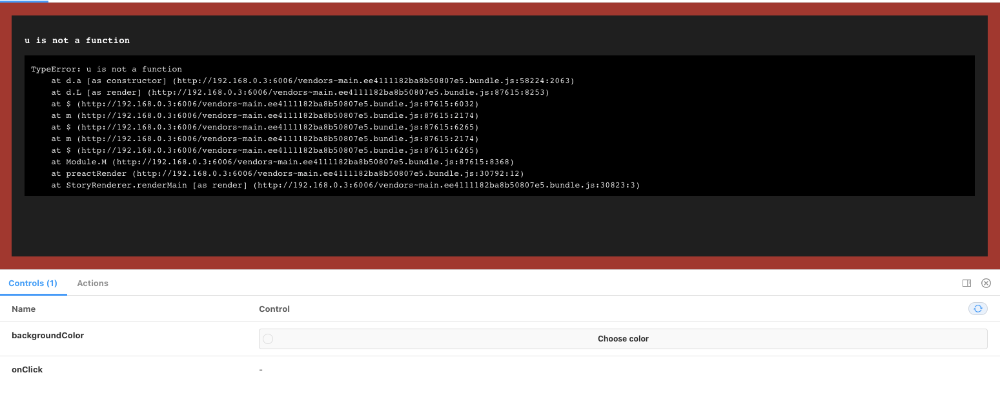
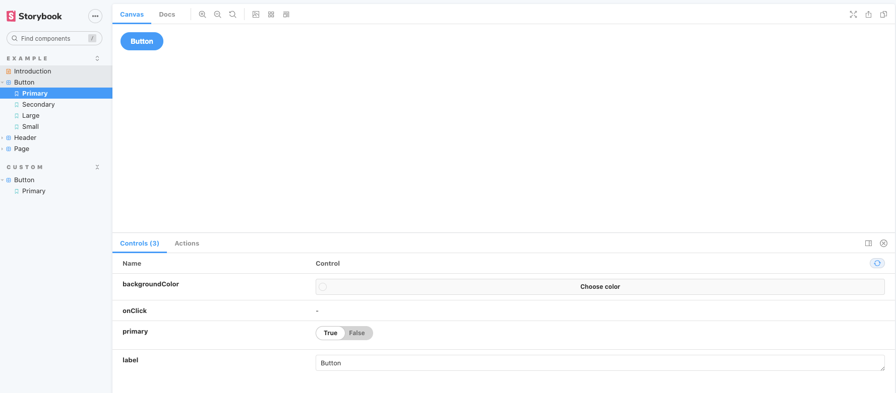

English version is [here](https://dev.to/sadnessojisan/storybook-with-preact-ts-goober-4ghk)

preact + TS + goober 環境下に storybook を入れることに苦労したのでその時のメモです。

## storybook の作成に失敗する

preact + TS + goober で何かしらのコンポーネントを作ります。

```tsx:title=button.tsx
import { h } from "preact"
import { styled } from "goober"

const _Button = styled("button")`
  background-color: red;
`

export const Button = () => {
  return <_Button>ok</_Button>
}
```

次にこのコンポーネントの storybook を作ります。

```sh
npx sb init
```

```tsx:title=button.stories.tsx
import { h } from "preact"
import { Button } from "./button"

export default {
  title: "custom/Button",
  component: Button,
  argTypes: {
    backgroundColor: { control: "color" },
    onClick: { action: "onClick" },
  },
}

const Template = (args: any) => <Button {...args} />

export const Primary = Template.bind({})
```

起動させます。

```
npm run storybook
```

そして該当のボタンを開くと

```sh
h is not defined
ReferenceError: h is not defined
    at Object.Template (http://192.168.0.3:6006/main.4bde6a78d76d85c8a393.bundle.js:353:3)
    at finalStoryFn (http://192.168.0.3:6006/vendors~main.4bde6a78d76d85c8a393.bundle.js:16622:32)
    at http://192.168.0.3:6006/vendors~main.4bde6a78d76d85c8a393.bundle.js:13062:21
    at http://192.168.0.3:6006/vendors~main.4bde6a78d76d85c8a393.bundle.js:14861:14
    at wrapper (http://192.168.0.3:6006/vendors~main.4bde6a78d76d85c8a393.bundle.js:12801:12)
    at http://192.168.0.3:6006/vendors~main.4bde6a78d76d85c8a393.bundle.js:13580:14
    at http://192.168.0.3:6006/vendors~main.4bde6a78d76d85c8a393.bundle.js:13594:26
    at http://192.168.0.3:6006/vendors~main.4bde6a78d76d85c8a393.bundle.js:13062:21
    at http://192.168.0.3:6006/vendors~main.4bde6a78d76d85c8a393.bundle.js:14854:12
    at http://192.168.0.3:6006/vendors~main.4bde6a78d76d85c8a393.bundle.js:14861:14
```



といったエラーが表示されるはずです。

一方で、 `npx sb init` が生成した examle story は表示されています。



一体どうしてでしょうか。

## 成功する例とはどのようなものか

まずそもそも preact は storybook 公式でもサポートされています。

FYI: https://www.npmjs.com/package/@storybook/preact

これにより `sb init` 時に自動生成させることができ、それは問題なく使えます。

そこで自動生成されたファイルを見てみましょう。

```js:title=button.stories.js
/** @jsx h */
import { h } from "preact"
import PropTypes from "prop-types"
import "./button.css"

/**
 * Primary UI component for user interaction
 */
export const Button = ({ primary, backgroundColor, size, label, ...props }) => {
  const mode = primary
    ? "storybook-button--primary"
    : "storybook-button--secondary"
  return (
    <button
      type="button"
      className={["storybook-button", `storybook-button--${size}`, mode].join(
        " "
      )}
      style={backgroundColor && { backgroundColor }}
      {...props}
    >
      {label}
    </button>
  )
}

Button.propTypes = {
  /**
   * Is this the principal call to action on the page?
   */
  primary: PropTypes.bool,
  /**
   * What background color to use
   */
  backgroundColor: PropTypes.string,
  /**
   * How large should the button be?
   */
  size: PropTypes.oneOf(["small", "medium", "large"]),
  /**
   * Button contents
   */
  label: PropTypes.string.isRequired,
  /**
   * Optional click handler
   */
  onClick: PropTypes.func,
}

Button.defaultProps = {
  backgroundColor: null,
  primary: false,
  size: "medium",
  onClick: undefined,
}
```

生成されたファイルと自分の実装とで大きな差異があるとすれば、

- TS ではなく JS である
- jsx pragma がついている
- CSS in JS を使っていない

という点です。
そしてこれらがまさしく、自分の手元で動かない原因でした。

## jsx の設定が必要

### /\*\* @jsx h \*/ とは何か

`/** @jsx h */` は jsx pragma と呼ばれている記法です。
これは コンパイラ に jsx を作り出す関数(jsx factory)が何かを伝えることができます。
たとえば react では jsx factory は `createElement` ですが、それが preact では `h` であることはコンパイラは知らず、開発者がコンパイラに伝える必要があります。

### storybook は babel でビルドする

そして アプリケーション開発時は TS を使っていたとしても、storybook は babel でビルドするため、babel の設定ファイルに jsxFactory が h であることを伝える必要がうあります。
これを実現する方法の一つが jsx pragma ですが、直接 babel の設定ファイルに書くこともできます。
ただし storybook の設定にそれは書かないといけません。

```js:title=main.js
module.exports = {
  stories: ["../src/**/*.stories.mdx", "../src/**/*.stories.@(js|jsx|ts|tsx)"],
  addons: ["@storybook/addon-links", "@storybook/addon-essentials"],
  babel: async options => ({
    ...options,
    presets: [["@babel/typescript", { jsxPragma: "h" }]],
  }),
}
```

ちなみにアプリを開発しているということはすでに TS 側で jsxFacroty の設定はしているはずです。

```json:title=tsconfig.json
{
  "compilerOptions": {
    ...
    "jsxFactory": "h"
  }
}
```

しかし storybook は babel でコンパイルするのでこの設定は読まれません。
storybook 側の設定に書く jsxFactory の指定をする必要があったという訳ですね。

## goober 　はそもそも setup が必要

いまで使っている goober はアプリケーションのエントリポイントで初期化が必要です。

```ts:title=index.tsx
import { setup } from "goober"
import { h, render } from "preact"
import { Button } from "./button"

setup(h)

const App = () => {
  return (
    <div>
      <Button></Button>
    </div>
  )
}

render(<App></App>, document.body)
```

storybook ではその初期化フェーズのコードは呼ばれないので、各 story ファイルで初期化(`setup(h)`)が必要です。

```js:title=button.stories.js
import { setup } from "goober"
import { h } from "preact"
import { Button } from "./button"

setup(h)

export default {
  title: "custom/Button",
  component: Button,
  argTypes: {
    backgroundColor: { control: "color" },
    onClick: { action: "onClick" },
  },
}

const Template = (args: any) => <Button {...args} />

export const Primary = Template.bind({})
```

## storybook ができた

これで

```sh
npm run storybook
```

とすると無事に storybook が表示されます。


ソースコードはこちらです。

https://github.com/ojisan-toybox/preact-storybook
