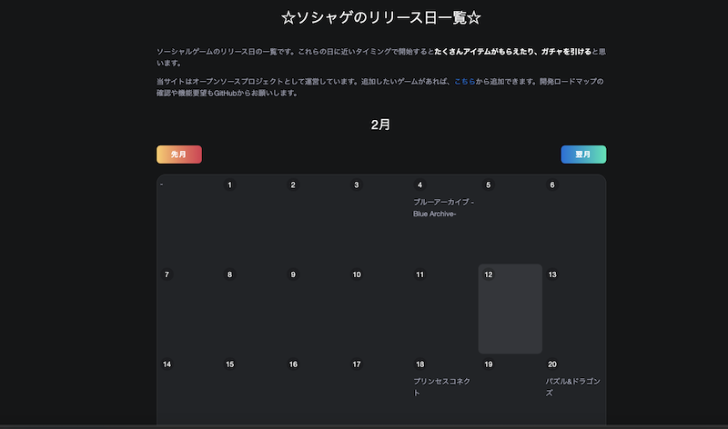

Rust で時間を扱うとなれば chrono クレートだと思うのですが、`Local::now()` を yew の上で呼び出すとランタイムで落ちてしまって、どうやって現在日付を取得しようと悩んでいました。
`Local::now()` を含んだコードから出力した wasm をブラウザ上で動かすと、勝手に `new Date()` 相応に動く訳なんてありませんでした。
なので、日付を返す関数を JS 側に予め定義しておいて、それを Rust 側から呼び出す interop を実装して解決しました。

## interop

日付を返す関数をあらかじめ定義しておきます。

```html
<script>
  function getISOString() {
    const date = new Date()
    return `${date.getFullYear()}-${date.getMonth() + 1}-${date.getDate()}`
  }
</script>
<script type="module">
  import init from "./wasm.js"
  init()
</script>
```

さきほど定義した関数を Rust 側から呼べるようにバインドを書きます。
ここで `-> String` という型指定を忘れると想定通りに動かないので注意しましょう。

```rust
#[wasm_bindgen]
extern "C" {
    fn getISOString() -> String;
}
```

あとは yew の中から使うだけです。
ここでは create のタイミングで呼び出しています。

```rust
impl Component for Model {
    ...
    fn create(_: Self::Properties, link: ComponentLink<Self>) -> Self {
        let iso = getISOString(); // YYYY-MM-DD
        ...
        self {
            today: iso

        }
    }
}
```

こうして yew の state として JS から取得した日付を使えるようになりました。

## web-sys 使いなよ

yew は利用する web ライブラリを stdweb, web-sys から選べます。
yew の features で指定でき、何も指定しなければ web-sys が選ばれ、僕もこれを使っています。
web-sys には DateTimeValue というものがあり、これが Date 相応のものぽいのですが、これを呼び出そうとすると何故かコンパイルが通らなくて諦めていたという背景があります。
どうやって web-sys 経由で `new Date().getMonth()` のようなことができるのか、ご存知の方がいらっしゃいましたら教えてください。

## なんで yew 使ってるの？

こんなクソアプリを作ったからです。



ソシャゲの配信日カレンダーです。
配信日付近に始めたらめちゃくちゃアイテムもらえるから、そこでガチャたくさん引くという欲望を叶えるためのサイトです。

https://birthstone.web.app/

今回の JS から取得した日付は、カレンダー上で今日を示す処理のために使っています。
