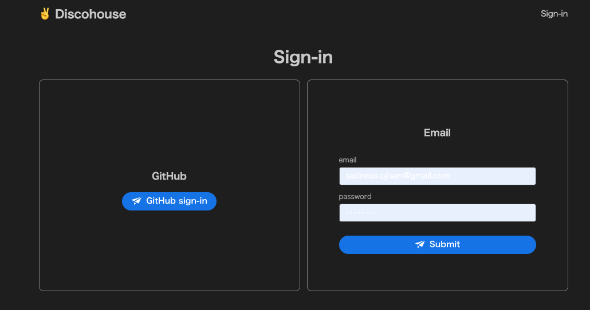
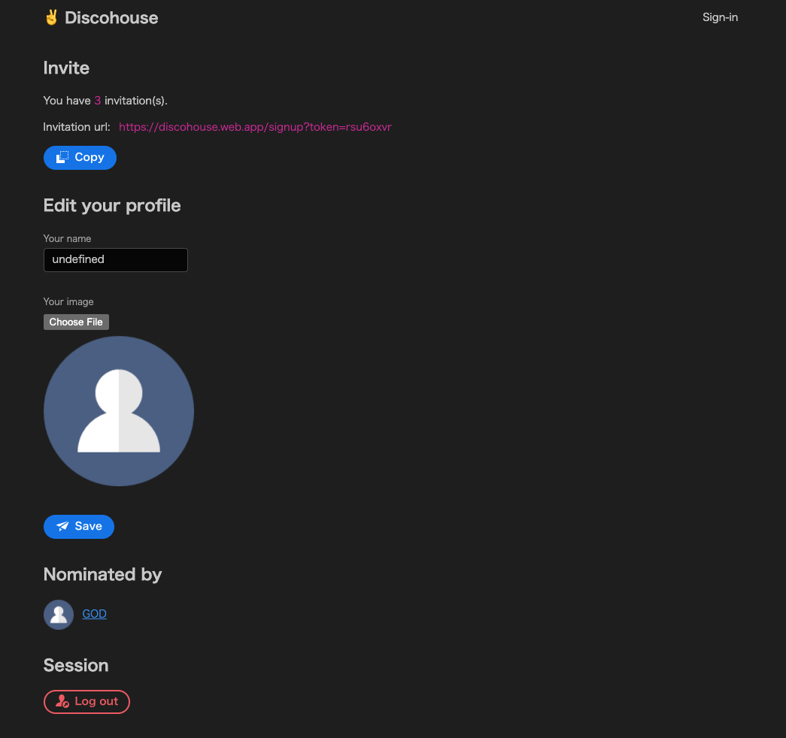
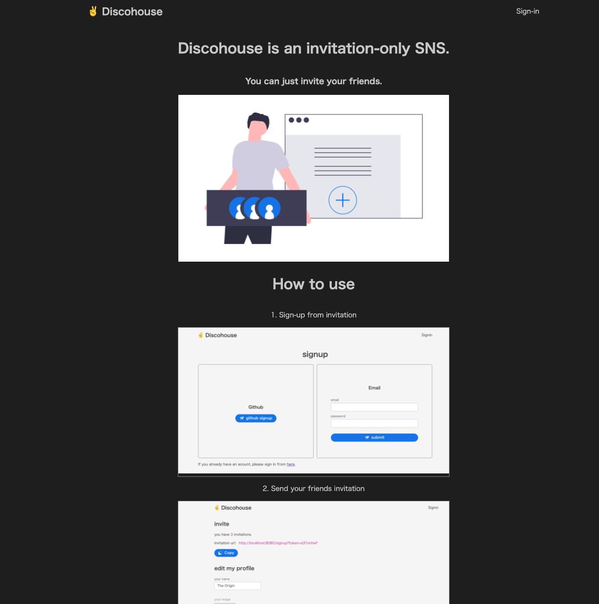
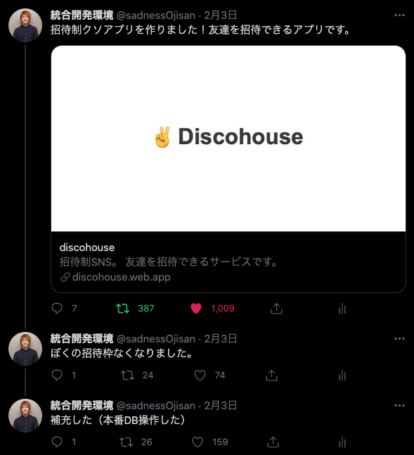
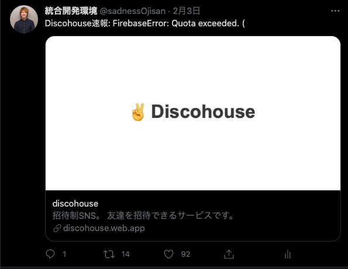

Clubhouse が登場した頃、自分は [Discohouse](https://github.com/sadnessOjisan/discohouse) というサービスを作りました。
これは友達を招待できるアプリです。
はい、**招待できるだけ**のアプリです。
招待制が成功の鍵だみたいな話を眺めてて「ほーん、招待制にしたら成功するんだ」ってことで作ったサービスです。

## なんでブログの題材にしたか

たったいま全てのデータを消したからです。
Discohouse は Clubhouse を知って 2 日くらいで一気に作ったもので、いろいろ雑に作られています。
その上でいろんな人の個人情報を集めてしまっていて、これを手元に置いておくのが怖すぎたので消しました。
ただ雑に作ったと言っても 、認証は切り離していて、問題が起きないようにそもそも DB には見えて良い情報しか入れていないので、その点はご安心ください。

で、消すんだったら作ったという事実だけは残しておきたいと思いこうしてブログを書いています。

## どんなサービスか

会員登録して、



招待トークンを手に入れて招待するだけ



です。

このように LP はありますが、



ここには会員登録導線はなく、招待 URL からしか登録できないようになっています。

その招待数も上限は 3 つしかありません。
ふざけて 本番 DB いじって特定ユーザーに 1000000 個ほど招待 URL を増やしたりもしましたが・・・

## 結果、どうなったか

作った最初は Discord で友人たちにばらまいて遊びました。
そこでちゃんと動くことが分かったので、Twitter に自分の招待リンクを貼ってみました。
自分は特権ユーザーということで 30 件くらい招待リンクを発行したと思います。

「まぁ 10 人くらい使ってくれたら良いかな」って軽い感じでシェアしたのですが、ツイート自体が 300RT くらいされてちょっとびっくりしました。



https://twitter.com/sadnessOjisan/status/1356800802988331009?s=20

それでも個人情報を登録させるタイプなので本当に登録する人なんて居ないだろって思っていたのですが、気付いたら 670 件くらい登録されていて、びっくりしました。

そして Firebase を無料プランで設定していたのでリリース 1 時間後くらいには落ちました。



https://twitter.com/sadnessOjisan/status/1356831986980016128?s=20

なので課金して動かしています。

最終的には 650 人ほどが登録してくれたみたいです。
リリースして 1 ヶ月以上経っているので誰も使ってないだろうと思っていたら今でも 1 日に 30PV くらいはあって、一体誰がという気持ちです。
けど、自分が不要な個人情報を握っている事実が怖すぎるので全て破棄しました。

あと、誰が誰を招待したという関係データが手に入りました。
とはいえ、これは悪用されたら怖いデータだと思っていたので早く消したかったです。

覚悟もなしに作ったジョークアプリでいろんな情報が手に入ってしまったのは、緊張感がありました。

## 使った技術

### preact

preact は (厳密には違いますが)React のサブセットです。
私は、compat にたくさんお世話になるような、React のライブラリをたくさん使わないといけない場合以外は preact を使うようにしています。
preact を使うメリットとしては、軽量という以外にも、本体のコードが読みやすいので「なんもわからん」となったたときも、最悪本体を解読することで自分の制御下に置きやすいと思っている点があります。

### @adobe/react-spectrum

おそらく注目を浴びたコンポーネントライブラリの中では最後発のコンポーネントライブラリです。
最後発であるため、いろんな知識やユースケースが一番結集していると思って採用しました。
個人的には Ant, ChakraUI が登場したときにそれぞれゲームチェンジャーと思った記憶があり、コンポーネントライブラリは後発ライブラリを使ってみるのが良いと思っています。
Adobe がサポートしているというのも、信頼度という意味で採用の決め手の一つです。

ただ使ってみた結果としてはまだ時期尚早だったという感想を持ちました。
たとえば Upload コンポーネントがなかったり AlertDialog がボタンコンポーネントと一緒に使うことが前提だったり、ChakraUI にはある Tailwind のような IF がなかったり、自分の要求を満たせない点もいくつかありました。
ただ、`UNSAFE_style` という緊急ハッチが用意されているので、それを使うことで自由にスタイリングして乗り切ることはできます。
そして適当に作っても、自分が本気で考えたデザインよりかはきれいに仕上がったので、採用して良かったと思います。

### Firebase

完全な SPA として作ったので Firebase Hosting に上げています。
SPA モードでデプロイすると SPA の routing の fallback 処理(index.html への rewrite)も自動で行われます。

## 設計

### preact

いわゆる Container/Component パターンにしました。
元来であれば redux の connect をしていたのを、代わりに custom hooks に置き換えました。
ロジックやイベントハンドラの全てを custom hooks に押し込んで、それを Container 層で呼び出すという仕組みです。

責務の分割がはっきりして僕はこのやり方を気に入っています。
もちろん大規模アプリになると container で繋いだ値のバケツリレーが発生するため別の分割ルールを作りたくなりますが、小規模なアプリであればこのやり方が一番しっくりきています。

### Firestore

Firebase ルールが苦手、かといって全 false で CF 経由のバックエンド立てるのはめんどくさい + spark plan で居たかったという理由から、private な情報を持たないようにしました。
最悪漏らしても大丈夫という訳です。

なので、

```sh
- USERS
  - image
  - invitation
  - invitationKey
  - name
  - timeStamp
- INVITATIONS
  - from
  - to
  - timeStamp
```

としています。

ユーザーアカウント作成時に invitationKey を乱数で生成し、それを招待 URL とするという仕組みです。

## その他思ったこと

### ソースコードを公開していてよかった

ここに公開しています。

https://github.com/sadnessOjisan/discohouse

攻撃されても漏洩はありえないと思っていたので、ソースコードは firebase ルールも公開していました。
案の定「ガバガバだろ」という指摘を受けることなったのですが、自分の知らなかった機能などを教われたのでこれは良かったなと思います。

ただ自分は自分を信用していないのでやっぱり真面目に作るときは全ルールを false にしてサーバーから叩くようにしています。
普段はそれなりの施策を講じているので「sadnessOjisan が作るアプリはセキュリティやばそう」とは思わないでください＞＜

### あなたの名前は script タグですか？

あなたの名前は script タグですか？
