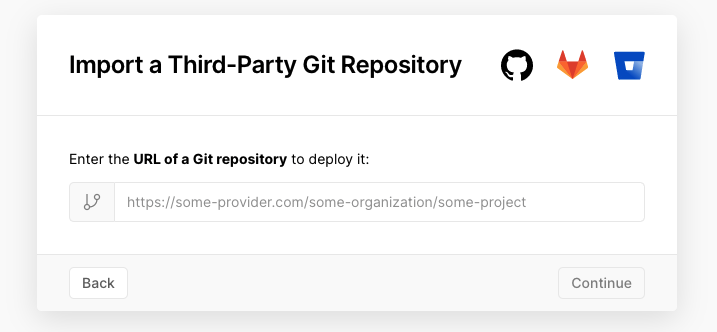

お久しぶりです。
BRAVELY DEFAULT II やったりモンハンに忙しくてブログの存在を忘れてました。

最近、個人開発やゆるふわな開発をする時に使えるエラー通知システムが欲しくて自作しました。

欲しかった要件としては、

- 無料
- Slack に通知できる
- Web API ベース

といったものです。

その方法として、Vercel にエンドポイントを生やしてそれを Slack 連携しました。
この方式のいいところは、Vercel は GitHub のレポジトリを指定してプロジェクトを作れる点で、管理画面でレポジトリの URL を打つだけで通知サーバーを建てられる点です。



そのため、皆さんも Vercel の管理画面からこのレポジトリを指定すれば同様の仕組みを作れます。

これがそのレポジトリです。

https://github.com/sadnessOjisan/datacat

DataDog ぽい名前で良いですね。datacat はただ Data を cat しているだけです。

## 要素技術

### Vercel

Vercel は FrontEnd 開発における無料のホスティングサービスとして使われがちですが、ただの Serverless Function を実行する口としても活用できます。
TypeScript の最小構成で API 生やす方法を以前書いたので、よければご覧ください。

[Let's create simple echo server with Vercel and TypeScript](https://dev.to/sadnessojisan/simple-server-with-vercel-and-typescript-481b)

### Slack

Slack は管理画面から Webhook URL を発行でき、特定のスペースの特定のチャンネルに、POST 経由でメッセージを送ることができます。
そのエンドポイントを Vercel から叩けば通知サービスを実装できます。

## 使い方

詳しくは [こちら](https://github.com/sadnessOjisan/datacat) にまとめてありますので概略だけ解説します。

Slack の 管理画面から Webhook url を取得

Vercel にレポジトリを登録

Webhook url を環境変数にする

エンドポイントにメッセージを送る

たとえば、

```ts
axios
  .post("http://datacat-demo.vercel.app/api/report-dev-error", {
    message: "Hello from vercel!!",
  })
  .then(() => res.status(204))
  .catch(() => res.status(500).send("slack api error"))
```

のようにして使えます。

## おわりに

ランタイムでのエラー通知をできるだけでなく、mobile 端末での実機デバッグにおいてもエラーログを覗き見れるので便利です。
雑に使えるエラー報告ツールを持っておくと開発の補助にも使えるのでオススメです。
よければ Vercel に読み込んで使ってみてください。

https://github.com/sadnessOjisan/datacat
