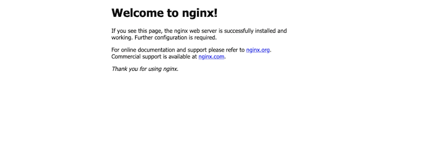

GCE には、docker コマンドが初めから使える Container Optimized OS というものがあります。
いきなり docker が使えるので、初手でイメージを落としてきたらそのまま何かを serve できてしまいます。
例えば、nginx や MySQL を簡単にセットアップできます。

ただ GCE に慣れておらず、動かしていた時になかなか繋がらなくて困ったので、そういった場合のデバッグや原因の切り分け用に Nginx からページを返すだけのコンテナの作り方をメモしておこうと思います。

## コンソールでぽちぽちインスタンスを作る

やることはこの 2 つです。

- container optimized os を選ぶ
- firewall を設定チェックボックスにチェックする

GCE は port に対するアクセス制限はタグを割り振り、そのタグに紐づく設定をネットワークの設定画面・ファイアウォールの設定画面経由で行えます。
ただし、80, 443 に関しては最初からタグ(http-server, https-server)が振られているのでそれを使います。

## コンソールに入る

SSH で入ってもいいですがいちいち鍵を登録するのめんどくさいので web コンソールから入ります。

## 必要なイメージを落としてくる

といってもあとはローカルでやることと同じです。

Web コンソールから直接 docker コマンドを叩けるので nginx のイメージを落とします。

```sh
docker pull nginx
```

これで nginx のコンテナを建てれるようになりました。

## コンテナを起動する

次に docker run でコンテナを作ります。

```sh
docker run -d --rm --name hogehoge -p 80:80 nginx
```

option は適当につけてはいけないので注意しましょう。

```sh
docker run [OPTIONS] IMAGE [COMMAND] [ARG...]
```

きちんとこのような順序で書きましょう。

FYI: [https://www.shigemk2.com/entry/docker_run_order](https://www.shigemk2.com/entry/docker_run_order)

特に -p を適当な場所につけると、GCE のファイアーウォールの設定を間違えたのかと時間を潰す羽目になるので、基本的なことですが気をつけましょう。

これで port80 で見えるようになりました。(-p ホスト側ポート:コンテナ側ポート なので)

あとは GCP の管理画面にある外部 IP をブラウザに打ち込むと見えるはずです。



## あとは好きにデバッグを

これで、ポート番号変えても動くんだっけ？登録した起動スクリプトからいきなりコンテナを実行できたっけ？みたいな実験ができます。
手元にイメージが落ちてこないので、何も気にせず docker pull できて気持ちいいですね。
