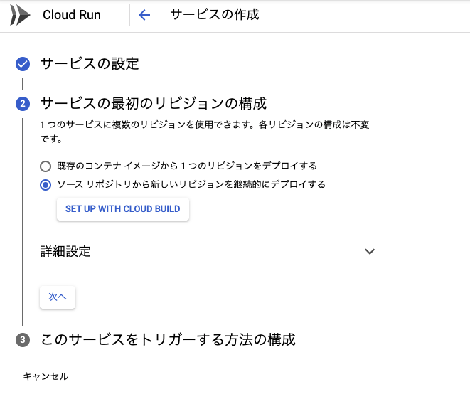
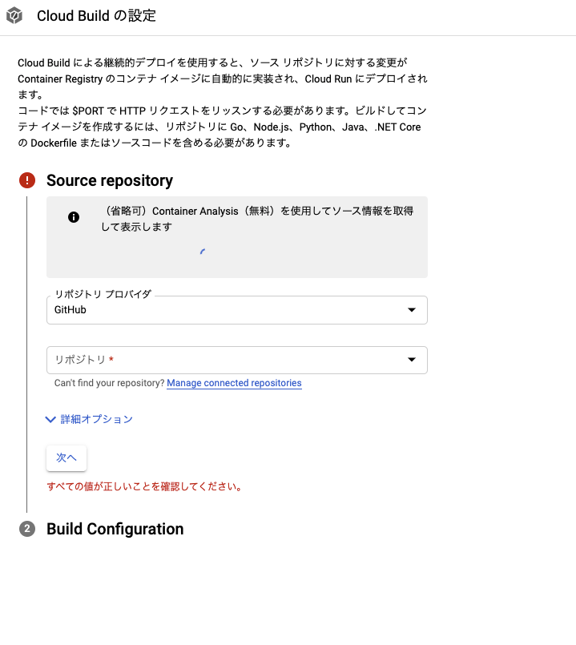
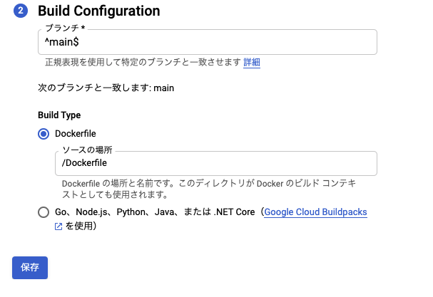
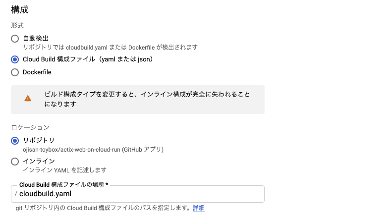

Cloud Run は GCP が提供するサービスで、コンテナを動かせます。
いま actix-web で作った API サーバーを Cloud Run で動かそうとしていろんな場所でつまずいたのでメモします。
公式の [Getting Started](https://actix.rs/docs/getting-started/) を動かすことが目標です。

## ローカルで動く状態に持っていく

[Getting Started](https://actix.rs/docs/getting-started/) 通りのファイルを作ります。

```toml:title=Cargo.toml
[dependencies]
actix-web = "3"
```

```rust:title=src/main.rs
use actix_web::{get, post, web, App, HttpResponse, HttpServer, Responder};

#[get("/")]
async fn hello() -> impl Responder {
    HttpResponse::Ok().body("Hello world!")
}

#[post("/echo")]
async fn echo(req_body: String) -> impl Responder {
    HttpResponse::Ok().body(req_body)
}

async fn manual_hello() -> impl Responder {
    HttpResponse::Ok().body("Hey there!")
}

#[actix_web::main]
async fn main() -> std::io::Result<()> {
    HttpServer::new(|| {
        App::new()
            .service(hello)
            .service(echo)
            .route("/hey", web::get().to(manual_hello))
    })
    .bind("0.0.0.0:8080")?
    .run()
    .await
}
```

があれば良いです。この状態で

```sh
cargo run
```

とすれば API が立ち上がりアクセスできるはずです。

## Cloud Run と Cloud Build

[Cloud Run](https://cloud.google.com/run/?hl=ja) へのデプロイの前に Cloud Run 周りのエコシステムについて説明をします。
Cloud Run はコンテナをデプロイするため、その前にソースコードをイメージにする必要があります。
そのため Cloud Run を使ったワークフローでは [GCR](https://cloud.google.com/container-registry/docs/overview?hl=ja) という Container Registry に登録します。
ここへは 手元でイメージを作ってそのまま push することもできますが、CI/CD のワークフローを考えて、GitHub をトリガーに GCP 上でビルドしたいです。
そのようなビルド環境が [Cloud Build](https://cloud.google.com/build?hl=ja) です。

そのため Cloud Run へデプロイするために GitHub => Cloud Build => GCR => Cloud Run という手順を踏んでデプロイします。

## Cloud Run のセットアップ

先の説明で Cloud Build => GCR => Cloud Run という流れを作らないといけないと書きましたが、コンソールをぽちぽちしてれば終わるので楽です。

サービスの作成をクリックするとフォームが出てくるのでそれを埋めていきます。
ここで GitHub にあるソースコードから GCR へイメージを上げたいので、GitHub を使うように構成を選びます。



次に連携するレポジトリを選びます。



そしてビルドの構成が書かれたファイルを指定します。
ここでは Docker でビルドするので Dockerfile を指定します。

ここではあらかじめこのような Dockerfile をレポジトリに入れておきます。

```sh
# Use the official Rust image.
# https://hub.docker.com/_/rust
FROM rust

# Copy local code to the container image.
WORKDIR /usr/src/app
COPY . .

# Install production dependencies and build a release artifact.
RUN cargo build --release

EXPOSE 8080

# Run the web service on container startup.

ENTRYPOINT ["target/release/hogehoge"]
```



構成が決まったらそのままフォームを進めていきサービスを作ってください。

## ビルドに失敗するはず

もしここで actix-web を使っていなければビルドに成功するかもしれませんが、おそらく失敗しているはずです。
原因は timeout error です。
Cloud Build はデフォルトでは 10 分を超えたらビルドが止まります。
そこでこの上限を突破する設定を書きましょう。

```yaml:title=cloudbuild.yaml
steps:
  - name: "gcr.io/cloud-builders/docker"
    args: ["build", "-t", "gcr.io/$PROJECT_ID/hogehoge:$COMMIT_SHA", "."]
    timeout: 1200s
  - name: "gcr.io/cloud-builders/docker"
    args: ["push", "gcr.io/$PROJECT_ID/hogehoge:$COMMIT_SHA"]
    timeout: 1200s
  - name: "gcr.io/google.com/cloudsdktool/cloud-sdk"
    entrypoint: gcloud
    args:
      - "run"
      - "deploy"
      - "hogehoge"
      - "--image"
      - "gcr.io/$PROJECT_ID/hogehoge:$COMMIT_SHA"
      - "--region"
      - "asia-northeast1"
      - "--platform"
      - "managed"
    timeout: 1200s
images:
  - "gcr.io/$PROJECT_ID/hogehoge:$COMMIT_SHA"
timeout: 2400s
```

timeout: 2400s を指定します。各 STEP ごとの上限と、全体での上限を決めます。

そして次に **この設定を読み込むように Cloud Build の設定を編集**します。
なぜ太字で書いてるかと言うとデフォルトではこのファイルが入っていても Cloud Build は読み込んでくれないからです。

コンソールのメニューから Cloud Build を選択し、トリガーメニューを選ぶと、GitHub と連携したトリガーがあるはずです。
それを選んだら構成セクションで Cloud Build ファイルとリポジトリを選択してください。
インラインが設定されていると、この設定画面で設定したビルド手順でビルドがされてしまい、timeout の編集が適用されません。



cloudbuild.yaml を使うように設定した後にもう一度 GitHub になにか push してトリガーを動かすと、正常にデプロイされます。

ちなみに Docker の Multi Stage Build を使いつつ、Cloud Build の step ごとにビルドし、明示的に cache を指定すればビルド時間を削れますが、どっちにしろ初回ビルドでは全 step を舐めることになるので、timeout を誤魔化すワークフローは必要です。

## 何が言いたかったか

actix-web を使うと Cloud Build のビルド時間を超えてしまうから、それを上書くための設定ファイルを入れよう。
そして Cloud Build の設定画面でその設定を読み込むように構成を変更しよう。
