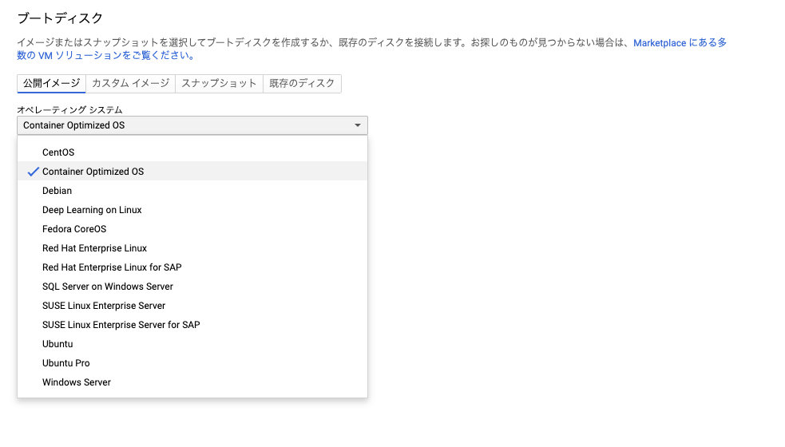
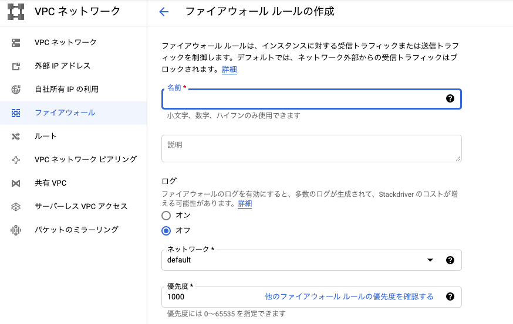
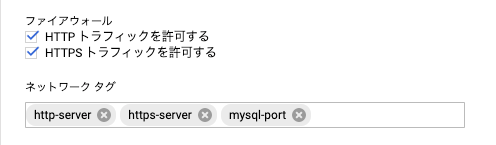
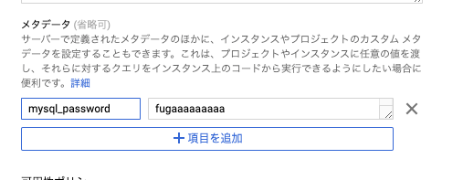

[GCE](https://cloud.google.com/compute/?hl=ja) には、docker コマンドが初めから使える Container Optimized OS というものがあります。
いきなり docker が使えるので、初手でイメージを落としてきたらそのまま何かを serve できてしまいます。
例えば、nginx や MySQL を簡単にセットアップできます。
今日はこれを使って MySQL サーバーを作ります。

## 動機

ちょっとした個人開発でデータストレージが必要になり、そういうときはいつも Firestore を使うのですが、流石に最近は飽きてきたと言うか芸が無いというかという気持ちになってきたので RDB ベースなストレージを使いたくなりました。

ところで、GCP には CloudSQL というフルマネージドな素晴らしい Database があります。
では、どうして GCE で自分で MySQL サーバーを立てたいと思ったのでしょうか。
答えは簡単、**高いから**です。
ちょっとした個人開発のために月 6000 円は少し厳しいので、別な方法を考えていました。

きっと一番安いのは 1000 円くらいで VPS 借りてそこで MySQL サーバー立てる方法です。
しかし VPS といえば SSH でサーバーに入って必要な資材を自分で入れて面倒を見るというワークが必要だと思い、時間がかかりそうなので今回は見送りました。

そこで GCE の Container Optimized OS です。
Container Optimized OS を使えば「Docker で mysql を pull してきたら終わり」ってワケです。
ただ実際にやってみるといろいろハマったところがあったので、そういうハマりポイントを紹介します。

ちなみに余談なのですが、最近 Zenn で本を書きました。 1 冊 500 円です。売り上げがあると CloudSQL 代を捻出できるので是非ご購入ください。

[苦しんで覚える React](https://zenn.dev/sadness_ojisan/books/introduction-of-react-introduction)


## GCE のセットアップ

では早速作っていきましょう。
まずは GCE のセットアップです。
コンソールをぽちぽちすればいいのですが、気を付けるポイントが何箇所かあります。

### OS は Container Optimized OS

OS の選択画面で Container Optimized OS を忘れずに選びましょう。



### ファイアウォール

MySQL は 3306 ポートを使います。
そのためあらかじめポートを開けておきましょう。
ファイアウォールは VPC ネットワークタブから設定できます。



GCP ではここで作ったルールをタグとして利用できます。
そのルールの名前を GCE のネットワークタグとして使えば、そのルールが GCE に適用されます。



### 外部 IP の固定

MySQL の接続ではホストの指定が必要です。
そのホストには IP アドレスを使うので、GCE の外部 IP を固定します。

## MySQL の設定

では GCE に MySQL の設定をしていきます。
GCE インスタンスに入りましょう。
SSH を使わなくてもブラウザから擬似的なコンソールを使ってアクセスできます。

### docker-compose のインストール

Container Optimzed OS では docker は使えますが docker-compose は使えません。
そこで docker-compose を使えるようにします。

実はすでに docker が入っているので、

```sh
docker run --rm \
    -v /var/run/docker.sock:/var/run/docker.sock \
    -v "$PWD:/rootfs/$PWD" \
    -w="/rootfs/$PWD" \
    docker/compose:1.26.2 up
```

などとすれば docker-compose が使えます。

ただ毎回これを打ち込むのはめんどくさいので alias を貼っておきましょう。

```sh
echo alias docker-compose="'"'docker run --rm \
    -v /var/run/docker.sock:/var/run/docker.sock \
    -v "$PWD:/rootfs/$PWD" \
    -w="/rootfs/$PWD" \
    docker/compose:1.26.2'"'" >> ~/.bashrc

source ~/.bashrc
```

これで

```sh
docker-compose
```

としてコマンドが使えます。

## MySQL サーバーを立てる

それでは docker-compose コマンドが使えるようになったので、docker-compose で MySQL サーバーを立てましょう。
こんな docker-compose.yaml を用意します。

```yaml:title=docker-compose.yaml
version: "3"
services:
  db:
    image: mysql:8.0
    volumes:
      - hoge:/var/lib/mysql
    environment:
      MYSQL_DATABASE: hoge
      MYSQL_USER: ojisan
      MYSQL_PASSWORD: sadness
      MYSQL_ROOT_PASSWORD: ojisan
    ports:
      - "3306:3306"

volumes:
  hoge:
```

コンテナを落としてもデータを永続化したいので volumes の指定を忘れないようにしましょう。
また将来の使い勝手も考慮して データは data volume として管理します。
`hoge` はその設定です。
data volume を作ると何が嬉しいかは公式を参照ください。

FYI: https://docs.docker.jp/engine/userguide/dockervolumes.html

## credential を metadata server で秘匿をする

いま、MySQL の password が丸見えになっているのですが、これはよくないです。
環境変数から設定するようにしましょう。

GCE は 環境変数的なものを metadata server に格納できます。
ここに予め格納しておき、それを GCE で読み出して docker-compose.yaml で指定するようにしましょう。

### metadata server

GCE のコンソールの設定に戻りましょう。
タブが折り畳まれて隠れていますが、メタデータを設定するフォームがあります。



ここに GCE から読み出したい値をセットします。

### GCE から呼び出す

GCE のインスタンスの内部からは メタデータサーバーにアクセスできます。
そこを cURL で叩くなりしてデータを取得します。

```sh
curl http://metadata.google.internal/computeMetadata/v1/instance/attributes/mysql_password
```

attributes の後に key 名を指定すればそれに紐づいた meta data を取得できます。

```sh
$ curl http://metadata.google.internal/computeMetadata/v1/instance/attributes/mysql_password
fugaaaaaaa
```

秘匿情報は環境変数として使いたいので .env に書き出しておきましょう。

```sh
touch .env

MYSQL_DATABASE=$(curl http://metadata.google.internal/computeMetadata/v1/instance/attributes/database_name -H "Metadata-Flavor: Google")
echo MYSQL_DATABASE=$MYSQL_DATABASE | tee -a .env

MYSQL_USER=$(curl http://metadata.google.internal/computeMetadata/v1/instance/attributes/mysql_user -H "Metadata-Flavor: Google")
echo MYSQL_USER=$MYSQL_USER | tee -a .env

MYSQL_PASSWORD=$(curl http://metadata.google.internal/computeMetadata/v1/instance/attributes/mysql_password -H "Metadata-Flavor: Google")
echo MYSQL_PASSWORD=$MYSQL_PASSWORD | tee -a .env

MYSQL_ROOT_PASSWORD=$(curl http://metadata.google.internal/computeMetadata/v1/instance/attributes/mysql_root_password -H "Metadata-Flavor: Google")
echo MYSQL_ROOT_PASSWORD=$MYSQL_ROOT_PASSWORD | tee -a .env
```

## docker-compose で環境変数を読み出す

docker-compose は.env があれば環境変数を読み出せます。
そのためには key だけを指定すればいいです。

```yaml:title=docker-compose.yaml
version: "3"
services:
  db:
    image: mysql:8.0
    volumes:
      - hoge:/var/lib/mysql
    environment:
    　MYSQL_DATABASE
      MYSQL_USER
      MYSQL_PASSWORD
      MYSQL_ROOT_PASSWORD
    ports:
      - "3306:3306"

volumes:
  hoge:
```

これで全ての準備が整いました。

## MySQL を立ち上げる

あとはこれを立ち上げるだけです。

```sh
docker-compose up
```

立ち上げたらあとは client でアクセスして動作確認しましょう。
お手元のターミナルから繋がるはずです。

```sh
mysql -u root -p -h 999.999.999.999
```

## 終わりに

本番ではお勧めしません。どうしてもやるならレプリケーションやバックアップを考えましょう。
