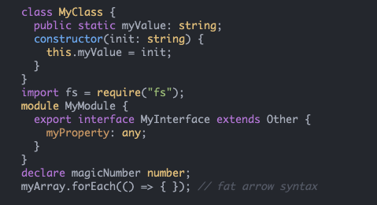
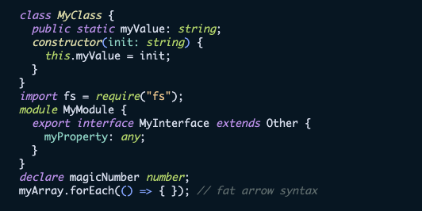
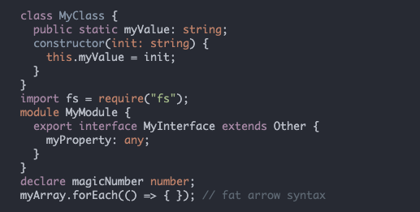
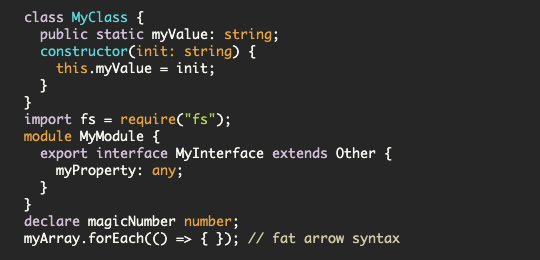
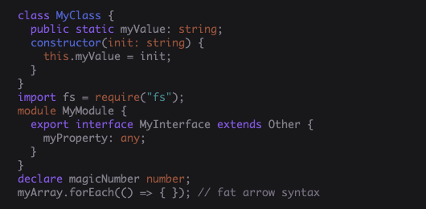
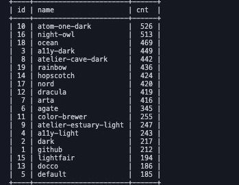

## 背景

いまこのブログを作り直しているのですが、新しいブログの syntax highlight をどうするかを悩んでいました。
highlight.js を使っているのですが、たくさん例があってどれにしたらいいかが分かりませんでした。
そこで 2 つの syntax highlight を並べて戦わせるサイトを作りました。

[https://syntax-hilight-battle-client.pages.dev/](https://syntax-hilight-battle-client.pages.dev/)

どんな色にするかはここから決めようと思います。

## 集計結果

で、集計結果はこんな感じでした。

### 1 位: atom-one-dark



### 2 位: night-owl



### 3 位: ocean



### 4 位: a11y-dark



### 5 位: atelier-cave-dark



### 残り

こんな感じでした。



久々の SQL でめちゃくちゃ苦労しました。

```sql
select id, name, cnt from hilights left outer join (select winner_id, count(*) as cnt from results group by results.winner_id) as res on id = res.winner_id order by cnt desc;
```

いかがでしたか！？

## おまけ: 実装について

要件的に小さいアプリなので普段使っていない技術で作ってみました。

### Client は svelte

#### ハマったところ

svelte はビルド時にスタイリング用のクラスを割り振ってそうで、highlight.js でランタイムで DOM を書き換えると、そこにはスタイルが当たらなくて泣きました。
なのであらかじめ highlight.js の関数を実行して吐き出した DOM を svelte にハードコーディングしています。

### Server は Rust

#### actix-web

actor モデルを使いたいといったわけでなく、ただの server fw として使っています。
Result 型で持ちまわっておけば異常系を FW がよしなにしてくれるのが気に入っています。

#### diesel

いわゆる ORM です。
たまには Firestore 以外を使いたかったので、RDB を利用するために使いました。
ただ生の SQL を書くには connection pool 周りの設定が苦手なので、その辺もまとめてやってくれそうなライブラリを使いました。

### Infra は GCP

Cloud Run で actix-web を動かし、GCE 上の MySQL にアクセスしています。
最近書いたブログのこれらの記事は、このサイトを作るためのものです。

- [GCE & Container Optimized OS で MySQL サーバーを楽に安価に作る](https://blog.ojisan.io/gce-mysql)
- [actix-web を Cloud Run で動かす](https://blog.ojisan.io/actix-web-cloud-run)
