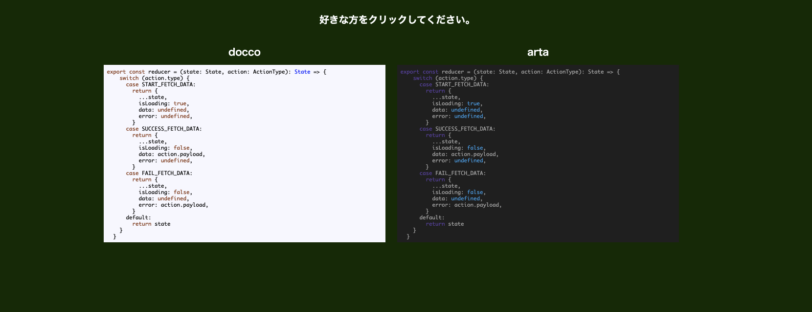
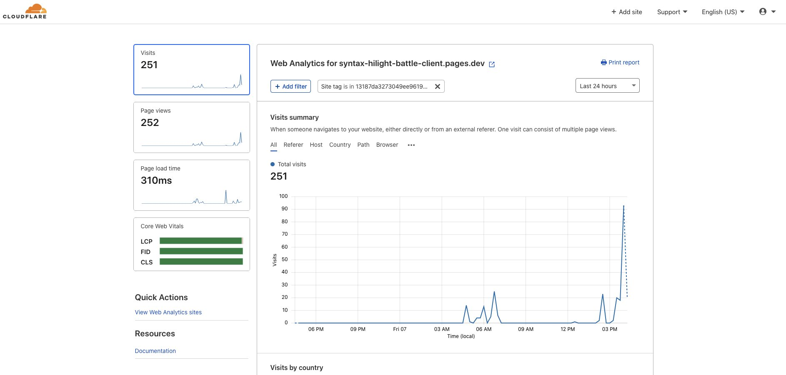

## 背景

いまこのブログを作り直しているのですが、新しいブログの syntax highlight をどうするかを悩んでいます。
highlight.js を使っているのですが、たくさん例があってどれにしたらいいかが分かりませんでした。
そこで 2 つの syntax highlight を並べて戦わせるサイトを作りました。

[https://syntax-hilight-battle-client.pages.dev/](https://syntax-hilight-battle-client.pages.dev/)

どんな色にするかはここから決めようと思います。

## 集計結果

で、集計結果はこんな感じでした。

### 1 位: atom-one-dark

### 2 位: night-owl

### 3 位: ocean

### 4 位: a11y-dark

### 5 位: atelier-cave-dark

### 残り

こんな感じでした。

いかがでしたか！？

## 総評

みんな暗いテーマが好きなんですね。
僕は明るい方が好きなので以外です。（このブログの syntax highlight が暗いのは大人の事情です 😈）

## 実装について

要件的に小さいアプリなので普段使っていない技術で作ってみました。

### Client は svelte

[https://github.com/sadnessOjisan/syntax-hilight-battle-client](https://github.com/sadnessOjisan/syntax-hilight-battle-client)

#### ハマったところ

svelte はビルド時にスタイリング用のクラスを割り振ってそうで、highlight.js でランタイムで DOM を書き換えると、そこにはスタイルが当たらなくて泣きました。
なのであらかじめ highlight.js の関数を実行して吐き出した DOM を svelte にハードコーディングしています。

#### Cloudflare pages にデプロイ

SPA として作ったので静的ホスティングができます。
デプロイ先には Cloudflare pages を使ってみました。
analytics まで付いてきて良かったです。

### Server は Rust

[https://github.com/sadnessOjisan/syntax-hilight-battle-api](https://github.com/sadnessOjisan/syntax-hilight-battle-api)

#### actix-web

actor モデルを使いたいといったわけでなく、ただの server fw として使っています。
Result 型で持ちまわっておけば異常系を FW がよしなにしてくれるのが気に入っています。

#### diesel

いわゆる ORM です。
たまには Firestore 以外を使いたかったので、RDB を利用するために使いました。
ただ生の SQL を書くには connection pool 周りの設定が苦手なので、その辺もまとめてやってくれそうなライブラリを使いました。

### Infra は GCP

Cloud Run で actix-web を動かし、GCE 上の MySQL にアクセスしています。
最近書いたブログのこれらの記事は、このサイトを作るためのものでした。

- [GCE & Container Optimized OS で MySQL サーバーを楽に安価に作る](https://blog.ojisan.io/gce-mysql)
- [actix-web を Cloud Run で動かす](https://blog.ojisan.io/actix-web-cloud-run)

## 作り直すよ〜

個人だけで集計できる機能が欲しいという声があったので作ります。
ちゃんと作り込むので 0 から作り直そうと思います。
