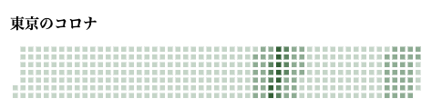
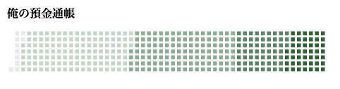

GitHub のマイページのトップに生えている草のデザインで、いろいろなものを可視化できる Web Components, [weed365](https://github.com/sadnessOjisan/weed365) を作りました。

例えば、東京における Covid-19 の感染者数はこのように表示できます。

```html
<weed-365
  date="2021-05-14"
  kusas='{
        ... // 中略
        "2021-05-03": 592,
        "2021-05-04": 530,
        "2021-05-05": 604,
        "2021-05-06": 589,
        "2021-05-07": 598,
        "2021-05-08": 496,
        "2021-05-09": 431,
        "2021-05-10": 405,
        "2021-05-11": 363,
        "2021-05-12": 254,
      }'
></weed-365>
```



他にも僕の預金通帳の金額もこのようにして表現できます。（※ マウント防止のためあらかじめ最大値で割り算をし、額が分からないようにしています。）

```html
<weed-365
  date="2021-05-15"
  kusas='{
        ...
        "2021-04-20": 0.7894736842105263,
        "2021-04-21": 0.7894736842105263,
        "2021-04-22": 0.7894736842105263,
        "2021-04-23": 0.7894736842105263,
        "2021-04-24": 0.7894736842105263,
        "2021-04-25": 0.7894736842105263,
        "2021-04-26": 0.7894736842105263,
        "2021-04-27": 0.7894736842105263,
        "2021-04-28": 0.9210526315789473,
        "2021-04-29": 0.9210526315789473,
        "2021-04-30": 1,
        "2021-05-01": 1,
        "2021-05-02": 1,
        "2021-05-03": 1,
        "2021-05-04": 1,
        "2021-05-05": 1,
        "2021-05-06": 1,
        "2021-05-07": 1,
        "2021-05-08": 1,
        "2021-05-09": 1,
        "2021-05-10": 1,
        "2021-05-11": 1,
        "2021-05-12": 1,
        "2021-05-13": 1,
        "2021-05-14": 1,
        "2021-05-15": 1}'
></weed-365>
```



このようにある期間の様々な値をヒートマップで可視化できます。
GitHub の草は、同じ曜日で横に並ぶので週における周期や時系列を追いやすいという利点があります。

## 草 Web Components を支える技術

### カレンダーレイアウトの作り方

GitHub の草の配置を作るためのライブラリとして [weedize](https://github.com/sadnessOjisan/weedize) というライブラリを作りました。

これは日付を渡すことで、その日までの headless な草レイアウトを 1 年分作成します。

```ts
import { weedize } from "weedize"

const layout = weedizeFrom(new Date("2021-01-01"))

consoel.log(layout)
```

```ts
[
  [
    undefined,
    undefined,
    undefined,
    undefined,
    undefined,
    new Date("2021-01-01T00:00:00.000Z"),
    new Date("2021-01-02T00:00:00.000Z"),
  ],
  [
    new Date("2021-01-03T00:00:00.000Z"),
    new Date("2021-01-04T00:00:00.000Z"),
    new Date("2021-01-05T00:00:00.000Z"),
    new Date("2021-01-06T00:00:00.000Z"),
    new Date("2021-01-07T00:00:00.000Z"),
    new Date("2021-01-08T00:00:00.000Z"),
    new Date("2021-01-09T00:00:00.000Z"),
  ],
  ,...,
  [
    new Date("2021-12-26T00:00:00.000Z"),
    new Date("2021-12-27T00:00:00.000Z"),
    new Date("2021-12-28T00:00:00.000Z"),
    new Date("2021-12-29T00:00:00.000Z"),
    new Date("2021-12-30T00:00:00.000Z"),
    new Date("2021-12-31T00:00:00.000Z"),
    undefined,
  ],
];
```

GitHub の草は、その測定日の曜日によっては途中で欠けています。
その欠けを再現するために日付以外に undefined を返すようにしています。
またこの配列は Week の配列で、その Weed は `Date | undefined` を要素として持ちます。
さらにその `Date | undefined` は日付順に並ぶため、この配列を並べるだけで GitHub スタイルのカレンダーレイアウトが出来上がります。

これはカレンダーを作るためのライブラリである [calendarize](https://www.npmjs.com/package/calendarize) から影響を受けた考え方です。

ちなみに 私は [calendarize](https://crates.io/crates/calendarize) を Rust で再実装もしています。
WebAssembly 上でも使えるようにすることが目的です。
その結果、WebAssembly 上でソシャゲのガチャカレンダーも作りました。

[http://birthstone.web.app/](http://birthstone.web.app/)

リリース日をカレンダーで記録すれば、周年記念が分かってその日にソシャゲを始めるとガチャを引き放題っていうコンセプトです。

このようにカレンダーを作るときは layout を配列として返すライブラリを用意しておけば、その後の UI や機能 は自由に改変できるので便利です。

### Web Components

今回作った草ライブラリ、Weed365 は WebComponents にしました。
そのため、どのようなライブラリを使っていても、

```html
<script src="https://cdn.jsdelivr.net/npm/weed365@0.0.4"></script>
```

としてライブラリを読み込んでしまえば、

```html
<weed-365
  date="2021-05-14"
  kusas='{
        ... // 中略
        "2021-05-03": 592,
        "2021-05-04": 530,
        "2021-05-05": 604,
        "2021-05-06": 589,
        "2021-05-07": 598,
        "2021-05-08": 496,
        "2021-05-09": 431,
        "2021-05-10": 405,
        "2021-05-11": 363,
        "2021-05-12": 254,
      }'
></weed-365>

<script src="https://cdn.jsdelivr.net/npm/weed365@0.0.4"></script>
```

として使えます。

この `<weed-365>` タグは

```ts
customElements.define("weed-365", Weed365)
```

として定義しており、`Weed365` クラスは

```ts
import { weedizeTo } from "weedize"

class Weed365 extends HTMLElement {
  shadow: ShadowRoot
  constructor() {
    super()
    const endDate = this.getAttribute("date")
    if (endDate === null) throw new Error("should set endDate")

    const layout = weedizeTo(new Date(endDate))

    const kusasString = this.getAttribute("kusas")
    if (kusasString === null) throw new Error("should set kusasString")
    const kusas = JSON.parse(kusasString)
    const values = (Object.values(kusas) as any) as number[] // TODO: validation
    const max = values.reduce((a, b) => {
      const max = Math.max(a, b)
      return max
    })
    const kusaLayout = layout.map(week => {
      return week.map(dateString => {
        if (dateString === undefined) return undefined
        const date = dateString as Date
        const YYYYMMDD = `${date.getFullYear()}-${(date.getMonth() + 1)
          .toString()
          .padStart(2, "0")}-${date.getDate().toString().padStart(2, "0")}`
        const value = kusas[YYYYMMDD] ?? 0
        let o
        if (value / max < 0.25 && value / max > 0) {
          o = 0.25
        } else if (value / max < 0.5 && value / max >= 0.25) {
          o = 0.5
        } else if (value / max < 0.75 && value / max >= 0.5) {
          o = 0.75
        } else if ((value / max <= 1 && value / max >= 0.75) || value === 0) {
          o = 1
        } else {
          console.error("value", value)
        }
        return { date: YYYYMMDD, value: o, isZero: value === 0 }
      })
    })
    this.shadow = this.attachShadow({ mode: "open" })
    this.shadow.innerHTML = `
      <style>
      .month{
        display:flex;
      }
      .week{
        display: flex;
        flex-direction: column;
      }
      .day{
        width: 11px;
        height: 11px;
        margin-top: 6px;
        margin-left: 6px;
        outline: 1px solid hsl(210deg 13% 12% / 6%);
      }
      .fill {
        background: rgb(33 110 57);
      }
      .zero {
        background: #ebedf0;
      }
      </style>
      <div class="month">
        ${kusaLayout
          .map(
            week =>
              `<div class="week">
          ${week
            .map(
              day =>
                `<div class="day ${day === undefined ? "empty" : "fill"} ${
                  day !== undefined && day.isZero ? "zero" : ""
                }" style="opacity: ${
                  day === undefined ? 0 : day.value === 0 ? 1 : day.value
                };"></div>`
            )
            .join(" ")}
          </div>`
          )
          .join(" ")}
      </div>
    `
  }
}
```

といった定義です。

やっていることは、weedize した草レイアウトと、Custom Elements に与えられた日付と値の組を突合し、草の濃度を計算しスタイリングに反映しています。

そのスタイルや HTML は innerHTML に食わせることで実現しており、 HTML 要素 を template literal + 気合で作ったおかげでライブラリ非依存で作れました。
しかし開発体験としては format が効かなかったり、呼び出し側の型推論が効かなかったりで辛いところが多かったので、何か支援系のライブラリを入れるべきだったかなと思っています。
リファクタリングする時があればついでに入れたいです。

## おわりに

クソアプリならぬクサアプリにどうぞ。

[https://github.com/sadnessOjisan/weed365](https://github.com/sadnessOjisan/weed365)
