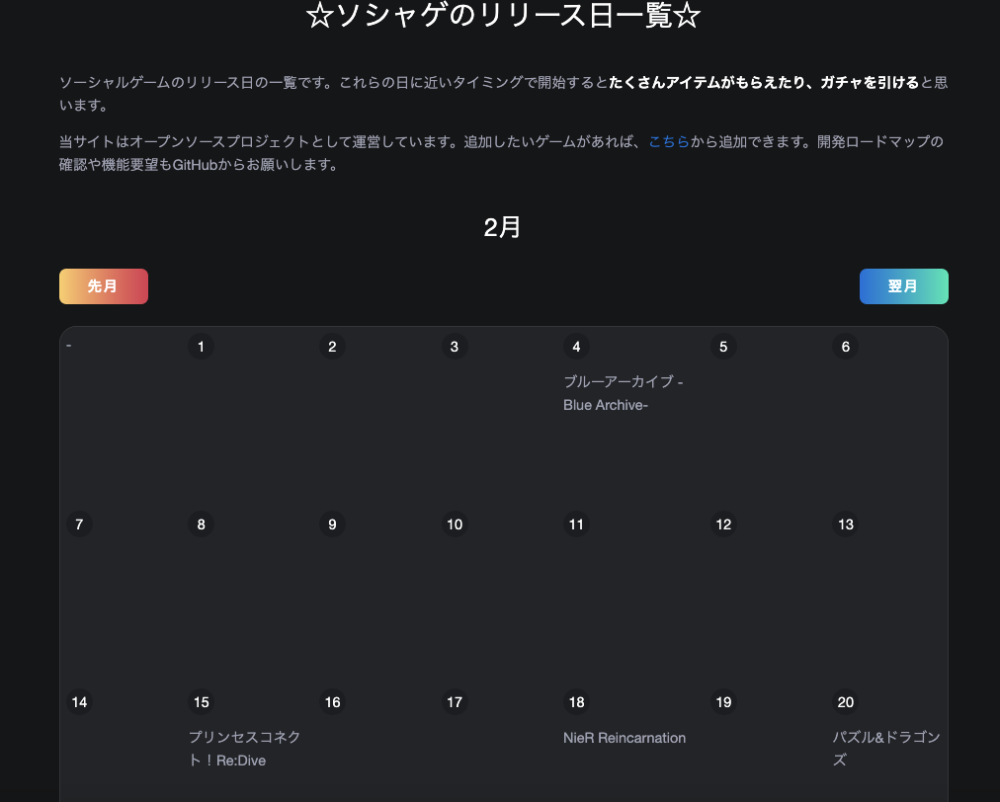

すみません、ブログをサボってました。代わりにスプラトゥーンのランクが S になりました。
今日のブログは、約半年前にソシャゲの周年記念日だけをまとめたカレンダーサイト、[birthstone](https://birthstone.web.app/)を作りましたのでその紹介です

これは、ソシャゲは周年記念ごとに石を配るので、その日を調べられるサイトを作っておけば、該当する日にソシャゲを始めるだけでたくさんガチャを引けてリセマラが捗るというものです。

ただこれからやりたいことをやるために今の構成を捨てることにしたので、今の構成のスナップショットとしてこの記事を書いています。

## 構成

実装は [https://github.com/sadnessOjisan/birthstone](https://github.com/sadnessOjisan/birthstone) です。

### Rust + WebAssembly

Rust も wasm も使わないといけない理由はないのですが、要件が小さいので素振りとして書くにはちょうどいいと思って使いました。
wasm と DOM の bind は Yew に任せています。
なのでコードのほとんどは React や Elm を書くような感じで済ませられたので特に困ることはありませんでした。
（LSP が html! マクロをうまく解釈してくれなくて開発体験はちょっとしんどかったです。）

### Calendarize の再実装

カレンダーを作るのでカレンダーレイアウトを作る必要がありました。
JS だと UI ごと提供するライブラリがあるので（例えば bigcalendar など）楽に作れますが、Rust 環境にはなかったので、そういったライブラリを作るところから始めました。
UI（スタイリング） を Rust で書くのは大変なので、カレンダーのレイアウトだけを吐き出すライブラリを作りました。
それが [calendarize](https://crates.io/crates/calendarize) です。
これは NodeJS の同名ライブラリを同じインターフェースで Rust 上で再実装したものです。

### ガチャ情報をビルド時に埋め込む

ガチャ情報は Yaml で管理しています。
これはソシャゲのリリースごとにメンテすることを見越してのことです。
また PR 経由で情報提供してもらうことも目的です。
実際に[さまざまな PR](https://github.com/sadnessOjisan/birthstone/pulls?q=is%3Apr+is%3Aclosed) をいただきました。

JS 実装だと module bundler を使ってランタイムから呼べるようにできますが、同様のことを Rust でやるために [include_str](https://doc.rust-lang.org/std/macro.include_str.html) マクロを使いました。
これでコンパイル時に wasm に yaml 埋め込むことができます。
あとは yaml parser と serde を使うことで Rust 上でその情報が読み取れます。

## やりたいこと、なぜ今の構成を捨てるか

birthstone は PWA 版でも動作するので、push 通知を実装したくなりました。
リセマラに旬な季節に通知が来たら便利と思ったからです。

そのためには Firebase Cloud Messaging + Cloud Functions が欲しいのですが、yaml 情報を Rust と JS で共有するのがめんどくさいです。
JS で yaml を扱うためにはなんらかの module bundler が必要だし、それを Rust / NodeJS 側のコードからも読める位置に配置するようにしたり、Rust で書かれている以上 lerna などの補助を受けることも難しかったりで、Rust 実装を全て落としたいのが本音です。

また yew にはまだ SSR サポートがないはずで、SEO 的にもあまりよくなさそうであり、Next などで SSG したくなりました。
SEO が強くなって広告収入が入ればその収入でガチャ回せるので、その方が自分の目的にあっているのではと思っています。

## 終わりに

なんかこんなの作らなくても、そもそもソシャゲに石をたくさん突っ込めるようにたくさん稼げばいいだけの話な気がしてきました。
nosh の招待リンクを置いておくので良かったら使ってください。
登録すると僕が 3000 円もらえます。
[
https://nosh.jp/share/t/friend-202103/9ogpi](https://nosh.jp/share/t/friend-202103/9ogpi)

ちなみに nosh が何か分からんという方は [こちら](https://blog.ojisan.io/lockdown-nosh) をお読みください。
生活力皆無でも自粛生活を生き残れる素晴らしいツールです。
