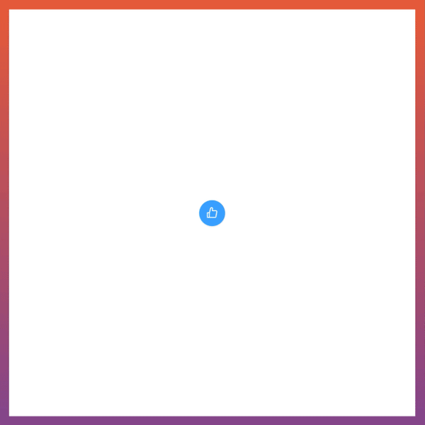

最近、[人の就職を祝う OSS](https://employment-ojisan.vercel.app/)に紙吹雪を導入する[PR](https://github.com/miyaoka/employment-ojisan/pull/8)を投げたくらいには紙吹雪事情に詳しいので、オススメライブラリを紹介します。

## 紙吹雪ライブラリって

こういうやつ

## どういうライブラリがあるのか

自分が知っている限りでは

- <https://www.npmjs.com/package/react-confetti>
- <https://www.npmjs.com/package/react-canvas-confetti>
- <https://www.npmjs.com/package/react-rewards>

があります。

おそらくこの手のライブラリの先駆けは <https://github.com/catdad/canvas-confetti> というライブラリです。
React の中では <https://www.npmjs.com/package/react-confetti> がこの手のジャンルを牽引していた記憶があります。

## どれを使うのがオススメか

2021 年においては react-rewards が良いです。理由は

- TS サポートが厚い、any で潰されていない
- 特定の位置から紙吹雪を破裂させるかのように散らせることが可能、その制御する権利はユーザーが持てる
- canvas を使わないため、ユーザーの state と挙動のリンクが素直にできる
- 最後発であり、example も古風な書き方がされていない

という点です。ただ react-confetti は紙吹雪を無限に出すことができるので、その点は react-confetti に軍配が上がります。

## おわりに

就職するだけでお祝いサイトを作ってもらえる良い友人（会ったことない）を持ちました 😭

OGP: <https://www.canva.com/design/DAEpQ5EEoyY/pqUH08Dx3fYUzTQx6TmA4g/view?utm_content=DAEpQ5EEoyY&utm_campaign=designshare&utm_medium=link&utm_source=sharebutton>
