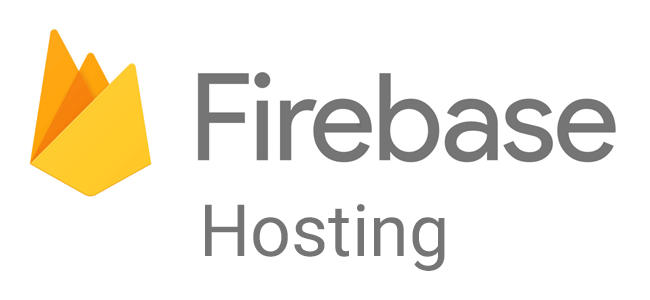
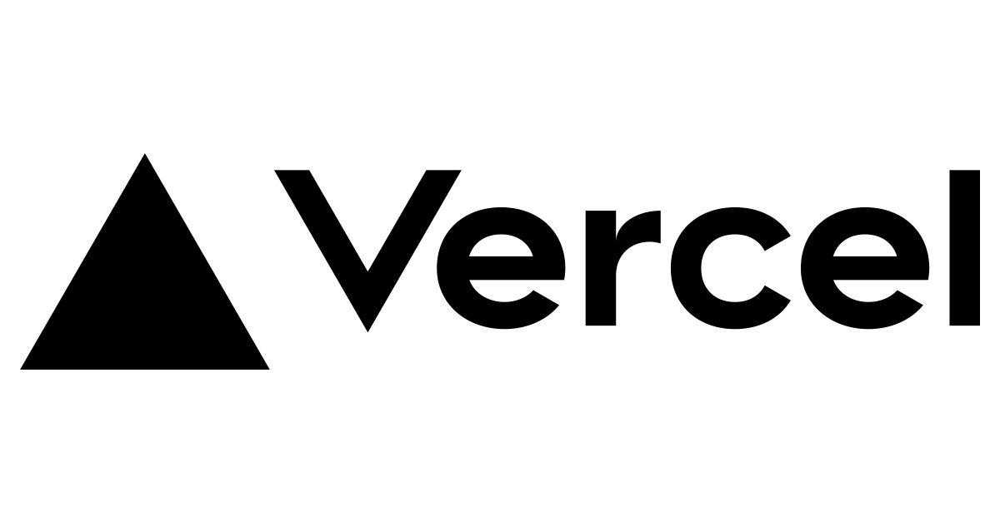
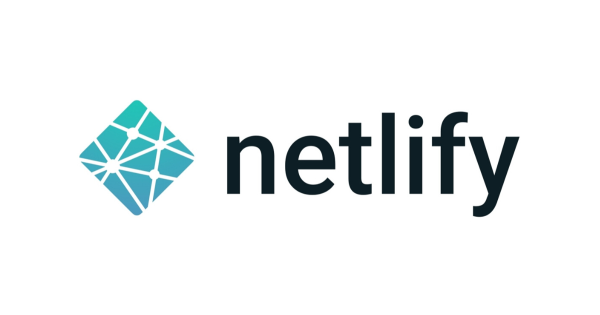
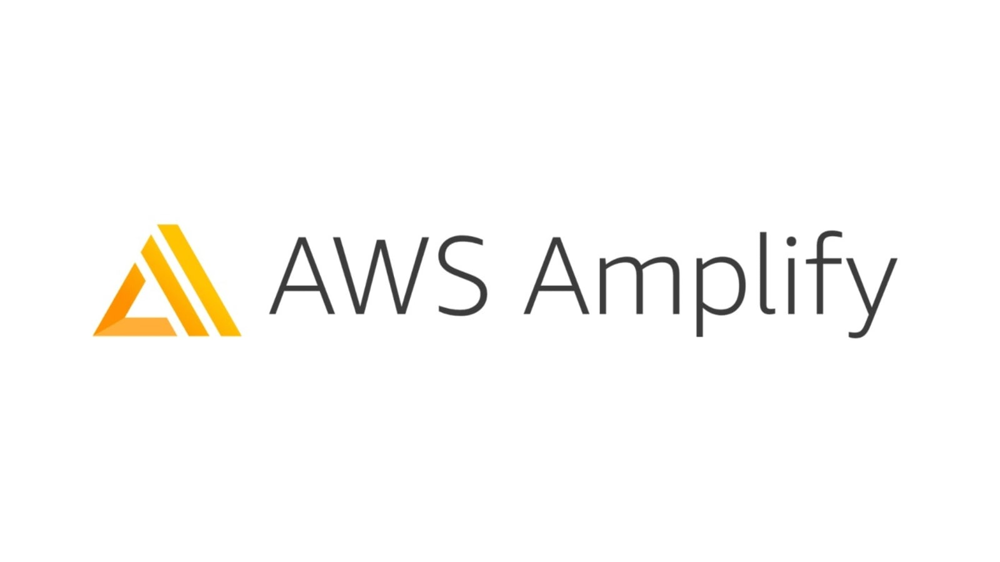

ホスティングサービスに何を使えばいいのか分からないという話はよく目にしますし、僕もたまに思います。
そこでこれまで自分が使ったサービスの特徴や for me, not for me な点を紹介します。
静的ページ、および NextJS を前提としたサービス選定で、Firebase Hosting, Cloudflare Pages, Vercel, Netlify, GitHub Pages, Amplify, CloudRun を紹介します。
また、それらはフリープラン前提の話であり、not for me な点は課金すれば解決するものが多いことを先に述べておきます。

## 全てに共通していること

ブランチ連携したらすぐ（ほぼ）無料でホスティングできます。連携の方法はサービスの GUI もしくは GitHub Actions です。

またプレビュー機能が存在しており(GitHub Pages 以外)、動作確認が楽です。

## Firebase Hosting

### for me

- 国内にエッジがある CDN から配信できる。
  - 裏は多分 fastly
  - FYI: <https://firebase.google.com/terms/subprocessors>
- CI/CD のパイプラインを握りやすい
  - GitHub Actions を生成してくれる
  - 他のホスティングサービスもブランチ連携に頼らない方法を提供しているので実現可能だが、Firebase の強みはその yaml を生成してくれるところにあり、CI/CD の構築が実質 zero config.
- Basic 認証や IP 制限も Cloud Functions を使えばでき、同等の機能を提供する他のサービスの PRO プランに入るよりかは圧倒的に安価。

### not for me

- 特に思いつかないが、簡素さではブランチ連携をするだけの他のサービスに劣っており、デプロイだけが目的なときは選択しないです。

## Cloudflare Pages

### for me

- Analysis が無制限についてくるので PV を測り易い。
  - analysis は firebase にもあるが、こちらはライブラリを入れなくてよく、チェックボックスを ON にするだけでよい。
  - Fusuma をデプロイするときに使っている。おかげでスライドがどれだけ見られたかといったことが測れる。
    - [Markdown を 黒塗りできる Monadic Parser -Darkdown-](https://darkdown-slide.pages.dev/)

### not for me

- 同一レポジトリから複数サイトをデプロイできない。
  - monorepo にしていると厳しかったり、storybook や coverage report のデプロイに困る
- URL を自分で変えられない。やるためには初デプロイ時にレポジトリ名を修正すればできる。（名前を戻したときにリンクが壊れそう。やったことないから知りませんが。）

## Vercel

### for me

- ブランチ連携するだけで完結
- SSR できる

### not for me

- 自分作成以外のレポジトリを連携できない
  - 課金すれば可能

## Netlify

### for me

- slack 通知がデフォルト機能で設定できる
- 操作 GUI が使いやすい
  - 長らく変わっていないだけ？
  - 自分が使いすぎているだけ？
  - 使いやすいので、Firebase Hosting を使う理由がない時は、こちらを使っています。
- プラグイン概念があり、Netlify 側のビルドのパイプラインに介入できる。
  - 例えばビルドキャッシュが使える
    - [Gatsby 製サイトを Netlify にデプロイする前に見ておきたい設定 2 つ（ビルドと表示）](https://blog.ojisan.io/gatsby-meet-netlify)

### not for me

- CDN のエッジが国内にないので、他のホスティングサービスに比べると遅い

### 個人的な想い

ブランチ連携したらタダでデプロイできる系のサービスの草分け的存在で、また Jamstack の提唱をしたり、静的サイトホスティングの価格競争・性能競争を進ませた存在だと思っており、とても感謝しています。

## GitHub Pages

### for me

- GitHub Actions に yaml を置くだけでデプロイできる
  - [GitHub Actions と GitHub Pages で yml をフォルダに入れておくだけのお手軽デプロイ](https://taihi-blog-ojisan-io-f7lfnpnsh-ojisan.vercel.app/gha-ghpage)

### not for me

- preview がない
  - あれば最強だと思ってる。
- ただデプロイするだけではうまくいかないケースがある
  - NextJS の SSG や create-react-app
  - gh page 用のデプロイコマンドを使えば解決はできる

## Amplify

### for me

- ブランチごとに環境変数を GUI でセットできる
- AWS 資産との連携が楽
  - Route53 など

### not for me

- AWS にログインしないといけない
  - 私は仕事でならまだしも個人開発で AWS は使うことがあまりないです。
  - 会社用のアカウントをログアウトしないといけなかったり面倒
- amplify.yaml の書き方は覚えないといけない
  - 学習コストは無いとはいえ、portable なスキルかどうかを考えるとどうなのだろうか？

## CloudRun

### for me

- GCP 上で NextJS を使いたい時の選択肢になる
- NextJS を使うがカスタムサーバーを動かしたい時に NodeJS そのものを動かしたい時の選択肢
  - 例えば websocket

### not for me

- デプロイがめんどくさい
  - cloudbuild -> gcr -> cloudrun
  - この手のめんどくささは GAE で解消できるがお金が・・・
  - ブランチ連携したら完結する Vercel が簡単すぎるだけ？

## 試してないけど気になっているもの

### Gatsby Cloud

free プランが 1 サイトのみだが使えないことはない。
財務的なバックボーンがまだ弱そうで、ある日突然値上げやフリープラン縮小がないと言い切れないと思っており、採用に踏み切れない。

## おわりに

自分の選び方としては

- サービスとして運営したい: Firebase Hosting
- SSR する: Vercel
- スライドなど、サービスではないが PV を計測したい: Cloudflare Pages
- storybook や test coverage: Netlify
- sandbox や実験の成果物をデプロイしたい: Github Page

といった形です。

みなさんの推しホスティングサービスも教えてください。
