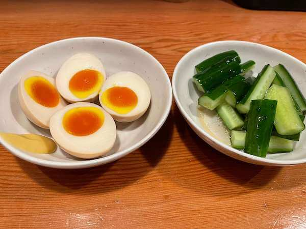
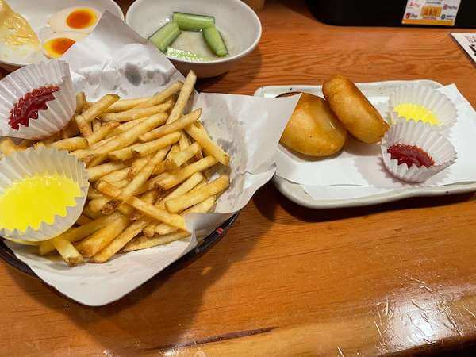
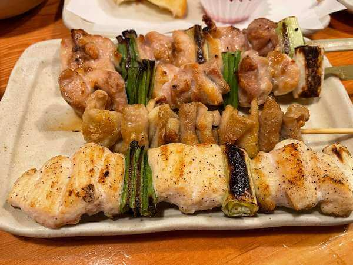
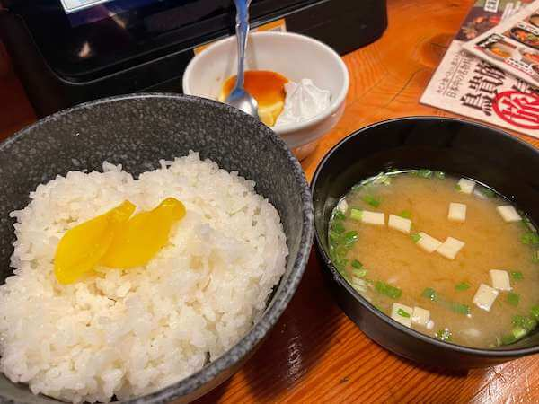

この記事は [sadnessOjisan Advent Calendar 2021](https://adventar.org/calendars/7015) ２日目の記事です。

昨日の記事で「1 人アドベントカレンダーを始めたのは、たまった技術メモを放出する機会が欲しかったからです」とか書いてたのに、いきなり技術関係ないってどういうことなんですかね。

先日 JSConf の打ち上げとして鳥貴族に行ったのですが、それが３年振りくらいの鳥貴族であまりの美味しさに泣きそうになる程感動しました。
そのとき「今度 1 人で行こ」って心の中で決めていましたので、昨日それを決行しました。

## 鳥貴族は 1 人で入れる店

日常的に 1 人焼肉をしている自分でも 1 人鳥貴族は少し抵抗がありました。
しかし店の中にカウンターがあることを確認していたので、実は 1 人でも入りやすい店である可能性は感じていました。
そこで今回はそのカウンター席に行ってみました。
結果、このカウンターがとても出来が良かったです。
ブースのような席かつ横の席と必ず距離がある設計になっています。

どうやらこれは有名な話らしく、調べてみるといろんな人が記事にしていました。

FYI: https://nlab.itmedia.co.jp/nl/articles/2111/30/news082.html

FYI: https://yajiphoto.com/2018/10/torikizoku/

写真をみたら分かる通り、横の席とは必ずスペースがあるので、カウンターで横並びになって服がすれ違う距離で相手の出方をちょっとずつ確かめながらドキドキを楽しむみたいなゴミクソくだらねぇ人間関係を封じており、鳥貴族は完全にお一人様のために設計したということがひしひしと伝わってきますね。良い店だ。

## みんなで食べるご飯より、1 人で好きなもの注文した方が美味しいに決まってるだろ

複数人で行くとどうしてもシェアになって 1 人 1 つ食べれないのが少し不満に思っていました。
でも 1 人でいけば全部 1 人で食べられるのでとても幸せでした。

おかずにパフェやアイスを注文したり、アイスを一人で 2 つ注文しても奇異の目で見られないのも良いです。

## とはいえ複数人で行く良さもある

僕は

- 塩だれキューリ
- 味付煮玉子
- ふんわり山芋の鉄板焼
- ポテトフライ
- カマンベールコロッケ
- もも貴族焼（塩）
- むね貴族焼（スパイス）
- ささみ塩焼 わさび添え
- むね明太マヨ焼
- チョコパフェ
- カタラーナアイス

が好きなのですが、胃袋的に全部は食べられず、全部注文してもいくつかは残すことになりました。

ところで鳥貴族には食べ飲み放題プランがあるので、それを使えばこの問題は解消できそうです。
これは 2 時間 3000 円で食べ飲み放題ができますが４人必要です。

FYI: https://www.torikizoku.co.jp/menu/bansankai/

私は 1 人飲みで 4000 円ほど使ったので 4 人集めて食べ飲み放題やったほうが経済的で、好きなものも全部食べられるという点から複数人で行く鳥貴族というのも良いのかもしれません。

## 何がいいたいか

誰か一緒に鳥貴族で食べ飲み放題しながら、これからの フロントエンドについて語りませんか？
