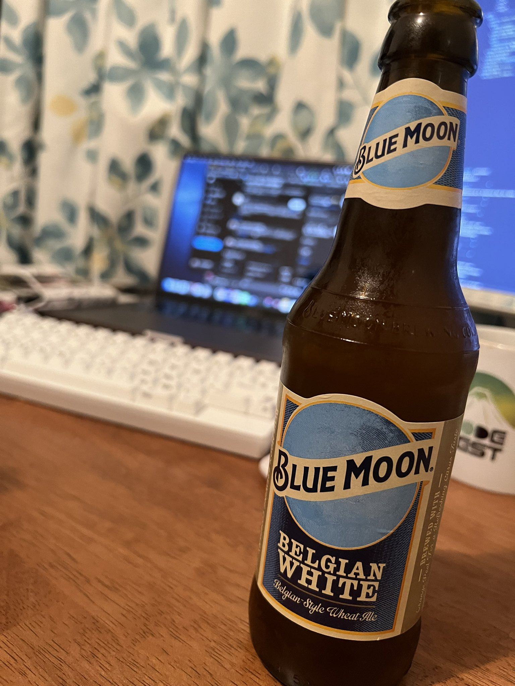

この記事は [sadnessOjisan Advent Calendar 2021](https://adventar.org/calendars/7015) 4 日目の記事です。

僕は絶対にお酒は夜しか飲まないのですが、つい魔が差して昼からビールを飲んでしまいました。
たまたま瓶ビールが家にあり、栓抜きを持っていなかったので注文したのを受け取ったときについ魔が差してしまいました。

## 感想

ふわふわして気持ちの良い午後を過ごせました。
でも夜に急に眠気が来て寝てしまったので睡眠は破壊されました。
また一時的に高揚感で進捗は出ましたが、全体として進捗は破壊されました。

## 雑学

アルコール依存症の基準の一つにアルコールが体に入っている時間を持続しているかというものがあります。
昨今はリモートワークの普及によりいつでもアルコールが摂取できる状況です。
そのためアルコール依存症になる人が増えると予想されていたらしく、実際に増えたらしいです。

一方で同じような原理で性依存症の人も増えたらしいです。
みなさんリモートワーク中に何してるんですか・・・

FYI: https://blogos.com/article/555403/
