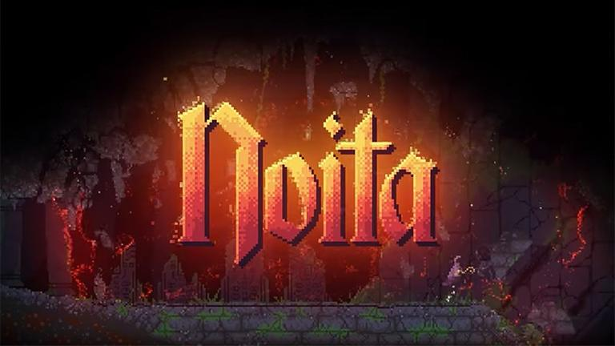

この記事は [sadnessOjisan Advent Calendar 2021](https://adventar.org/calendars/7015) 11 日目の記事です。
書かれた日付は 12/23 です。
もう間に合わせる気がないのでなんでサボってるのかについて書きます。

このゲームのせいです。

いま Steam で半額なので買いましょう。
生活が破壊されます。

FYI: https://store.steampowered.com/app/881100/Noita/?l=japanese

## どういうゲームか

いわゆるローグライクです。
ダンジョンを進みながら魔法の杖と呪文を集めて行って、各層のチェックポイントでそれを装備して次の層へ挑んでいくといきゴールを目指すと言うゲームです。

このトレイラーにビビっと来たら買いましょう。

<iframe width="560" height="315" src="https://www.youtube.com/embed/0cDkmQ0F0Jw" title="YouTube video player" frameborder="0" allow="accelerometer; autoplay; clipboard-write; encrypted-media; gyroscope; picture-in-picture" allowfullscreen></iframe>

FYI: https://store.steampowered.com/app/881100/Noita/?l=japanese

ただ難易度がべらぼうに高くて 150 回死んでもクリアできていません。プレイ時間が 80 時間超えていました。なのにクリアできていません。Slay the Spire だと全キャラクリアできているくらいの時間なのに・・・進行度で言うとチュートリアルクリアすらできていないレベルらしく数百時間遊ぶタイプのゲームであることがもう分かっています。

難易度が高い理由が、理不尽にゲームオーバーになるという点です。このゲームの特徴としてピクセル単位で物理演算がされており、自分の呪文やステージの環境の相互作用で爆発や火事や凍結や感電して死ぬみたいなことが往々にしておきます。最初は何をしたら死ぬかが分からないので死んで覚えるしかないです。そして自由度が高すぎるので色々好奇心で試したりしているとすぐ死にます。死ぬのでクリアできません。でも死ぬたびにプレイヤースキルが上がっていくので、だんだん死ななくなり楽しくなります。死ににくなるので時間も溶けていくわけですね。まあ最後は死ぬのでクリアできないんですけど。

本当はもっと魅力を語りたいのですが、クリアできていないのに書くと情けないのでクリアできるまでお預けです。できたらちゃんとブログ書きます。と言うわけでしばらくアドベントカレンダーはサボりますね。生活リズムを元に戻したりやることもやっておきたいので。

## 追記

Special Thanks: Noita を僕に勧めた人、Noita をクリアするまで配信を強要させられる Discord サーバーに閉じ込めた人たち
