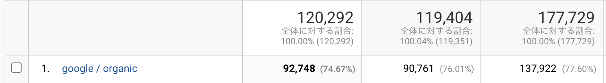
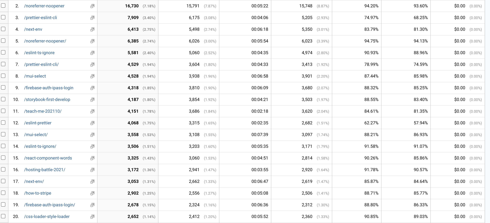

この記事は [sadnessOjisan Advent Calendar 2021](https://adventar.org/calendars/7015) 12 日目の記事です。書かれた日は 12/27 です。

去年もやった、ブログの１年間の振り返りをしたりアクセス解析をみていきましょう。

## Update

ブログ自体のアップデートについてです。

### ブログの構成を大きく変えた

色々自作してみようと思って、元々の実装をやめました。

FYI: https://github.com/sadnessOjisan/blog.ojisan.io

これまでにアップデートの PR をくださった方、ありがとうございます。

自作しようとしたきっかけは、maxmellon の https://me1on.dev/blog/20201221 がきっかけです。
全ての自作は厳しかったのですが、とりあえず便利なものを使うのをやめようと思い、SSG ツールとホスティングサービスをやめました。

ひとまず Rust + VPS で 静的吐き出しした HTML を吐き出すブログを作りました。

FYI: https://blog.ojisan.io/sakura-vps

### 本番環境をぶっ壊した

その後、jpg, png 以外に gif をあげられるように、VPS に SSH して何か作業していたら、Nginx 周りの何かを消して、あれこれ復旧しようとしたら余計に壊してしまって修復できなくなってブログが見れなくなってしまいました。
便利なもの縛りとして Docker の利用も禁止していたのでこうなりました。

FYI: https://blog.ojisan.io/taihi-kankyo-tsukuru

なので Gatsby + Vercel で簡易的なブログを作ったのがこのブログです。

### ブログを作り直す予定だったけど頓挫した

これはあくまでも仮住まいなのですぐ作り直していたのですが、構成を完璧にしようとして無限に時間が解けていき、この仮住まいのままなのが今の状態です。
なので一旦は自作ブログを切り上げて、Gatsby でさくっと見栄えが良いのを作ってしまおうと今では考えており、お正月にでもやろうかなと思っています。

## 実績値

では今年書いたブログを見ていきます。

### 書いた本数

2021/1/1 - 2021/12/27 で、55 件書いていました。
ちなみに去年は 2020/06/10 - 2020/12/31 で、82 記事書きました。
半年しかないのに多いですね。
どうやら就職した影響が大きいようです。
実際、暇な時間はあまりないのでブログを書くペースは落ちています。
ただ手元にたくさんメモは溜まっているので、それをさくっと記事にはしていきたいですね。

### PV

2021/1/1 - 2021/12/27 で、232,878 PV でした。
この数字は前年度が 143,415PV なので大幅に上がっていますが、そもそも前年度は計測期間が半年なので当然です。
むしろ割合比率では前年度より PV は落ちています。

### 流入経路

主な経路は Google 経由です。

これは去年に Google での経由を増やすことを目的としたので、達成できていて嬉しいです。
これまでは Twitter -> はてブ での瞬間的なアクセス増が主な流入元だったのですが、それを抜け出せてよかったです。

自分は Google からの持続的な流入が、自分が誰かの問題解決を手伝えた（かもしれない）バロメータだと思っているので、この指標は今後も大事にしたいです。

あとイントラネットや社内ツールから見てる人、noreffer の設定をしましょう。類推できてはいけないあれこれがありました。

### 読まれた記事

去年書かれた記事が多く読まれています。
自分でも書いた内容を覚えていなかったりするので読み返すと懐かしい気持ちになります。
ただ一番大きい感情は「「「拙すぎて恥しい！！！」」」です。
なんか色々と勘違いというか変な主張をしているというか、「それを言いたかっただけでその文章関係なくね？」みたいなのばかりで本当に恥ずかしくなってきました。

#### noreferrer-noopener

FYI: https://blog.ojisan.io/noreferrer-noopener/

noreferrer だけの検索キーワードでトップにくるの勘弁してくれ。
"noreferrer noopener" 付けろっていうだけの話をこんなにくどくど書いてて恥ずかしくなってきました。
それにイマドキの主要ブラウザはデフォルトで付いていたり、そもそも COOP に寄せた方がイマドキな気もしますし書き直した方が良い気がしている。

#### prettier-eslint-cli

FYI: https://blog.ojisan.io/prettier-eslint-cli/

prettier だけの検索キーワードで出てくるの勘弁してくれ。
書かれている内容は今となっては公式ドキュメントの焼き直しなので公式を読んでください。

FYI: https://prettier.io/docs/en/integrating-with-linters.html

#### eslint-ts-ignore

FYI: https://blog.ojisan.io/eslint-ts-ignore/

この世の邪悪のような記事。
だが手を出したくなる気持ちもわかる。
こういう記事があるから静的チェッカの抑制がなくならないのでは。

## 来年はどういうの書いていきたいか

今年と同じく、自分が困ったちょっとしたことの解決策をまとめていこうと思います。
あとは混同して定義を調べたときのメモなども積極的に公開していこうと思います。
自分が書けるものかつ書きたいものはそういうものな気がします。

#### おわりに

たまに読み返すと恥ずかしくなる記事があるのだけど、それが自作ブログって感じで良いな・・・
