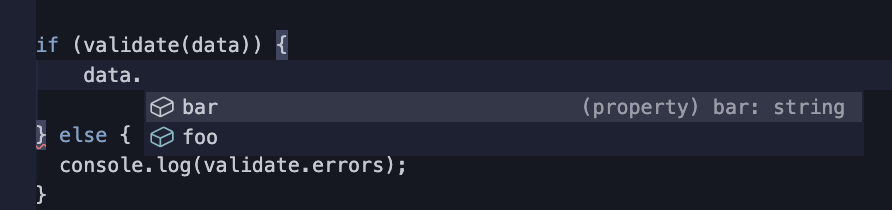
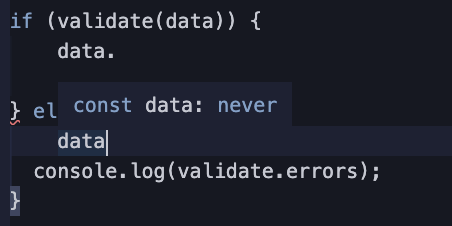

この記事は [sadnessOjisan Advent Calendar 2021](https://adventar.org/calendars/7015) 15 日目の記事です。書かれた日付は 1/3 です。

JSON Schema + Ajv + TypeScript という組み合わせは、スキーマ駆動開発に置いて一定の成果や評価がされていると思います。
しかし、これらの力を最大限に引き出そうとしたら、型周りで困ってしまったので何をどう困っているかのメモを残そうと思います。もし解決策を知っている方がいらっしゃりましたら教えてください。

## そもそもこれらのツールはどういうものか

### JSON Schema

FYI: https://json-schema.org/

JSON Schema は JSON の形を定義することができる規格・語彙です。
大きな特徴としてそれ自体も JSON であり、なんか良いです。

```ts
const data = { foo: 1, bar: "abc" };

type Data = {
  foo: number;
  bar: string;
};

const jsonSchema = {
  type: "object",
  properties: {
    foo: { type: "integer" },
    bar: { type: "string" },
  },
  required: ["foo", "bar"],
};
```

### Ajv

[ajv](https://ajv.js.org/) は JSON Schema を使ったバリデーションライブラリです。

公式の例を使うと、

```js
const Ajv = require("ajv");
const ajv = new Ajv();

const schema = {
  type: "object",
  properties: {
    foo: { type: "integer" },
    bar: { type: "string" },
  },
  required: ["foo"],
  additionalProperties: false,
};

const data = { foo: 1, bar: "abc" };
const valid = ajv.validate(schema, data);
if (!valid) console.log(ajv.errors);
```

このようにしてバリデーションすることができます。

## Ajv を通した後の値には型がついて欲しい

Ajv は valdation をする関数を提供します。
もし validation に通ったら、そこからはその値に型がついて欲しいです。

```js
const Ajv = require("ajv");
const ajv = new Ajv();

type Data = {
  foo: number;
  bar?: string;
};

const schema = {
  type: "object",
  properties: {
    foo: { type: "integer" },
    bar: { type: "string" },
  },
  required: ["foo"],
  additionalProperties: false,
};

const data = { foo: 1, bar: "abc" };
const valid = ajv.validate(schema, data);
if (!valid) {
  data // ここには型がついて欲しくない
  throw new Error("invalid)
}

data // ここに Data 型がついて欲しい。
```

しかし、現実には型が付きません。

## 公式による TS サポート

とはいえそれだと流石に使い辛いので、型をつけるためのツールは公式が用意しています。
JSONSchemaType という型があり、これについて欲しい型をジェネリクスとして渡すことで型をつけることができます。

例えば、

```ts
import Ajv, { JSONSchemaType } from "ajv";
const ajv = new Ajv();

interface MyData {
  foo: number;
  bar?: string;
}

const schema: JSONSchemaType<MyData> = {
  type: "object",
  properties: {
    foo: { type: "integer" },
    bar: { type: "string", nullable: true },
  },
  required: ["foo"],
  additionalProperties: false,
};

// validate is a type guard for MyData - type is inferred from schema type
const validate = ajv.compile(schema);

// or, if you did not use type annotation for the schema,
// type parameter can be used to make it type guard:
// const validate = ajv.compile<MyData>(schema)

const data = {
  foo: 1,
  bar: "abc",
};

if (validate(data)) {
  // data is MyData here
  console.log(data.foo);
} else {
  console.log(validate.errors);
}
```

のようにすると、`validatte(data)` の後　の data には型がついています。





「自分で型指定しているのだから型がつきそうなのは当然」と思うかもしれませんが、JSON Schema とそぐわない型を型指定しようとすると怒られるので、この型指定は正しい型指定です。
なので Ajv + TS はうまくいきそうで困ることは何もなさそうです。

しかし、現実の問題を解決しようとすると型がつけられなくなります。

## Ajv を使いたい時は validaton を後からつけたい時

Ajv が zod などの validation ライブラリよりまさっている点は、validation を後から導入できる点です。
zod などは先に zod schema を作る必要がありますが、ajv の場合は JSON Schema という互換性が広い技術を使うので様々なものから生成できます。
その一つに TS の型から生成できます。
そのためプロジェクトの途中から Ajv を導入していくことは容易です。
例えばすでに大量の型があるプロジェクトに対して zod schema を書いていくことは現実的ではなく、TS から JSON Schema を生成できる JSON Schema が便利です。

（※ zod にコンバートツールがあるのは知っていますが、zod が廃れた後に zod -> xxx へのコンバートツールができる保証はなく移行で困りそうなので、あまり zod が好みではないです。それよりかはきちんと規格が存在し、フロントエンドに限らず様々な世界から参照されている JSON Schema に従いたいです。）

## TS からの JSON SChema 生成

その JSON SChema 生成 には主に２つのライブラリが使われています

### quicktype

ありとあらゆる何か <-> JSON Schema を実現するライブラリ

FYI: https://quicktype.io/

```sh
quicktype pokedex.ts -o hoge.json
```

### typescript-json-schema

TypeScript <-> JSON Schema を実現するライブラリ

```bash
typescript-json-schema hoge.ts Hoge
```

### どちらのライブラリを使うべきか

まず typescript-json-schema で吐き出した JSON Schema ですが、

```js
// npx typescript-json-schema hoge.ts Shape
{
  "$schema": "http://json-schema.org/draft-07/schema#",
  "properties": {
    "size": {
      "description": "The size of the shape.",
      "type": "number"
    }
  },
  "type": "object"
}
```

といった形です。

一方で quicktype で吐き出した JSON Schema は、

```js
// npx quicktype hoge.ts  --lang schema
{
    "$schema": "http://json-schema.org/draft-07/schema#",
    "definitions": {
        "Shape": {
            "title": "Shape",
            "type": "object",
            "properties": {
                "size": {
                    "description": "The size of the shape.",
                    "type": "number",
                    "title": "size"
                }
            },
            "required": [
                "size"
            ]
        }
    }
}
```

といった感じです。

このとき、Ajv の JSONSchemaType に型を入れて怒られないのは後者です。
Ajv が必要とする JSON Schema は required が必須です。
本来 JSON Schema の規格としては不要なのですが、型推論するときは要求されます。

では quicktype を使うと良さそうなのですが、問題があります。
それは型の import ができない点です。

つまり、

```ts
import { User } from "user";

type Data = {
  users: User[];
};
```

のような型からは JSON Schema が生成できません。

```ts
type User = {
  id: number;
};

type Data = {
  users: User[];
};
```

といった風に同じファイルに書く必要があります。
なのでこれは使い勝手が悪く、流石に困ります。

一方で typescript-json-schema なら可能です。
typescript-json-schema の場合、required フィールドが問題でしたが実はこれはオプションでつけることができます。
そのため先刻の問題も解消できます。

```js
// npx typescript-json-schema hoge.ts Shape --required

{
    "$schema": "http://json-schema.org/draft-07/schema#",
    "properties": {
        "size": {
            "description": "The size of the shape.",
            "type": "number"
        }
    },
    "required": [
        "size"
    ],
    "type": "object"
}
```

これで全ての問題が解決したかに見えます。

### nullable 指定が必要

しかし、実際には型指定が失敗するケースがあります。

それは、

```ts
type User = {
  id: string;
  name?: string;
};
```

のように Optional , Nullable, Undefinable な値を扱う時です。

このとき Ajv Valid な JSON Schema は、JSON Schema の nullable 指定を要求します。
しかしそれは生成ライブラリは付けてくれないのです。
そのため そのような型を使っていると Ajv で型を付けてくれないのです。
Issue にもなっています。（僕もしれっとコメントをしました）

FYI: https://github.com/YousefED/typescript-json-schema/issues/419

## 世間はどのようにして TS + Ajv を使っているのか

このように型をうまく使えない理由は見つかる一方で、Ajv はこの手の処理としては歴史も長く代表的なライブラリです。
なにかワークアラウンドはあるのでしょうか。
適当に 「Ajv TS」とかでググってみます。

そうするとたくさんの記事がヒットしますが、

- 型をそもそも付けていない
- as を使う
- is を使う

などとしていました。

これらは JSON Schema と TypeScript の整合性を人間がとる必要があり心配が残ります。

そのような問題意識からか is による user-defined type guard と validation 関数を生成する CLI ツールを自作している方もいました。
しかし is を使っている以上、そのツール自体にバグがあると型の保証は取れないですし、例えば JSON Schema だけ、型だけを変更した時にその同期を取れる保証もありません。

やはり理想は Ajv の `JSONSchemaType<T>` に頼ることです。

## で、何に困っているの？

次の要求が満たせていないことです。

- 既存プロジェクトにある大量の 型のバリデーションを、Ajv でしたい
  - 既存の資産を生かしたいかつ剥がしやすさや移行のしやすさを考慮しての Ajv チョイスだが別の方法があるならそれでも可
- 型から JSON Schema を吐くツールで、Ajv の JSONSchemaType が要求する JSON Schema を吐き出したい

とにかく既存の大量の型に対してバリデーションを、完全な形で行いたいです。

## 本当に解決策はないの？

実は JSONSchemaType と JSON Schema 生成ツールとの整合性を取って、万々歳する方法はあるにはあるのですが（それを実現するライブラリを作ったのですが）、まだ検証中なので検証が終わればそのための方法を紹介しようと思います。
