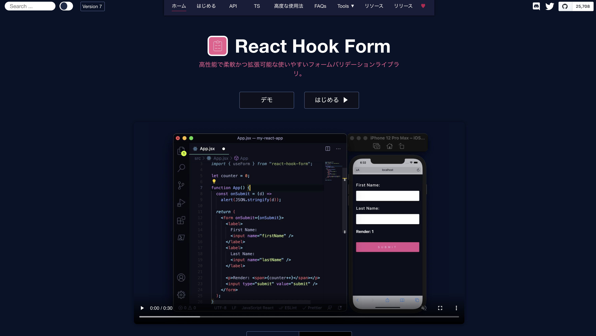
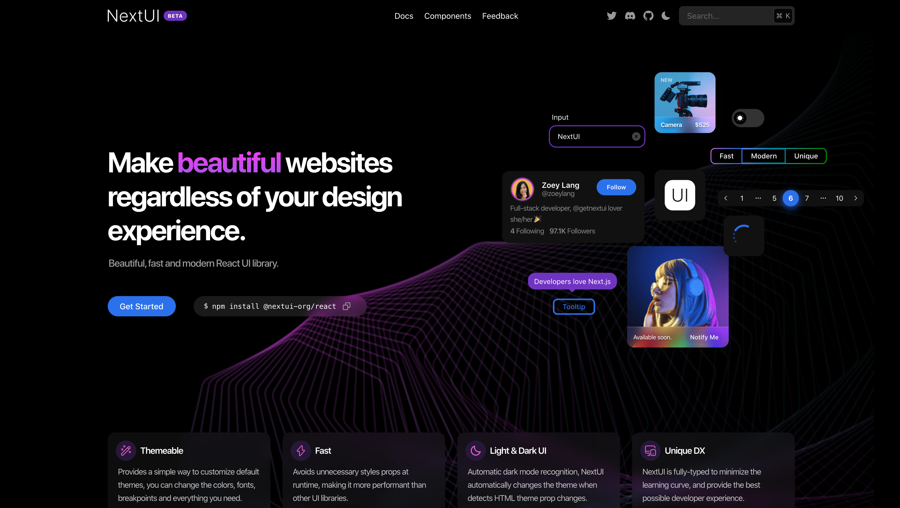
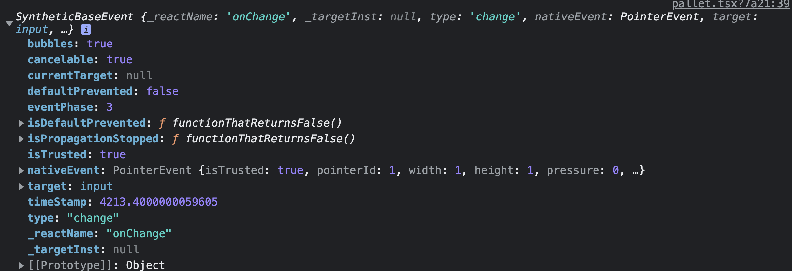
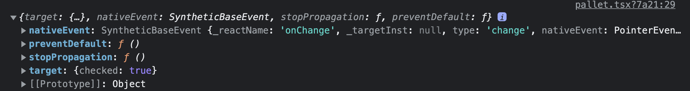

この記事は [sadnessOjisan Advent Calendar 2021](https://adventar.org/calendars/7015) 23 日目の記事です。書かれた日付は 1/30 です。

最近、[react-hook-form](https://react-hook-form.com/) と [NextUI](https://nextui.org/) の人気がじわじわ上がっていると思うのですが、これを組み合わせるとどうなるのだろうかと思っての記事です。実は組み合わせたら色々なところでハマったのでその時のメモです。

## react-hook-form とは

2022 年 1 月現在、イケてるフォームライブラリです。



hook とある通り custom hooks を提供しており、それをコンポーネントに渡すことでフォームの状態管理が可能になります。

公式の例を借りると、

```tsx
import React from "react";
import { useForm, SubmitHandler } from "react-hook-form";

type Inputs = {
  example: string;
  exampleRequired: string;
};

export default function App() {
  const {
    register,
    handleSubmit,
    watch,
    formState: { errors },
  } = useForm<Inputs>();
  const onSubmit: SubmitHandler<Inputs> = (data) => console.log(data);

  console.log(watch("example")); // watch input value by passing the name of it

  return (
    /* "handleSubmit" will validate your inputs before invoking "onSubmit" */
    <form onSubmit={handleSubmit(onSubmit)}>
      {/* register your input into the hook by invoking the "register" function */}
      <input defaultValue="test" {...register("example")} />

      {/* include validation with required or other standard HTML validation rules */}
      <input {...register("exampleRequired", { required: true })} />
      {/* errors will return when field validation fails  */}
      {errors.exampleRequired && <span>This field is required</span>}

      <input type="submit" />
    </form>
  );
}
```

のような形で使えます。

FYI: https://react-hook-form.com/get-started

custom hooks の返す register を input に埋め込むことで、その form の状態管理を行えます。

これの凄いところは TS サポートの充実さであり、`register` などで型の補完が効くので、監視対象を取り違えるみたいなバグを作りづらいです。

## NextUI とは

2022 年 1 月現在、イケてるコンポーネントライブラリです。



他のコンポーネントライブラリと何が違うのかといえば、かっこよさです。
グラデーションやブラー効果、シャドウをふんだんに使ったコンポーネントを使えます。
それに加え、使いやすさも充実しており、Chakra や Mui などといったコンポーネントライブラリの中では後発ライブラリに該当するようなライブラリの機能を取り込んでおり、とてもモダンです。

もちろん、フォームコンポーネントがあるのでフォームも構築できます。

```tsx
<Input placeholder="Next UI" />

<Textarea
    label="Write your thoughts"
    placeholder="Enter your amazing ideas."
/>

<Radio.Group value="A">
  <Radio value="A">Option A</Radio>
  <Radio value="B">Option B</Radio>
  <Radio value="C">Option C</Radio>
  <Radio value="D">Option D</Radio>
</Radio.Group>

<Checkbox checked={true}>
    Option
 </Checkbox>
```

## では組み合わせてみよう

### Input

```tsx
<Input {...register("text")} />
```

のようなコードは動きます。内部的に onChange が発火し、react-hook-form の状態が更新されます。

### Textarea

```tsx
<Textarea {...register("text")} />
```

のようなコードも動きます。内部的に onChange が発火し、react-hook-form の状態が更新されます。

### Radio

```tsx
<Radio.Group value="A">
  <Radio value="A" {...register("option")}>
    Option A
  </Radio>
  <Radio value="B" {...register("option")}>
    Option B
  </Radio>
  <Radio value="C" {...register("option")}>
    Option C
  </Radio>
  <Radio value="D" {...register("option")}>
    Option D
  </Radio>
</Radio.Group>
```

のようなコードは動きません。内部的に onChange が発火しません。

## react-hook-form をコンポーネントライブラリと組み合わせる

react-hook-form には他のコンポーネントライブラリと組み合わせる機能があり、Mui などでよく使われています。

FYI: <https://dev.classmethod.jp/articles/mui-with-rhf-v7/>

render props か custom hooks のどちらかを使うことになるのですが、react-hook-form が controll と呼ばれる部品を提供しているので、それを使って状態に紐付けられる専用のイベントハンドラを作ります。

```tsx
import React from "react";
import Select from "react-select";
import { useForm, Controller, SubmitHandler } from "react-hook-form";
import Input from "@material-ui/core/Input";

interface IFormInput {
  firstName: string;
  lastName: string;
  iceCreamType: { label: string; value: string };
}

const App = () => {
  const { control, handleSubmit } = useForm<IFormInput>();

  const onSubmit: SubmitHandler<IFormInput> = (data) => {
    console.log(data);
  };

  return (
    <form onSubmit={handleSubmit(onSubmit)}>
      <Controller
        name="firstName"
        control={control}
        defaultValue=""
        render={({ field }) => <Input {...field} />}
      />
      <Controller
        name="iceCreamType"
        control={control}
        render={({ field }) => (
          <Select
            {...field}
            options={[
              { value: "chocolate", label: "Chocolate" },
              { value: "strawberry", label: "Strawberry" },
              { value: "vanilla", label: "Vanilla" },
            ]}
          />
        )}
      />
      <input type="submit" />
    </form>
  );
};
```

ここでは公式ドキュメントの例に則って render props の例を載せます。

FYI: <https://react-hook-form.com/jp/get-started/#IntegratingwithUIlibraries>

つまり僕たちは render props に Radio コンポーネントを渡すことで解決できそうに見えます。

## reder props にラジオボタンを渡す

ではさっそく実験してみましょう。

```tsx
import { Radio } from "@nextui-org/react";
import { type Control, Controller } from "react-hook-form";

interface Props {
  control: Control<Input, object>;
}

export const Pallet: VFC<Props> = ({ control }) => {
  return (
    <div>
      <Controller
        control={control}
        name="color"
        render={({ field }) => {
          const { onChange, value } = field;
          return (
            <Radio.Group>
              selected: {value}
              <Radio onChange={onChange} value="red">
                red
              </Radio>
              <Radio onChange={onChange} value="blue">
                blue
              </Radio>
              <Radio onChange={onChange} value="green">
                green
              </Radio>
            </Radio.Group>
          );
        }}
      />
    </div>
  );
};
```

これはうまくいくでしょうか？
いいえ、うまくいきません。
ラジオボタンを押しても react-hook-form の内部状態は変わらないです。
それを確かめるためには render props が持つ value を見ると良いです。

## NextUI が渡すイベントはネイティブなイベントではない

今回のように

```tsx
<Radio onChange={onChange} value="green">
  green
</Radio>
```

だと動きませんが、実は

```tsx
<label htmlFor='green'>green</label>
<input type="radio" onChange={onChange} value="green" id="green"></input>
```

であれば、正しく動きます。

つまりこれはどういうことかというと、Radio の onChange が渡す event と、DOM の input の onChange が渡す event は異なっているということです。

実際、それらを見比べてみました。コピーするのは大変そうだったのでスクショです。

DOM



NextUI



これをよく見ると、NextUI には nativeEvent が生えています。
つまりこれを渡すとうまく動くのではないでしょうか。

```tsx
import { Radio } from "@nextui-org/react";
import { type Control, Controller } from "react-hook-form";

interface Props {
  control: Control<Input, object>;
}

export const Pallet: VFC<Props> = ({ control }) => {
  return (
    <div>
      <Controller
        control={control}
        name="color"
        render={({ field }) => {
          const { onChange, value } = field;
          return (
            <Radio.Group>
              selected: {value}
              <Radio onChange={(e) => onChange(e.nativeEvent)} value="red">
                red
              </Radio>
              <Radio onChange={(e) => onChange(e.nativeEvent)} value="blue">
                blue
              </Radio>
              <Radio onChange={(e) => onChange(e.nativeEvent)} value="green">
                green
              </Radio>
            </Radio.Group>
          );
        }}
      />
    </div>
  );
};
```

これはきちんと動きました。

## まとめ

- react-hook-form とコンポーネントライブラリをつなげるためには Control 機能を使おう
- onChange に渡すイベントはネイティブイベントを渡そう。NextUI はそのままではネイティブイベントを渡してくれない。
