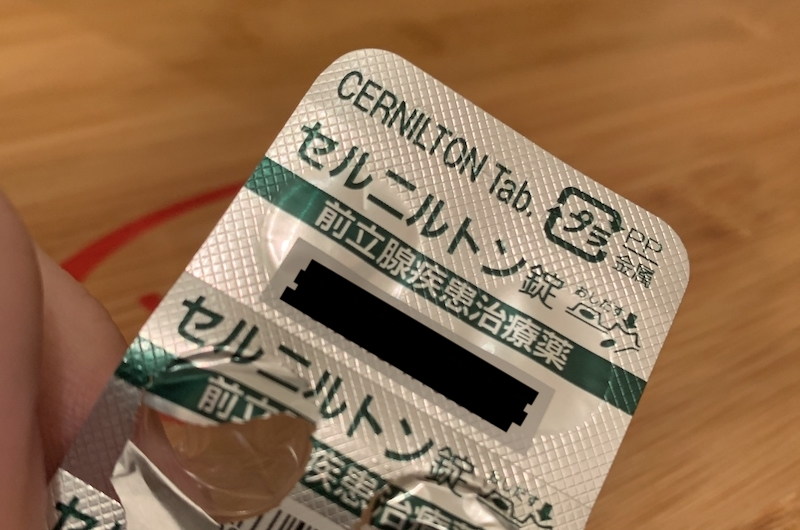

この記事は [sadnessOjisan Advent Calendar 2021](https://adventar.org/calendars/7015) 24 日目の記事です。

ㄘんㄘん の話が苦手な方はカムバック推奨

実は今年の 9 月くらいにㄘんㄘんの病院に行っていました。そのとき、こんなものを貰いました。

一体なにが起きたのか・・・

## 異変に気づいたのは引っ越しをした２週間後

今年の夏に家を引っ越しました。
家具は後で買い換えようと思って家具のほとんどを捨てて、座椅子とノートパソコンだけで仕事をしていました。
そんなある日、ㄘんㄘんの内側の裏側っぽいところがじんじんすることに気づきます。
とはいっても激痛があるわけでも排尿時になにかあるわけでもなく慢性的にじんじんしていただけで、特に激痛もなかったのでしばらく様子を見ようと思い 3 日くらい待ちました。
しかし痛みは治らず少しずつ痛くなってきたので病院に行きました。

## 検査をしてみる

尿検査をしました。
何も問題はなかったです。

問診されました。
「最近、遊びましたか？」と聞かれて、「遊ぶ」が多義すぎて答えに窮しました。どの意味だろうが遊んでいないので「いいえ」でした。
悲しい。

触診しました。
ぐりぐりされましたがそれに対する痛みはなく何も問題なかったです。
触診、扉一枚隔てた向こうに人がいる場所、明るくて解放的な場所でそんなことされるので変な気分になりました。よくない。

## 結論: わからん

病院の先生曰く、「分からん（原文ママ）」とのことでした。
ただ前立腺がむくんでいることが原因であろうとは言っており、それを抑える薬を貰いました。
こんな良い加減な結論でいいのかと思ったのですが、どうやら最近同じような症状の人が増えているらしく、その人たちに実績があり効果的な治療法ではあるとのことです。

同じような症状が増えているという点ですが、どうも在宅勤務が影響しているらしく、ずっと座った状態でいたり、座り方が悪いとこのような症状が出るとのことです。
自分は座椅子の上で不自然な姿勢の上で長時間仕事をしていたので思い当たることがあり、とても納得感を持ちました。
実際先程の薬を飲むと 3 日くらいで治りました。
ナイス ㄘんㄘん

## スタンディングデスクを買った

予防の一環としてスタンディングデスクを買いました。毎日気が向いた時に立っているのですが同じような症状が出ることはなくなって安心しています。実際すわっているとㄘんㄘんが圧迫された感じはあり、立つと解放される感じがあります。なのでやはりずっと座っているとㄘんㄘんが痛くなるのはあり得る話なんだと思いました。スタンディングデスクはいいぞ！
