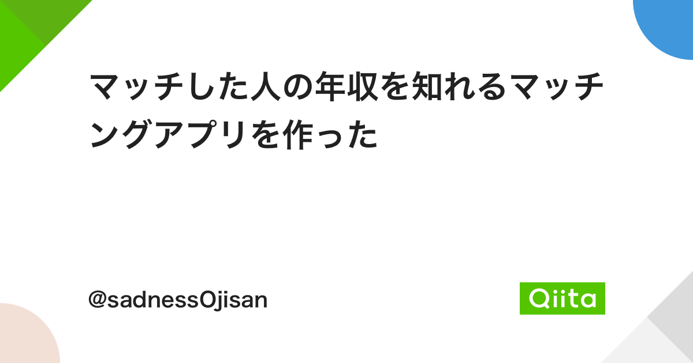
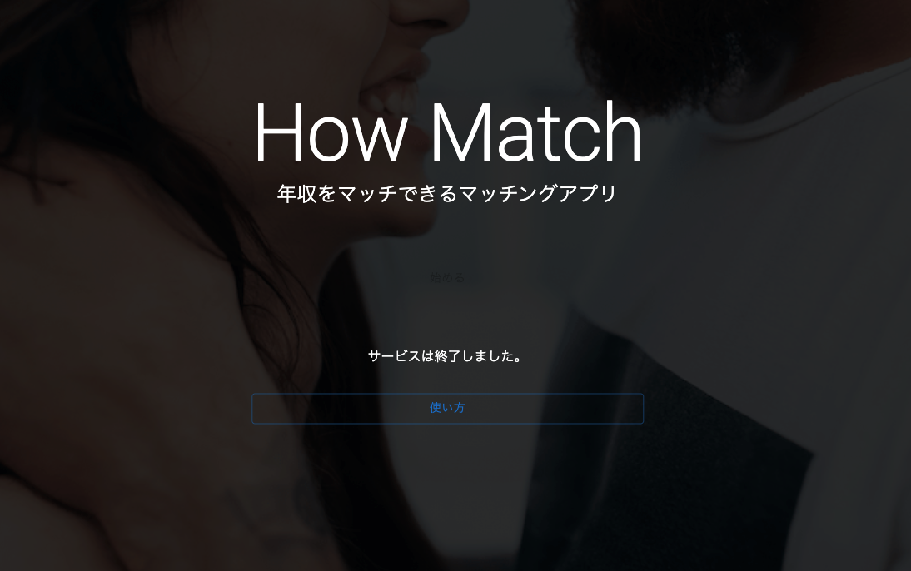
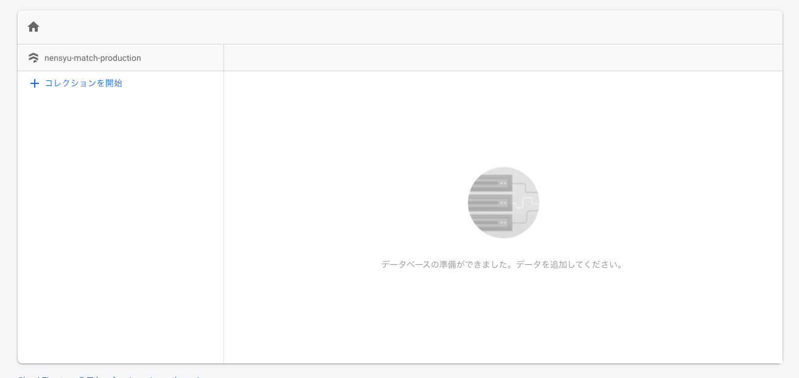
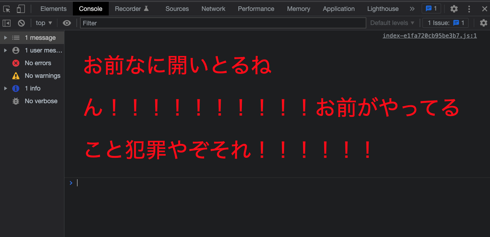
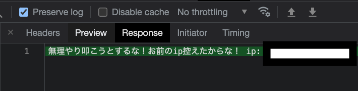

この記事は [sadnessOjisan Advent Calendar 2021](https://adventar.org/calendars/7015) 25 日目の記事です。
ついに最終日ですね！今日は 02/04 なのですが・・・

12/25 に Qiita のクソアプリカレンダーに [マッチした人の年収を知れるマッチングアプリを作った](https://qiita.com/sadnessOjisan/items/8399f41b475fe3f61618) と言うのを書いたのですが、あまりにも攻撃的なリクエストが飛んできたので閉じました。
で、閉じさせられることに腹が立ってきたので何か仕返しできないかなと思ってこの記事を書いています。



## 何を作っていたか

[年収マッチ](https://howmatch.ojisan.dev) と言う、マッチングアプリ です。



マッチング（出会い）した相手とマッチ（対戦）できるというコンセプトです。

「年収を教えてくれる人には自分の年収を教えてもいいよね〜」と個人的に思っていて、それをしやすくするサービスとして作りました。
最終的には 50 人くらいの人が登録してくれていたのですが、一方でリクエストを見ていると登録やマッチングをせずに人の年収情報だけを抜き出そうとしている人もいました。

### どういう攻撃が飛んできていたか

自分が攻撃者になるとしたらやりそうなことは一通りやられました。

#### XSS

お前の名前はタグなんか？

#### 会員専用ページに認証情報なしでアクセス

API のエンドポイントを直接叩いてきました。

#### ID / Token 偽装

これも直接エンドポイントを叩いてきたパターンです。

相手の年収を知れるロジックは

- 自分と相手がマッチングするとフラグが立つ
- 相手の ID をクエリとしてリクエスト
- 認証情報から得られる 自 ID に対して、そのフラグあると年収を返す

というものだったのですが、フラグがない状態で相手の ID をクエリにしてアクセスした痕跡がありました。

### どういう防衛をしていたか

これらは自分が攻撃するときにやるであろうことでもあったので、対策はしていました。

例えば、

- バリデーションの徹底
- 事前条件検証の徹底
- レスポンスの事後検証の徹底
- Firestore のルールで全リクエストを弾く（= admin からしかアクセスできないようにする）
- 認証には IDaaS

といったことをしていました。
一通り攻撃されて本当にさぼらなくて良かったと思いました。

レスポンスの事後検証の徹底 には zod の object.strict を採用し、ユーザー一覧情報を返す時に、うっかり API に年収情報を含めてしまうといった事故を防ぐのに便利でした。

### とはいえ消した

防護しているので大丈夫だと思ったのですが、自分が人の年収情報を預かっていて攻撃されているという状況があまりにも怖くなったので全データを消しました。
急にクローズすることは事前に規約に書いていたので、書いておいてよかったと思いました。



## 悔しい・・・

消してスッキリしたわけですが、攻撃されたから消したという事実に何か腹が立ってきました。
これだと今年のクソアプリカレンダーは未完成なんですよね。

というわけでクソアプリカレンダー 2021 2 として、攻撃者に一泡吹かせるアプリを作ります！

## 不正なリクエストに一泡吹かせるクソアプリ

ログイン機能とユーザー表示機能だけがある簡単なアプリを用意しました。

<https://getout.vercel.app/>

ログインとありますが、処理を簡略化しているので、同じ ID でしかログインできないようになっています。

ソースコードはこちらです。

<https://github.com/sadnessOjisan/getout>

### コンソールを開くのは犯罪

攻撃者はどういう API にどういうリクエストを飛ばしているのかを確認しています。
そのためコンソールを開いた瞬間に牽制しましょう。
オススメは警察が言いそうな文言です。



コンソールに出力する文字の大きさや色のスタイリングは、制御できます。

```js
const styles = `
  font-size: 40px;
  color: red;
  line-height: 2;
  padding: 10px;
`;

console.log(
  "%c" +
    "お前なに開いとるねん！！！！！！！！！！お前がやってること犯罪やぞそれ！！！！！！",
  styles
);
```

コンソールでは、まるで標準出力のように色を変えるための制御文字列が使える上、`%s${log}${css string}` という形式で好きにスタイリングもできます。

### お前の IP を抜いたからな

認証情報がないまま、認証情報が必要なページにアクセスしてきた人は悪意を持っていると言えると思うので、さらに牽制しましょう。



IP アドレスを取得するコードは適当にネットに落ちてたコードを使いました。
ブラウザによっては x-forwarded-for がつかないのでそのフォールバックが付いています。

```js
const getIP = function (req) {
  if (req.headers["x-forwarded-for"]) {
    return req.headers["x-forwarded-for"];
  }
  if (req.connection && req.connection.remoteAddress) {
    return req.connection.remoteAddress;
  }
  if (req.socket && req.socket.remoteAddress) {
    return req.socket.remoteAddress;
  }
  return "0.0.0.0";
};
```

ここではしていませんが、`x-forwarded-for` は CDN などの Middlebox を介するとお尻に足されていくので、環境によっては適宜パースしてください。

これで「「IP アドレス控えたからな」をいえます。
とはいえ攻撃者にとっては 「IP アドレスを控えられたからなんやねん、そもそもログに全部でとるやろ」と思われているかもしれません。
それでも昔は「IP アドレス控えたからな」と言われてビビった記憶があるので人によっては牽制になるでしょう。

### ククク......ﾀﾋねﾀﾋねﾀﾋね

NodeJS の実装ではステータスコードは 100 - 999 までの数字を返せます。
それ以外の数字や文字は返す時にエラーとなります。
そこでこれらの数字で悪意あるリクエストに専用の数字を返しましょう。

ここでは 「ククク...」の 999 と 「ﾀﾋねﾀﾋねﾀﾋね」の 444 を返します。

```ts
res.status(999).send({
  message: "ざんねーーーん！ちゃんとチェックしていまーーーーすw",
});

res.status(444).send({
  message:
    "えーーー！ログインしないと叩けないはずのAPIだよ！どうやって叩いの！？すごいすごーーーーーーい",
});
```

あースッキリした

## おわりに

こんなことしたら逆に恨み買って (D)Dos とかされそうなんだけどええんか？
