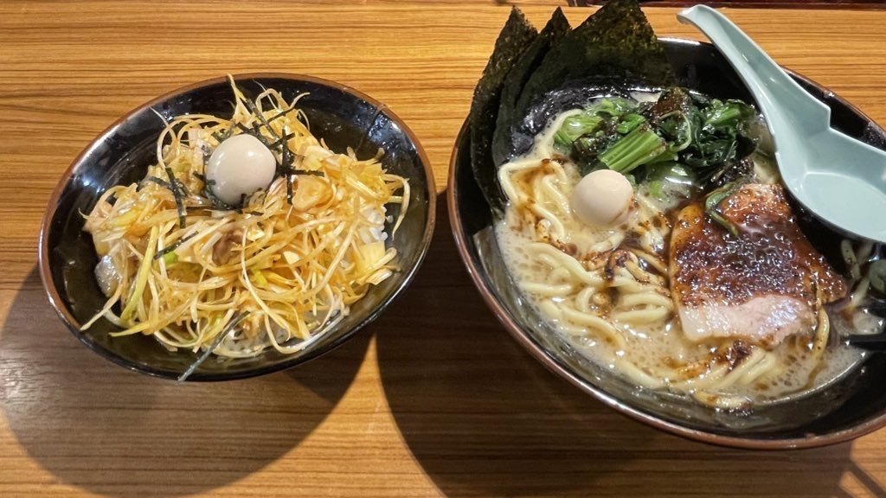
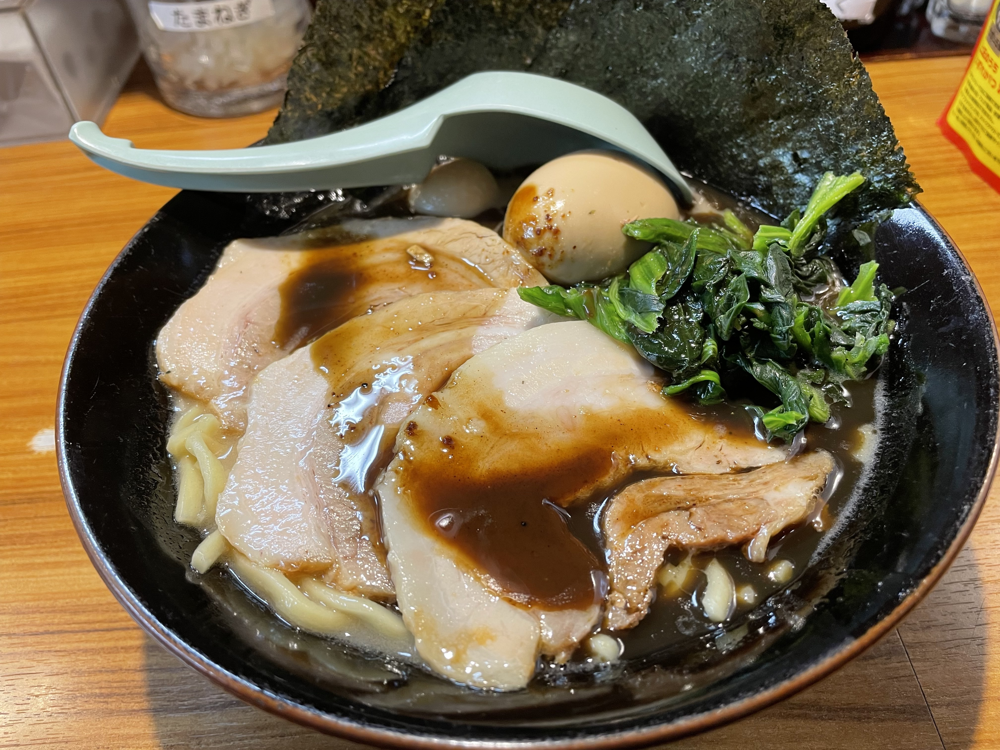
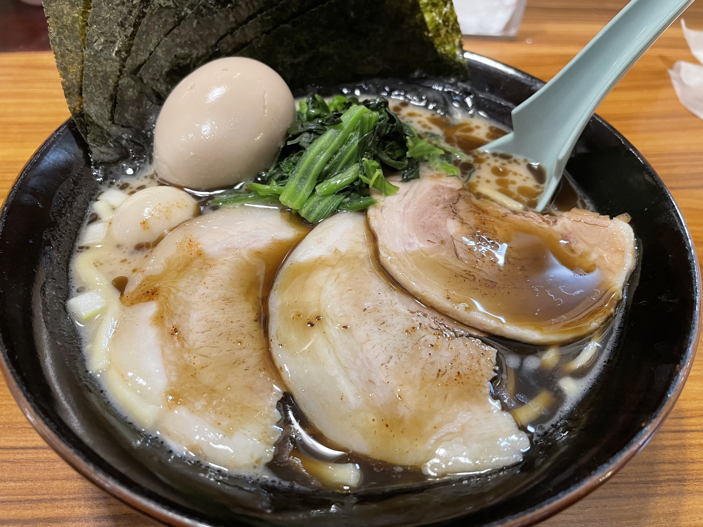

あけましておめでとうございます！
昨日ようやく[sadnessOjisan Advent Calendar 2021](https://adventar.org/calendars/7015)を終えれたので新年を迎えることができました。
なので、2021 年を軽く振り返ろうと思います。

## キャリア面

### フルタイムフリーランスをした

一昨年に前職をやめたあと、最初の１年は勉強期間に当てて、昨年はフルタイムフリーランスとして働いていました。会社をやめて勉強していた時の話はこちらにあります。

<https://blog.ojisan.io/not-working-why/>

ずっと働かないままでもいいかなと思っていたのですが、流石に怖くなってきて就職を考えるようになり、未来に訪れるであろう就職活動のための空白期間を塗りつぶしたくてフリーランスになりました。

フリーランスとしては 3-4 社と契約していて、ほぼ週 7 で稼働していました。
そのうちの 1 社はほぼ受託のような形で、趣味も兼ねていたのでずっと働いているという感覚はなくご機嫌に過ごせていました。

### 就職した

同業のフリーランスの方々と比べると私の単価は一回り小さいのですが、それでもラーメンやカレーのトッピングだったり、サラダの注文が気にならないほどの収入がありました。

一方でフリーランスとしての生き方が自分の技術を切り売りしているだけで、壁を打ち破るような成長機会を掴めないことにモヤモヤしていました。

雇用主にはかなり自由に働かせてもらったこともあり自分の成長を自分でコントロールできる立場にはありましたが、自分で作れる成長機会は自分のポテンシャルまでの範囲でしかなくその壁を乗り越えられなくて困っていました。
自分のポテンシャルを超えた成長は自分一人でできないと思っており、さらに自分は導いてくれるような何かがないと成し遂げられない人間だと自覚しています。
そこで期待さえあれば成長の手助けが得られると信じて就職することにしました。

というわけで転職活動（就職活動）を始めたのですが、実は転職活動は初めてなので勝手が良くわからず何も考えずに愚かにもいきなり第一志望だけを受けに行きました。
面接官などに「第一志望？」って聞かれるたびに「御社が第一志望です」と答えるわけですが、その度に「ほんまかよ」みたいな顔をされるのが楽しかったです。
御社しか受けていないので第一志望でしかないんですよね。

ただ今思えばいろんなところに話を聞きに行ったり、記念受験しておけばよかったという後悔はあります。
それこそ最近 Meety を見てると面白そうな会社がたくさんあるので、もしあのサービスがもっと早くにあれば違う結末になっていたかもしれません。
仮に第一志望が変わらなかったとしても、面接のやり方を学べるのであの手のサービスを使っておけば良かったと思っています。

## 開発面

### フロントエンドのキャッチアップ

去年はスキルを切り売りしていただけなので、何か新しく身に付けた能力はない気がします。
年末に焦燥感に駆られて React18 のキャッチアップはしましたが、素振りすらしていない状況なので何も身には付いてないです。

### JSConf に出た

JSConf JP の CFP が通ったので JSConf JP に登壇しました。

<iframe src="https://speakerdeck.com/player/a098fcd04ea94eaca743cd1779b60087" style="top: 0; left: 0; width: 100%; height: 100%; position: absolute; border: 0;" allowfullscreen scrolling="no" allow="encrypted-media;"></iframe>

個人的には大変名誉のあることだと思っているのですが、一方で今年はコロナ禍でオンラインということもあり、倍率は低かっただろうなとは思っています。
正直なところ他の登壇者のレベルには届いていないと思いましたし、一昨年のオフサイト JSConf JP に採択されるようなクオリティではなかったとは思っているので、次はそのクオリティのアウトプットを出せるよう精進します。

### フロントエンド以外の勉強を始めた

最近フロントエンド開発に飽きています。
今はあまり React を書きたいという気持ちはなくなっていて、関心は CDN, Web の仕組みそのもの, サーバーそのもの, Rust です。
CDN と Web に関しては職場で学べるので、そこで学んでいます。

サーバーそのものや Rust に関しては [僕がお金を払ってでも教わりたいこと 2021](https://blog.ojisan.io/teach-me-202110/) にあるような家庭教師スタイルで勉強していました。自分の限界以上のスキルを持っている人から直接教わるのは、自分の限界値そのものが引き上がるし、好奇心も満たせるのでとても良かったです。

サーバーを理解したいというのは [2015 年 Web サーバアーキテクチャ序論](https://blog.yuuk.io/entry/2015-webserver-architecture) に書かれていることを理解したいというのが発端なのですが、最近ようやくマルチスレッド環境での非同期ランタイムの作り方が分かって、その記事にあるハイブリットモデルをどう実装できるかが想像付くようになりました。あとは自走するだけという段階に来たので、今は Rust の習得を一番の課題に設定しています。

Rust に関しては、自分がフロントエンドを頑張る方向性のキャリア戦略をとるとしても、昨今の Tooling や Wasm、 C@E のトピックを眺める限り投資しておいた方が良いと感じており、いま一番頑張りたいことです。

他にも クラウドアーキテクトと認証認可の勉強もしっかりしたいのですが、流石に自分のキャパシティー的に手が回らないのでこれらは 2023 年以降に勉強しようと思っています。

## 生活面

### 住居

引越しをしました。25 平米を脱出しました。
転職に合わせて会社の近くに引っ越しました。
都心に引っ越すか郊外に引っ越すかで悩んだのですが、エンデミック時に良い物件がなくなるだろうと思って都心に近づきました。
ただ実態ではさらに感染状況がひどくなってリモートを推奨されている状況なので郊外に引っ越せば良かったと後悔しています。

### 食事

上半期は自炊に挑戦していたのですがやめました。
引越しのタイミングで全ての食器や調理器具を捨てました。
ただ引越しをしてキッチンが広くなったことで、また挑戦してもいいかなと最近は思っています。

### 趣味

ゲーム以外の趣味を見つけるっていうのを 2021 年の目標にしていましたが見つかりませんでした。
コード書いてるかゲームしてるかの年でした。
2022 年こそは何か趣味を見つけたいです。

## 婚活面

コロナが悪い
