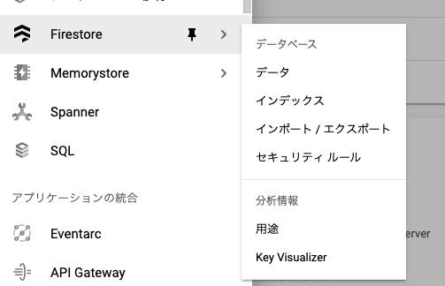
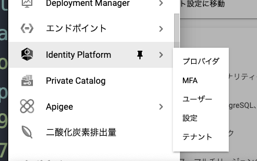
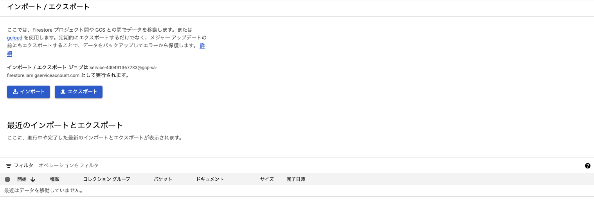

Firestore や Firebase Auth は GCP から利用できることをご存知でしょうか？





実は Firestore はそのまま使えますし、Auth も Identity Platform がそれとして使えます。

そこで思うわけです、Firebase をコンソールに入ることなく IaC できるのではないかと。

この記事では Firebase を GCP を IaC することでコンソールに入ることなく構築する方法とそれが幻想であることについて書きます。

## そもそも GCP に寄せると何が嬉しいのか

一番のメリットは IaC が可能になることです。
インフラ構築における手作業が減らせることはそれだけでもメリットです。

また GCP にある Firebase の機能は、Firebase にあるものよりも機能が強力です。
例えば Firestore であると GCS からの import/ export などがあったりもします。



## Firebase を Terraform から建てる

ここでは terraform コードを吐くツールとして、[cdktf](https://github.com/hashicorp/terraform-cdk) を使います。
cdktf で GCP 環境を作るところは以下の記事を参照してください。

<https://blog.ojisan.io/terraform-cdk-gcp/>

### Firestore

Firestore のリソースを作ります。

`./.gen/providers/google` や `@cdktf/provider-google` にそのためのクラスがあるはずなので、予測変換なりで出そうとしてみましょう。

...

はい、実は出てきません。

その理由を調べてみると、どうやら terraform では、GAE のリソースに含まれているようです。

Firebase のドキュメントに [Automate database creation](https://firebase.google.cn/docs/firestore/solutions/automate-database-create) というのがあるのですが、それによると

> You can automate Cloud Firestore database creation with the following process:

> Create a new Google Cloud project. Each project is limited to one Cloud Firestore database.

> Create an App Engine application. Cloud Firestore depends on App Engine. You must activate App Engine to use Cloud Firestore.

> Create a Cloud Firestore database.

> This page describes how to complete this process using REST APIs, the gcloud command-line tool, and Terraform.

とのことです。"Cloud Firestore depends on App Engine" と明記されている上、さらには Create a database with Terraform というセクションがあり

```
provider "google" {
  credentials = file("credentials-file")
}

resource "google_project" "my_project" {
  name = "My Project"
  project_id = "project-id"
}

resource "google_app_engine_application" "app" {
  project     = google_project.my_project.project_id
  location_id = "location"
  database_type = "CLOUD_FIRESTORE"
}
```

という HCL で建てれるようです。

ではこれと同じことを cdktf でもやってみましょう。

```ts
new AppEngineApplication(this, "gae", {
  project: projectId,
  locationId: "asia-northeast1",
  databaseType: "CLOUD_FIRESTORE",
});
```

これで Firestore が建ちます。

### Auth

次に Auth を作ります。IdentityPlatformXXX 系に必要なリソースが入っています。

```ts
class MyStack extends TerraformStack {
  constructor(scope: Construct, name: string) {
    super(scope, name);

    new IdentityPlatformTenant(this, "auth", {
      displayName: "auth",
      allowPasswordSignup: true,
    });

    new IdentityPlatformDefaultSupportedIdpConfig(this, "github", {
      clientId: "xxx",
      clientSecret: "xxx",
      idpId: "github.com",
    });
  }
}
```

このようにして認証のためのリソースを作れます。

## 現実は甘くない

これをすることで GCP プロジェクトに Firestore や Auth が作られ、さらには GCP プロジェクトに紐づいている Firebase プロジェクトにも反映されます。
これで GCP 環境だけで Firebase を使うことができそうに見えますが現実には Firebase へのログインを強いられます。

### Firestore rules / index の更新

Firestore には rule や index を作れますが、その更新は CLI ベースだと firebase のコマンドからしか行えません。
GUI でよければ GCP のコンソールから直接書き込めますが、GitHub のワークフローと同期させることを考えるとそれは現実的ではありません。
そのため結局は Firebase を使う羽目になります。

### クライアントサイドからのデータアクセス

GCP の管理画面にクライアントから使うためのサンプルコードがありますが、それはしれっと Firebase を入れさせられます。

```html
<script src="https://www.gstatic.com/firebasejs/8.0/firebase.js"></script>
<script>
  var config = {
    apiKey: "xxx",
    authDomain: "yyy",
  };
  firebase.initializeApp(config);
</script>
```

見たら分かる通り v8 系な上、module として入れないので古いコードです。
そのため新しいサンプルコードを得るためには Firebase のコンソールに入る必要があります。
（やり方を覚えていれば不要ですが。）

### クライアントサイドでの認証

これも先と同じ理由です。
クライアントでの認証をするライブラリは Firebase を使う必要があります。

## まとめ

GCP + Terraform で Firebase のコンソールに入ることなくコードから Firebase リソースを生成できるが、便利な機能を使おうとすると結局はコンソールに入る必要がある。

一方でクライアント系の機能を使わずサーバーからしか Firebase を使わない場合であれば Firebase のコンソールに入らずにやり遂げることも可能です。
