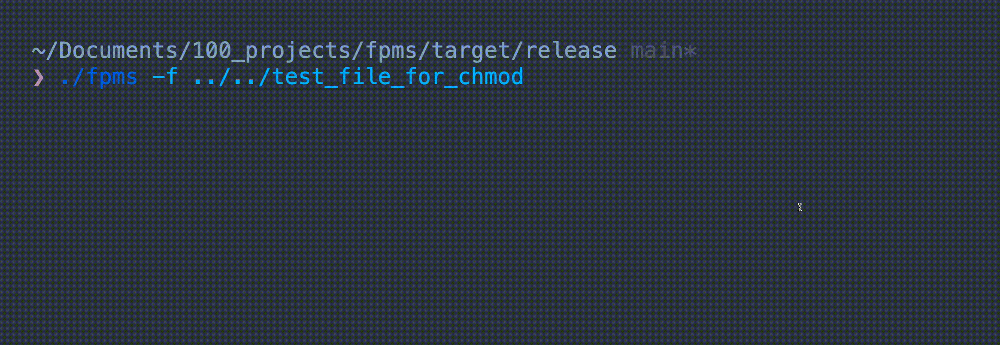

2021 年で一番良かったアドベントカレンダーとはなんでしょうか。
私が選ぶのは、[ファイルパーミッションでスロットがしたい](https://qiita.com/jiro4989/items/2530c4f789916521a47a) です。


これは 2021 年 Go アドベントカレンダー 1 日目の記事で、CLI でスロットマシーンを実装し、その数値でファイルパーミッションを設定します。
自分はジョークアプリを日頃から考えたりしているのですが、このアイデアは全く思いついておらず見た瞬間に「やられた！」と思いました。
あまりにも悔しかったので Go 言語を書いたことがないにも関わらず [コード](https://github.com/jiro4989/slotchmod) を読んでいました。
読んでみると、スロットの描画と停止は goroutine を使えばできるとのことだったので、Rust でも thread と mpsc を使えばできそうだなと思って挑戦してみました。

## 成果物

Mac と Linux 用のバイナリとソースコードを用意しました。

<https://github.com/sadnessOjisan/fpms/releases/tag/v0.0.1>

```
fpms -f hoge
```



7 以上の数字が出ているから失敗していますね。

## 実装

```rust
pub fn do_slot(file: &str) {
    let mut slot = Slot::new();
    let (tx, rx) = channel(); // 入力されたことを通知するチャネル
    let (ftx, frx) = channel(); // スロットの結果を呼び出し元に戻すためのチャネル
    spawn(move || loop {
        let received = rx.try_recv();
        slot.spin();
        let value = format!(
            "{}{}{}",
            slot.output.0.num, slot.output.1.num, slot.output.2.num
        );
        print!("\r\x1b[?25lchmod {}", value);
        match received {
            Ok(should_stop) => {
                if should_stop {
                    slot.stop();
                }
                if slot.is_finish() {
                    println!(""); // HACK: これがないと何か出力が壊れる
                    ftx.send(value);
                    break;
                }
            }
            Err(_) => {}
        }
    });

    loop {
        let mut guess = String::new();
        stdin().read_line(&mut guess).expect("Failed to read line.");
        let _ = tx.send(true);
        let rv = frx.try_recv();
        match rv {
            Ok(v) => {
                let output =Command::new("chmod").arg(v).arg(file).output();
                println!("{:?}",output);
                break;
            }
            _ => {}
        }
    }
}
```

コードの全体は [fpms](https://github.com/sadnessOjisan/fpms) です。

## 解説

### ループを止めない

スロットを描画するために無限ループを使っています。
しかしそうすると標準入力が使えなくなります。
そこで描画だけを行うスレッドを作り、メインスレッド（呼び出し元）で標準入力を受け取るようにします。
受け取った値は適宜もう一つのスレッドに送ります。
そのために使うものがチャネルで、Rust では mpsc が使えます。
(mpsc 以外にもチャネルはあり、今回は producer が multi にならないので mpsc である必要はないのだが、一番ポピュラーだと思うので mpsc を使う。)
mpsc の receiver 側で値を受け取るときは recv ではなく try_recv を使います。
そうすることでループを止めることなく値を受け取れます。
recv だと sender から値を受け取るまで処理が止まってしまいます。

### TUI の作成

本家は termbox を使っていたので、その Rust バインドを使おうとしましたが、メンテが 2 年前で動きませんでした。
[Rust のターミナル操作 crate いろいろ](https://meganehouser.github.io/2019-12-11_rust-terminal-crates.html#ncurses-rs) で他にも探して見えて、[ncurses-rs](https://github.com/jeaye/ncurses-rs) の採用も考えました。ncurses 自体は歴史がかなり長いので信用できるはずです。

ただ実際に使ってみると、スロットの停止命令を送った後にスロットが停止してくれなく使えなかったです。
真偽は不明ですがスレッドセーフでないといった投稿を見かけたりして大変そうだったので採用は見送りました。
代わりに標準出力でスロットを実現しています。
標準出力では先頭に `\r` をつけることで先に出力した文字を上書けます。
その結果、スロットの数値の変化を表現することができます。
さらに `\x1b[?25l` を付けるとカーソルも消すことができます。
これにより数値しか見せないといったことができます。
これらは TUI ツールを使えば簡単に設定で使えるようになるものですが、同じことは標準出力でもできます。

ただ TUI を使っていないので複数行数の管理が難しく、本家のようなアスキーアートは諦めています。

## おわりに

TUI で完全なスロットを作りて〜〜〜
