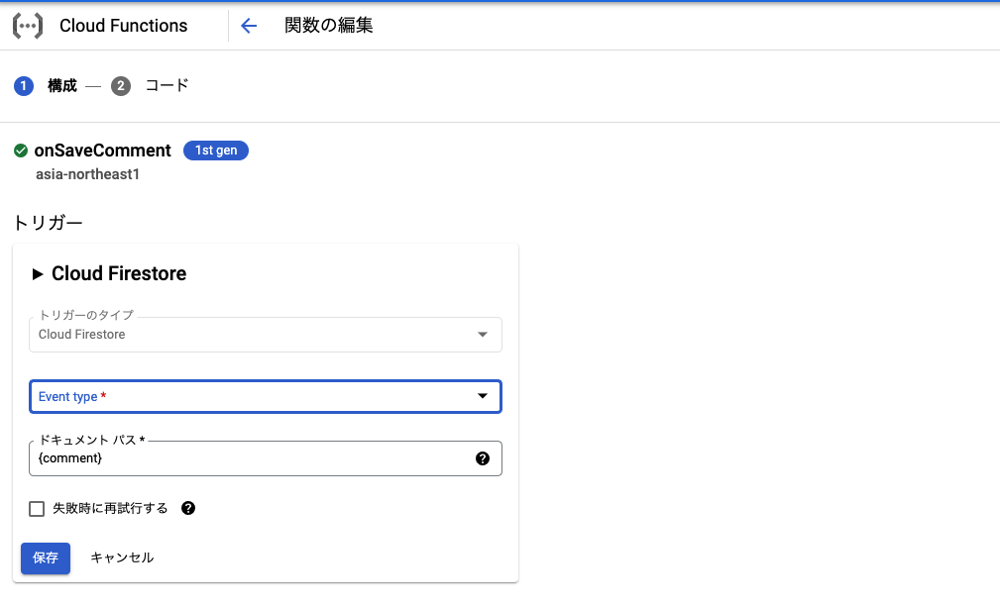

## トリガーとは

ご存知の通り、Firebase の Cloud Functions は Firestore の [トリガー](https://firebase.google.com/docs/functions/firestore-events?hl=ja) が使えます。

これはドキュメントの追加、削除を検知して任意の処理を実行させることができます。

```ts
const functions = require("firebase-functions");

exports.myFunction = functions.firestore
  .document("my-collection/{docId}")
  .onWrite((change, context) => {
    /* ... */
  });
```

よくある処理はあるドキュメントが書き込まれたとき、同じ内容を別 collection に書き込むなどです。

とても便利な機能ですが `functions.firestore` とある通り、Firebase 限定の機能に見え(functions は firebase-functions モジュールなので)、事実 GCP 版 Cloud Functions ではこのモジュールを使わずに Function を定義するので使えません。

## trigger を登録する

トリガーそのものについてのドキュメントはこちらにあります。

FYI: <https://cloud.google.com/functions/docs/calling/cloud-firestore>

### GUI からの登録

GCP 版では Functions の設定は GUI で行えます。
トリガーを登録できるセクションがあるのでここで登録できます。



### CD 時に登録

Firebase のときは GUI でいちいち設定しなくて良かったので、同じことを GCP でもやりたいです。
GCP 版では CI/CD のタイミングで API 経由でその設定を行い、GUI 設定をしなくていいようにしましょう。

結論を先に書くと、GitHub Actions であればこのような yaml を用意します。

```yaml
- id: "deploy"
  uses: "google-github-actions/deploy-cloud-functions@v0"
  with:
    name: "onSaveComment"
    runtime: "nodejs14"
    region: asia-northeast1
    description: firestore trigger
    entry_point: onSaveComment
    event_trigger_type: providers/cloud.firestore/eventTypes/document.write
    event_trigger_resource: "projects/xxxxxx/databases/(default)/documents/users/{user}/comments/{comment}"
```

GitHub Actions で CloudFunctions を使う方法についてはこちらをご覧ください。

FYI: <https://blog.ojisan.io/gha-functions/>

注目すべきは event_trigger_type と event_trigger_resource です。
event_trigger_type は紐づけるイベントを指定します。
ここではドキュメントの書き込み・編集をトリガーしています。

event_trigger_resource では監視対象を設定します。
注意すべきは `(default)` です。
これはこういうものです。
firestore rules でも同じような文言がでてきたはずです。

これらに何を書いたらいいかは [Google Cloud Firestore トリガー](https://cloud.google.com/functions/docs/calling/cloud-firestore) に書かれているのでこちらを参照してください。
