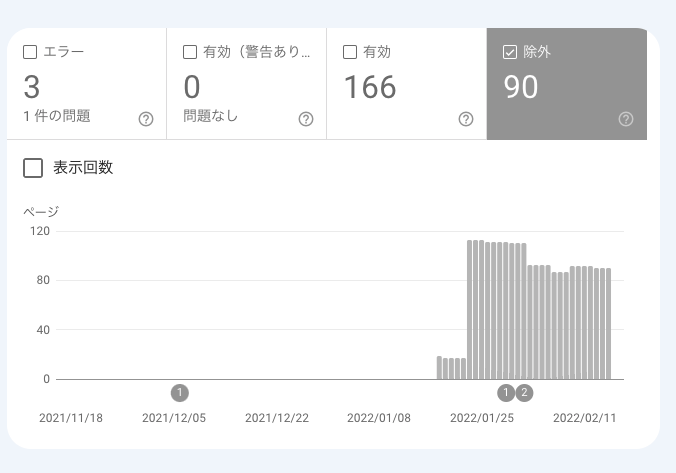
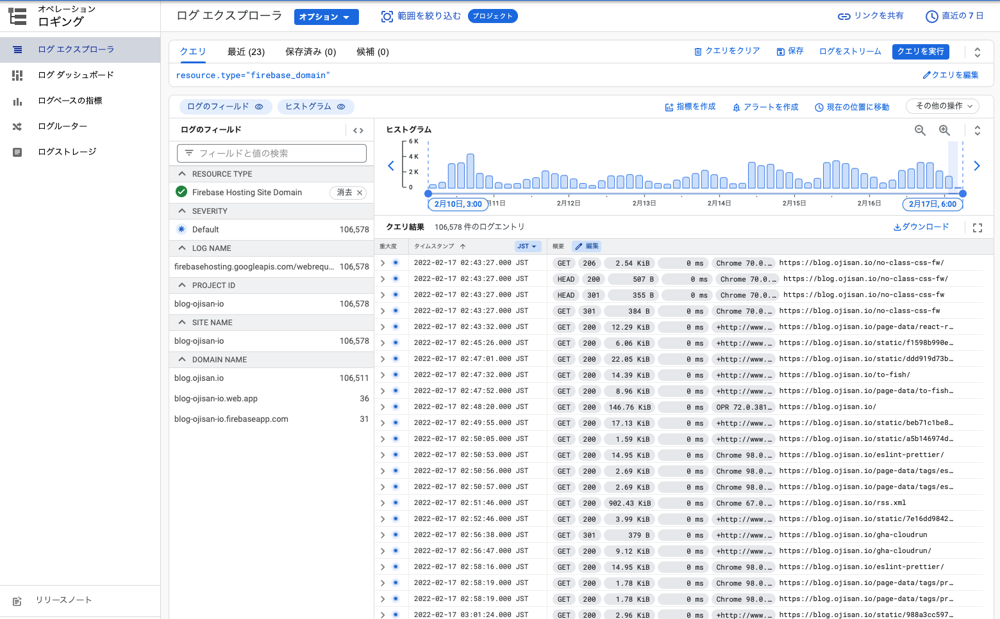

なぜか急にブログのインデックス状況が悪化しました。
書いたものが一切インデックスされない状況になっています。
新しく書いた記事は全て 「検出 – インデックス未登録」として登録されています。
これはクローラーは来たけどインデックスされなかったという状態です。

影の組織的なものが暗躍しているのでしょうか。

とはいっても最近ブログをいじっていまして、もしかしたらそれが原因かもと思い、調査ログとして一旦現状について書いておきます。
まあ書いてもインデックスされないので読まれないんですけどねハハハ

## どのようなエラーが出ているか

新しく追加したページに関して、 「検出 – インデックス未登録」という判定がされています。
これは公式の見解によると

> 検出 - インデックス未登録: ページは Google により検出されましたが、まだクロールされていません。これは通常、Google が URL をクロールしようとしたものの、サイトへの過負荷が予想されたため、クロールの再スケジュールが必要となった場合です。そのため、レポート上で最終クロール日が空欄になっています。

FYI: <https://support.google.com/webmasters/answer/7440203?hl=ja#discovered__unclear_status>

とのことです。

このエラーが出ていることにはいくつかの不審な点があります。

### 不審な点

#### 新しく追加したページにのみ起きる事象

既存のページに関しては正常にインデックスされています。12 月の途中当たりに追加したものからインデックスされないようになっています。

#### サイトへの過負荷はかかっていない

後述しますがクローラに対するログをみたところ正常に 200 レスポンスを返せていました。

#### 手動で送るとインデックスされる

[NextUI と react-hook-form を組み合わせる](https://blog.ojisan.io/nextui-react-hook-form/) は手動で送信しました。無事にインデックスされました。

#### 外部リンクがあるとインデックスされる

[サーバー入門、非同期処理入門、epoll 入門](https://blog.ojisan.io/how-to-epoll/) はインデックスされました。
クロール結果を見るとはてブからの外部リンクを検出していたようなので外部リンクがあるとインデックスされるようです。

ただし、[不正なリクエストに一泡吹かせたい](https://blog.ojisan.io/kuso-request-revenge/) のようにはてブでホットエントリーに乗るようなものでも、[はてぶブロッカー](https://blog.ojisan.io/hatebu-helmet/)を有効にしているとインデックスされないようです。

#### インデックスされたものと同時期に書いたブログがインデックスされていない

インデックスされたものと同時期に書いたブログがインデックスされていないません。
つまりインデックスされたのは上記の理由と考えられます。

インデックスされなかったのは具体的にはこれらです。

- [GCP 版 Cloud Functions からも Firestore をトリガーしたい](https://blog.ojisan.io/cloud-functions-firestore-trigger/)
- [GitHub Actions から CloudRun にデプロイする](https://blog.ojisan.io/gha-cloudrun/)
- [GitHub Actions から Cloud Functions にデプロイする](https://blog.ojisan.io/gha-functions/)
- [Rust でもファイルパーミッションでスロットがしたい](https://blog.ojisan.io/file-permission-slot-with-rust/)
- [いま GitHub Actions から GCP を使うなら](https://blog.ojisan.io/gha-gcloud/)
- [Firebase を Firebase コンソールにログインせずに terraform から使う回（存在しない回）](https://blog.ojisan.io/fire-fire/)
- [2021 年の振り返り](https://blog.ojisan.io/hurikaeri-2021/)
- [CDK for Terraform で GCP スタックを作る](https://blog.ojisan.io/terraform-cdk-gcp/)

せっかく書いたのに、、、

低品質コンテンツとみなされていたのなら悲しい。（メモみたいなものだしその可能性はありそう）

## 最近加えた変更

特定の期間から Index されていないので、その辺りでした修正が大きな理由かもしれません。
どれが原因かはわからないのですが、このようなことをしました。

- Gatsby3 -> 4 にした
  - page-data.json をクロールした軌跡があり、もしかしたら Gatsby 起因かもしれない
- 個別タグページを作った
  - 価値の低いページを量産したことになるので原因かもしれない
- Vercel から Firebase Hosting に移した
  - "これは通常、Google が URL をクロールしようとしたものの、サイトへの過負荷が予想されたため、クロールの再スケジュールが必要となった場合です。" という文言を信じるのであればインフラが変わったことが原因かもしれない。とはいえ同じ Google の Firebase を使っているわけでそんなことはありえないはず・・・
- URL を trailing slash にした
  - 全ての URL が変わったのでもしかするとこれは非常に怪しい

## どのような対策を行ったか

これを受けていろいろなことを試してみました。

### 先行事例の調査

- [記事が突然 Google 検索に表示されなくなる](https://www.ultra-noob.com/blog/2021/34/)
- [Google 検索に乗らない対策まとめ](https://www.ultra-noob.com/blog/2021/40/)

という Gatsby で同様の事例を踏んだ人がいたことがわかったのでこれらの記事を読んでいました。

巷で言われていることではあるが、重複コンテンツはペナルティになるようで、記事 URL の規則を統一することが対策の一つであることがわかりました。

### canonical URL を設定

Firebase Hosting はインデックスファイルに対してはデフォルトで / を付けてリダイレクトも自動で行うので / ありなしでコンテンツの差異がでることはなく先の対応は不要なのですが、 URL の正規化を確実に行うために canonical URL を設定しました。

FYI: <https://developer.mozilla.org/ja/docs/Web/HTML/Link_types>

### Cloud logging を有効化

せっかく Firebase に載せているので GCP と連携し、GCP 側で全アクセスのログをみれるようにしました。
主にクローラー bot に対してきちんとリクエストを返せているかを見るためです。

予想としては

> 検出 - インデックス未登録: ページは Google により検出されましたが、まだクロールされていません。これは通常、Google が URL をクロールしようとしたものの、サイトへの過負荷が予想されたため、クロールの再スケジュールが必要となった場合です。そのため、レポート上で最終クロール日が空欄になっています。

と言われるということはクローラのリクエストが相当悪い結果になっているはずです。

が、結果は 200 レスポンスでスピードも問題ありませんでした。全然負荷かかってないじゃん。

### サイトマップの送信

サイトマップがあれば変わるかもと思って送ってみました。

上のグラフが跳ね上がっている箇所はそれを送ったタイミングです。
除外が跳ね上がったということはゴミを送りつけただけということでした。
悲しい。

### 構造化マークアップを利用

json+ld を使ってリッチリザルト表示されるようにしました。
メタ的な情報を増やすと SEO 的にもよくなるかなと思ってのことです。
効果がなかったです。
悲しい。

### preview 環境にクローラーが来ないようにした

robots.txt で prd 以外は全部 disallow しました。
効果はなさそうです。

## これからする対策

まだやろうとしていることはあります。

### Vercel に戻す

Firebase Hosting の設定が起因している可能性はありそう。
Vercel 時代は問題がなかったので。

### trailing slash を止める

Vercel 時代は trailing slash がなかったのでもしかしたらこれが原因かもしれない

### Index API を使う

API 経由でクローラを呼べるということを最近知ったので試してみたい。
とはいえ元々これがなくてもできていたので、これは最終手段

FYI: <https://developers.google.com/search/apis/indexing-api/v3/quickstart>

## おわりに

一番の謎は 12 月以前の記事は何も影響がないことです。
クローラーは定期的にきているにも拘らずです。
もしかしたら一度インデックスされたらされないようなチェックで弾かれているのだろうと予想はできますがそれが何かは分かりません。

考えたくはないけど、インデックスされない理由が「低品質コンテンツだから」だったらめちゃくちゃ面白いな。
