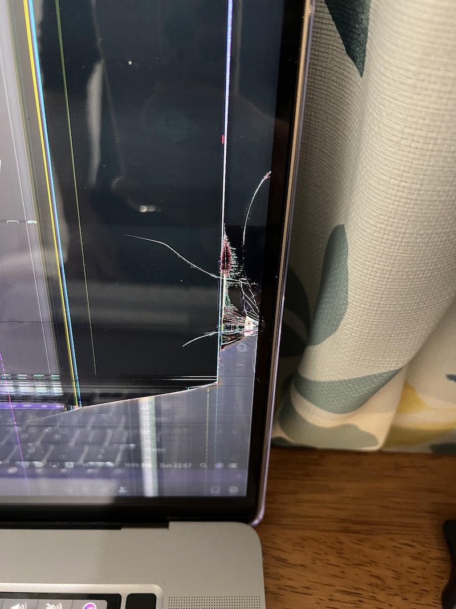

スタンディングデスクを買ったという嬉しそうなツイートが流れてきたので、昇降デスクでパソコンを割った話を書きます。

## tl;dr

- パソコンを開いた
- 机を上昇させた
- 突起にパソコンを挟んでしまった

## 敗因

窓際に机を置いてカーテンで窓を隠していたので、突起があることに気づいていませんでした。
昇降中にその突起に巻き込んで PC を破ってしまいました。

また僕が使っている机のモデルにはフェールセーフ機能が付いており、圧力がかかると自動的に下がるようになっているのですが、それが起動しても PC を割る方が早かったです。
Mac は上からの圧力に弱いようです。

アップルケアに入っていたので近いうちに出そうと思います。
それにしてもなんで壁と窓に突起があるんだろうか。
嬉しくない。

