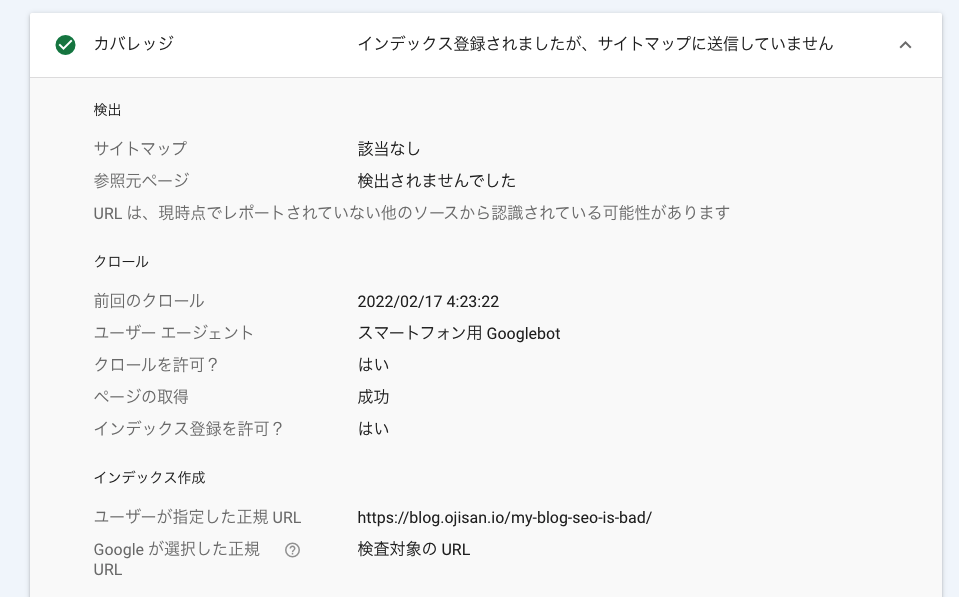

## ごめん、嘘

先日、[ブログの SEO が壊滅し始めていることに気づいた](https://blog.ojisan.io/my-blog-seo-is-bad/) では、ブログが Google にインデックスされなくなっていることを取り上げました。

しかしなんとそのブログ記事自体がインデックスされました。

そこでどうしてインデックスされたのか、なにをするとインデックスされるのかを原因を切り分けながら考えてみます。

## インデックスされた状況

今一度、サーチコンソールの結果を見てみます。

このうち大事なことは次の 2 つです。

- クロール日時
  - 深夜にクロールされており、この時間は記事を書き終わってデプロイしたタイミングです。
- サイトマップ
  - 送信したサイトマップがまだ処理されていないので、サイトマップ経由で登録されていません。

ここで次のような仮説が立ちます。

## 仮説

### サイトマップを経由しなければインデックスされる

こちらからサイトマップを送りそこにクローラーが来た場合に、「検出 – インデックス未登録」となる。つまり自然にクローラーがきた場合に限り、インデックスされるという説です。

### 実は SEO 対策はうまくいっていた

[ブログの SEO が壊滅し始めていることに気づいた](https://blog.ojisan.io/my-blog-seo-is-bad/) では、インデックスされなくなったのを直そうとしていろいろ手を打つも改善しなかったという内容ですが、実は対策後に新規投稿された物に関しては有効だったという説です。

## 仮説の検証を進める

これらの仮説を検証するためには再度インデックスされる記事を書くことだと思っているので、しばらくスピードを上げて色々なものを投稿してみようと思います。また何かアップデートがあれば報告します。
