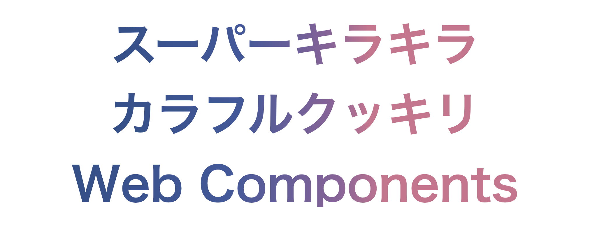

## 何を作ったか

5 ヶ月くらい前に [SupercolorpixelisticXDRidocious](https://github.com/sadnessOjisan/SupercolorpixelisticXDRidocious) というライブラリを作りました。

これは Apple が iPhone13 を発売したときのデモページに書かれていた文字列が、半ば meme 化したのですが、そのときの文字を再現したものです。



日本語訳は "スーパーキラキラカラフルクッキリディスプレイ" と表記され、これもまたインターネット上で話題になりました。

今回はその文字列のようなデザインを再現できる Web Components を作ったのでそのお話です。

## 使い方

npm に custom element を配置しており、それを jsdelivr で配布しています。
そのため script タグでその custom element を読み込めば使えます。

```html
<body>
  <supercolorpixelistic-xdridocious
    text="kira kira word"
  ></supercolorpixelistic-xdridocious>
  <script src="https://cdn.jsdelivr.net/npm/supercolorpixelisticxdridocious"></script>
</body>
```

または npm 経由で supercolorpixelisticxdridocious の実体を手元に持ってきても良いです。
そのようにすれば、`<supercolorpixelistic-xdridocious />` 以外のタグ名が使えます。

```js
import { Supercolorpixelisticxdridocious } from "supercolorpixelisticxdridocious";

customElements.define("valid-name", Supercolorpixelisticxdridocious);
```

## どう作ったか

### グラデーション

これは知り尽くされて方法かと思いますが、背景を gradation し、それをテキストに合わせて clip で切り出しています。

```html
<style>
  span {
    display: inline;
    background: linear-gradient(
      90deg,
      #2e4f8b 0%,
      #3e589d 35%,
      #8f619b 60%,
      #d0718f 70%
    );
    -webkit-background-clip: text;
    color: transparent;
  }
</style>
```

### Web Components

ライブラリ非依存で作っています。

```ts
export class Supercolorpixelisticxdridocious extends HTMLElement {
  shadow: ShadowRoot;
  constructor() {
    super();
    const text = this.getAttribute("text");
    this.shadow = this.attachShadow({ mode: "open" });
    this.shadow.innerHTML = `
      <style>
      span{
        display: inline;
        background:linear-gradient(
            90deg,#2e4f8b 0%,#3e589d 35%,#8f619b 60%,#d0718f 70%);
        -webkit-background-clip: text;
        color: transparent;
      }
      </style>
      <span>
        ${text}
      </span>
    `;
  }
}

customElements.define(
  "supercolorpixelistic-xdridocious",
  Supercolorpixelisticxdridocious
);
```

Shadow DOM そのものに Style タグ文字列を埋め込んでスタイリングをしています。

Web Components 系の FW を使うとこの辺はもっと綺麗に型をつけるような形でも書けるのですが、Web Components の良さはライブラリ非依存でもモダンフロントエンドの思想で開発できるところだと思っており、何もライブラリを使わずに開発することが個人的な好みです。
