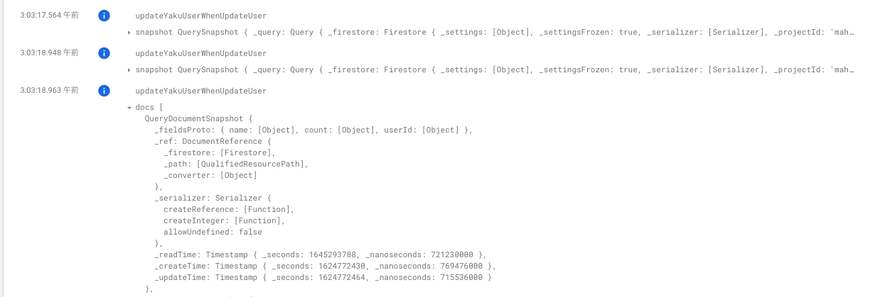

※ 諸説あるかとは思いますが、ここでいう構造化ロギングは JSON などの構造に従って構築されたログという意味で使っています。

## Firebase ではどうしていたか

Firebase 上の Cloud Functions は firebase-functions の機能で構造化ロギングをできます。
Cloud Functions では `conosle.log()` とすれば任意のオブジェクトをログに出せますが、複数行にまたがるとログが分割して表示されて非常に見づらいです。

そのため Firebase の Cloud Functions では、

```ts
import * as functions from "firebase-functions";

functions.logger.error("<validation error | data: ", data, {
  structuredData: true,
});
```

などとしてログを構造化できました。

これだと data の部分だけが構造化され、ログビューアー上では折り畳みで見えます。



(上の具体例のログじゃないけどご容赦)

## GCP 版 Cloud Functions でもやりたい

さて、この logger 関数は便利ですが、`firebase-functions` です。
GCP 上ではどうすればいいでしょうか。
「うるせー、裏側はきっと同じだと信じてこっちでも firebase を使うぜ」という手もありますが、おそらく動きません。
そこで、そもそも構造化ロギングは GCP 上の Cloud Logging でサポートされているはずなので、それに紐づける形で Cloud Functions を使ってみましょう。

<https://cloud.google.com/functions/docs/monitoring/logging#write-logs-client-libraries> によると、

```js
const entry = Object.assign(
  {
    severity: "NOTICE",
    message: {
      id: {
        type: {
          type: {
            type: {
              type: {
                id: {
                  type: {
                    type: {
                      type: {
                        type: {
                          type: {
                            type: {
                              type: {
                                type: {
                                  type: {
                                    id: {
                                      type: {
                                        type: { type: { type: "string" } },
                                      },
                                    },
                                  },
                                },
                              },
                            },
                          },
                        },
                      },
                    },
                  },
                },
              },
            },
          },
        },
      },
    },
    // Log viewer accesses 'component' as 'jsonPayload.component'.
    component: "arbitrary-property",
  },
  globalLogFields
);

// Serialize to a JSON string and output.
console.log(JSON.stringify(entry));
```

のようにして渡すと良さそうです。

しかしこれはこのように表示されるだけです。


ログの全量は表示されますが、中身を折り畳みで見ることはできません。

じゃあどうするのかというと、このようにして出力したログは cloud logging からも見れるようになります。
なので、cloud logging で確認しましょう。


