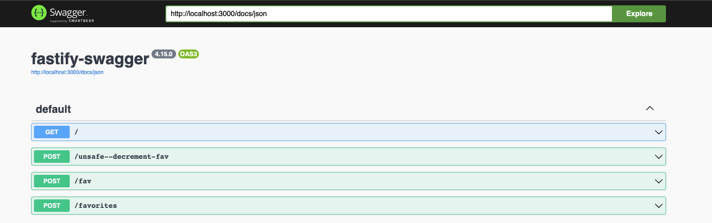
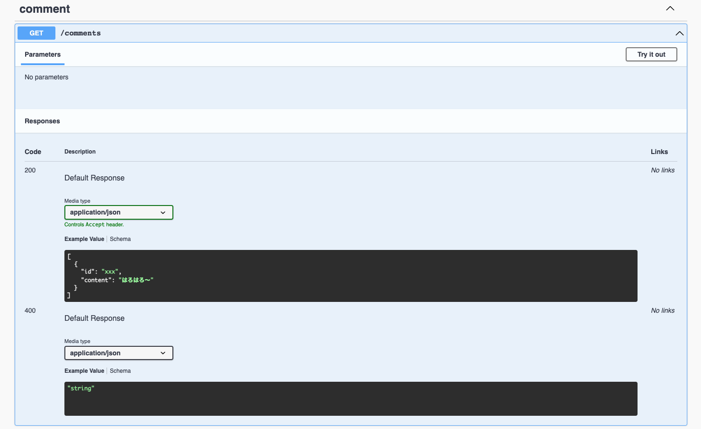
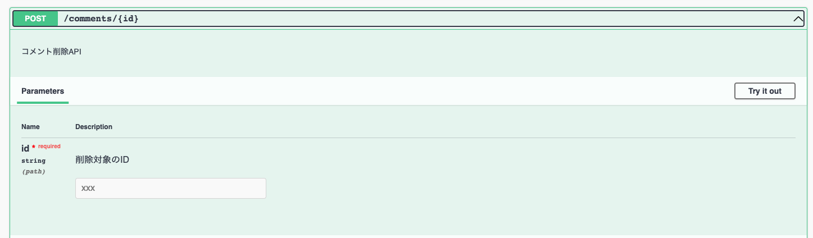
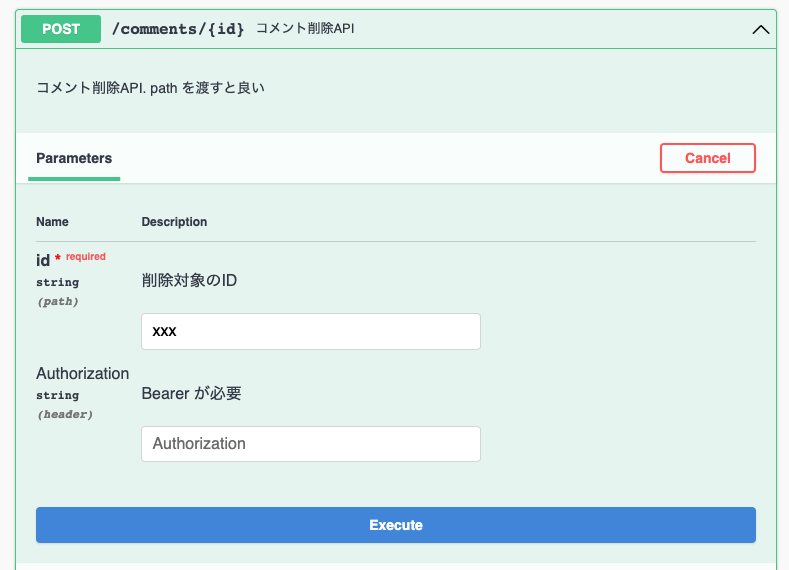
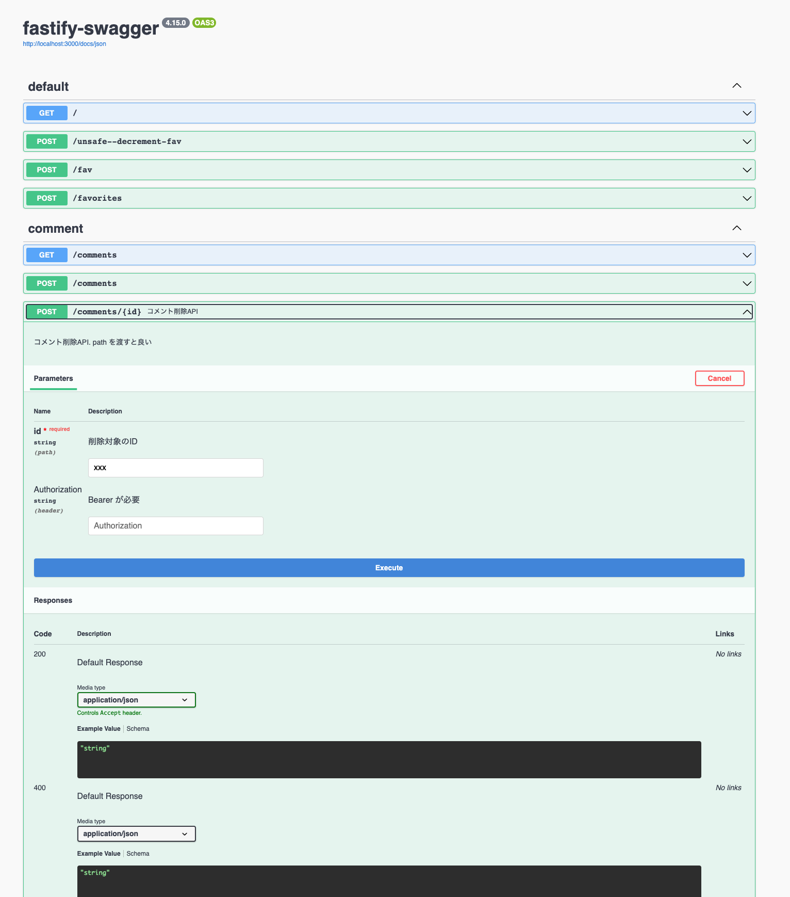

API Spec を書くとそれ通りのリクエストしか受け付けないようにバリデーションしてくれて、なおかつバリデーションされた値には Spec で期待した通りの型が付いて欲しいですよね。

これを TypeScript で実現しようとすると色々と壁があることがわかると思います。特に Open API の Spec と TypeScript の型を揃えるのが難しいです。

これは NestJS でクラスフィールドとデコレータを使って解決できているのですが、会社の事情で採用が難しかったりもします。そこで fastify を使って同様のことを達成してみましょう。

## Swagger はどうあるべきか

まず、フロントエンドエンジニアとしてのお気持ちを最初に表明させてください。
Swagger などの API Spec はソースコードから生成されるべきで、もしくはバリデータから生成されるべきで、型をつけられるべきです。
ソースコードから生成しなければソースコード修正時の変更が Spec に反映漏れしうりますし、バリデータの保証がなければ Spec と違う定義の値が返ってきうるし、型がないとそもそもコードから Spec を生成できないはずだからです。コメントや yaml で定義されているとどうしても不幸な事故は起きうります。そしてこの不幸な事故でなぜかフロントエンドエンジニアが怒られるもっと不幸な事故もあります。¯\\\_(° ペ)\_/¯

とはいえこれが難しいのも知っています。
動的型付け言語を使うとこの手の不幸な事故は仕組みでは避けにくいですし（運用で避けられるという意味です）、静的型付け言語であっても何かしらの補助情報がなければ Open API の便利機能への準拠が難しかったり、ランタイムで静的な型が消されるタイプの言語であればデコレータを使わない限りは Spec の生成は難しいでしょう。

そこで型がなくても使えるアプローチとして、バリデーターを中心にして swagger と 型を作るアプローチを考えてみます。
さらにバリデータから型をつける方法を取り入れて、Swagger と バリデーター と 型の同調を図ります。

## fastify のバリデーション

### バリデーションの仕組み

fastify はルーティングの定義時に JSON Schema を使ったバリデータを定義できます。

```ts
export const postComment: FastifyPluginCallback = (f, _, done) => {
  f.post(
    "/comments",
    {
      schema: {
        body: CommentRequest,
        response: {
          204: { type: "string" },
          400: {
            type: "string",
          },
        },
      },
    },
    (req, res) => {
      res.status(204).send();
    }
  );
  done();
};
```

第二引数の

```ts
{
      schema: {
        body: CommentRequest,
        response: {
          204: { type: "string" },
          400: {
            type: "string",
          },
        },
      },
    }
```

はオプションであり、schema 以外にも

```ts
interface Hoge {
  schema?: FastifySchema;
  attachValidation?: boolean;
  exposeHeadRoute?: boolean;
  validatorCompiler?: FastifySchemaCompiler<SchemaCompiler>;
  serializerCompiler?: FastifySerializerCompiler<SchemaCompiler>;
  bodyLimit?: number;
  logLevel?: LogLevel;
  config?: FastifyContext<ContextConfig>["config"];
  version?: string;
  constraints?: { [name: string]: any };
  prefixTrailingSlash?: "slash" | "no-slash" | "both";
  errorHandler?: (
    this: FastifyInstance,
    error: FastifyError,
    request: FastifyRequest,
    reply: FastifyReply
  ) => void;
  // TODO: Change to actual type.
  schemaErrorFormatter?: (
    errors: FastifySchemaValidationError[],
    dataVar: string
  ) => Error;

  // hooks (onError, onRequest, onSend などを紙面の都合で省略)
}
```

といったオプションを取れます。
fastify のバリデーションは組み込み機能であるため、細かい制御（例えばデフォルトの ajv 以外の validator を使えないのか）は完全解放されていないのですが、`attachValidation` , `validatorCompiler`, `serializerCompiler`のようなオプションを通して可能な範囲もあります。どのようなオプションがあるかは覚えておきましょう。

先の例では body と response に対して JSON Schema を定義しています。
ちなみに他にも validation できて、schema の型定義は

```ts
export interface FastifySchema {
  body?: unknown;
  querystring?: unknown;
  params?: unknown;
  headers?: unknown;
  response?: unknown;
}
```

となっていてこれらに validation をかけられます。

ところで注目して欲しいのは unknown です。
実は先の例だと、なので `req.body.content` などとすれば string を取り出せますが、実は型は付きません。

ではどのようにしてバリデーション結果に型をつけるかというと、

```ts
f.post<{ Body: CommentRequestType }>(
  "/comments",
  {
    schema: {
      body: CommentRequest,

      response: {
        204: { type: "string" },
        400: {
          type: "string",
        },
      },
    },
  },
  (req, res) => {}
);
```

のように `<{ Body: CommentRequestType }>` といったジェネリクスを指定します。

こうすると、`req.body.content` と言った風に型をつけることができます。

### 型が自動でつかないことの問題

さて、この型ですが、大きな問題があります。
それは明らかなに JSON Schema と矛盾する型を書いても tsc 的には OK ということです。
極端な話、`<{ Body: undefined }>` という型も書けてしまいます。

つまり JSON Schema と 型が一致しません。
同様の問題は [TypeScript, JSON Schema, Ajv の組み合わせを考える](https://blog.ojisan.io/typescript-json-schema-ajv/) にもありましたが、 ajv ベースだとこの手の問題は起きがちです。

### JSON Schema と型の同期

残念ながら JSON Schema と型を一致させるような方法は限られています。
そこで fastify では typebox を使って解決しようとしているのでこれを採用します。

[typebox](https://github.com/sinclairzx81/typebox) は

> JSON Schema Type Builder with Static Type Resolution for TypeScript

とあるとおり、JSON Schema と 型を揃えることのできるライブラリです。

このように、

```ts
import { Static, Type } from "@sinclair/typebox";

const T = Type.String(); // const T = { "type": "string" }

type T = Static<typeof T>; // type T = string
```

実行することで JSON Schema を生成できる独自スキーマと、それから型を導出するユーテリティで構成されています。

先ほどの Comment API の POST に対しては、

```ts
export const CommentRequest = Type.Object({
  url: Type.String({ description: "コメントしたいURL" }),
  content: Type.String({ description: "コメント内容" }),
});
export type CommentRequestType = Static<typeof CommentRequest>;

export const postComment: FastifyPluginCallback = (f, _, done) => {
  f.post<{ Body: CommentRequestType }>(
    "/comments",
    {
      schema: {
        tags: ["comment"],
        body: CommentRequest,
        response: {
          204: { type: "string" },
          400: {
            type: "string",
          },
        },
      },
    },
    (req, res) => {}
  );
  done();
};
```

のようにして JSON Schema と型を付与できます。

ただし注意点があり、たしかに JSON Schema と型は一致させられましたが、fastify には相変わらずでたらめな値を渡せてしまうのでそれは人間が注意する必要があります。

## JSON Schema から swagger の API Spec を生成する

nestjs ではクラスフィールドとデコレータから swagger を生成していました。
デコレータを持たない fastify では代わりに API の JSON Schema から API Spec を生成します。

### fastify-swagger の導入

導入は簡単です。

```ts
import Fastify from "fastify";
import fastifySwagger from "fastify-swagger";

import { routesPlugin } from "./routes";

const fastify = Fastify({
  logger: true,
});

fastify.register(fastifySwagger, {
  routePrefix: "/docs",
  openapi: {},
  exposeRoute: true,
});

fastify.register(routesPlugin);

fastify.ready((err) => {
  if (err) throw err;
  fastify.swagger();
});

// Run the server!
fastify.listen(3000, function (err, address) {
  if (err) {
    fastify.log.error(err);
    process.exit(1);
  }
});
```

fastifySwagger を plugin として登録し、`fastify.swagger()` で実行するだけです。
あとは plugin のオプションに渡したルーティングに doc が展開されます。

そして、routing の body や response に schema を当てればそれだけで API Spec が完成します。



### swagger のための JSON SChema

さて、swagger の情報はリッチであればあるほど助かります。
そこで情報を足していきましょう。

そのためには JSON Schema をリッチにすればいいです。
JSON Schema は型以外の情報を足せるとてもリッチなフォーマットで、文字列の長さやフォーマットなども定義できます。

FYI: <https://json-schema.org/>

swagger に反映させることを考えると description と example を付けた方が良いでしょう。
それを JSON Schema に反映させるために typebox にこのように定義します。

```ts
export const CommentsResponse = Type.Array(
  Type.Object(
    {
      id: Type.String({ description: "コメントID", examples: ["xxx"] }),
      content: Type.String({
        description: "投稿内容",
        examples: ["hello"],
      }),
    },
    {
      examples: [
        {
          id: "xxx",
          content: "はろはろ〜",
        },
      ],
    }
  )
);
```

ここから生成された JSON Schema を fastify-swagger が読み取ると、



と表示されます。

リクエストに対しても

```ts
export const CommentDeleteRequest = Type.Object(
  {
    id: Type.String({ description: "削除対象のID", examples: ["xxx"] }),
  },
  {
    description: "コメント削除リクエスト",

    examples: [
      {
        id: 4,
      },
    ],
  }
);
```

とすれば



と表示されます。

他にも、schema 自体に summary, description を定義すれば一覧ページに説明文を出せたりもします。



一覧のセクションは tags を渡せば作れます。というわけで完成形。

```ts
export const deleteComment: FastifyPluginCallback = (f, _, done) => {
  f.post<{ Params: CommentDeleteRequestType }>(
    "/comments/:id",
    {
      schema: {
        headers: {
          type: "object",
          properties: {
            Authorization: {
              type: "string",
              description: "Bearer が必要",
              examples: ["Bearer fjwefjweiofjweioj"],
            },
          },
        },
        summary: "コメント削除API",
        description: "コメント削除API. path を渡すと良い",
        tags: ["comment"],
        params: CommentDeleteRequest,
        response: {
          200: { type: "string" },
          400: {
            type: "string",
          },
        },
      },
    },
    (req, res) => {
      res.status(200).send(`requested is ${req.params.id}`);
    }
  );
  done();
};
```



## まとめ

- API 定義書は実装から生成されるべきで、型とバリデータと同期されていたら最高。
- fastify では validation 用の JSON Schema から swagger を生成可能で、JSON Schema と型を同期させるために typebox を使う
- typebox はリッチな表現が可能で swagger をリッチにできる

JSON Schema のバリデーションをもっと使いやすくするための方法とか(たとえば 400 エラー 以外を返せるようにしたり文言をカスタマイズした上で swagger にどう反映させるか)を書こうと思ったけど別の記事に分けて書きます。
