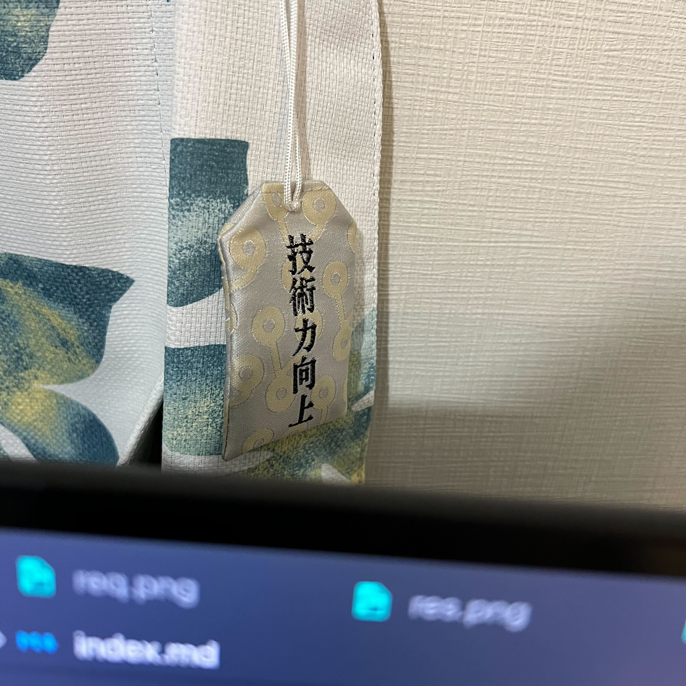
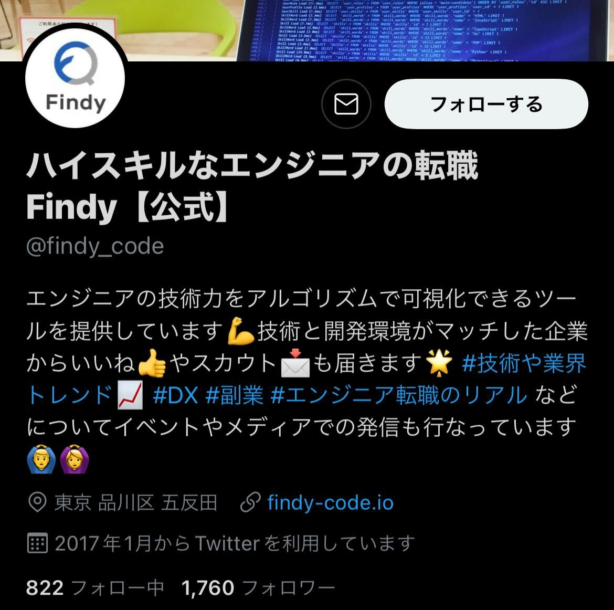
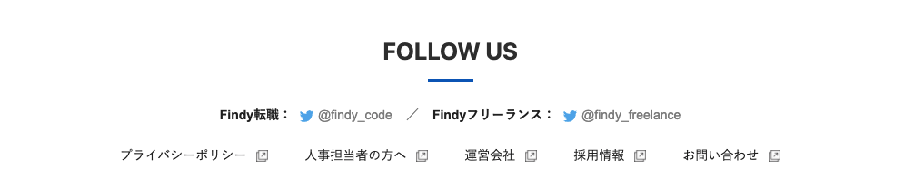
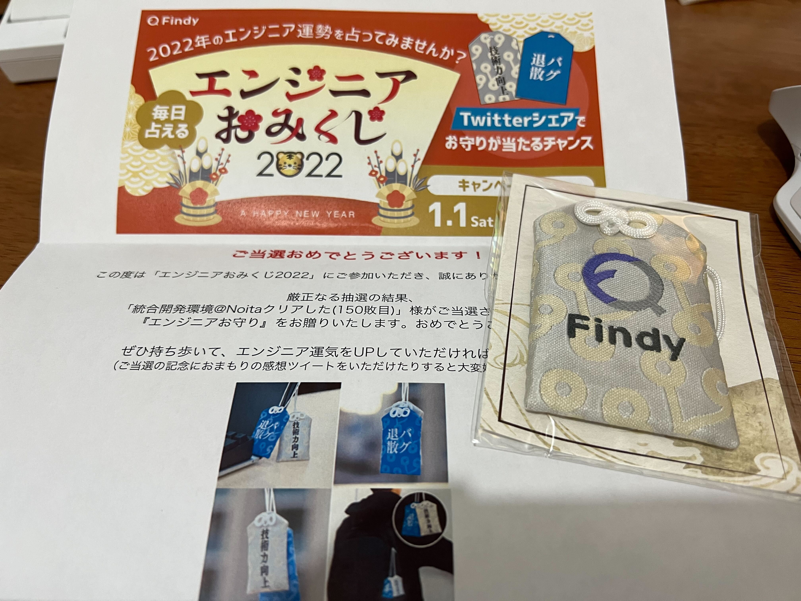

Findy からお守りもらいました！

これは、[エンジニアおみくじ](https://findy-code.io/engineer-lab/findy-omikuji-2022) という年始にやっていた Twitter の投稿キャンペーンを通してもらったものです。
実はこういう抽選で当たるの初めてですごい舞い上がっています。

さて、当選したときに Twitter DM で住所入力フォームが送られてきたのですが、そこに住所を本当に入力するか悩んだ時の話をします。

## そのアカウントは本当に Findy 公式なのか

私に当選通知を送ったアカウントはこちらです。

これ、公式を自称していますが本当に公式なのでしょうか？
Findy のプレスリリースをツイートに流していれば成りすませますよね。

流石に見ず知らずの人に住所は教えたくないので、これが本物と言い切れるまでは送りたくないという気持ちがあります。

共通のフォロワーに知り合いがたくさん居たので「流石に全員を騙されていることはないだろう」という思いと、キャンペーン自体は Findy のサービス自体で告知されていたということがあって 99.9% 本物ということは分かっていましたが、それでも本当にこのアカウントが Findy 本物とは分からなかったです。

さらに、住所を伝える方法はフォームだったのですが、Google フォームであったため本当に Findy かどうかが心配になりました。せめてこれが Findy のドメインもしくはサブドメインであれば信頼していたと思うのですが、ここで住所を送るべきかの脳内会議が開かれました。

## Findy 本家からアカウントにリンクがあるかを探す

というわけでこれが本当に Findy 公式なのか調べてみることにしました。

Findy のアカウントが本物か確かめるために、まずは Findy の公式から Twitter へのアカウントへのリンクを探しました。
最新ツイートの紹介とか広報的なセクションにあるだろうと予想していたのですが、これが全然見つからなくて困りました。
この時点で「もしかして偽物の可能性もあるのか？」と少し疑いが深まりました。

会社説明にも 「Findy のメディア・発信」とあるのですが Twitter のアカウントがありませんでした。お問い合わせ / 採用担当 Twitter というセクションもあるのですが、採用担当者の Twitter しかありません。該当キャンペーンの告知の記事にもアカウント情報はありません。すこし疑いは高まりました。

FYI: <https://careers.findy.co.jp/#004c1390e8ba45ecaf11cf61da7d022e>

FYI: <https://findy-code.io/engineer-lab/findy-omikuji-2022>

というわけで色々調べて本物と判定したときの方法を書いておきます。

### Findy のアカウントを findy ドメインで検索

`findy_code site:findy.co.jp` でググりました。
ヒットしませんでした。
findy_code はアカウントの ID です。

### Findy の役員のフォロー一覧から探す

メンバー紹介ページから https://twitter.com/sugnchi/following という役員の方のアカウントを見つけたので、検索をかけました。
そうすると該当 ID は見つかりました。
ただこれも「もしかして怪しいアカウントを監視する目的でのフォローなのか？」とか考えてしまい、本物とは言い切れないみたいな疑いを持ってしまいました。

### とりあえずありとあらゆる Findy のページにアクセスする

なので Findy の公式から飛べるありとあらゆるページで探しました。
クローラーを作ろうと思ったのですがなんかやる気が出なかったので人力で頑張りました。
そうすると https://engineer-lab.findy-code.io という Findy のエンジニア向けのメディアサイトのフッターに該当の ID へのリンクを見つけました。

というわけで本物であると確信しました。

## というわけで GET

というわけで住所を送って入手しました。わーい。

ありがとうございます！

## あとがき

色違いバージョンも欲しいなぁ
