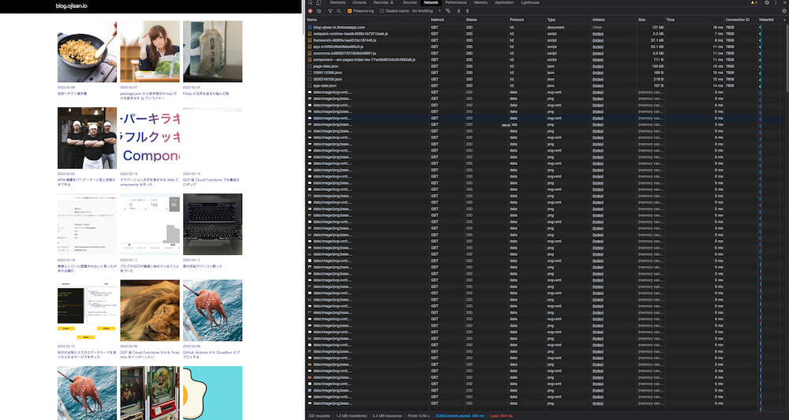
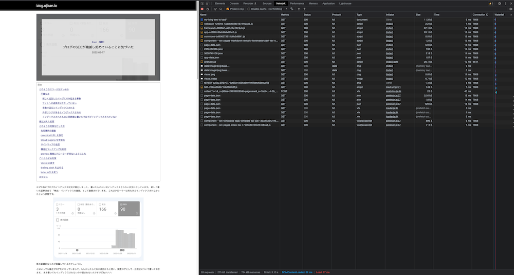
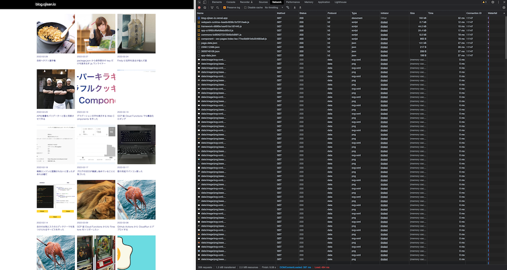

## ブログを Firebase から Vercel に移した

先日、ブログを Firebase から Vercel に移しました。

元々は今年の年始に

- CI/CD を柔軟にしたかった、
- cloud logging を使いたかった

という理由で Firebase Hosting に移したのですが、それを機に [ブログの SEO が壊滅し始めていることに気づいた](https://blog-ojisan-io.vercel.app/my-blog-seo-is-bad/) にあるように検索結果に Index されないようになりました。

Search Console のエラーは 「検出 – インデックス未登録」 とあり、これは

> 検出 - インデックス未登録: ページは Google により検出されましたが、まだクロールされていません。これは通常、Google が URL をクロールしようとしたものの、サイトへの過負荷が予想されたため、クロールの再スケジュールが必要となった場合です。そのため、レポート上で最終クロール日が空欄になっています。

と公式で説明されています。

Firebase Hosting で静的ホスティングしているだけなのでこの理由であることは考えられないし、他の理由でもこのエラーが出るといったエスパー報告をネットでそれなりの数を見かけているので、原因がこれだとは信じていません。
ただ、「公式がそう言うなら...」という気持ちと、事実インフラを入れ替えたタイミングでエラーが出ているので、「もしかして Vercel なら治るのか？」と思って Vercel に戻し検証していました。

その SEO の検証結果については興味深い結果が出てきているので後日まとめて報告しようと思いますが、今日は「せっかく同じものを Firebase Hosting と Vercel にデプロイしたし純粋に速度を比べてみるか」という報告を書こうと思います。

## 検証方法

### 最初のリクエストでは計測しない

Firebase Hosting, Vercel 共に前段に CDN があるサービスです。
その CDN にアセットが展開されるタイミングはデプロイ時なのかよくわからなかったので、何回かアクセスした後のアクセスで検証します。

### 10 回計測する

1 回だけだとブレがあるので 10 回計測します。

### トップページと記事ページを対象とする

1URL だけだと不安だったので 2URL を使います。

対象は

- https://blog.ojisan.io/
- https://blog.ojisan.io/my-blog-seo-is-bad/

の Firebase Hosting & Vercel の URL です。

### 独自ドメインを通さない

それぞれのサービスが発効する独自 URL に対するリクエストで検証します。
DNS の名前解決にかかる時間を省いて計測したかったからです。

## 検証結果

※ 速度の単位は ms

### Firebase Hosting

#### index

速度は、

- 13
- 27
- 10
- 17
- 22
- 12
- 16
- 25
- 19
- 12

max: 27, min: 10, ave: 17.3

#### detail

- 17
- 15
- 13
- 14
- 9
- 14
- 9
- 15
- 9
- 14

max: 17, min: 9, ave: 12.9

### Vercel

速度は、

- 21
- 28
- 29
- 29
- 33
- 30
- 29
- 45
- 32
- 27

max: 45, min: 21, ave: 30.3

速度は、

- 23
- 16
- 20
- 21
- 13
- 18
- 13
- 25
- 12
- 21

max: 25, min: 12, ave: 18.1

### まとめ

Firebase Hosting の方が 5-10ms ほど速いですね。
