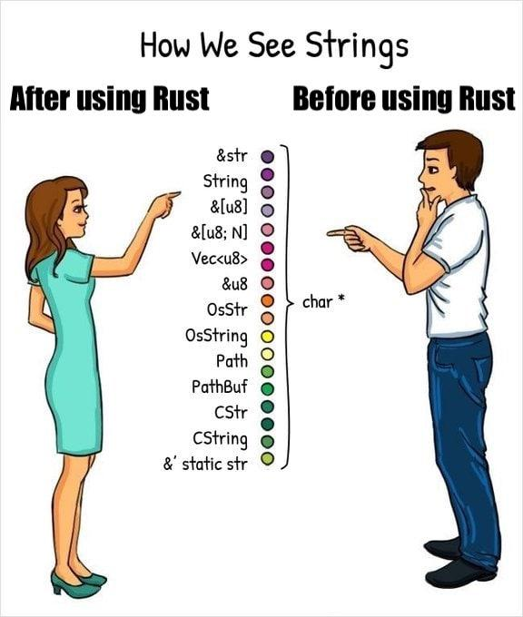

Rust 分かんないッピ ・ε・

Rust の文字列周りのプラクティスを基礎から勉強してみようと思って勉強したのでそのときのメモをまとめます。

## Rust は GC を持たない

なぜ Rust の文字列周りの型があんなに大変なことになっているかは、Rust のメモリモデルと Copy の仕組みを学ぶことで理解できた気がしたので、メモリの話から始めます。



### GC とは

まずは GC からです。
GC とは Wikipedia をそのまま引用すると

> ガベージコレクション（英: garbage collection; GC）とは、コンピュータプログラムが動的に確保したメモリ領域のうち、不要になった領域を自動的に解放する機能である。

とのことです。

FYI: <https://ja.wikipedia.org/wiki/%E3%82%AC%E3%83%99%E3%83%BC%E3%82%B8%E3%82%B3%E3%83%AC%E3%82%AF%E3%82%B7%E3%83%A7%E3%83%B3>

GC が必要とされる背景としては、プログラマがメモリ管理を気にせずにコードを書けるようにしたいからです。
もしプログラマがメモリの管理でミスをすると、

- メモリリーク
  - メモリを解放せずにポインタだけを消すなどした場合、プログラムは実行中にどんどん不要なメモリを貯めていくこととなり、利用可能なメモリがなくなる。
- メモリの二重解放
  - 手動でメモリを解放するも、ダングリングポインタを放置していると間違えて再度メモリを解放するかもしれない。その場合は未定義動作を引き起こす

といった問題を起こしてしまうかもしれません。

そこでメモリの管理を信頼できる機能で機械的に行います。
それが GC であり、GC があればメモリ管理でバグを埋め込んでしまうことを防げます。
そして今世の中で使われている言語は GC を持つことが多いです。

しかし、Rust には GC がありません。

### Rust には GC がない

Rust は GC を持ちませんが、そのおかげで効率の面で恩恵を受けています。
GC があるということは GC のための処理がそのプロセスの中で走っているということであり、コストがかかっています。
そのため GC がなければそれだけで効率が良くなります。

そうすると GC がないので先ほどのメモリ管理をプログラマがするデメリットが降りかかりそうに思えます。
しかし Rust の場合はそのような問題が起きないようにコンパイルでその問題を解決してくれます。

Rust には次の機能があります。

- 有効なスコープを抜けると、自動的にそのオブジェクトのために確保したメモリを解放する
  - ドロップ時にメモリを解放する命令を Rust コンパイラが差し込んでくれる。
  - ここでいう有効なスコープはブロックではなく、ライフタイムであり、リージョンと呼ばれるもの。
  - 正直正しく説明できる自信がないので他の資料を読んでください。リージョン推論全体を俯瞰できる資料として、 <https://keens.github.io/slide/seitekinamemorikanrinohanashi.ri> が良かったです。また公式の言語仕様でも言及されています。<https://rustc-dev-guide.rust-lang.org/borrow_check/region_inference.html#inference-overview>
- そもそも自分でメモリを解放しないのでメモリの二重解放は起きない
  - コンパイラは変数のライフタイムを知っているからメモリの二重解放は防げます。
  - （※ リージョン推論の一部とも言えるが、明示的にプログラマが与えることができるものでもあるので切り出しました。)

## Clone と Copy とヒープについて

さて Rust ではコンパイラがいい感じにメモリの面倒を見てくれることがわかりました。
では開発者はコンパイラにどのようなヒントを出せるのでしょうか。
Clone と Copy トレイトもそのようなヒントの一つです。

### コピーできるもの・できないもの

ある構造体に String を持たせていて、それを含む別の構造体になんらかの事情で Copy トレイトをつけろとコンパイラに言われた時、付けようとしても付けられなかった経験はないでしょうか。
Rust には Copy を実装できるものとできないものがあります。

結論から話すと、Rust では primitive なものには Copy トレイトが実装されていて、String や Vec には実装されていないです。

### ヒープに入るものは Copy しない

String や Vec に Copy がないということを言い換えると、ヒープを使うものは Copy が実装されていないです。
その理由として、Copy トレイトが実装されているとムーブの代わりにコピーがされていくこととなりますが、ヒープに入るような大きなもの・Sized でないものが勝手に Copy されていくと、どんどん効率が落ちていくからでです。
代わりに Clone は実装できるので、所有権の都合などで同じものが欲しい場合は開発者が手で clone する必要があります。

反対にその理由として、Copy できる（もしくはその理由として、Copy トレイトを実装できる）ものは Sized なものと覚えると良いでしょう。
Sized なものを Copy するときはバイト列をピッと Copy すればいいためコストも低いです。
これは memcopy 相応と考えておくと良いでしょう。

### ヒープにあるものを Clone するとどうなるか

String の場合、ヒープに作成するとスタック上にはその文字列の先頭のアドレスと length と確保したヒープのサイズを保持されます。
もしこれを memcopy 相応なもので Copy しようとすれば、コピーされるものはスタックの上にあるものであり、実体はオリジナルが指しているものです。（実際には Copy は実装されていないので妄想での話です。）
反対に Clone をした場合であれば、stack にあるものだけでなくデータの実体も clone されます。このときヒープ上に新しいバイト列を持足せる必要があるのでメモリの確保、つまり malloc 相応のものから行われます。
つまり String の clone はヒープの操作を伴うのでスタックの操作に比べると多少のコストがかかることになります。

Rust で文字を扱う場合には、Clone のような深いコピーをいかに避けるかを考えて型を選択していく必要があります。

## Rust における文字の種類

### スライス

文字の話をする前に前提になるものとしてスライスについて復習しよう。

スライスは、連続するメモリ領域に対する参照です。
噛み砕いた言い方をするならば、あるコレクションの一部に対する参照です。
もっと噛み砕いていうと、要するに `&str` や `[u8]` です。
参照であるため所有権が奪われることを気にせずに使えます。

### char

1 文字です。

```rust
let c = 'a';
```

公式の定義には、

> The char type represents a single character. More specifically, since ‘character’ isn’t a well-defined concept in Unicode, char is a ‘Unicode scalar value’, which is similar to, but not the same as, a ‘Unicode code point’.

とあります。ユニコードのコードポイントにとても似たものが使われています。 (‘Unicode scalar value’ is any Unicode code point except high-surrogate and low-surrogate code points. )

FYI: https://doc.rust-lang.org/std/primitive.char.html

### バイト列

1byte(8bit, 2^8) の集合。Rust だと `&[u8]` もしくは `Vec<u8>` で表現されます。（やろうと思えば `[u8]` も定義可能だが、参照を使わない理由が破壊したいということであれば、Vec にしない理由はない）
`Vec<u8>` のスライスが `&[u8]` です。
型の時点ではただのバイト列なのでエンコード形式は自分で決められます。

### String

公式の定義には、

> A UTF-8–encoded, growable string.

> The String type is the most common string type that has ownership over the contents of the string. It has a close relationship with its borrowed counterpart, the primitive str.

とあります。

FYI: https://doc.rust-lang.org/std/string/struct.String.html

特徴としては、

- 実体は `Vec<u8>`
- utf-8 でエンコーディングされることが前提
- 所有権を持つ

といったものがあります。

### &str

公式の定義には、

> String slices.

> The str type, also called a ‘string slice’, is the most primitive string type. It is usually seen in its borrowed form, &str. It is also the type of string literals, &'static str.

> String slices are always valid UTF-8.

とあります。

FYI: https://doc.rust-lang.org/std/primitive.str.html

つまりは、

- String のスライス
- `Vec<u8>` に対するスライスなので実体は `[u8]`
- スライスなので所有権も持たない
- utf-8 でエンコーディングされている

という特徴を持ちます。

## Rust で文字列を扱うためのプラクティス

さて、ここでこれらの型をどう使い分けていけばいいかを考えましょう。

https://qiita.com/Kogia_sima/items/6899c5196813cf231054 という記事で同様の試みがあったので、一部参考にしつつ初心者目線での持論をまとめていきます。

### イージーなやり方: すべて String

まず前提として Rust における難しさは、所有権とライフタイムだと思います。
なのでそれをなるべく考えなくていいようにと考えると、全てを String にしてしまえばいいと思います。

```rust
struct Hoge {
  content: String
}

pub hoge(input: Hoge) -> String {
  input.content
}
```

ただし、関数の引数に String を持つと、それを呼び出すことで所有権が奪われてしまい、汎用性はなくなります。
このままだと、所有権がなくなってもいいという条件でないと呼び出せない関数です。
なので改善するとすれば、奪った所有権も返すような戻り値設計にすると良いでしょう。。

```rust
struct Hoge {
  content: String
}

pub hoge(input: Hoge) -> (String, Hoge) {
  (input.content, input)
}
```

とはいえ、入力を出力として常に返し続ける関数が正しいはずはないので別の方法を考えます。
正攻法であれば、引数は参照を持たせてみてはどうでしょうか。

```rust
struct Hoge {
  content: String
}

pub hoge(input: &String) -> &String {
  input
}
```

しかしこれは clippy で

```
warning: writing `&String` instead of `&str` involves a new object where a slice will do
  --> src/main.rs:27:16
   |
27 | fn hoge(input: &String)->&String {
   |                ^^^^^^^ help: change this to: `&str`
   |
   = note: `#[warn(clippy::ptr_arg)]` on by default
   = help: for further information visit https://rust-lang.github.io/rust-clippy/master/index.html#ptr_arg
```

と警告が出ます。

この警告も尤もで、参照しかできないのであれば String で持つ必要はないため、よりエコな &str を使った方が良いです。

ちなみに mut するのであれば警告は出ないし、`&String` を受け取る意義もあります。

```rust
struct Hoge {
  content: String
}

pub fn hoge(input: &mut String) -> &String {
  input
}
```

### よくやるやり方: 戻り値だけ String

そこで頻出するやり方が、

```rust
pub fn hoge(input: &str) -> String {
  input.to_string()
}
```

といった風に、引数では `&str` で受けて、戻り値は `String` で返すやり方です。
ただし、 `.to_string()` は `String::from(xxx)`なので、戻り値を作る時にコストはあります。

### 入力を汎用的にする: Into

&str で引数を受けるのが良いとは描きましたが、引数の柔軟性は欲しいかもしれません。
具体的なケースとしては呼び出し元が String, &str のどちらで渡すのか分からない時や、関数の汎用性をあげたい時はどちらでも受け取れるようにしたいです。
Rust ではそのようなケースもサポートでき、 `Into` が使えます。

```rust
pub struct Person {
    name: String
}

impl Person {
    pub fn new(name: impl Into<String>) -> Person {
        Person { name: name.into() }
    }
}


Person::new("hoge".to_string());
Person::new("hoge");
```

自分自身への `into` は素通りさせるだけなので、`into` を使うことで、`&str` が渡ってきた時にはじめて `String` を作るようになります。
つまり最初から String が渡されれば、その変換処理がいらなくなり多少のコストカットになります。

### 理想的なやり方: 戻り値も &str

とはいえ、String の生成自体がなくなる方がコストは低いので、入力も出力も参照の方が幸せです。

それはこのように定義できます。

```rust
pub hoge(input: &str) ->　&str {
  input
}
```

ちなみにこのコードがうまく動くのはライフタイムが見た目からは省略されていて、本当はついているからです。

```rust
pub fn hoge<'a>(input: &'a str) -> &'a str {
  input
}
```

そのため入力がなかったり、入力が複数ある場合(こちらの場合はライフタイムを明示すればいい)はライフタイムがつかずにコンパイルができません。

```rust
// error
pub fn hoge() -> &str {
  "hogeeee"
}
```

このようなケースがあるため String で返さないといけないケースを 0 にすることはできないですが、参照を返せるときは参照を返すと良いです。

### ライフタイム付きの参照で zero-copy の実現

さて、参照を返すためには入力に参照が必要です。
入力されるデータが構造体であれば、そのフィールドは参照でなければいけません。
そして参照で定義するということはライフタイムも付けないといけないです。

```rust
struct Heading<'a> {
    pub content: &'a str,
    pub level: u8,
}

fn parse_heading<'a>(input: &'a str) -> Heading<'a> {
  Heading{...}
}
```

こうすることで登場人物の全てを参照にできます。
全てを参照で持つような構造にしておくと、同じような関数を何度も呼び出す際に有効です。
例えばパーサーコンビネータを定義するときは、全てを参照で引き回せるようにしないとパフォーマンスに大きな差が生まれます。

事実、代表的なパーサーコンビネータライブラリである combine は参照を要求するような型定義やトレイト境界を持っています。

```rust
pub fn parse_heading<'a, Input>() -> impl Parser<Input, Output = Heading<'a>>
where
    Input: RangeStream<Token = char, Range = &'a str>,
    Input::Error: ParseError<Input::Token, Input::Range, Input::Position>,
{
    let heading_content = (
        string("#"),
        space(),
        take_while1(|c: char| c.is_alphabetic()),
    )
        .map(|(_, _, content)| Heading {
            level: 1,
            content: content,
        });
    heading_content
}
```

### いい感じに抽象化できるスマートポインタ、CoW

さて、Rust には戻り値にくる String, &str をいい感じに抽象化できる型、スマートポインタがあります。

それが `CoW` で、Clone on Write を実現してくれます。（文字列は Copy できないので、よくある Copy on Write と違う読み方になっている）

公式ドキュメントには

> A clone-on-write smart pointer.

> The type Cow is a smart pointer providing clone-on-write functionality: it can enclose and provide immutable access to borrowed data, and clone the data lazily when mutation or ownership is required. The type is designed to work with general borrowed data via the Borrow trait.

とあります。

FYI: https://doc.rust-lang.org/std/borrow/enum.Cow.html

Cow を使うと、借用されたデータに対しては immutable にアクセスを提供し、mutate を試みたり所有権を要求されると clone して owned なデータを返します。
CoW そのものの解説は https://dhghomon.github.io/easy_rust/Chapter_42.html に詳しいので気になる方はこちらをご参照ください。

Rust における文字列操作において、効率を求めるのであればなるべく参照で持ち回すのが良いが、CoW を使えば mutate したくなったときにわざわざ手で clone しなくていいようになるという嬉しさがあります。

例としては先のドキュメントにこういう関数があります。

```rust
use std::borrow::Cow;

fn modulo_3(input: u8) -> Cow<'static, str> {
    match input % 3 {
        0 => "Remainder is 0".into(),
        1 => "Remainder is 1".into(),
        remainder => format!("Remainder is {}", remainder).into(),
    }
}

fn main() {
    for number in 1..=6 {
        match modulo_3(number) {
            Cow::Borrowed(message) => println!("{} went in. The Cow is borrowed with this message: {}", number, message),
            Cow::Owned(message) => println!("{} went in. The Cow is owned with this message: {}", number, message),
        }
    }
}
```

つまり &str と String を切り替えています。
現実世界で何が嬉しいかというとこちらの reddit の回答がまとまっていると思います。

https://www.reddit.com/r/rust/comments/kbi2dc/comment/gfhpxmp/?utm_source=share&utm_medium=web2x&context=3

この例は JSON Parser において、エスケープ文字を編集する時を例に挙げています。
つまり、ほとんどの場合は参照で持ち回ればいいが、一部変更しないといけない場合に全部を String にしなくても良くなるという点で有効です。

## まとめ、感想、お気持ち

- String はヒープに保持される
- String のコピーやクローンはなるべく避ける必要がある
- なるべく &str で持ち回るとコストの高いクローンをする機会がないので、なるべく &str で持ち回るべき
- String, str のどちらも扱いたいなら Into もしくは CoW を使う
- とはいえ現実問題における開発者体験を考えると、引数は `&str` で受けて `String` で渡し、構造体の中は全部 String にしておくのが良いと思うッピ！
