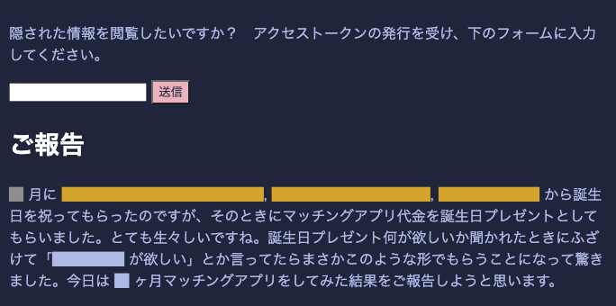

少し前に婚活をしていてまして、そのご報告ブログを書きました。(https://gohoukoku.ojisan.dev)今日はこれをどう作ったかについて書きます。



## なぜご報告ブログを書いたか

つい最近までマッチングアプリをしていました。
嬉しいことに僕の誕生日を祝ってくれた人たちがいまして、その人たちから Pairs 代をもらったことがきっかけです。
ただ投資を受けたからには投資家への説明責任が発生するので、そのためにご報告ブログを書きました。

## どのようなブログを書いたか

ご報告ブログを書くにしても、投資家には何か優待が必要になると思いましたので、投資家の方々にしか見れないような仕組みを作りたくなりました。いろいろ検討した結果、 [uhyo さんの職務経歴書](http://uhy.ooo/jobs/)を思い出したのでそのフォーマットに乗りました。


ただ、そのままパクるだけであれば芸がないので、黒塗りブログ界での最速を目指すこととしました。静的なコンテンツをエッジから返すことが最速だと信じているので、そのような仕組みを実現しようと考えました。

そのとき[とある新聞社の発表スライド](https://speakerdeck.com/sisidovski/nikkei-inside-frontend)を最近読む機会があり、ここで Paywall 付きの記事をどうやって CDN から配信するかという実装について解説されていたことを思い出しました。その素振りをするべく CDN 上でアクセス制限を解き権限ごとにキャッシュを出し分ける実装に挑戦しました。

## 設計について

まずアクセス制限については、権限を埋め込んだ JWT を用意しそれを token として発行することで実現しています。
token は CDN 上で秘密鍵を読み込んで検証しています。

権限自体は

```ts
{
  rank: string;
  name: string;
}
```

形式の custom claim が JWT に埋め込まれています。
name があるのは、token の流出があったときに犯人を突き止められるようにするためです。

rank は 3 種用意しており、投資家用以外にも自分の友人用、特に信頼できる友人用のものを用意していました。
ちなみに 友人用トークンは 2 回流出しており、すでに 2 回とも検証用の秘密鍵を差し替えています。

## Edge には Fastly C@E

その token の検証は Fastly C@E 上で行っています。
C@E は Edge Computing サービスであり、Edge でのコード実行以外にも Cache-Control-Header を解釈してくれることから CDN としても利用できます。

このサービスが Edge Computing 部分と Cache 部分がどういう関係になっているのか正直把握できていないのですが、VCL の代わりに WASM が代わりに使える CDN という認識で書いていました。WASM で書けるのでソース言語は WASM にコンパイルできるなら何言語でもいいことや、JS -> WASM への変換ツールを Fastly が用意していたり VCL を書かなくても CDN を設定できるようになっています。VCL は [falco](https://github.com/ysugimoto/falco) のような開発支援ツールを使うことで開発体験を向上させられますが、やはり Rust などに比べると言語機能やエコシステムの充実さに behind があり、避けたい理由がありました。そのためご報告ブログでは Rust を採用しました。

### routing

C@E では、

```rust
match req.get_path() {
  "/" => {}
  "/hoge" => {}
}
```

のようにしてルーティングを定義できるのでそのなかに処理を書いていきます。

### token の検証

token の検証, decode ロジックとしては jwt_simple という crate を使い、

```rust
#[derive(Serialize, Deserialize, Debug)]
struct CustomClaim {
    name: String,
    age: u8,
}

pub fn validate_token_rs256<CustomClaims: Serialize + DeserializeOwned>(
    token_string: &str,
) -> Result<JWTClaims<CustomClaims>, Error> {
    let public_key = RS256PublicKey::from_pem(include_str!("public.key"))?;
    public_key.verify_token::<CustomClaims>(token_string, None)
}
```

のようにします。ring が WASI 向けコンパイルに対応していないといったトラブルなどおまりましたが、それは jwt_simple の利用で回避しました。その詳しい解説は [Fastly Compute@Edge + Rust で JWT を decode する](https://blog.ojisan.io/jwt-verify-on-cae/) に書きました。

### 認可

そのトークンは form から送ってもらい、サーバーで検証したら cookie として付与するようにします。
こうすることで一度検証されたユーザーは次のアクセスからはそのクッキーを見るだけでランクを取り出せるようになります。
そのため form から送ってもらうためのエンドポイントを定義しています。
そこでは検証後に元のページにリダイレクトさせており、リダイレクト後に黒塗りが剥がれて見えるようになっています。

### まとめ

コードの全容はこの通りです。

```rust
#[fastly::main]
fn main(mut req: Request) -> Result<Response, Error> {
    // Pattern match on the path...
    match req.get_path() {
        "/" => {
            match req.get_method() {
                // Allow GET and HEAD requests.
                &Method::GET | &Method::HEAD => (),

                // Deny anything else.
                _ => {
                    return Ok(Response::from_status(StatusCode::METHOD_NOT_ALLOWED)
                        .with_header(header::ALLOW, "GET, HEAD")
                        .with_body_text_plain("This method is not allowed\n"))
                }
            };

            // cookie から token を参照し、decode して rank を取り出す
            let cookie = req
                .get_header("cookie")
                .map_or_else(|| "", |x| x.to_str().unwrap_or(""));
            let attributes = cookie.split(';');

            let mut rank = None;
            for attr in attributes {
                let (key, value) = match attr.find('=') {
                    Some(i) => (attr[..i].trim(), Some(attr[(i + 1)..].trim())),
                    None => (attr.trim(), None),
                };
                if key == "token" {
                    let token = value.expect("cookie からtoken の取り出しに失敗");
                    let decoded = validate_token_rs256::<CustomClaim>(token);
                    match decoded {
                        Ok(v) => rank = Some(v.custom.rank),
                        Err(_) => rank = Some(0),
                    }
                }
            }

            let bereq = Request::get("オリジンサーバー")
                .with_header("ランク", 値))
                .with_ttl(60);

            // fastly.toml で指定した値
            let beresp = bereq.send("cloudrun")?;

            let html = beresp.into_body_str();

            Ok(Response::from_status(StatusCode::OK)
                .with_content_type(mime::TEXT_HTML_UTF_8)
                .with_body(html))
        }

        // form から token を multipart で受け取り、それをクッキーにセットしてトップページにリダイレクトさせる。
        "/authorization" => {
            match req.get_method() {
                // Allow GET and HEAD requests.
                &Method::POST => (),

                // Deny anything else.
                _ => {
                    return Ok(Response::from_status(StatusCode::METHOD_NOT_ALLOWED)
                        .with_header(header::ALLOW, "POST")
                        .with_body_text_plain("This method is not allowed\n"));
                }
            };
            #[derive(serde::Deserialize, Debug)]
            struct MyData {
                token: String,
            }

            let token = match req.take_body_form::<MyData>() {
                Ok(v) => v,
                Err(_) => return Ok(Response::from_status(StatusCode::BAD_REQUEST)),
            };

            Ok(Response::from_status(usCode::MOVED_PERMANENTLY)
                .with_header("Location", "/")
                .with_header(
                    "Set-Cookie",
                    format!(
                        "token={}; Expires=Thu, 21 Oct 2999 07:28:00 GMT; Secure; HttpOnly",
                        token.token
                    ),
                )
                .with_content_type(mime::TEXT_HTML_UTF_8))
        }
        // Catch all other requests and return a 404.
        _ => Ok(Response::from_status(StatusCode::NOT_FOUND)
            .with_body_text_plain("The page you requested could not be found\n")),
    }
}
```

実際には fastly.toml やコンソールでの設定が必要なので他にもハマる点はあったのですが、それは自分で踏み抜いてみてください。

## オリジンサーバーは Rust + actix-web + CloudRun

CDN の裏側には黒塗りと地の文を出し分けるオリジンサーバーが必要です。
これは CDN が decode した rank を Request Header につけてアクセスすることで、出し分けています。
そのサーバーとしては actix-web を選定しています。
特に理由はないのですがいろんな関連 crate があって静的ファイル配信などサボれるというのが決め手でした。
HTML を組み立てるための Template Engine も tera を利用していますが、これも特に選定理由はなくこれしか知らなかったと言うものです。

```rust
#[actix_web::main]
async fn main() -> std::io::Result<()> {
    let templates = Tera::new("src/templates/**").unwrap();
    HttpServer::new(move || {
        App::new()
            .app_data(Data::new(templates.clone()))
            .route("/", web::get().to(get_gohoukoku))
            .service(actix_files::Files::new("assets/js", "./src/asset/js").show_files_listing())
            .service(actix_files::Files::new("assets/css", "./src/asset/css").show_files_listing())
            .service(actix_files::Files::new("assets/img", "./src/asset/img").show_files_listing())
    })
    .bind(("0.0.0.0", 8080))?
    .run()
    .await
}
```

またハンドラ get_gohoukoku では、HTML をランクごとにキャッシュさせたいので vary ヘッダーに rank を指定して、CDN にキャッシュを分けるように指示しています。

```rust
let view = tmpl.render("gohoukoku.html.tera", &ctx).unwrap();

return HttpResponse::Ok()
  .content_type("text/html")
  .append_header(("vary", "ユーザーの権限ランク"))
  .append_header(("Cache-Control", "s-maxage=60"))
  .body(view);
```

デプロイ先には CloudRun には選択しています。
Rust 用の FaaS はまだまだ充実しておらず、コンテナを使うしかデプロイの方法が思いつきませんでした。
Dockerfile は [Rust プログラミング入門](https://www.shuwasystem.co.jp/book/9784798061702.html)を参考に multi staged build や cache できるようにしていますが、GHA 経由でのデプロイの際にうまく GHA に cache できなくてあまり恩恵は受けれていません。

```
# Use the official Rust image.
# https://hub.docker.com/_/rust
FROM rust

# Copy local code to the container image.
WORKDIR /usr/src/app

COPY Cargo.toml Cargo.toml

RUN mkdir src

RUN echo "fn main(){}" > src/main.rs

RUN cargo build --release

COPY ./src ./src

RUN rm -f target/relase/deps/gohoukoku_origin*

RUN cargo build --release

RUN cargo install --path .

CMD [ "gohoukoku-origin" ]
```

Docker 苦手です。誰か教えて...

## 黒塗り用の独自言語を作り、その parser は Rust + combine

黒塗りの実現には、黒塗り用の文法、parser, printer を作ることで実現しています。

### 黒塗り文法、Darkdown

まず Markdown の subset を作り、そこに黒塗り用の文法を定義しました。
そのために黒塗りできる Markdown, Darkdown を作りました。
具体的には 3 段階の権限に合わせて

```
# rank1
☆hoge☆

# rank2
□hoge□

# rank3
■hoge■
```

のように記号で囲んだところが黒塗りになるようにしています。記号は普段使いしないものを選びました。

これは markdown parser のうち

```md
_hoge_
```

のイタリックのパーサーを実装すれば、あとは `_` を差し替えたら済むのでそのように定義しています。

### AST

parser を作るにあたって、次のような AST を定義しました。

```rust
use serde::Serialize;

#[derive(Debug, PartialEq, Serialize)]
pub struct Header {
    pub level: u8,
    pub content: String,
}

#[derive(Debug, PartialEq, Serialize, Clone)]
pub struct Link {
    pub href: String,
    pub title: String,
}

#[derive(Debug, PartialEq)]
pub struct Level(u8);

#[derive(Debug, PartialEq, Serialize, Clone)]
pub struct Text(pub String);

#[derive(Debug, PartialEq, Serialize)]
pub struct Rank(u8);

#[derive(Debug, PartialEq, Serialize, Clone)]
pub struct Dark {
    pub inline: Box<Inline>,
    pub rank: u8,
}

#[derive(Debug, PartialEq, Serialize, Clone)]
pub enum Inline {
    Text(Text),
    Link(Link),
    Dark(Dark),
}

#[derive(Debug, PartialEq, Serialize)]
pub struct Paragraph(pub Vec<Inline>);

#[derive(Debug, PartialEq, Serialize)]
pub enum Block {
    Header(Header),
    Paragraph(Paragraph),
}

#[derive(Debug, PartialEq, Serialize)]
pub struct Document {
    pub blocks: Vec<Block>,
}
```

黒塗りブログに必要な機能だけをもった AST です。
型が Owned なのばかりなのは甘えです。すみません。
combine には zero copy parsing という機能があって、AST を参照で持ち回れる仕組みがあるのですが、要求される trait 境界がよくわからなくて諦めました。

### parser の定義

parser に採用する combine はいわゆる monadic parser と呼ばれているもので、小さい parser を combinator で組み立てて大きな文章を parse していきます。

たとえば、`char` という文字を一文字 parse するパーサーがあるとすれば、任意のパーサーを複数回適用する combinator である many を用意することで、

```rust
let char_parsed = char('abc');
// Ok([a, bc])

let string = many(char)
let string_parsed = string('abc');
// Ok([abc, ""])
```

といった風に文字列に対するパーサーを作れる仕組みです。

今回だと先ほどの AST に対して、一つ一つの Node の parser を作って組み合わせたら大きなパーサーが出来上がるといった感じです。

黒塗りに対してはこのようなパーサーを作っています。

```rust
use combine::{
    attempt, between, choice, many, parser::char::string, satisfy, ParseError, Parser, Stream,
};

use crate::darkdown_parser::ast::Dark;

use super::inline::parse_inline;

pub fn parse_dark<'a, Input>() -> impl Parser<Input, Output = Dark>
where
    Input: Stream<Token = char>,
    Input::Error: ParseError<Input::Token, Input::Range, Input::Position>,
{
    choice((
        attempt(parse_lv1_dark()),
        attempt(parse_lv2_dark()),
        attempt(parse_lv3_dark()),
    ))
}

pub fn parse_lv1_dark<'a, Input>() -> impl Parser<Input, Output = Dark>
where
    Input: Stream<Token = char>,
    Input::Error: ParseError<Input::Token, Input::Range, Input::Position>,
{
    between(string("☆"), string("☆"), many(satisfy(|c| c != '☆'))).map(|name: String| {
        let inline = parse_inline().parse(name.as_str()).unwrap().0;
        let dark = Dark {
            inline: Box::new(inline),
            rank: 1,
        };
        dark
    })
}

pub fn parse_lv2_dark<'a, Input>() -> impl Parser<Input, Output = Dark>
where
    Input: Stream<Token = char>,
    Input::Error: ParseError<Input::Token, Input::Range, Input::Position>,
{
    between(string("□"), string("□"), many(satisfy(|c| c != '□'))).map(|name: String| {
        let inline = parse_inline().parse(name.as_str()).unwrap().0;
        let dark = Dark {
            inline: Box::new(inline),
            rank: 2,
        };
        dark
    })
}

pub fn parse_lv3_dark<'a, Input>() -> impl Parser<Input, Output = Dark>
where
    Input: Stream<Token = char>,
    Input::Error: ParseError<Input::Token, Input::Range, Input::Position>,
{
    between(string("■"), string("■"), many(satisfy(|c| c != '■'))).map(|name: String| {
        let inline = parse_inline().parse(name.as_str()).unwrap().0;
        let dark = Dark {
            inline: Box::new(inline),
            rank: 3,
        };
        dark
    })
}

#[cfg(test)]
mod tests {
    use combine::Parser;

    use crate::darkdown_parser::ast::{Dark, Inline, Link};

    use super::parse_dark;

    #[test]
    fn rank1() {
        let input = "☆[test](http://localhost:3000)☆";
        let mut parser = parse_dark();
        let actual = parser.parse(input).unwrap().0;
        let expected = Dark {
            inline: Box::new(Inline::Link(Link {
                href: "http://localhost:3000".to_string(),
                title: "test".to_string(),
            })),
            rank: 1,
        };
        assert_eq!(actual, expected)
    }

    #[test]
    fn rank2() {
        let input = "□[test](http://localhost:3000)□";
        let mut parser = parse_dark();
        let actual = parser.parse(input).unwrap().0;
        let expected = Dark {
            inline: Box::new(Inline::Link(Link {
                href: "http://localhost:3000".to_string(),
                title: "test".to_string(),
            })),
            rank: 2,
        };
        assert_eq!(actual, expected)
    }

    #[test]
    fn rank3() {
        let input = "■[test](http://localhost:3000)■";
        let mut parser = parse_dark();
        let actual = parser.parse(input).unwrap().0;
        let expected = Dark {
            inline: Box::new(Inline::Link(Link {
                href: "http://localhost:3000".to_string(),
                title: "test".to_string(),
            })),
            rank: 3,
        };
        assert_eq!(actual, expected)
    }
}

```

そして Dark 要素は Inline 要素なので、それようの parser から呼び出すようにしています。

```rust
use combine::{attempt, choice, ParseError, Parser, RangeStream};

use crate::darkdown_parser::ast::Inline;

use super::{dark::parse_dark, link::parse_anchor, text::parse_text};

pub fn parse_inline<'a, Input>() -> impl Parser<Input, Output = Inline>
where
    Input: RangeStream<Token = char, Range = &'a str>,
    Input::Error: ParseError<Input::Token, Input::Range, Input::Position>,
{
    let inline = choice((
        attempt(parse_dark().map(|x| Inline::Dark(x))),
        attempt(parse_text().map(|x| Inline::Text(x))),
        attempt(parse_anchor().map(|x| Inline::Link(x))),
    ));
    inline
}

```

Inline 要素は Paragraph の一部なので次は Paragraph parser の中で Inline parser を呼び出して parser を育てていくようにしています。

元々は combinator そのものを自作する予定でしたが、[Rust でもモナドは実装できるのか？（再)](https://blog-dry.com/entry/2020/12/25/130250) のような実装が必要になって自分の理解を超えたので諦めました。

自作しようとしたきっかけはこちらで、monadic parsing を 0 からフルスクラッチで作る実況があるので興味がある方は是非。

<div style="left: 0; width: 100%; height: 0; position: relative; padding-bottom: 56.25%;"><iframe src="https://www.youtube.com/watch?v=Y5IIXUBXvLs" style="top: 0; left: 0; width: 100%; height: 100%; position: absolute; border: 0;" allowfullscreen scrolling="no" allow="accelerometer; clipboard-write; encrypted-media; gyroscope; picture-in-picture;"></iframe></div>

ちなみに combine は monadic parsing と名乗ってはいるが map はあれど pure や apply はなく厳密には monadic parser ではないと思います。じゃあどのようにパーサーを並べるかと言うと、タプルの中にパーサーを並べると連接パーサーとして動くといった仕組みになっています。本来タプルに対しては map は定義されていませんが、combine は tuple_parser! というマクロを使って最大 20 個の引数まで取れるタプルそれぞれを定義して map を実装しています。

```rust
tuple_parser!(PartialState1; A);
tuple_parser!(PartialState2; A, B);
tuple_parser!(PartialState3; A, B, C);
tuple_parser!(PartialState4; A, B, C, D);
tuple_parser!(PartialState5; A, B, C, D, E);
tuple_parser!(PartialState6; A, B, C, D, E, F);
tuple_parser!(PartialState7; A, B, C, D, E, F, G);
tuple_parser!(PartialState8; A, B, C, D, E, F, G, H);
tuple_parser!(PartialState9; A, B, C, D, E, F, G, H, I);
tuple_parser!(PartialState10; A, B, C, D, E, F, G, H, I, J);
tuple_parser!(PartialState11; A, B, C, D, E, F, G, H, I, J, K);
tuple_parser!(PartialState12; A, B, C, D, E, F, G, H, I, J, K, L);
tuple_parser!(PartialState13; A, B, C, D, E, F, G, H, I, J, K, L, M);
tuple_parser!(PartialState14; A, B, C, D, E, F, G, H, I, J, K, L, M, N);
tuple_parser!(PartialState15; A, B, C, D, E, F, G, H, I, J, K, L, M, N, P);
tuple_parser!(PartialState16; A, B, C, D, E, F, G, H, I, J, K, L, M, N, P, Q);
tuple_parser!(PartialState17; A, B, C, D, E, F, G, H, I, J, K, L, M, N, P, Q, R);
tuple_parser!(PartialState18; A, B, C, D, E, F, G, H, I, J, K, L, M, N, P, Q, R, S);
tuple_parser!(PartialState19; A, B, C, D, E, F, G, H, I, J, K, L, M, N, P, Q, R, S, T);
tuple_parser!(PartialState20; A, B, C, D, E, F, G, H, I, J, K, L, M, N, P, Q, R, S, T, U);
```

最初はどうしてタプルに map が使えるのか分からなくて不思議だったのですが、有識者に解説してもらったら力技すぎて驚きました。

### printer

黒塗りへの変換は AST と 権限ランクを受け取ったら それに該当する黒塗りと class を付与した HTML を出力します。

```rust
pub fn emit(doc: &Document, rank: u8) -> String {
    doc.blocks
        .iter()
        .map(|block| emit_from_block(block, rank))
        .collect::<Vec<_>>()
        .join("")
}
```

```html
<!-- 結果 -->
<span class="rank3">████</span>
```

こうすることで権限ごとにスタイリングもできます。uhyo さんはこれをアニメーションさせていたのですごいと思いました。真似しようとしましたができませんでした。

## 結婚についてどう考えているか

今年は諦めました。勉強。今年は Rust で Edge で WASM な一年にしようと思います。
