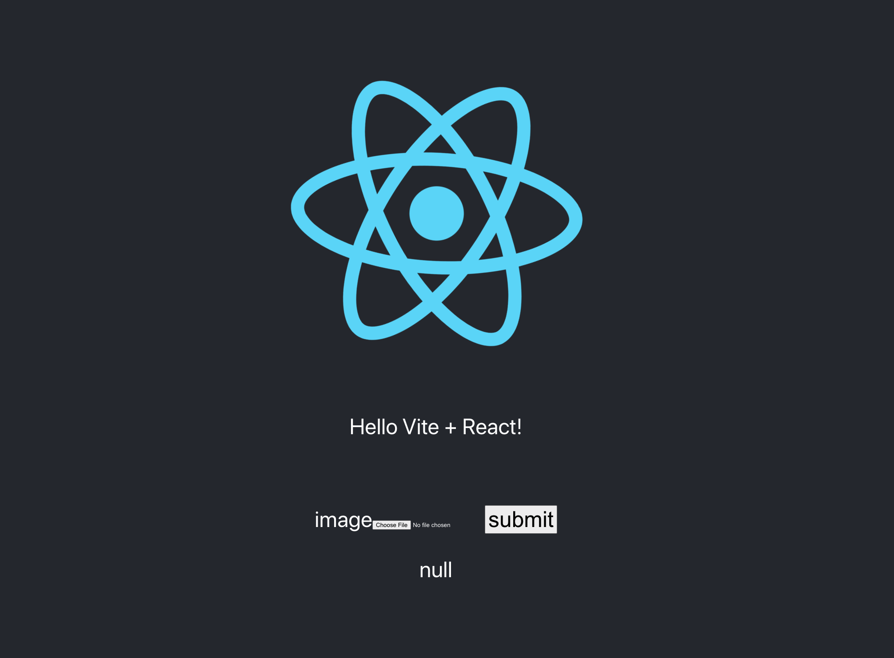

Twitter のアイコンが本人とかなり乖離してきたため、職場の人に「え、誰ですか？」と言われることが多々あり、そろそろアイコンを変えようかなと思っていました。でもアイコンを変えると認識できなくなると思ったので、少しずつアイコンにモザイクをかけていこうと思い、モザイクツールを自作していました。自作しなくても既存のツールがあるのではと思うかもしれませんが、車輪は再発明するものなので再発明しました。ただ車輪の再発明とは言っても、Wasm で動作（=クライアントで加工してくれるからサーバーに送らなくていいし Web で使える）という点では比較的新しい車輪の再発明な気がしています。

それがこの [umie](https://sadnessojisan.github.io/umie/) です。ファイル選択して送信するとこのようにモザイクをかけられます。


ちなみに umie というのは神戸に umie mosaic という商用施設があって、そこから名前をとっています。


<https://www.harborland.co.jp/harborland-night/>

ちなみに OGP は失敗したモザイクです。ピクセルの平均値をとる処理を間違えた。

## 要件

ということで今回のモザイクのために洗い出した要件はこちらです。

- モザイクをかけられる
- Web で使える
- （可能であればパラメータを可変にできる）

そうすると、意外と Wasm という選択肢がありに見えてきたので、まずはモザイクツールを作り、それを Wasm として呼び出せるように編集し、JS 世界に引き渡すようにしました。

## セットアップ

Wasm に吐き出せる言語ということで、ここは Rust を選択しました。
画像変換を行うモジュール、それを CLI として検証するツール、Wasm にビルドするモジュールが必要になったので、cargo-workspace で作業をしました。

```toml
[workspace]
members = ["packages/*"]
```

packages 配下は、`packages/core`, `packages/cli`, `packages/web` となっています。core は library crate で、それ以外は binary crate です。

## ライブラリは使うべきか

モザイク処理はピクセルの RGB 平均を取る必要があるため、画像からピクセルを抜き出す方法が必要です。当初の予定は 0 deps でやるつもりでしたが、PNG パーサーなどを調べているとちょっと大変なことが分かったので、ここは image-rs というクレートを使用しました。これにはバッファ列を RGB に変換する機能があったので使います。

FYI: https://github.com/image-rs/image

## モザイク処理

### モザイク処理のアルゴリズム

モザイク処理は意外と簡単です。詳しいやり方は「モザイク C++」 などでぐぐると出てくるでしょう。

FYI: https://qiita.com/tomoya_matsuyama/items/a5292772a607e2b81a08#%E3%83%A2%E3%82%B6%E3%82%A4%E3%82%AF

大まかに説明すると、画像は RGB のピクセルの集合として見れますが、このときあるピクセルの周囲 n マスを、その n マスの RGB 平均値の色で置き換えることでモザイクを実装できます。

実装としては画像の幅と高さそれぞれの走査の中でブロックごとの処理を行う必要があり、その処理では各ブロックのピクセルの平均を作るためにブロックサイズ分の幅と高さの走査が必要になり、４重ループを作れば処理が可能です。

```rust
pub fn mosaic(img: ImageBuffer<Rgba<u8>, Vec<_>>, width: u32, height: u32) -> Vec<u8> {
    let block_size: u32 = 32;
    for h in (0..height).step_by(block_size as usize) {
        for w in (0..width).step_by(block_size as usize) {
            let mut r_sum: u32 = 0;
            let mut g_sum: u32 = 0;
            let mut b_sum: u32 = 0;
            let mut a_sum: u32 = 0;
            let mut safe_area_x = 0;
            let mut safe_area_y = 0;
            for y in 0..block_size as u32 {
                if height <= h + y as u32 {
                    break;
                }
                safe_area_y = y as u32 + 1;
                for x in 0..block_size as u32 {
                    if width <= w + x as u32 {
                        break;
                    }
                    r_sum += img.get_pixel(w + x, h + y).0[0] as u32;
                    g_sum += img.get_pixel(w + x, h + y).0[1] as u32;
                    b_sum += img.get_pixel(w + x, h + y).0[2] as u32;
                    a_sum += img.get_pixel(w + x, h + y).0[3] as u32;
                    safe_area_x = x + 1;
                }
            }

            for y in 0..safe_area_y {
                for x in 0..safe_area_x {
                    img.put_pixel(
                        w + x,
                        h + y,
                        Rgba([
                            (r_sum / (block_size * block_size)) as u8,
                            (g_sum / (block_size * block_size)) as u8,
                            (b_sum / (block_size * block_size)) as u8,
                            (a_sum / (block_size * block_size)) as u8,
                        ]),
                    )
                }
            }
        }
    }
    img.as_bytes().to_vec()
}
```

たくさんキャストしているのは、RGB 値は 255 までなので u8 におさまるものの、平均値を作る過程で u8 を超えるためしかたなくキャストしています。

また、もっと簡単なモザイクもあり、画像を引き伸ばして元のサイズに戻すというやり方もありますが、これは画質を落としているだけで面白味がなかったので今回は採用しませんでした。

### インターフェースを考える

[image-rs](https://github.com/image-rs/image) には

```rust
let img = image::open("tests/images/jpg/progressive/cat.jpg").unwrap();
```

のようにパスから画像を作る機能があります。

我々は今回はこの方法を取ることができません。なぜなら Wasm から使わせることを考えたときファイルシステムには頼れないからです。
Wasm とのやりとりを考えると、バッファ列から作る方法を考慮する必要が生まれます。

幸にも ImageBuffer に `from_raw` という指定があるのでこれを使うのが良いでしょう。
（注意: 拡張子指定がないことから File Blob を渡されることを期待しているのではなく、すでに RGB のピクセルの配列に変換されたものを渡されることを期待している！これが後に Web 側で File の Blob のバッファ列を送るのではなく、canvas 経由で ImageData.data の ClampedUint8Array を送らないといけないという事情につながってくる。ここでめちゃくちゃ時間を溶かした。悲しい。)

```rust
pub fn exec(buf: Vec<u8>, width: u32, height: u32) -> Vec<u8> {
    let mut img: ImageBuffer<Rgba<u8>, Vec<_>> = ImageBuffer::from_raw(width, height, buf).unwrap();
    mosaic(img, width, height)
}
```

## CLI

このコア部分があっているか確かめるために、CLI を用意します。

```rust
use image::{io::Reader as ImageReader, GenericImage, GenericImageView, ImageFormat, Rgba};
use std::{fs::File, io::BufReader};

use umie::exec;
fn main() {
    let path = "./umie-cli/src/test.png";
    let path = File::open(path);
    let buf = BufReader::new(path.unwrap());
    let img = ImageReader::open_from_buf(buf, Some(ImageFormat::Png))
        .unwrap()
        .decode()
        .unwrap();
    let width = img.width();
    let height = img.height();
    let vec = img.as_bytes().to_vec();
    let converted = exec(vec, width, height);
}
```

このとき core 側の exec の中でモザイク画像を保存させるようなコードを書いておけば動作確認ができます。(この辺は core の方を書き換えなくて良いように img を返す関数を作って CLI 側でやってもよかったが、image-rs crate を core 以外にいれたくなかったのでそうした。)

```rust
img.save("./umie/src/new.png");
```

このとき新しい画像が自分のローカルに保存されていたら、動作確認は終了です。

## Wasm 吐き出し

### wasm-pack new

ではこれを wasm として使えるようにします。

```rust
use std::{fs::File, io::BufReader, u8};

use umie::{exec};
use wasm_bindgen::{prelude::*, Clamped};
use web_sys::{window, Blob, Event};

// When the `wee_alloc` feature is enabled, this uses `wee_alloc` as the global
// allocator.
//
// If you don't want to use `wee_alloc`, you can safely delete this.
#[cfg(feature = "wee_alloc")]
#[global_allocator]
static ALLOC: wee_alloc::WeeAlloc = wee_alloc::WeeAlloc::INIT;

#[wasm_bindgen]
pub fn mosaic(buf: Clamped<Vec<u8>>, w: u32, h: u32) -> Vec<u8> {
    console_error_panic_hook::set_once();
    let converted = exec(buf.0, w, h);
    converted
}
```

これは wasm-pack をローカルで `wasm-pack new` して作られる Rust ファイルを少しいじって umie/core を呼び出すようにしただけです。

### テンプレートは使わない

また web 用のテンプレート (HTML や webpack の設定もいっしょに吐き出してくれるやつ)を使わなかった理由があり、それは

- form 送信なども Rust で管理させるような世界観で初期化される
- form などの管理は React で行いたい
- 中途半端に生成された webpack の設定に React や TS の設定を盛り込んでいくのがめんどくさい

というものです。

Wasm はコアの処理だけを export して JS 側はその関数だけを使うといったことができるので、UI などは React で作り、モザイク処理だけ Wasm を使うようにします。

## JS の世界

webpack のテンプレートを使わなくて済むので、ビルド環境に余裕ができました。ここでは vite を使って環境構築します。なお、Web 側のコードは cargo workspace の外にあって問題ないので、packages の外に出します。

といってもここはいつもの JS の世界なのですることは簡単。

```
npm create vite@latest
```

で、React と TypeScript を指定すればいい。

そして、wasm モジュールを配置する。そのために packages/web をビルドします。

```
wasm-pack build --target web
```

こうすると、pkg フォルダができるので、これを Web アプリ側にコピペして配置します。

そしてそれを JS から呼び出します。

```ts
import { FormEvent, useCallback, useEffect, useRef, useState } from "react";
import logo from "./logo.svg";
import init, { mosaic } from "./pkg/umie_web";
import "./App.css";

...
```

## バッファ列を通して wasm モジュールと通信

さて、ではモザイク処理をしよう。
まずモザイク処理には画像のバッファ列が必要なのでそれを作る必要があります。

バッファ列は canvas を経由して得ることにします。
そのためにまずは canvas に書き込むための画像をフォームから読み込みます。

```ts
e.preventDefault();
const elem = document.getElementById("file");
if (elem === null) {
  alert("画像が選択されていません");
  return;
}
const image = new Image();
const file = elem.files[0];
const reader = new FileReader();
reader.addEventListener("load", (event) => {
  image.src = event.target?.result;
});
image.onload = function () {
  const result = {
    width: image.width,
    height: image.height,
  };

  setNatImage(image);
  setDimension(result);
};
reader.readAsDataURL(file);
```

そして、React の state を経由して画像を読み込み、canvas に書き込み、canvas から buffer 列を取得します。

```ts
canvasRef.current
  ?.getContext("2d")
  ?.drawImage(natImage, 0, 0, dimension.width, dimension.height);
const imageData = canvasRef.current
  ?.getContext("2d")
  ?.getImageData(0, 0, dimension.width, dimension.height);
```

ここで疑問に思うかもしれないが、UInt8Array や Blob を使っていないです。
これには理由があり、<https://github.com/image-rs/image/issues/1610#issuecomment-965829105> にある通り、image-rs の制約で file blob ではなく [ImageData.data](https://developer.mozilla.org/en-US/docs/Web/API/ImageData/data) を使う必要があり、その取得は canvas を経由するのが一般的であるからです。

全体はこうなります。

```ts
import { FormEvent, useCallback, useEffect, useRef, useState } from "react";
import logo from "./logo.svg";
import init, { mosaic } from "./pkg/umie_web";
import "./App.css";

function App() {
  const [dimension, setDimension] = useState<{
    width: number;
    height: number;
  } | null>(null);
  const [natImage, setNatImage] = useState<HTMLImageElement>();

  const canvasRef = useRef<HTMLCanvasElement>(null);
  const forNewRef = useRef<HTMLCanvasElement>(null);
  useEffect(() => {
    init();
  }, []);

  const [converted, setConverted] = useState<ImageData | null>(null);

  const handleSubmit = useCallback(
    (e: FormEvent<HTMLFormElement>) => {
      e.preventDefault();
      const elem = document.getElementById("file");
      if (elem === null) {
        alert("画像が選択されていません");
        return;
      }
      const image = new Image();
      const file = elem.files[0];
      const reader = new FileReader();
      reader.addEventListener("load", (event) => {
        image.src = event.target?.result;
      });
      image.onload = function () {
        const result = {
          width: image.width,
          height: image.height,
        };

        setNatImage(image);
        setDimension(result);
      };
      reader.readAsDataURL(file);
    },
    [dimension]
  );

  useEffect(() => {}, [dimension]);

  useEffect(() => {
    if (natImage === undefined) return;
    if (dimension === null) return;
    canvasRef.current
      ?.getContext("2d")
      ?.drawImage(natImage, 0, 0, dimension.width, dimension.height);
    const imageData = canvasRef.current
      ?.getContext("2d")
      ?.getImageData(0, 0, dimension.width, dimension.height);

    if (imageData === undefined) {
      return;
    }
    const converted = mosaic(imageData.data, dimension.width, dimension.height);

    const convertedImageData = new ImageData(
      new Uint8ClampedArray(converted.buffer),
      dimension.width
    );
    forNewRef.current?.getContext("2d")?.putImageData(convertedImageData, 0, 0);
  }, [converted, dimension, natImage]);

  return (
    <div className="App">
      <header className="App-header">
        
        <p>Hello Vite + React!</p>
        <p></p>
        <form onSubmit={handleSubmit}>
          <label htmlFor="file">image</label>
          <input type="file" id="file" />
          <button>submit</button>
        </form>
        <p>{JSON.stringify(dimension)}</p>
        <canvas
          ref={canvasRef}
          width={dimension?.width}
          height={dimension?.height}
        ></canvas>
        <canvas
          ref={forNewRef}
          width={dimension?.width}
          height={dimension?.height}
        ></canvas>
      </header>
    </div>
  );
}
```

そしてこれをビルドすると、ローカルでこのように動きます。



## ビルドワークフローの構築

さて、これでローカルでは動く分けですがわざわざ wasm モジュールをコピペしたりした手順が面倒です。それに vite は cargo workspace の外にいるからビルドコマンドが通らなかったり、そもそも wasm module は wasm-pack が必要なのでこれも cargo workspace の世界から外れています。（厳密には cargo から wasm32-unknown-unknown にビルドすればモジュールは手に入るが、型定義ファイルは吐かないので使い辛い）

### cargo make

そこで、ビルドワークフローを作りましょう。ここで使うのは [cargo-make](https://github.com/sagiegurari/cargo-make) という cargo-workspace に親和性のある make です。

こういう風にタスクを書いて

```toml
[tasks.format]
install_crate = "rustfmt"
command = "cargo"
args = ["fmt", "--", "--emit=files"]

[tasks.build]
command = "cargo"
args = ["build"]

[tasks.test]
command = "cargo"
args = ["test"]

[tasks.my-flow]
dependencies = [
    "format",
    "build",
    "test"
]
workspace = false
```

```
cargo make --makefile Makefile.toml my-flow
```

などのようにすれば動きます。

ローカルでの動作確認をしたいのなら

```toml
[tasks.build-wasm]
script_runner = "@shell"
script = '''
cd packages/umie-web
wasm-pack build --target web
'''
workspace = false

[tasks.cp-wasm]
script_runner = "@shell"
script = '''
cp -r packages/umie-web/pkg site/src
'''
workspace = false
dependencies = ["build-wasm"]

[tasks.npm-install]
script_runner = "@shell"
script = '''
cd site
npm install
'''
workspace = false

[tasks.run-web]
script_runner = "@shell"
script = '''
cd site
npm run dev
'''
workspace = false
```

のようなワークフローを作れば良いです。

### GitHub Actions

そしたらあとは、wasm モジュールを生成して、それを vite でビルドするフローを GHA 上に移すだけです。
ただ GHA 上では cargo make を使わなくても、GHA の working-directory でお茶を濁せることに気づいたので使っていません。

Rust 世界のビルドと JS 世界のビルドがあるので、wasm モジュールは Artifact を経由させワークフローを分けて定義します。

```yml
on: [push]

name: CI

jobs:
  build_wasm:
    name: Rust project
    runs-on: ubuntu-latest
    steps:
      - uses: actions/checkout@v2
      - uses: actions-rs/toolchain@v1
        with:
          toolchain: stable
      - run: curl https://rustwasm.github.io/wasm-pack/installer/init.sh -sSf | sh
      - run: wasm-pack build --target web
        working-directory: packages/umie-web
      - name: Archive code coverage results
        uses: actions/upload-artifact@v3
        with:
          name: wasm
          path: packages/umie-web/pkg
  use_wasm:
    name: use wasm
    needs: build_wasm
    runs-on: ubuntu-latest
    steps:
      - uses: actions/checkout@v2
      - name: Use Node.js
        uses: actions/setup-node@v3
        with:
          node-version: 18
      - name: Download math result for job 2
        uses: actions/download-artifact@v3
        with:
          name: wasm
          path: site/pkg
      - run: mv pkg/ src/
        working-directory: site
      - run: npm install
        working-directory: site
      - run: npm run build
        working-directory: site
      - name: Deploy
        uses: peaceiris/actions-gh-pages@v3
        with:
          github_token: ${{ secrets.GITHUB_TOKEN }}
          publish_dir: site/dist
```

こうすればデプロイが完了します。

<https://sadnessojisan.github.io/umie/>
