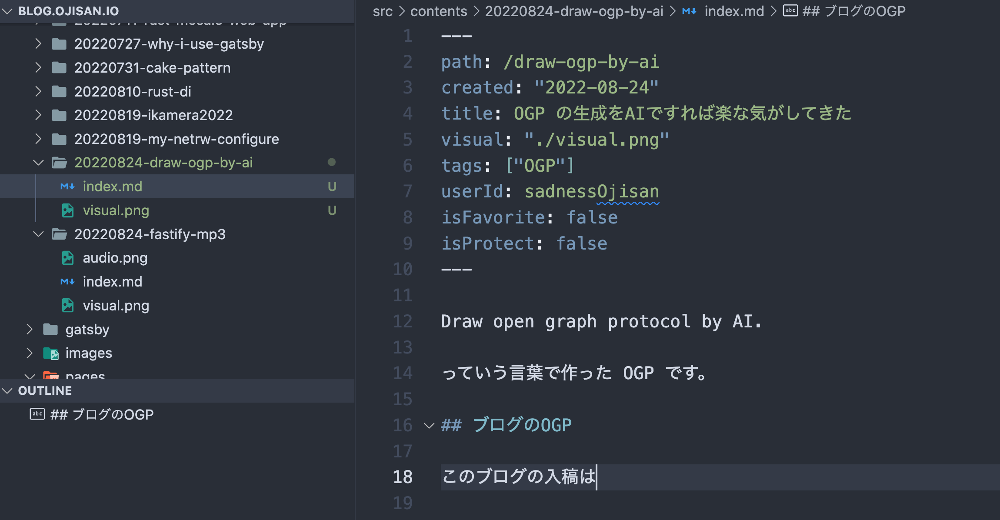
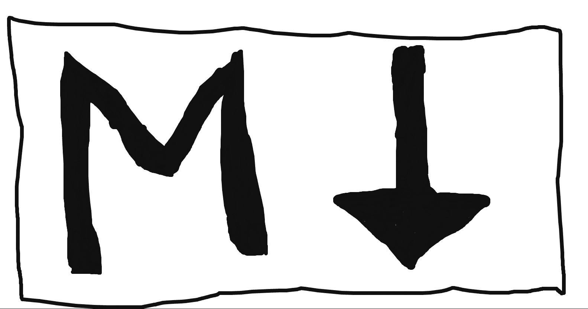
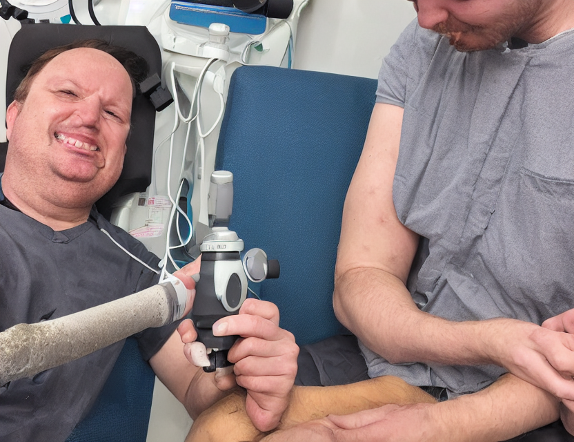
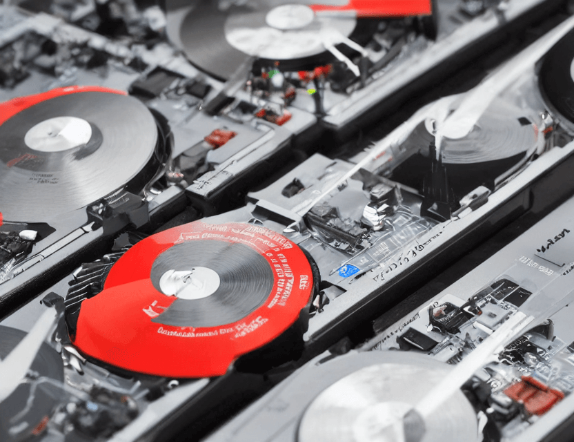

この OGP は "Draw open graph protocol by AI." っていう言葉で作った OGP だ。graph に引っ張られすぎだろ...

## ブログの OGP

このブログの入稿は  のようにフォルダに visual.png という名前でフォルダに保存して、

```yaml
---
path: /draw-ogp-by-ai
created: "2022-08-24"
title: OGP の生成をAIですれば楽な気がしてきた
visual: "./visual.png"
tags: ["OGP"]
userId: sadnessOjisan
isFavorite: false
isProtect: false
---
```

の visual でパスを visual.png に指定すれば適用できるようになっている。

なので日頃は **ユーモア** ある画像を入稿するようにしている。

が、最近はそれがめんどくさく感じているときもないこともない。

その結果、[正しく Markdown を書こうと思った](https://blog.ojisan.io/write-normal-markdown/) のように変な画像を入稿せざるをえなくなる。



## AI で生成できることに気づいた

ところで最近、いろいろと AI で画像生成できるサービスが流行りつつある。テキストを与えるとそれ通りの画像を生成してくれるサービスだ。

で、用途がいろいろと議論されているが、そのうちの一つとして OGP 作成の簡略化に使えることに気づいた。

実はいつも著作権を気にして画像を選んだり、アスペクト比調整をしたり結構な手間がかかっていたのである。

それにいま OGP の素材サイトとして canva に月 1000 円払っているので、これは解約できるかもしれない。毎月のラーメン代になるぞ、やったね。

試しに<https://beta.dreamstudio.ai/dream> で [はじめての胃カメラ、感想](https://blog.ojisan.io/ikamera2022/)の OGP を "I experienced gastroscope." で作ると、



になった。もとのいらすとやの画像とは全然違う感じになった。


[mp3 を fastify から返す](https://blog.ojisan.io/fastify-mp3/) も AI で生成した。mp3 からターンテーブルを想定していそうだ。



これは便利なのか...？

## 結局は俺が手で作る OGP が一番では？

それっぽい OGP がすぐできるのは便利だと思った。でも正直なところ、この OGP を超えられるものは AI は作れないと思っている。知らんけど。

[多コピーの原罪](https://blog.ojisan.io/many-copies-original-sin/)


[Cake Pattern で DI してみた](https://blog.ojisan.io/cake-pattern/)


とはいえそれなりのクオリティのものを爆速で作るにはとても便利なので、これから愛用していくと思う。
