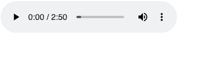

## 実験のセットアップ

とりあえずサーバーが立つようにする

```js
const server = require("fastify")({ logger: true });

server.listen({ port: 8000 }, (err, address) => {
  if (err) {
    console.error(err);
    process.exit(1);
  }
  console.log(`Server listening at ${address}`);
});
```

## ファイルから読み込んだ mp3 をクライアントに返す

ローカルに mp3 ファイルがあるとして、そのファイルをクライアントに返すとする。

```js
const server = require("fastify")({ logger: true });
const fs = require("fs");
const path = require("path");

server.get("/", async (request, reply) => {
  const mp3 = fs.readFileSync(path.join(__dirname, "./hello.mp3"));
  reply.send(mp3);
});
```

このようにファイルをサーバーに send するだけで良い。
これはバイナリを返している。
バイナリを返せるようにするためには、send に Buffer 列を渡す必要がある。
ありがたいことに readFileSync の戻り値は Buffer 列なのでそのまま利用する。

## API から取得した mp3 をクライアントに返す

では、その mp3 が API 経由で手に入ることを考えてみよう。BFF を作っている時はこのユースケースはあるのではないだろうか。
さきほど作った API を mp3 を取得するための API として利用してみよう。

```js
server.get("/file", async (request, reply) => {
  const res = await fetch("http://127.0.0.1:8000");
  const data = await res.arrayBuffer();
  reply.send(Buffer.from(data));
});
```

Buffer を返す必要があるので、それをどうにかして作る必要がある。
なので API から帰ってきたレスポンスを arrayBuffer に変換して、それを Buffer.from で buffer に詰め替えるとよい。

このエンドポイントはアクセスするとファイルが DL される。ただファイル名は適当なものになっている。それは `content-disposition` で指定できる。

```js
server.get("/file", async (request, reply) => {
  const res = await fetch("http://127.0.0.1:8000");

  const data = await res.arrayBuffer();
  reply.type(data.type);
  reply.headers({
    "content-disposition": "attachment; filename=aaa.mp3",
    "Accept-Ranges": "bytes",
  });
  reply.send(Buffer.from(data));
});
```

## audio 要素から参照する

先ほどのコードで、http://localhost:8000/file で音声ファイルが手に入るようになっている。実際にここにアクセスするとバイナリが降ってくる。この URL は audio タグの src に渡すと作動する。

```js
server.get("/html", async (request, reply) => {
  reply.type("text/html");
  reply.send(
    "<html><body><audio src='http://127.0.0.1:8000/file' controls /></body></html>"
  );
});
```

send した文字列を HTML として解釈してほしいので、content type に text/html をつけておく。
こうすると、きちんと audio 要素が表示される。



## audio をシークできない

さて、この audio 要素だが、シークバーを動かしてみるとわかるが、動かすたびに開始位置に戻る。
これは range request に対応していないからである。
対応するためにはバイナリを返すときに `"Accept-Ranges": "bytes"` をヘッダにつける必要がある。

```js
server.get("/file", async (request, reply) => {
  const res = await fetch("http://127.0.0.1:8000");

  const data = await res.arrayBuffer();
  reply.type(data.type);
  reply.headers({
    "content-disposition": "attachment; filename=aaa.mp3",
    "Accept-Ranges": "bytes",
  });
  reply.send(Buffer.from(data));
});
```

range request についてはそのうち記事を書こうと思っているので、そこで解説する。（多分）

## 補足: SSR 時にバイナリを埋め込みたい。けどやめた方がよかった。

いま fastify のエンドポイントから返していたが、これを Next でやるとどうなるだろうか。 API Routes 経由からでは同じようにできるであろうが、SSR だけでするときはどうすればいいか。

いろいろ考えた結果、Base64 に変換して SSR 時に埋め込んでみた。

```tsx
<audio src={`data:audio/wav;base64,${props.dataUrl}`} />

export const getServerSideProps: GetServerSideProps<Props> = async (ctx) => {
    ...

    const res = await fetch('hoge');
    const blob = await res.arrayBuffer();
    const dataUrl = Buffer.from(blob).toString("base64");

    return {
        props: {
            dataUrl
        }
    }
}
```

audio タグは base64 したデータに`data:audio/wav;base64,` を追加すると再生できる。

これでうまくいくように思えるし実際うまくいくのだが、Base64 化することでデータサイズは増えるし、Range Request にも対応しないのでデータそのものが SSR 時に降ってくるので動作が重たくなる。なので、普通にバイナリを返すエンドポイントを生やしてそこをみるようにしよう。
