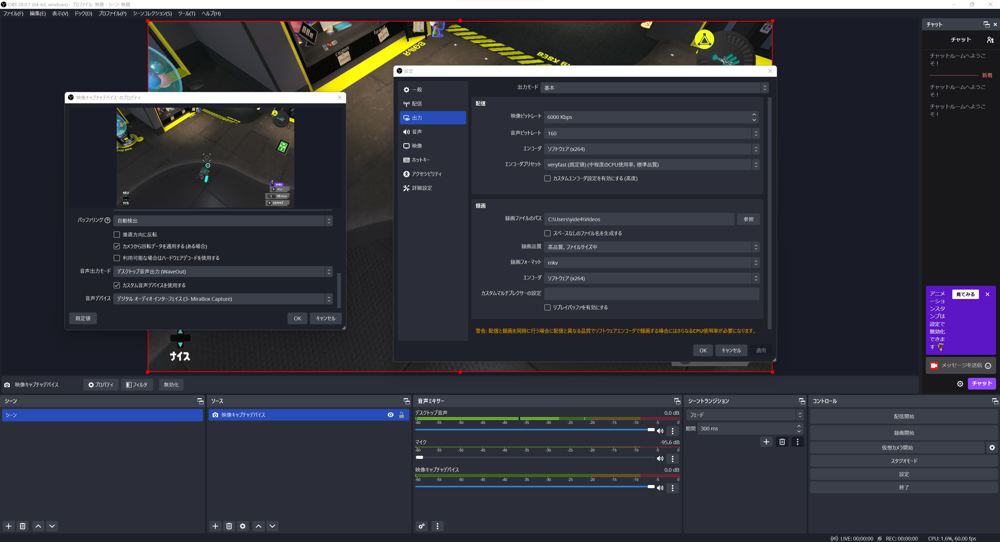
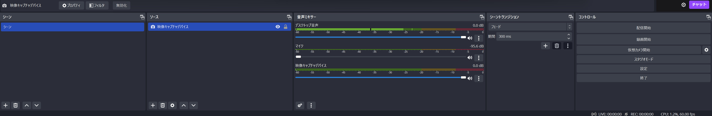

## スプラトゥーンをうまくなりたい

スプラトゥーン 2 は 3 年ほど遊んでプレイ時間 1400 時間でウデマエが S+0 が限界でした。
ゲームをつけっぱなしにしていたので実際はそんなに遊んでいないとは思いますが、それでも 1000 時間は遊んでいたと思います。
ただそれだけ遊んでもウデマエは X になりませんでした。
これはとても悔しくて、3 では最高位までウデマエを上げたいなと思っていました。

## キャプチャーボードを買った

そんなときスプラトゥーン上達の方法としてキルされたときに switch の録画機能で録画して反省文を書く練習方法を教えてもらいました。これいいなと思ったので、あとから動画を見返すために無限のストレージである Youtube にあげるべく、switch のプレイを録画するためのキャプチャーボードを買いました。

Amazon で調べたところハイエンド品は 20,000 円ほどしましたが、安物だとセールで 3,000 円くらいで変えました。

<https://amzn.asia/d/jkkKUPH>

試してみたところ画質も音質もそこまで悪くないです。

<iframe src="https://www.youtube.com/embed/XAh6usExtJ0" style="top: 0; left: 0; width: 100%; height: 100%; position: absolute; border: 0;" allowfullscreen scrolling="no" allow="accelerometer; clipboard-write; encrypted-media; gyroscope; picture-in-picture;"></iframe>

## OBS の設定

キャプチャーボードをつないだ先の PC では録画するためのソフトが必要になるのですが、それが OBS です。設定方法に最初は苦労したのでいまの設定を載せておきます。

設定方法はソースに映像キャプチャデバイスを指定すれば、配信もしくは録画ボタンで録画できます。

注意点としては、音声も録画する場合は switch からではなく PC まで音を通してから、PC にイヤホンを繋いで音を聞く必要があります。そうしないと録画には音が入りません。さらに音を聞くときにはカスタム音声デバイスの利用にチェックを入れ、音声出力モードはデスクトップ音声出力（WaveOut）に設定します。そして、音声ミキサーではマイク入力を０にします。そうしないとデスクトップ音声と音が重なって割れたような音が聞こえます。またエンコーダはソフトウェアに変更します。ハードウェアを指定していると GPU が積んである前提となり、パソコンによってはエラーが発生します。

このような設定画面になることを目指してください。

これらのポップアップはソースの映像キャプチャをダブルクリック、もしくはコントロールの設定ボタンを押すと開く設定画面です。

## これから

3 の動画をたくさん撮って反省会をたくさんします。反省会用のシステムを作ろうかなとも画策しています。デスシーンに反省文を投稿できて、後から死因やステージやブキなどで検索できるようなものを考えています。ただ、それをするにはそのデータを保存するための DB サーバーを作るところからやりたくて先が長そうです。（さくら VPS が一つ余っている + Firestore 飽きた）
