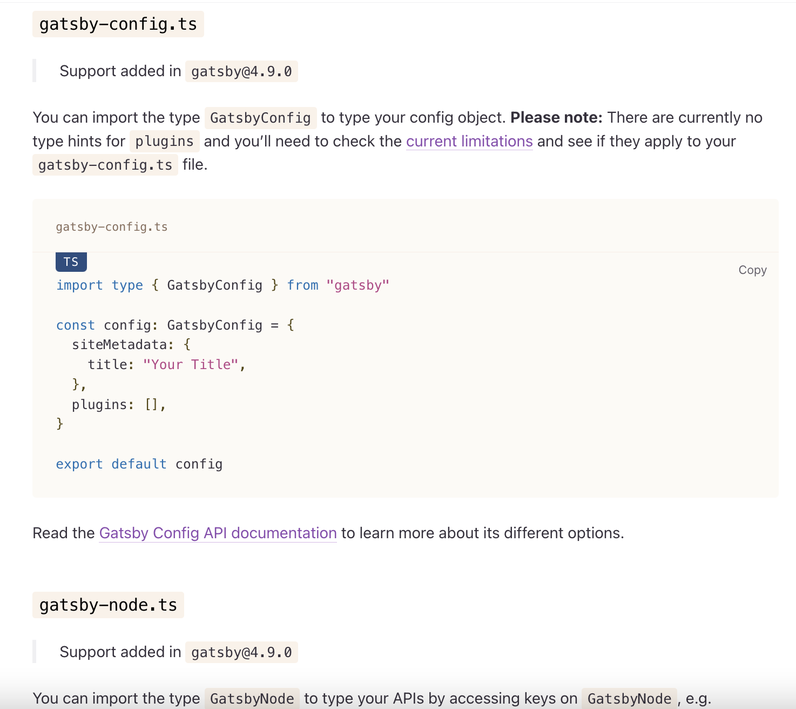

## これまでの TS 化

[Gatsby.js を完全 TypeScript 化する](https://qiita.com/Takepepe/items/144209f860fbe4d5e9bb#gatsby-nodejs-%E3%82%92-ts%E5%8C%96%E3%81%99%E3%82%8B) などでも紹介されているが(これを参考にして実装した記憶がある)、この[ブログでも実装](https://github.com/sadnessOjisan/blog.ojisan.io/blob/16e71efc3af0f85c3b9f980b72892b2a9c1be70d/src/gatsby/gatsby-node.ts)しているように、設定自体は TS で行って、[実行時に ts-node で無理やり動かす](https://github.com/sadnessOjisan/blog.ojisan.io/blob/16e71efc3af0f85c3b9f980b72892b2a9c1be70d/gatsby-node.js) として実現していた。

## 公式による設定ファイルの TS サポート

それが Gatsby v4.9 から `*.ts` での設定自体が可能となった。



FYI: https://www.gatsbyjs.com/docs/how-to/custom-configuration/typescript/

肝心の型付けは簡単で、`GatsbyConfig` や `GatsbyNode` といった型が gatsby から export されているので、それを export する関数につけるだけで良い。

## 注意点

おっちょこちょいな人は注意だが、もし `gatsby-node.ts` 内で graphql を呼ぶ場合は gatsby から呼ばないようにしよう。 TS 環境であれば `gatsby` 関数が自動補完されて gatsby モジュールから import されてしまうこともある。必ず引数から取得するようにしよう。

```ts
export const createPages: GatsbyNode["createPages"] = async ({
  actions,
  graphql,
}) => {
  const { createPage } = actions;
  const result = await graphql<Queries.PaginationQueryQuery>(`
    query PaginationQuery {
      allMarkdownRemark(
        sort: { fields: [frontmatter___created], order: DESC }
        limit: 1000
      ) {
        nodes {
          frontmatter {
            path
          }
        }
      }
    }
  `);

  console.log(result);
};
```

もし gatsby から取得した場合、

```
ERROR #11321  PLUGIN

"gatsby-node.js" threw an error while running the createPages lifecycle:

> 1 | !function(e,r,n,t,o){var i="undefined"!=typeof globalThis?globalThis:"undefined"!=typeof self?self:"undefined"!=typeof window?window:"undefined"!=typeof
global?global:{},u="function"==typeof i.parcelRequiredbc1&&i.parcelRequiredbc1,f=u.cache||{},c="undefined"!=typeof module&&"function"==typeof
module.require&&module.require.bind(module);function l(r,n){if(!f[r]){if(!e[r]){var t="function"==typeof i.parcelRequiredbc1&&i.parcelRequiredbc1;if(!n&&t)return t(r,!0);if(u)return
...
    |
                                                                                              ^

File: .cache/compiled/gatsby-node.js:1:1512

Error: It appears like Gatsby is misconfigured. Gatsby related `graphql` calls are supposed to only be evaluated at compile time, and then compiled away. Unfortunately, something went wrong and the query was left in the compiled code.

Unless your site has a complex or custom babel/Gatsby configuration this is likely a bug in Gatsby.
```

といった仰々しいエラーを目にすることになる。

実は gatsby モジュールの graphql 関数はクライアント専用の関数であり、gatsby-node.js では使えないことを覚えておこう。それに、gatsby-node.js の例に出てくる

```ts
graphql(`{
    ...
}`);
```

のような使い方ではなく、

```ts
graphql`
    ...
`;
```

といった使い方を要求されるので、型エラーも起きたりする。見逃さないように。
