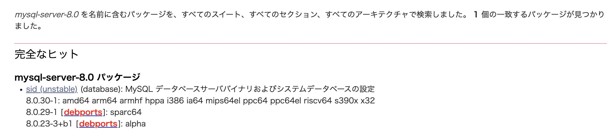

## はじめに

どこかから、

```
RUN apt-get update && \
	apt-get install -y mysql-server python3 python3-pip && \
	pip3 install awscli && \
	apt-get autoremove -y && \
	apt-get remove -y python3-pip && \
	apt-get clean && \
	rm -rf /var/lib/apt/lists/* /tmp/* /var/tmp/*
```

というコードを拾ってきたので動かそうとしていた。

ただ最近の Docker イメージは slim というのを使えばいいと何かで見たので、`FROM debian:stable-slim` を指定して docker build してみたらどうもビルドに失敗する

```
 => CACHED [1/4] FROM docker.io/library/debian:stable-slim  0.0s
 => ERROR [2/4] RUN apt-get update &&  apt-get install -y   4.0s
------
 > [2/4] RUN apt-get update &&  apt-get install -y mysql-server python3 python3-pip &&   pip3 install awscli &&  apt-get autoremove -y &&         apt-get remove -y python3-pip &&        apt-get clean &&         rm -rf /var/lib/apt/lists/* /tmp/* /var/tmp/*:
#0 0.965 Get:1 http://deb.debian.org/debian stable InRelease [116 kB]
#0 1.494 Get:2 http://deb.debian.org/debian-security stable-security InRelease [48.4 kB]
#0 1.987 Get:3 http://deb.debian.org/debian stable-updates InRelease [44.1 kB]
#0 1.999 Get:4 http://deb.debian.org/debian stable/main arm64 Packages [8071 kB]
#0 2.622 Get:5 http://deb.debian.org/debian-security stable-security/main arm64 Packages [183 kB]
#0 3.405 Get:6 http://deb.debian.org/debian stable-updates/main arm64 Packages [4160 B]
#0 3.424 Fetched 8466 kB in 3s (2873 kB/s)
#0 3.424 Reading package lists...
#0 3.666 Reading package lists...
#0 3.878 Building dependency tree...
#0 3.928 Reading state information...
#0 3.938 Package mysql-server is not available, but is referred to by another package.
#0 3.938 This may mean that the package is missing, has been obsoleted, or
#0 3.938 is only available from another source
#0 3.938
#0 3.971 E: Package 'mysql-server' has no installation candidate
------
failed to solve: executor failed running [/bin/sh -c apt-get update &&   apt-get install -y mysql-server python3 python3-pip &&  pip3 install awscli &&   apt-get autoremove -y &&        apt-get remove -y python3-pip &&         apt-get clean &&        rm -rf /var/lib/apt/lists/* /tmp/* /var/tmp/*]: exit code: 100
```

## mysql-server がない

mysql-server と言われるのだが流石にそんな訳はないはずである。で、調べていると <https://qiita.com/azu369yu/items/81cd67a88d074c3d3d88> を見ていると、[mysql-defaults](https://packages.debian.org/source/buster/mysql-defaults) を見て目的のパッケージを探せそうなことがわかった。

結論から言うと debian:stable-slim に対応する package が無いようである。

## Debian のバージョンについて

[Debian のリリース](https://www.debian.org/releases/index.ja.html)は 安定版、テスト版、不安定版がある。安定版は buster, stretch, jessie などのコードネームがついており、いまのコードネームは buster だ。一方で不安定版は常に sid と呼ばれる。

いま使っているコンテナイメージは `debian:stable-slim` なので buster である。

## buster の MySQL server

mysql-server 　のパッケージ一覧から buster を選択してみると、


mysql-server という名前でなく、該当のものは default-mysql-server という名前であることがわかる。

<https://packages.debian.org/source/buster/mysql-defaults>

なので、入れるべき名前は default-mysql-server であるというオチだった。

ちなみに mysql-server を見てみると、sid なら入るようだ。

<https://packages.debian.org/search?keywords=mysql-server-8.0>


