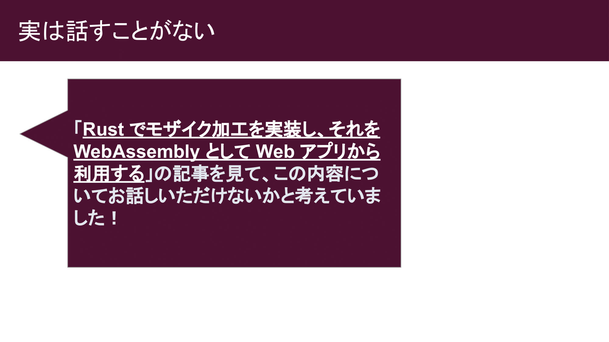
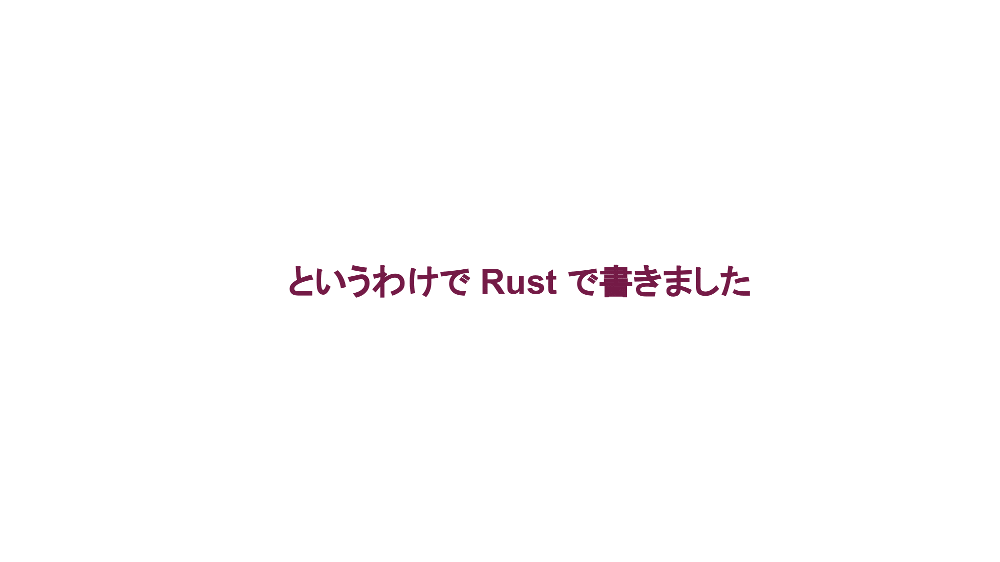

すみません！まだスライドできてないです。途中状態です。帰ったら続き書きます！

こんにちは、sadnessOjisan です。おじさん、おじさんさんなどと呼ばれることが多いです。Web 系のエンジニアで、普段は React や NodeJS を書いています。blob.ojisan.io というブログも書いていて技術や料理の話をしています。よければ読んでみてください。

Umie というモザイクツールを作りました。ただのモザイクツールですが、ウェブ上で動きます。実はウェブ上でモザイクをかけられるツールは意外となくて、出先でモザイクをかけたいときに欲しくなって作りました。Wasm 実装です。

ちなみに Umie という名前は神戸モザイクから取っています。

さて、今日ここにきた理由ですが、以前ブログに「Rust でモザイク加工を実装し、それを WebAssembly として Web アプリから利用する」というブログを書いたことがあって、それを読んでのお誘いでした。

で、承諾したのですが、何を話すかはかなり悩んでいまして、というのも Wasm 使わなくてもいいような内容だし、実は CSS でも実現できてしまいます。

そこで、おそらく普段 Wasm など触れない方や興味がある方が集まっていると思ったので、Rust や Wasm そのものの話をしつつ、作ったものの紹介ができたらいいなと思います。

MDN からの説明をそのまま持ってきただけですが、wasm とは
MDN によると

WebAssembly は現代のウェブブラウザーで実行できる新しい種類のコード

ネイティブに近いパフォーマンスで動作

C/C++、C# や Rust などの言語のコンパイル先

JavaScript と並行して動作するように設計されている

ものです。

Wasm の出力には Rust を使います。

Rust 言語は mozilla が作ったプログラミング言語です。
各種ネイティブ環境と Wasm に対してコンパイルができます

特徴としては GC がないこと、代わりに borrow checker というものを使ってメモリの安全性を保証します。

ただそれら特徴はフロントエンドから見るとあまり恩恵をうけないかもしれません。そこでフロントエンドエンジニアからみた嬉しさを紹介します。

まず Rust にはプログラミング言語それ自体に Result や Option が組み込まれています。

Result や Option は失敗するかもしれない、空かもしれないという文脈を表す型です。

これは、例外を投げていた関数に対して、その例外に関する型を付けられるようになるという利点があります。
そのため例外のハンドリングが網羅的にされているかどうかという検査ができるようになります。

この機能が標準ライブラリに入ることで、いろんなライブラリを跨いで Result を扱う関数の組み合わせがしやすくなります。例えば TypeScript では zod の safeParse のような関数が独自の Result を返してくれてはいるのですが、合成や組み合わせは難しいです。

次に紹介するのは式志向です。

式と文があると思います。式は値を返すもの、文は何か処理を行うものです。

Rust は式志向なので if や while も結果が値にできます。

これが何が嬉しいかというと JSX の中に制御構文をそのまま描けるようになります。

次に紹介するのは型のごまかしについてです。

ここでいうごまかしは any , ts-ignore, as などです。
TypeScript は簡単に推論を潰せる
any, @ts-ignore と書くだけでいい
Rust で検査を強行突破するのにも手間がかかる
書けば推論を通せる魔法がない

Rust では外部境界から Rust の世界に入る境界で型が付きます。
SQL, Reqest から Rust の世界に値が来るときに、ライブラリが Deserialize を要求することが多いです。正当な値と型を保証しないとコンパイルが通りません。

型の誤魔化しが難しいので推論結果を信用できると思います。

Rust で書かれた BE は、データソースからルーターまでに到達するデータ・レスポンスは型がついていると考えられます。
そのため OpenAPI Spec や proto や gql の定義通りに値を返すことが保証されています。
ちなみに言語によってはスキーマ駆動でしても、スキーマを無視した実値を返すのを稀によく見ます。
そういう経験があるからこそ、Rust が好きです。

僕が Rust が好きな理由はパフォーマンスではありません。むしろパフォーマンス的な使っておらず、Rust の良さを殺す使い方をしています。それでも Rust が好きです。

それは、JS / TS より機能が多く、制約が強いから、式指向、Result, match が欲しいといった理由です。

