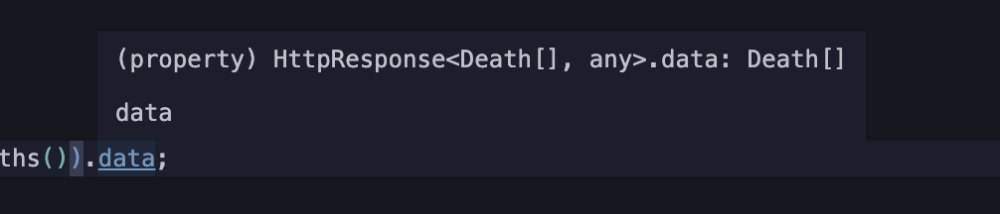

Django から Swagger で吐きたいというニーズは Django で API を作っている時であろう。
そのときに使われるライブラリに [Django REST framework](https://www.django-rest-framework.org/) があるが、このライブラリ自体に Swagger を生成する機能が含まれている。
それを使えばおしまいと思ったがそうではなかったので困ったことと対策をまとめていく。

## 前提

ライブラリはこのバージョンで検証している。

```
Django==4.1.1
djangorestframework==3.13.1
```

DRF を前提とするので Django にもその設定が済んでいる前提。

(setting.py)

```py
INSTALLED_APPS = [
    'src.apps.SrcConfig',
    'rest_framework',
    'django.contrib.admin',
    'django.contrib.auth',
    'django.contrib.contenttypes',
    'django.contrib.sessions',
    'django.contrib.messages',
    'django.contrib.staticfiles',
]
```

## DRF 標準の方法

「Django Swagger」 などで調べると DRF に標準で組み込まれていることと、それが generateschema で作れることがわかる。ただスキーマの生成に必要なパッケージはあるので、それを入れる。（入ってなかったら警告が出るはずなので入れよう）

```
pip3 install PyYAML uritemplate
```

そして schema を作ってみる

```
python3 manage.py generateschema
```

schema が表示されたはずだ。

## GUI が欲しい

とはいえ、この schema はただの yaml だ。Swagger といえばやはりクライアントが欲しい。

### オンラインで client を作る

例えば [SwaggerHub](https://swagger.io/tools/swaggerhub/) に yaml をコピペしたり統合すれば GUI が手に入る。
登録するのがめんどくさいということであれば、[swagger-ui](https://github.com/swagger-api/swagger-ui) をセルフホストして利用しても良いだろう。
それもめんどくさいということであれば、ホストされている [Swagger Editor](https://editor.swagger.io/) を使うと良いだろう。
ただしこれは共有できないので自分一人での解決方法だ。

### Django から GUI を吐き出す

ワンショットであれば先ほどのやり方でも良いが、長期的なメンテナンスを考えるのであれば Django に GUI も統合されていたほうが管理の面で都合が良い。
嬉しいことに DRF には Swagger の GUI を生成する方法がある。

#### Schema を静的ファイルとしてホスティング

さきほど generate コマンドで生成したが、その生成したものを routing 上に乗せることができる。

project.config の urls.py の urlpattern にこれを追加するだけだ。

```py
urlpatterns = [
     path('openapi-schema/', get_schema_view(
        title="title",
        description="title",
        version="1.0.0",
        public=True,
        urlconf='project_config.urls', # project_congif という project 名で開発している。
        renderer_classes=[OpenAPIRenderer],
        permission_classes=(permissions.AllowAny,),
    ), name='openapi-schema'),
 ]
```

こうすることで `/openapi-schema`にアクセスすると yaml が降ってくる。

#### schema をもとに GUI 生成

その schema をもとに UI を作り routing する。そのため下記も urlpatterns に追加する。

```py
urlpatterns = [
     path('docs/', TemplateView.as_view(
        template_name='swagger-ui.html',
        extra_context={'schema_url': 'openapi-schema'}
    ), name='swagger-ui')
 ]
```

ここで指定する template はこのようなもので、これは templates/swagger-ui.html として追加する。

```html
<!DOCTYPE html>
<html>
  <head>
    <title>Swagger</title>
    <meta charset="utf-8" />
    <meta name="viewport" content="width=device-width, initial-scale=1" />
    <link
      rel="stylesheet"
      type="text/css"
      href="//unpkg.com/swagger-ui-dist@3/swagger-ui.css"
    />
  </head>
  <body>
    <div id="swagger-ui"></div>
    <script src="//unpkg.com/swagger-ui-dist@3/swagger-ui-bundle.js"></script>
    <script>
      const ui = SwaggerUIBundle({
        url: "",
        dom_id: "#swagger-ui",
        presets: [
          SwaggerUIBundle.presets.apis,
          SwaggerUIBundle.SwaggerUIStandalonePreset,
        ],
        layout: "BaseLayout",
        requestInterceptor: (request) => {
          request.headers["X-CSRFToken"] = "{{ csrf_token }}";
          return request;
        },
      });
    </script>
  </body>
</html>
```

この template は <https://www.django-rest-framework.org/topics/documenting-your-api/#a-minimal-example-with-swagger-ui> から持ってきたものだ。ただの template なので自由に改変できる。
これで GUI が手に入った。

## Swagger Client を作る

ここから DRF とは関係なくなるのだが、Swagger Client を作ろうとすると結果的に DRF 側に手を入れることになったのでその解説をする。
ここでいう Swagger Client とは OpenAPI の Spec からデータの型がつく形で fetch してくれる TypeScript インターフェースである。
具体的には [swagger-typescript-api](https://github.com/acacode/swagger-typescript-api) というライブラリの利用を想定している。

例えば　[下記 1](/#下記1) のような yaml を与えたら[下記 2](/#下記2) のような クライアントが手に入る。

そのおかげで

```ts
const api = new Api();

const deaths = (await api.https.listDeaths()).data;
```

のようなコードを書けて、



といった形で型がつく。

### fetch 先の指定

ここで少し問題がある。実は swagger 生成した schema が /openapi-schema にあると話したが、ここをクライアントの生成元にすると fetch 先が `/api/battles` といったふうになってオリジンサーバーのオリジンが抜け落ちてしまうのである。
もちろん swagger 側にその指定オプションはあって、

```py
urlpatterns = [
     path('openapi-schema/', get_schema_view(
        title="title",
        description="title",
        version="1.0.0",
        public=True,
        url="https://hoge.ojisan.dev",
        urlconf='project_config.urls', # project_congif という project 名で開発している。
        renderer_classes=[OpenAPIRenderer],
        permission_classes=(permissions.AllowAny,),
    ), name='openapi-schema'),
 ]
```

と url 指定をすればこの問題は解決する。

しかしそうすると今度は GUI で URL 一覧の表示に全部オリジンがついて見づらくなったり、また実際にクエリを GUI から発酵した時に例えば localhost で実行した場合は `http://localhost:8080/https://hoge.ojisan.dev/api/battles` のような URL に対してリクエストが送られてしまう。

そのため Client Generator が読む spec file は別の場所に置きたい。

### swagger-typescript-api 用の schema file を生成する

そこでそれ用の schema ファイルを作る。このときに最初に紹介した `python3 manage.py generateschema` が役に立つ。実は --file オプションというのがあり、標準出力をファイルとして保存できるほか、--url オプションで base となる URL の指定もできる。そして django は static/ 配下は static file としてホスティングしてくれるので、(default で STATIC_URL の指定がされているから)

```
python3 manage.py generateschema --file src/static/src/api-schema.yml --title apidoc --url https://hoge.ojisan.dev
```

のようにして yaml を生成して配置できる。あとは Client Generator がこの yaml を見ればいいのである。

```
npx swagger-typescript-api -p "https://hoge.ojisan.dev/static/src/api-schema.yml" -o ./src -n myApi.ts"
```

## Swagger のための Doc を書く

さて、これで GUI にもクライアントにもいい感じに表示されるようになった。
ただ、書かれている内容は寂しく思うかもしれない。
Django の Swagger 統合は model の情報をみていい感じに情報を生成してくれるが、コメントの内容などは反映されない。
TS などであればドキュメンテーション文字列から Swagger のドキュメントにも反映があるが Python にはそれがない。
代わりに Python ではモデルの help_text 指定でこのドキュメントを行える。

```py
created_at = models.DateTimeField(auto_now_add=True, help_text="データ作成日時")
updated_at = models.DateTimeField(auto_now=True, help_text="データ更新日時")
```

## 今回扱っていないこと

これで大体のドキュメントはできるはずだが、まだやり方はある。
特に Serializer や ViewSet それ自体にドキュメントを付ける方法だったり、yaml を手でかいてカスタムする方法もある。
それについてはまた今度書こうと思う。（いま勉強中）

## コード例

### 下記 1

```yaml
openapi: 3.0.2
info:
  title: splatoon3_hansei_server_api_doc
  version: ""
paths:
  https://hoge.ojisan.dev/api/battles/:
    get:
      operationId: listBattles
      description: API endpoint that allows buki to be viewed or edited.
      parameters: []
      responses:
        "200":
          content:
            application/json:
              schema:
                type: array
                items:
                  $ref: "#/components/schemas/Battle"
          description: ""
      tags:
        - api
  https://hoge.ojisan.dev/api/battles/{id}/:
    get:
      operationId: retrieveBattle
      description: API endpoint that allows buki to be viewed or edited.
      parameters:
        - name: id
          in: path
          required: true
          description: A unique integer value identifying this battle.
          schema:
            type: string
      responses:
        "200":
          content:
            application/json:
              schema:
                $ref: "#/components/schemas/Battle"
          description: ""
      tags:
        - api
  https://hoge.ojisan.dev/api/deaths/:
    get:
      operationId: listDeaths
      description: API endpoint that allows buki to be viewed or edited.
      parameters: []
      responses:
        "200":
          content:
            application/json:
              schema:
                type: array
                items:
                  $ref: "#/components/schemas/Death"
          description: ""
      tags:
        - api
  https://hoge.ojisan.dev/api/deaths/{id}/:
    get:
      operationId: retrieveDeath
      description: API endpoint that allows buki to be viewed or edited.
      parameters:
        - name: id
          in: path
          required: true
          description: A unique integer value identifying this death.
          schema:
            type: string
      responses:
        "200":
          content:
            application/json:
              schema:
                $ref: "#/components/schemas/Death"
          description: ""
      tags:
        - api
  https://hoge.ojisan.dev/api/tag_for_deaths/:
    get:
      operationId: listTagForDeaths
      description: API endpoint that allows buki to be viewed or edited.
      parameters: []
      responses:
        "200":
          content:
            application/json:
              schema:
                type: array
                items:
                  $ref: "#/components/schemas/TagForDeath"
          description: ""
      tags:
        - api
  https://hoge.ojisan.dev/api/tag_for_deaths/{id}/:
    get:
      operationId: retrieveTagForDeath
      description: API endpoint that allows buki to be viewed or edited.
      parameters:
        - name: id
          in: path
          required: true
          description: A unique integer value identifying this tag for death.
          schema:
            type: string
      responses:
        "200":
          content:
            application/json:
              schema:
                $ref: "#/components/schemas/TagForDeath"
          description: ""
      tags:
        - api
components:
  schemas:
    Battle:
      type: object
      properties:
        id:
          type: integer
          readOnly: true
        using_buki:
          type: object
          properties:
            name:
              type: string
              description: "\u30D6\u30AD\u540D"
              maxLength: 20
          required:
            - name
        kind:
          enum:
            - challenge_match
            - open_match
            - open_match_with_friend
            - private_match
          type: string
          description: "\u30DE\u30C3\u30C1\u306E\u7A2E\u985E"
        udemae:
          enum:
            - C-
            - C
            - C+
            - B-
            - B
            - B+
            - A-
            - A
            - A+
            - S
            - S+0
            - S+1
            - S+2
            - S+3
            - S+4
            - S+5
            - S+6
            - S+7
            - S+8
            - S+9
            - S+10
            - S+11
            - S+12
            - S+13
            - S+14
            - S+15
            - S+16
            - S+17
            - S+18
            - S+19
            - S+20
            - S+21
            - S+22
            - S+23
            - S+24
            - S+25
            - S+26
            - S+27
            - S+28
            - S+29
            - S+30
            - S+31
            - S+32
            - S+33
            - S+34
            - S+35
            - S+36
            - S+37
            - S+38
            - S+39
            - S+40
            - S+41
            - S+42
            - S+43
            - S+44
            - S+45
            - S+46
            - S+47
            - S+48
            - S+49
            - S+50
          type: string
          description: "\u8155\u524D"
        rule:
          type: object
          properties:
            name:
              enum:
                - "\u30AC\u30C1\u30A2\u30B5\u30EA"
                - "\u30AC\u30C1\u30DB\u30B3"
                - "\u30AC\u30C1\u30A8\u30EA\u30A2"
                - "\u30AC\u30C1\u30E4\u30B0\u30E9"
              type: string
              description: "\u30EB\u30FC\u30EB\u540D"
          required:
            - name
        stage:
          type: object
          properties:
            name:
              enum:
                - "\u30B6\u30C8\u30A6\u30DE\u30FC\u30B1\u30C3\u30C8"
                - "\u30E4\u30AC\u30E9\u5E02\u5834"
                - "\u30AD\u30F3\u30E1\u30C0\u30A4\u7F8E\u8853\u9928"
                - "\u30DE\u30B5\u30D0\u6D77\u5CE1\u5927\u6A4B"
                - "\u30E6\u30CE\u30CF\u30CA\u5927\u6E13\u8C37"
                - "\u30B4\u30F3\u30BA\u30A4\u5730\u533A"
                - "\u30DE\u30C6\u30AC\u30A4\u653E\u6C34\u8DEF"
                - "\u30CA\u30E1\u30ED\u30A6\u91D1\u5C5E"
                - "\u30DE\u30D2\u30DE\u30D2\u30EA\u30BE\u30FC\u30C8\uFF06\u30B9\u30D1"
                - "\u6D77\u5973\u7F8E\u8853\u5927\u5B66"
                - "\u30C1\u30E7\u30A6\u30B6\u30E1\u9020\u8239"
                - "\u30B9\u30E1\u30FC\u30B7\u30FC\u30EF\u30FC\u30EB\u30C9"
              type: string
          required:
            - name
        my_score:
          type: integer
          maximum: 100
          description: "\u81EA\u9663\u55B6\u306E\u30B9\u30B3\u30A2"
          minimum: 0
        opponent_score:
          type: integer
          maximum: 100
          description: "\u6575\u9663\u55B6\u306E\u30B9\u30B3\u30A2"
          minimum: 0
        reflection:
          type: string
          nullable: true
          description: "\u53CD\u7701\u6587"
          maxLength: 1000
        memo:
          type: string
          nullable: true
          description: "\u30EB\u30FC\u30EB"
          maxLength: 1000
        tag_for_battle:
          type: array
          items:
            type: object
            properties:
              id:
                type: integer
                readOnly: true
              name:
                type: string
                description: "\u8A66\u5408\u30BF\u30B0\u540D"
                maxLength: 20
              description:
                type: string
                nullable: true
                description: "\u8A66\u5408\u30BF\u30B0\u306E\u8AAC\u660E"
                maxLength: 150
            required:
              - name
        created_at:
          type: string
          format: date-time
          readOnly: true
          description: "\u30C7\u30FC\u30BF\u4F5C\u6210\u65E5\u6642"
        updated_at:
          type: string
          format: date-time
          readOnly: true
          description: "\u30C7\u30FC\u30BF\u66F4\u65B0\u65E5\u6642"
        battle_date:
          type: string
          format: date
          description: "\u8A66\u5408\u65E5\u6642"
        deaths:
          type: array
          items:
            type: object
            properties:
              id:
                type: integer
                readOnly: true
              reflection:
                type: string
                nullable: true
                description: "death\u306E\u53CD\u7701\u6587"
                maxLength: 300
              time:
                type: integer
                maximum: 600
                description:
                  "death\u3057\u305F\u6642\u9593\u3002\u79D2\u5358\u4F4D\
                  \u3067\u4FDD\u5B58\u3002"
                minimum: 0
              tag_for_death:
                type: array
                items:
                  type: object
                  properties:
                    id:
                      type: integer
                      readOnly: true
                    name:
                      type: string
                      description: "\u6B7B\u30BF\u30B0\u540D"
                      maxLength: 20
                    description:
                      type: string
                      nullable: true
                      description: "\u6B7B\u30BF\u30B0\u306E\u8AAC\u660E"
                      maxLength: 150
                    death_id:
                      type: string
                      readOnly: true
                  required:
                    - name
              battle_id:
                type: string
                readOnly: true
              battle_movie_url:
                type: string
                readOnly: true
            required:
              - time
              - tag_for_death
          readOnly: true
        movie:
          type: object
          properties:
            url:
              type: string
              description:
                "\u52D5\u753BURL, youtube \u3092\u524D\u63D0\u3068\u3057\
                \u3066\u3044\u308B\u304C\u3001Youtube\u4EE5\u5916\u306EURL\u304C\u5165\
                \u308B\u3053\u3068\u3082\u899A\u609F\u3059\u3079\u304D"
              maxLength: 100
          required:
            - url
      required:
        - using_buki
        - kind
        - udemae
        - rule
        - stage
        - my_score
        - opponent_score
        - tag_for_battle
        - battle_date
        - movie
    Death:
      type: object
      properties:
        id:
          type: integer
          readOnly: true
        reflection:
          type: string
          nullable: true
          description: "death\u306E\u53CD\u7701\u6587"
          maxLength: 300
        time:
          type: integer
          maximum: 600
          description:
            "death\u3057\u305F\u6642\u9593\u3002\u79D2\u5358\u4F4D\u3067\
            \u4FDD\u5B58\u3002"
          minimum: 0
        tag_for_death:
          type: array
          items:
            type: object
            properties:
              id:
                type: integer
                readOnly: true
              name:
                type: string
                description: "\u6B7B\u30BF\u30B0\u540D"
                maxLength: 20
              description:
                type: string
                nullable: true
                description: "\u6B7B\u30BF\u30B0\u306E\u8AAC\u660E"
                maxLength: 150
              death_id:
                type: string
                readOnly: true
            required:
              - name
        battle_id:
          type: string
          readOnly: true
        battle_movie_url:
          type: string
          readOnly: true
      required:
        - time
        - tag_for_death
    TagForDeath:
      type: object
      properties:
        id:
          type: integer
          readOnly: true
        name:
          type: string
          description: "\u6B7B\u30BF\u30B0\u540D"
          maxLength: 20
        description:
          type: string
          nullable: true
          description: "\u6B7B\u30BF\u30B0\u306E\u8AAC\u660E"
          maxLength: 150
        death_id:
          type: string
          readOnly: true
      required:
        - name
```

### 下記 2

```ts
/* eslint-disable */
/* tslint:disable */
/*
 * ---------------------------------------------------------------
 * ## THIS FILE WAS GENERATED VIA SWAGGER-TYPESCRIPT-API        ##
 * ##                                                           ##
 * ## AUTHOR: acacode                                           ##
 * ## SOURCE: https://github.com/acacode/swagger-typescript-api ##
 * ---------------------------------------------------------------
 */

export interface Battle {
  id?: number;
  using_buki: { name: string };

  /** マッチの種類 */
  kind:
    | "challenge_match"
    | "open_match"
    | "open_match_with_friend"
    | "private_match";

  /** 腕前 */
  udemae:
    | "C-"
    | "C"
    | "C+"
    | "B-"
    | "B"
    | "B+"
    | "A-"
    | "A"
    | "A+"
    | "S"
    | "S+0"
    | "S+1"
    | "S+2"
    | "S+3"
    | "S+4"
    | "S+5"
    | "S+6"
    | "S+7"
    | "S+8"
    | "S+9"
    | "S+10"
    | "S+11"
    | "S+12"
    | "S+13"
    | "S+14"
    | "S+15"
    | "S+16"
    | "S+17"
    | "S+18"
    | "S+19"
    | "S+20"
    | "S+21"
    | "S+22"
    | "S+23"
    | "S+24"
    | "S+25"
    | "S+26"
    | "S+27"
    | "S+28"
    | "S+29"
    | "S+30"
    | "S+31"
    | "S+32"
    | "S+33"
    | "S+34"
    | "S+35"
    | "S+36"
    | "S+37"
    | "S+38"
    | "S+39"
    | "S+40"
    | "S+41"
    | "S+42"
    | "S+43"
    | "S+44"
    | "S+45"
    | "S+46"
    | "S+47"
    | "S+48"
    | "S+49"
    | "S+50";
  rule: { name: "ガチアサリ" | "ガチホコ" | "ガチエリア" | "ガチヤグラ" };
  stage: {
    name:
      | "ザトウマーケット"
      | "ヤガラ市場"
      | "キンメダイ美術館"
      | "マサバ海峡大橋"
      | "ユノハナ大渓谷"
      | "ゴンズイ地区"
      | "マテガイ放水路"
      | "ナメロウ金属"
      | "マヒマヒリゾート＆スパ"
      | "海女美術大学"
      | "チョウザメ造船"
      | "スメーシーワールド";
  };

  /**
   * 自陣営のスコア
   * @min 0
   * @max 100
   */
  my_score: number;

  /**
   * 敵陣営のスコア
   * @min 0
   * @max 100
   */
  opponent_score: number;

  /** 反省文 */
  reflection?: string | null;

  /** ルール */
  memo?: string | null;
  tag_for_battle: { id?: number; name: string; description?: string | null }[];

  /**
   * データ作成日時
   * @format date-time
   */
  created_at?: string;

  /**
   * データ更新日時
   * @format date-time
   */
  updated_at?: string;

  /**
   * 試合日時
   * @format date
   */
  battle_date: string;
  deaths?: {
    id?: number;
    reflection?: string | null;
    time: number;
    tag_for_death: {
      id?: number;
      name: string;
      description?: string | null;
      death_id?: string;
    }[];
    battle_id?: string;
    battle_movie_url?: string;
  }[];
  movie: { url: string };
}

export interface Death {
  id?: number;

  /** deathの反省文 */
  reflection?: string | null;

  /**
   * deathした時間。秒単位で保存。
   * @min 0
   * @max 600
   */
  time: number;
  tag_for_death: {
    id?: number;
    name: string;
    description?: string | null;
    death_id?: string;
  }[];
  battle_id?: string;
  battle_movie_url?: string;
}

export interface TagForDeath {
  id?: number;

  /** 死タグ名 */
  name: string;

  /** 死タグの説明 */
  description?: string | null;
  death_id?: string;
}

export type QueryParamsType = Record<string | number, any>;
export type ResponseFormat = keyof Omit<Body, "body" | "bodyUsed">;

export interface FullRequestParams extends Omit<RequestInit, "body"> {
  /** set parameter to `true` for call `securityWorker` for this request */
  secure?: boolean;
  /** request path */
  path: string;
  /** content type of request body */
  type?: ContentType;
  /** query params */
  query?: QueryParamsType;
  /** format of response (i.e. response.json() -> format: "json") */
  format?: ResponseFormat;
  /** request body */
  body?: unknown;
  /** base url */
  baseUrl?: string;
  /** request cancellation token */
  cancelToken?: CancelToken;
}

export type RequestParams = Omit<
  FullRequestParams,
  "body" | "method" | "query" | "path"
>;

export interface ApiConfig<SecurityDataType = unknown> {
  baseUrl?: string;
  baseApiParams?: Omit<RequestParams, "baseUrl" | "cancelToken" | "signal">;
  securityWorker?: (
    securityData: SecurityDataType | null
  ) => Promise<RequestParams | void> | RequestParams | void;
  customFetch?: typeof fetch;
}

export interface HttpResponse<D extends unknown, E extends unknown = unknown>
  extends Response {
  data: D;
  error: E;
}

type CancelToken = Symbol | string | number;

export enum ContentType {
  Json = "application/json",
  FormData = "multipart/form-data",
  UrlEncoded = "application/x-www-form-urlencoded",
}

export class HttpClient<SecurityDataType = unknown> {
  public baseUrl: string = "";
  private securityData: SecurityDataType | null = null;
  private securityWorker?: ApiConfig<SecurityDataType>["securityWorker"];
  private abortControllers = new Map<CancelToken, AbortController>();
  private customFetch = (...fetchParams: Parameters<typeof fetch>) =>
    fetch(...fetchParams);

  private baseApiParams: RequestParams = {
    credentials: "same-origin",
    headers: {},
    redirect: "follow",
    referrerPolicy: "no-referrer",
  };

  constructor(apiConfig: ApiConfig<SecurityDataType> = {}) {
    Object.assign(this, apiConfig);
  }

  public setSecurityData = (data: SecurityDataType | null) => {
    this.securityData = data;
  };

  protected encodeQueryParam(key: string, value: any) {
    const encodedKey = encodeURIComponent(key);
    return `${encodedKey}=${encodeURIComponent(
      typeof value === "number" ? value : `${value}`
    )}`;
  }

  protected addQueryParam(query: QueryParamsType, key: string) {
    return this.encodeQueryParam(key, query[key]);
  }

  protected addArrayQueryParam(query: QueryParamsType, key: string) {
    const value = query[key];
    return value.map((v: any) => this.encodeQueryParam(key, v)).join("&");
  }

  protected toQueryString(rawQuery?: QueryParamsType): string {
    const query = rawQuery || {};
    const keys = Object.keys(query).filter(
      (key) => "undefined" !== typeof query[key]
    );
    return keys
      .map((key) =>
        Array.isArray(query[key])
          ? this.addArrayQueryParam(query, key)
          : this.addQueryParam(query, key)
      )
      .join("&");
  }

  protected addQueryParams(rawQuery?: QueryParamsType): string {
    const queryString = this.toQueryString(rawQuery);
    return queryString ? `?${queryString}` : "";
  }

  private contentFormatters: Record<ContentType, (input: any) => any> = {
    [ContentType.Json]: (input: any) =>
      input !== null && (typeof input === "object" || typeof input === "string")
        ? JSON.stringify(input)
        : input,
    [ContentType.FormData]: (input: any) =>
      Object.keys(input || {}).reduce((formData, key) => {
        const property = input[key];
        formData.append(
          key,
          property instanceof Blob
            ? property
            : typeof property === "object" && property !== null
            ? JSON.stringify(property)
            : `${property}`
        );
        return formData;
      }, new FormData()),
    [ContentType.UrlEncoded]: (input: any) => this.toQueryString(input),
  };

  protected mergeRequestParams(
    params1: RequestParams,
    params2?: RequestParams
  ): RequestParams {
    return {
      ...this.baseApiParams,
      ...params1,
      ...(params2 || {}),
      headers: {
        ...(this.baseApiParams.headers || {}),
        ...(params1.headers || {}),
        ...((params2 && params2.headers) || {}),
      },
    };
  }

  protected createAbortSignal = (
    cancelToken: CancelToken
  ): AbortSignal | undefined => {
    if (this.abortControllers.has(cancelToken)) {
      const abortController = this.abortControllers.get(cancelToken);
      if (abortController) {
        return abortController.signal;
      }
      return void 0;
    }

    const abortController = new AbortController();
    this.abortControllers.set(cancelToken, abortController);
    return abortController.signal;
  };

  public abortRequest = (cancelToken: CancelToken) => {
    const abortController = this.abortControllers.get(cancelToken);

    if (abortController) {
      abortController.abort();
      this.abortControllers.delete(cancelToken);
    }
  };

  public request = async <T = any, E = any>({
    body,
    secure,
    path,
    type,
    query,
    format,
    baseUrl,
    cancelToken,
    ...params
  }: FullRequestParams): Promise<HttpResponse<T, E>> => {
    const secureParams =
      ((typeof secure === "boolean" ? secure : this.baseApiParams.secure) &&
        this.securityWorker &&
        (await this.securityWorker(this.securityData))) ||
      {};
    const requestParams = this.mergeRequestParams(params, secureParams);
    const queryString = query && this.toQueryString(query);
    const payloadFormatter = this.contentFormatters[type || ContentType.Json];
    const responseFormat = format || requestParams.format;

    return this.customFetch(
      `${baseUrl || this.baseUrl || ""}${path}${
        queryString ? `?${queryString}` : ""
      }`,
      {
        ...requestParams,
        headers: {
          ...(type && type !== ContentType.FormData
            ? { "Content-Type": type }
            : {}),
          ...(requestParams.headers || {}),
        },
        signal: cancelToken
          ? this.createAbortSignal(cancelToken)
          : requestParams.signal,
        body:
          typeof body === "undefined" || body === null
            ? null
            : payloadFormatter(body),
      }
    ).then(async (response) => {
      const r = response as HttpResponse<T, E>;
      r.data = null as unknown as T;
      r.error = null as unknown as E;

      const data = !responseFormat
        ? r
        : await response[responseFormat]()
            .then((data) => {
              if (r.ok) {
                r.data = data;
              } else {
                r.error = data;
              }
              return r;
            })
            .catch((e) => {
              r.error = e;
              return r;
            });

      if (cancelToken) {
        this.abortControllers.delete(cancelToken);
      }

      if (!response.ok) throw data;
      return data;
    });
  };
}

/**
 * @title splatoon3_hansei_server_api_doc
 */
export class Api<
  SecurityDataType extends unknown
> extends HttpClient<SecurityDataType> {
  https = {
    /**
     * @description API endpoint that allows buki to be viewed or edited.
     *
     * @tags api
     * @name ListBattles
     * @request GET:https://hoge.ojisan.dev/api/battles/
     */
    listBattles: (params: RequestParams = {}) =>
      this.request<Battle[], any>({
        path: `https://hoge.ojisan.dev/api/battles/`,
        method: "GET",
        format: "json",
        ...params,
      }),

    /**
     * @description API endpoint that allows buki to be viewed or edited.
     *
     * @tags api
     * @name RetrieveBattle
     * @request GET:https://hoge.ojisan.dev/api/battles/{id}/
     */
    retrieveBattle: (id: string, params: RequestParams = {}) =>
      this.request<Battle, any>({
        path: `https://hoge.ojisan.dev/api/battles/${id}/`,
        method: "GET",
        format: "json",
        ...params,
      }),

    /**
     * @description API endpoint that allows buki to be viewed or edited.
     *
     * @tags api
     * @name ListDeaths
     * @request GET:https://hoge.ojisan.dev/api/deaths/
     */
    listDeaths: (params: RequestParams = {}) =>
      this.request<Death[], any>({
        path: `https://hoge.ojisan.dev/api/deaths/`,
        method: "GET",
        format: "json",
        ...params,
      }),

    /**
     * @description API endpoint that allows buki to be viewed or edited.
     *
     * @tags api
     * @name RetrieveDeath
     * @request GET:https://hoge.ojisan.dev/api/deaths/{id}/
     */
    retrieveDeath: (id: string, params: RequestParams = {}) =>
      this.request<Death, any>({
        path: `https://hoge.ojisan.dev/api/deaths/${id}/`,
        method: "GET",
        format: "json",
        ...params,
      }),

    /**
     * @description API endpoint that allows buki to be viewed or edited.
     *
     * @tags api
     * @name ListTagForDeaths
     * @request GET:https://hoge.ojisan.dev/api/tag_for_deaths/
     */
    listTagForDeaths: (params: RequestParams = {}) =>
      this.request<TagForDeath[], any>({
        path: `https://hoge.ojisan.dev/api/tag_for_deaths/`,
        method: "GET",
        format: "json",
        ...params,
      }),

    /**
     * @description API endpoint that allows buki to be viewed or edited.
     *
     * @tags api
     * @name RetrieveTagForDeath
     * @request GET:https://hoge.ojisan.dev/api/tag_for_deaths/{id}/
     */
    retrieveTagForDeath: (id: string, params: RequestParams = {}) =>
      this.request<TagForDeath, any>({
        path: `https://hoge.ojisan.dev/api/tag_for_deaths/${id}/`,
        method: "GET",
        format: "json",
        ...params,
      }),
  };
}
```
