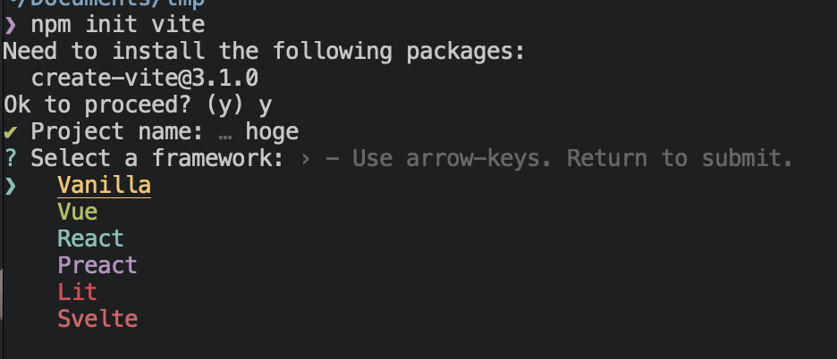
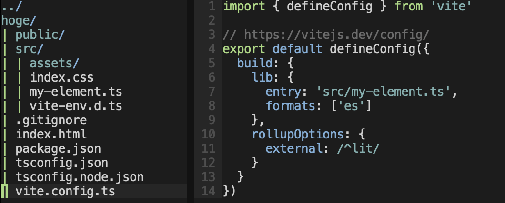

## lit の環境構築はめんどくさい

[lit のドキュメント](https://lit.dev/docs/tools/development/#development-and-production-builds) を読むと rollup でのビルド環境構築をしていたり、decorator 入れる入れないにしろそれぞれ TS や Babel の設定が必要になるので、実は動かすまでの手順はそれなりにある。

## vite の設定を思い出す

自分は最近 vite を使うのだが、vite の init 時に lit を選択できることを思い出した。
つまりこれを使えば楽々にビルドできそうである。
では早速使ってみよう。

## npm init vite で作られるもの

create-vite を走らせるとこのようなコンソールが出る。



つまり vite を選択できる。

これを選択すると、



のような構成である。

実はこの構成は web components をライブラリとして出力する設定である。

```js
import { defineConfig } from "vite";

// https://vitejs.dev/config/
export default defineConfig({
  build: {
    lib: {
      entry: "src/my-element.ts",
      formats: ["es"],
    },
    rollupOptions: {
      external: /^lit/,
    },
  },
});
```

ライブラリを作りたいのであればこれでいいが、もし Web アプリを lit で作りたい場合はもう一工夫いる。

```js
import { defineConfig } from "vite";

// https://vitejs.dev/config/
export default defineConfig({
  build: {
    outDir: "dist"
});
```

とすれば良い。

詳しくは <https://ja.vitejs.dev/config/build-options.html>
