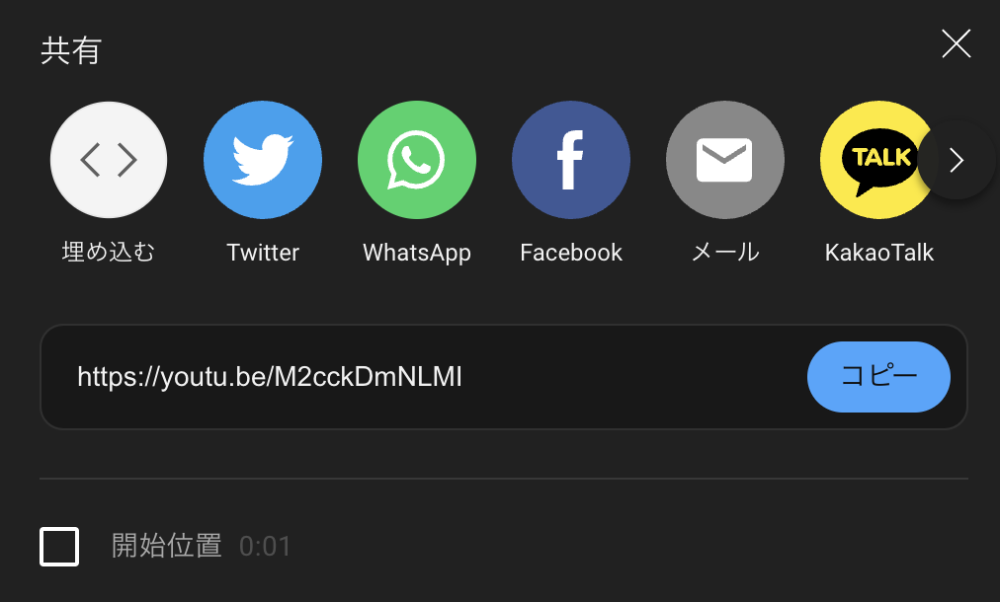
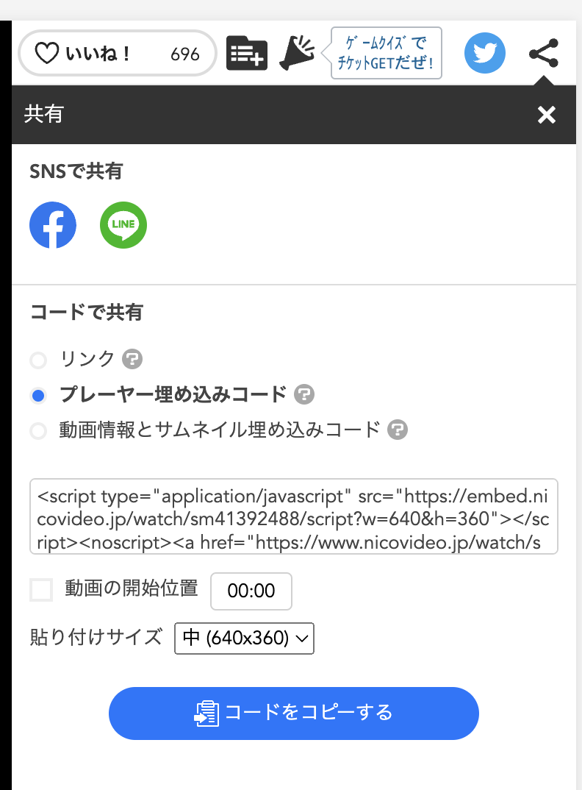

<https://blog.ojisan.io/aruchu-karakara-in-action> を書いた時のメモ。
OGP は AI が考えるニコニコ動画です。

## ブログに動画を埋め込むのは少しめんどくさい

例えば Youtube には動画の埋め込みリンクをコピーできる機能がある。



こういうリンクがあるので

```html
<iframe
  width="560"
  height="315"
  src="https://www.youtube.com/embed/M2cckDmNLMI"
  title="YouTube video player"
  frameborder="0"
  allow="accelerometer; autoplay; clipboard-write; encrypted-media; gyroscope; picture-in-picture"
  allowfullscreen
></iframe>
```

<iframe width="560" height="315" src="https://www.youtube.com/embed/M2cckDmNLMI" title="YouTube video player" frameborder="0" allow="accelerometer; autoplay; clipboard-write; encrypted-media; gyroscope; picture-in-picture" allowfullscreen></iframe>

として埋め込める。

しかしこれは width, height を直接指定するためデバイスごとに適したサイズを埋め込むことができない。

そこで、

```html
<div
  style="left: 0; width: 100%; height: 0; position: relative; padding-bottom: 56.25%;"
>
  <iframe
    src="https://www.youtube.com/embed/M2cckDmNLMI"
    style="top: 0; left: 0; width: 100%; height: 100%; position: absolute; border: 0;"
    allowfullscreen
    scrolling="no"
    allow="accelerometer; clipboard-write; encrypted-media; gyroscope; picture-in-picture;"
  ></iframe>
</div>
```

のようにして埋め込む。

<div style="left: 0; width: 100%; height: 0; position: relative; padding-bottom: 56.25%;"><iframe src="https://www.youtube.com/embed/M2cckDmNLMI" style="top: 0; left: 0; width: 100%; height: 100%; position: absolute; border: 0;" allowfullscreen scrolling="no" allow="accelerometer; clipboard-write; encrypted-media; gyroscope; picture-in-picture;"></iframe></div>

これは横幅を最大に引き伸ばし、高さは padding-bottom で指定した分だけアスペクト比として固定される。ここでいう 56.25% は 16:9 の 9/16 の数字だ。このように padding-bottom を使ったアス比固定は昔ながらのテクニックとして知っている人もいるだろう。

FYI: <https://css-tricks.com/aspect-ratio-boxes/>

もしかしたら今は CSS の新しい機能である aspect-ratio を使えば同じことができるかもしれない。

FYI: <https://developer.mozilla.org/ja/docs/Web/CSS/aspect-ratio>

何はともあれ、アス比固定で動画サイズを指定することでデバイスごとに見やすい動画配置が可能となる。これはアス比固定テクニックを使った中に iframe を埋め込むことで実現した。

## ニコニコ動画でアス比固定

結論から書くと

```html
<div
  style="left: 0; width: 100%; height: 0; position: relative; padding-bottom: 56.25%;"
>
  <iframe
    src="https://embed.nicovideo.jp/watch/sm31729451"
    style="top: 0; left: 0; width: 100%; height: 100%; position: absolute; border: 0;"
    allowfullscreen
    scrolling="no"
    allow="accelerometer; clipboard-write; encrypted-media; gyroscope; picture-in-picture;"
  ></iframe>
</div>
```

として書く。

アス比固定のところはこれまでと同じだ。

iframe の部分は

https://embed.nicovideo.jp/watch/sm31729451

という URL に注目だ。これはニコ動の共有 UI からは見えないものだ。



ただ動画 ID がわかれば `https://embed.nicovideo.jp/watch/sm31729451` のようにして使えるので覚えておこう。
この URL はどこかから見つけたのだがどこで見つけたかは忘れた。
