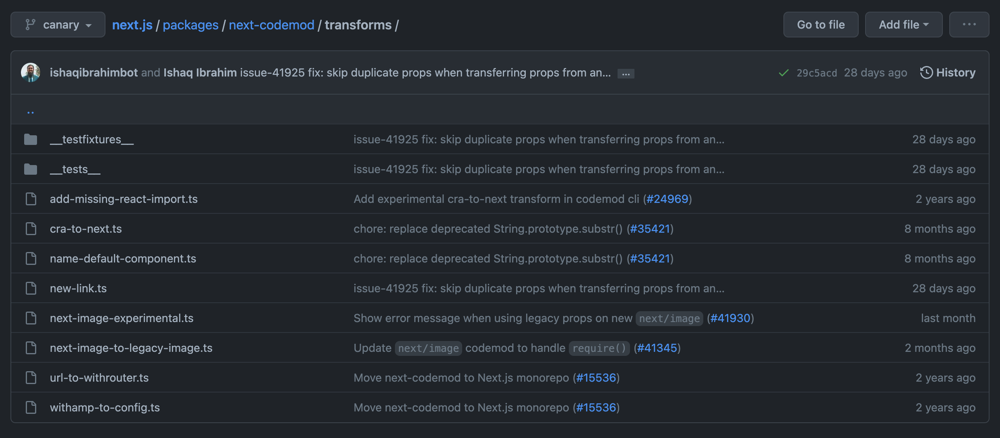

OGP はマイグレーション作業感を出そうと「工事現場 鉄骨 クレーン」で AI 生成した。前から思っているのだが大体生成に失敗する。あまり精度が良くないのは古くからある無料のものを使っているからなのだが、そろそろ自前でお絵描き AI をホスティングしてもいいかもと思いつつある。

## Next.js の codemod

今回の v12 から v13 へのアップグレードガイドでも紹介されていますが、Next.js ではマイグレーションを支援する codemod が存在します。

FYI: <https://nextjs.org/docs/upgrading#upgrading-from-12-to-13>

codemod はいろんなところで耳にはするものの改めて考えるとどう意味かわからなかったのですが、一般的な言葉かは知らないものの調べたところ <https://github.com/facebookarchive/codemod> というライブラリがあり、

> Codemod is a tool/library to assist you with large-scale codebase refactors that can be partially automated but still require human oversight and occasional intervention. Codemod was developed at Facebook and released as open source.

と説明されていることから、定義がされていて周知されている言葉であると言えます。要するにソースコード変換くんです。

Next.js の codemod は <https://nextjs.org/docs/advanced-features/codemods> に使い方が紹介されている通り、

```
npx @next/codemod@latest <transform> <path>
```

として利用できます。`<transform> <path>` の部分は省略すると対話インターフェースで聞かれるのでそのときに入力しても良いです。どんな codemod があるかは覚えきれないのでそのようにしたほうが使いやすいと個人的に思います。

## @next/codemod のレポジトリ

@next/codemod は

- npm: https://www.npmjs.com/package/@next/codemod
- repository: https://github.com/vercel/next.js/tree/canary/packages/next-codemod

にあります。

早速コードを読んでいきましょう。

## コードリーディング

`npx @next/codemod` で実行できるのでエントリポイントは package.json の bin で定義されているはずです。

FYI: <https://github.com/vercel/next.js/blob/canary/packages/next-codemod/package.json#L27>

どうやら bin/next-codemod.js が起点で cli.run を辿ると、

```js
export function run() {
  // ...

  const selectedTransformer = cli.input[0] || transformer;

  // ...

  return runTransform({
    files: filesExpanded,
    flags: cli.flags,
    transformer: selectedTransformer,
  });
}
```

といった関数が実行されます。

runTransform は

```js
export function runTransform({ files, flags, transformer }) {
  const transformerPath = path.join(transformerDirectory, `${transformer}.js`);

  // ...

  const result = execa.sync(jscodeshiftExecutable, args, {
    stdio: "inherit",
    stripFinalNewline: false,
  });

  // ...
}
```

と言ったふうに渡された transformer 名をもとに該当の transform を実行してくれます。
そして transform の実態は `transformerDirectory` ディレクトリにあることが分かります。

new-link.ts, next-image-to-legacy-image.ts などがあることからここが本丸のようです。



FYI: <https://github.com/vercel/next.js/tree/canary/packages/next-codemod/transforms>

では簡単な例として next-link がどう変更されるか見てみましょう。

## next-link はどのように動くか

v12 から v13 では `npx @next/codemod@latest next-link src` といった修正が必要です。

具体的にどういった変更が要求されるかでいうと、<https://nextjs.org/docs/upgrading#link-component> にある通り

> The <Link> Component no longer requires manually adding an <a> tag as a child. This behavior was added as an experimental option in version 12.2 and is now the default. In Next.js > 13, <Link> always renders <a> and allows you to forward props to the underlying tag.
>
> For example:
>
> import Link from 'next/link'

```jsx
// Next.js 12: `<a>` has to be nested otherwise it's excluded
<Link href="/about">
  <a>About</a>
</Link>

// Next.js 13: `<Link>` always renders `<a>` under the hood
<Link href="/about">
  About
</Link>
```

> To upgrade your links to Next.js 13, you can use the new-link codemod.

とのことで、a タグが不要となります。そして a タグを children の wrapper として使っている場合その a タグが消えるとマズい（例えば親のスタイルに `display: flex` とか当たっているとレイアウトがおかしくなる）ので、従来の挙動を再現するために [`legacyBehavior`](https://nextjs.org/docs/api-reference/next/link#if-the-child-is-a-tag) という attribute を付けてくれます（理由が undocumented なのでこれは私の妄想）。

というわけで codemod が a タグを消すのと必要に応じて legacyBehavior を付与するのを見ていきましょう。

## new-link

code は <https://github.com/vercel/next.js/blob/canary/packages/next-codemod/transforms/new-link.ts> です。短いので全部貼ります。

```js
import { API, FileInfo } from "jscodeshift";

export default function transformer(file: FileInfo, api: API) {
  const j = api.jscodeshift;

  const $j = j(file.source);

  return $j
    .find(j.ImportDeclaration, { source: { value: "next/link" } })
    .forEach((path) => {
      const defaultImport = j(path).find(j.ImportDefaultSpecifier);
      if (defaultImport.size() === 0) {
        return;
      }

      const variableName = j(path)
        .find(j.ImportDefaultSpecifier)
        .find(j.Identifier)
        .get("name").value;
      if (!variableName) {
        return;
      }

      const linkElements = $j.findJSXElements(variableName);
      const hasStylesJSX = $j.findJSXElements("style").some((stylePath) => {
        const $style = j(stylePath);
        const hasJSXProp =
          $style.find(j.JSXAttribute, { name: { name: "jsx" } }).size() !== 0;

        return hasJSXProp;
      });

      linkElements.forEach((linkPath) => {
        const $link = j(linkPath).filter((childPath) => {
          // Exclude links with `legacybehavior` prop from modification
          return (
            j(childPath)
              .find(j.JSXAttribute, { name: { name: "legacyBehavior" } })
              .size() === 0
          );
        });

        if ($link.size() === 0) {
          return;
        }

        // If file has <style jsx> enable legacyBehavior
        // and keep <a> to  stay on the safe side
        if (hasStylesJSX) {
          $link
            .get("attributes")
            .push(j.jsxAttribute(j.jsxIdentifier("legacyBehavior")));
          return;
        }

        const linkChildrenNodes = $link.get("children");

        // Text-only link children are already correct with the new behavior
        // `next/link` would previously auto-wrap typeof 'string' children already
        if (
          linkChildrenNodes.value &&
          linkChildrenNodes.value.length === 1 &&
          linkChildrenNodes.value[0].type === "JSXText"
        ) {
          return;
        }

        // Direct child elements referenced
        const $childrenElements = $link.childElements();
        const $childrenWithA = $childrenElements.filter((childPath) => {
          return (
            j(childPath).find(j.JSXOpeningElement).get("name").get("name")
              .value === "a"
          );
        });

        // No <a> as child to <Link> so the old behavior is used
        if ($childrenWithA.size() !== 1) {
          $link
            .get("attributes")
            .push(j.jsxAttribute(j.jsxIdentifier("legacyBehavior")));
          return;
        }

        const props = $childrenWithA.get("attributes").value;
        const hasProps = props.length > 0;

        if (hasProps) {
          // Add only unique props to <Link> (skip duplicate props)
          const linkPropNames = $link
            .get("attributes")
            .value.map((linkProp) => linkProp?.name?.name);
          const uniqueProps = [];

          props.forEach((anchorProp) => {
            if (!linkPropNames.includes(anchorProp?.name?.name)) {
              uniqueProps.push(anchorProp);
            }
          });

          $link.get("attributes").value.push(...uniqueProps);

          // Remove props from <a>
          props.length = 0;
        }

        const childrenProps = $childrenWithA.get("children");
        $childrenWithA.replaceWith(childrenProps.value);
      });
    })
    .toSource();
}
```

codemod は [jscodeshift](https://github.com/facebook/jscodeshift) で実現されています。AST に変換を加えて `.toSource` とすると修正後のコードを出力してくれるものです。[JavaScript のリファクタリングツール「jscodeshift」の使い方](https://qiita.com/toshi-toma/items/93f1dfdf0a820fe6fccc) を読むと肌感覚が掴めると思います。

まず変換対象の AST を作ります。

```js
const j = api.jscodeshift;

const $j = j(file.source);
```

すでに legacy mode を使うと宣言されている link は変換しないようにします。

```js
const $link = j(linkPath).filter((childPath) => {
  // Exclude links with `legacybehavior` prop from modification
  return (
    j(childPath)
      .find(j.JSXAttribute, { name: { name: "legacyBehavior" } })
      .size() === 0
  );
});

if ($link.size() === 0) {
  return;
}
```

Link が JSX Element でなくテキストを child として持っていたらそれは対象外としています。

```jsx
const linkChildrenNodes = $link.get("children");

// Text-only link children are already correct with the new behavior
// `next/link` would previously auto-wrap typeof 'string' children already
if (
  linkChildrenNodes.value &&
  linkChildrenNodes.value.length === 1 &&
  linkChildrenNodes.value[0].type === "JSXText"
) {
  return;
}
```

a タグを持つ Link タグをここで取得し、

```jsx
const $childrenWithA = $childrenElements.filter((childPath) => {
  return (
    j(childPath).find(j.JSXOpeningElement).get("name").get("name").value === "a"
  );
});
```

children が複数個であれば legacy mode として使います。

```jsx
if ($childrenWithA.size() !== 1) {
  $link
    .get("attributes")
    .push(j.jsxAttribute(j.jsxIdentifier("legacyBehavior")));
  return;
}
```

a タグについていた props を Link に全部移し替えて

```js
if (hasProps) {
  // Add only unique props to <Link> (skip duplicate props)
  const linkPropNames = $link
    .get("attributes")
    .value.map((linkProp) => linkProp?.name?.name);
  const uniqueProps = [];

  props.forEach((anchorProp) => {
    if (!linkPropNames.includes(anchorProp?.name?.name)) {
      uniqueProps.push(anchorProp);
    }
  });

  $link.get("attributes").value.push(...uniqueProps);

  // Remove props from <a>
  props.length = 0;
}
```

a タグ付きの Link の child (つまり a タグそのもの)を元々 a タグにあった child で置き換えます。

```js
$childrenWithA.replaceWith(childrenProps.value);
```

つまりこれで a タグが消えたこととなります。
そして Link の children が複数の時に legacyBehavior がついたことも確認できました。

つまりマイグレーションガイド通りの変更を codemod がしてくれたと言えます。
