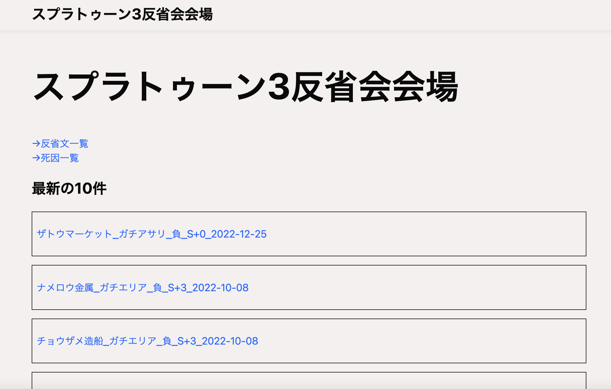
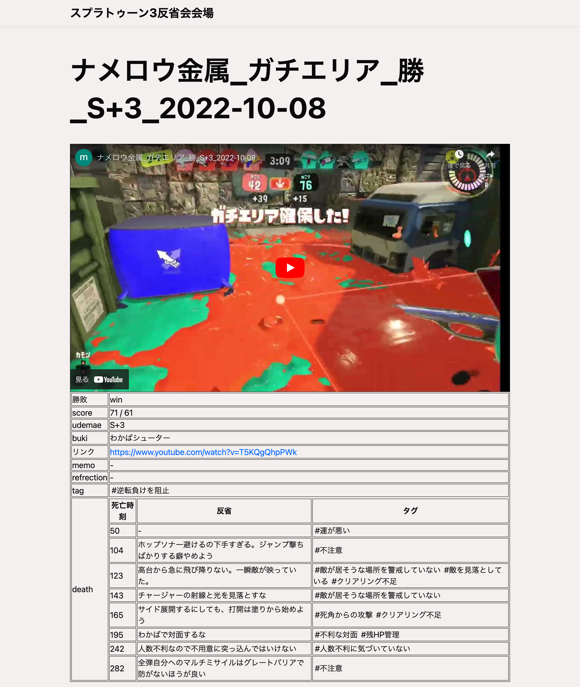
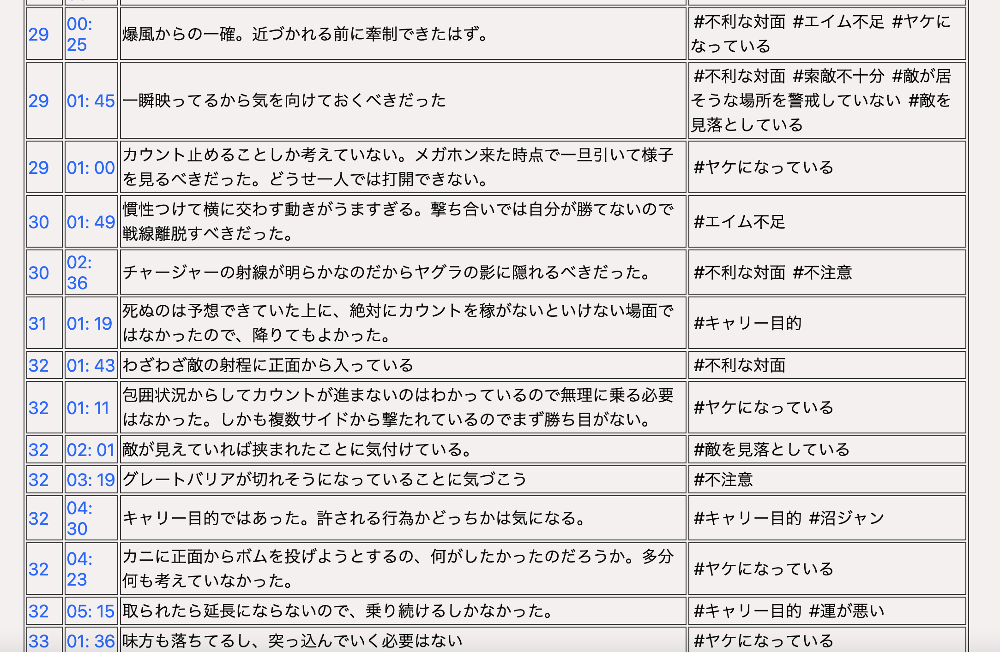
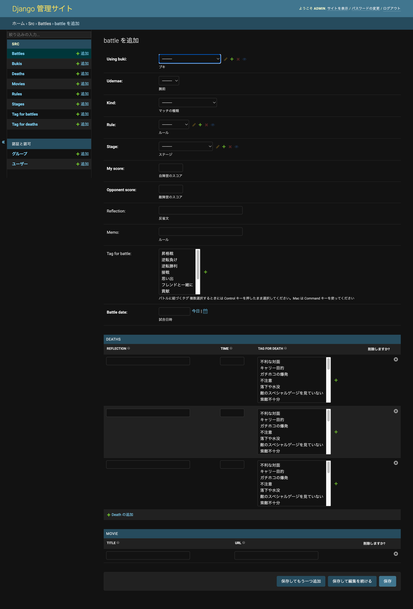
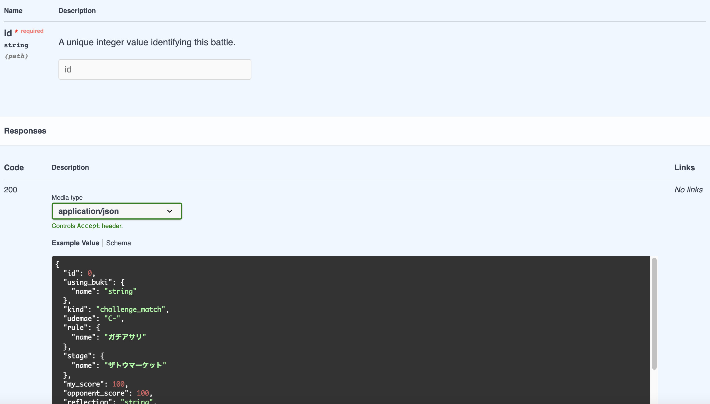
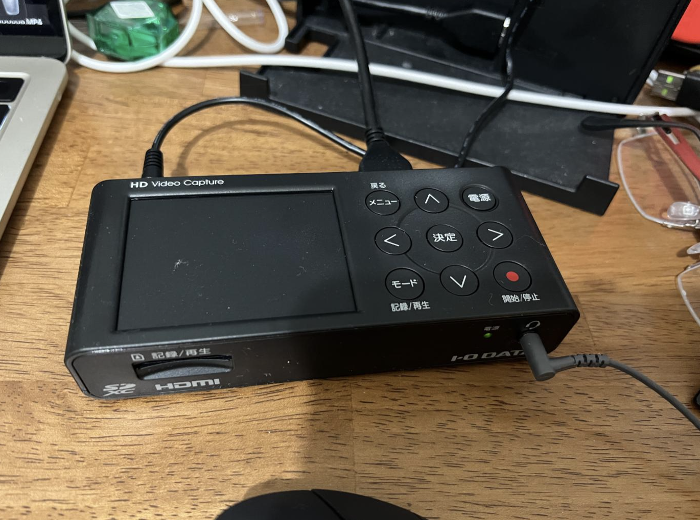
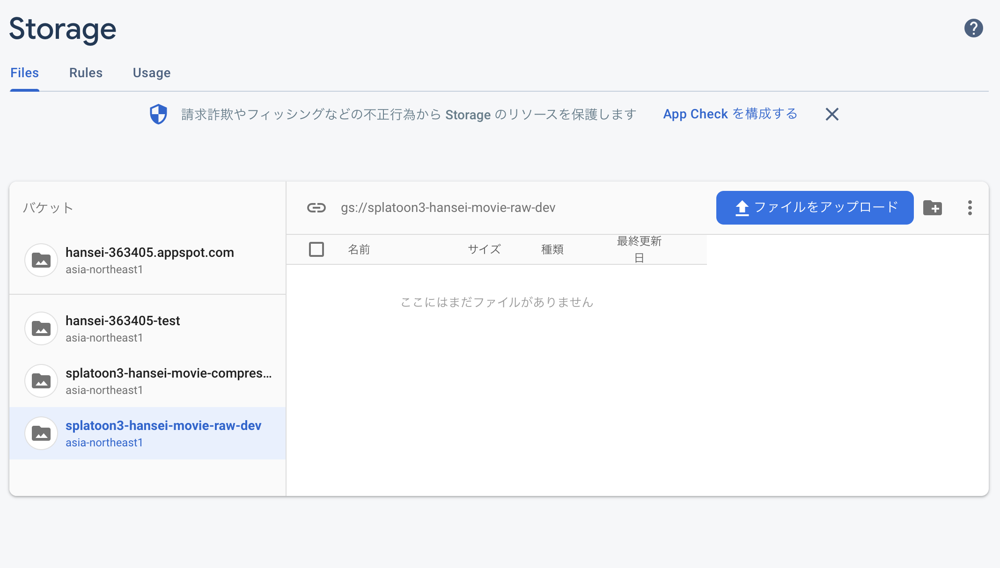

この記事は [身の回りの困りごとを楽しく解決！ by Works Human Intelligence Advent Calendar 2022](https://qiita.com/advent-calendar/2022/works-hi-1) 12 日目です。

## はじめに

3 ヶ月ほど前、[スプラトゥーン３の反省サイトを Jamstack でコスト抑えて作った](https://blog.ojisan.io/splatoon3-hansei-site/) という記事を書きました。
これは splatoon の上達のために書いたものです。

### スプラトゥーンのシステム

splatoon を知らない人のために説明させてください。
splatoon はイカになってインクを塗り合うゲームです。
イカはそのインクの上を進むことができて、陣地を塗ったり、バスケのようなものをして競います。

<div style="left: 0; width: 100%; height: 0; position: relative; padding-bottom: 56.25%;"><iframe src="https://www.youtube.com/embed/z0MZh-cUNiA" style="top: 0; left: 0; width: 100%; height: 100%; position: absolute; border: 0;" allowfullscreen scrolling="no" allow="accelerometer; clipboard-write; encrypted-media; gyroscope; picture-in-picture;"></iframe>
</div>

このゲームは武器や装備の種類が多く、スキルも自由に組み合わせられ、非常に奥が深いゲームです。
僕は splatoon2 を 1000 時間をあそびました。
しかしこれでも少ない方だと思います。

この splatoon にはレーティングシステムがあり、splatoon2 では C-, C, C+, B-, B, B+, A-, A, A+. S0, S1, S2, S3, S4, S5, S6, S7, S8, S9, X マッチ(独自のレーティング。イロレーティングのようなシステム) とあります。
実況者をみていると皆 X です。
しかし私は 1000 時間やったのに S0 でした。
一応 2019 年のデータですが、分布的には

```
X:1%
S+:6%
S:5%
A:20%
B:33%
C:33%
```

らしいです。

FYI: https://detail.chiebukuro.yahoo.co.jp/qa/question_detail/q11242411941

なので上位 10%には入っているのですが、splatooon3 発売前にこのレーティングを X にしたかったのです。
しかし力及びませんでした。
そこで splatoon3 では絶対に X になると決めて、X になるために反省会システムを作ることにしました。

### 反省システムを作った

反省会をするために生まれたシステムがこの [スプラトゥーン３反省会会場](https://splatoon3-hansei.ojisan.dev/)です。



こんな感じで一試合ごとに反省をしています。



死因の一覧を見て分析することもできます。



入稿は django の CMS で行っています。



### 技術的なこと

入稿システムは Python + Django です。
会社で使うから勉強しないといけなかったというのと、Admin の自動生成で CMS が生えてくるのが魅力的だったのでこの選定です。
また OpenAPI Spec の自動生成などもしています。
Python でこの手の Spec を生成できるのかという感心のもとに使ったのですが無事動きました。



しかも yaml を書かずにコードから生成できています。
この辺りに僕は強いこだわりをもっているので興味がある方はこのような記事を読んでみてください。

- [API 仕様書をバリデーターと型と同期させて作る](https://blog.ojisan.io/swagger-validator-ts/)
- [TypeScript, JSON Schema, Ajv の組み合わせを考える](https://blog.ojisan.io/typescript-json-schema-ajv/)
- [Django 製 API 仕様書を Swagger で作る](https://blog.ojisan.io/django-swagger/)

クライアントは Astro です。
これは経費削減目的の JAMStack にしたかったからです。
Django を使う以上 ORM の都合で RDB を使う必要があって、フルマネージドなものを使おうとするとコストが高くなるので気にしていました。
そこで DB は入稿と Astro のビルド時にしか ON にしないようにしています。
そのための JAMStack です。
こうすることで徹底的に経費を抑えられます。

## 問題点

さて、このようにして反省会システムを作って 2 ヶ月ほど使ってみました。
その結果ですが、実は途中から使わなくなってしまい、あまりワークしていませんでした。
というのもとても面倒だったのです。

### 撮影

まず入稿するための動画撮影がめんどくさいです。
Windows 立ち上げて OBS 起動して、スイッチとキャプチャーボードを繋いで、そこからディスプレイに HDMI を通し、音声確認もしてゲーム開始というのがめんどくさいです。

### 編集

プレイ中はずっと撮影していました。
そうすると動画を試合後とに切り取るする必要があります。
トリミングのたびに試合ごとにカーソル揃えて切り取り、動画編集ツールのロードを待ってまた切り取り、見失わないように名前もファイルに付けるといった繰り返しはかなり疲れました。

### アップロード

動画 URL を得るために Youtube にアップロードしていました。
無料だからです。
しかし一日に本数制限があったり容量制限があります。
そして一括アップロードもできません。
毎回手動でドラッグ&ドロップして名前を決めたりしてアップロードしていました。
それでも 10 本ほどしかアップロードできません。

### 入稿

動画 URL を手に入れたらそれを CMS に登録し、何分何秒で死んだかという反省会をします。

### ビルド

そして反省を CMS に打ち込んだら GitHub Actions から Astro のビルドを回します。
そうすることで反省文がデプロイされます。

## 生まれ変わらせる

この手順、普通にめんどくさいです。
そこで新反省会システム v2 を作ります。

### 手元で操作可能なキャプチャーボード

まずキャプチャーボードを買い替えました。
[アイ･オー･データ機器 I-O DATA GV-HDREC](https://www.yodobashi.com/product/100000001003403899/) です。



PC に繋がなくてよく SD カードに保存できて、操作もキャプチャーボード上で完結するものです。
録画と停止をハードウェアスイッチでできるので、試合のたびにボタンをポチポチして使います。
これのおかげで試合ごとのトリミングという苦行から解放されました。

### GCS を利用

動画のアップロード先を Youtube ではなく GCS にしました。
Google ということもあり、Youtubue ほどではありませんが動画再生もサポートされています。
アップロードもドラッグ&ドロップで一括で行えてとても楽です。



### コストを削減

ただ元々 Youtube を使っていた理由はコスト削減です。
動画は 1 試合 1GB ほどです。
これは保存するだけでも毎月 0.02 ドルかかります。
もし動画が増えて 100 本取れば毎月 2 ドルかかるので、それは嫌でした。
そこでコスト削減を考えます。

#### 検討 1: coast line + CDN Cache

GCS, S3 などにはアクセス頻度が低いデータを安く保存できるコースがあります。
それを使い、動画本体は CDN キャッシュから配信することを考えました。
私は個人で Fastly を有料契約をしているので毎月 5000 円分は使えます。
しかし現実的ではなかったです。
Cache Control を CDN が完全に守れる保証はないし、Get Query いじられてキャッシュ貫通する嫌がらせをされると割高のコストがかかるからです。

#### 検討 2: R2

CDN を考えた時に、CloudFalre が R2 というストレージを持っていることを思い出しました。
早速契約して使ったのですが、300MB 以上はアップロード制限があるようでした。
公式には wrangler 経由ならいけるとあったのですが、ダメでした。

#### 検討 3: ffmpeg

そしてその結果手元で ffmpeg に落ち着きました。
手元で圧縮して GCS に送り込んでいます。

圧縮の方法ですが、https://jbjbgame.com/post-5623/ などを見てパラメータを調整したり、圧縮結果の劣化具合を確認しながら、最終的には

```
$ ffmpeg -i /Volumes/Untitled/DCIM/100HDREC/IOHD0006.MP4  -vf scale=1024:-1 -b:v 1200k ~/Downloads/2022-12-25-01.mp4
```

になりました。これで 1GB が 50MB まで圧縮されます。`-b:v 1200k` というビットレート指定は劣化が激しい時は外してもいいと思います。外した時は 200MB ほどになります。

## 反省し続けた結果

はじめて X 帯になれました！感動です！


## これから

この仕組みは横展開できるので、スマブラやメルティブラッドなど始めようかなと思っています。
強くなるぞ！！！
