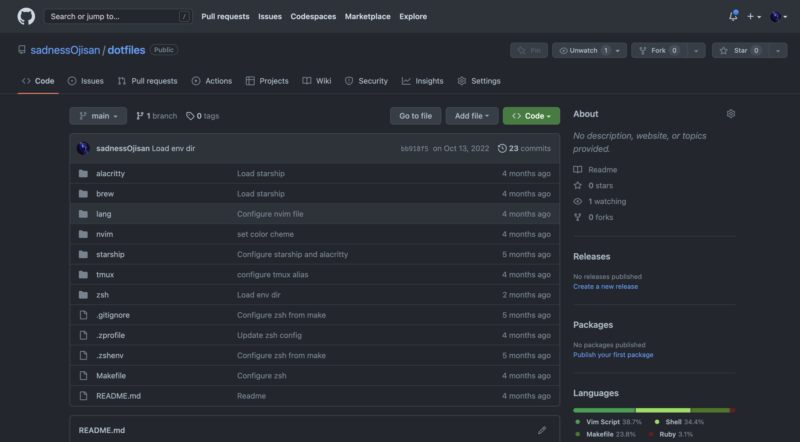
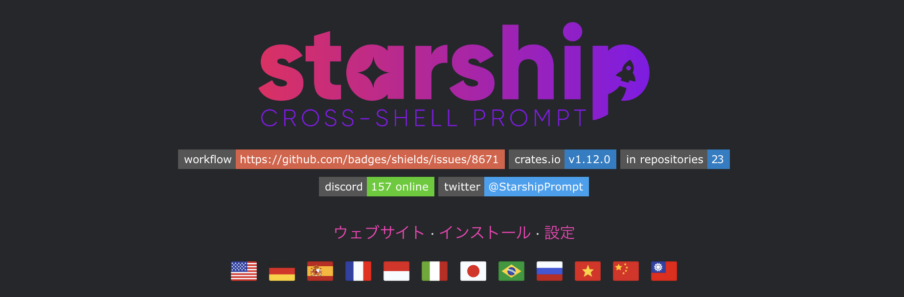
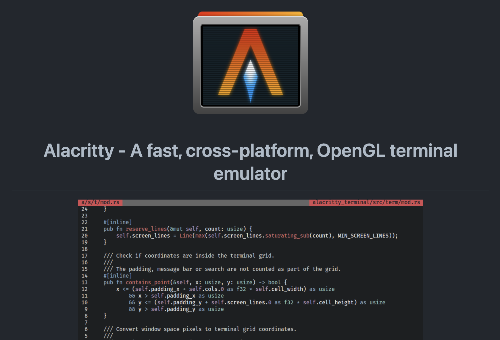

まだまだ 2022 年の振り返りが終わらないぜということで今日は dotfiles の振り返り。dotfiles はその変遷を見ると面白いので、毎年やろうと思い早速やっていきたい。

ちょっと前に M2 の MBA 買って、dotfiles を一新した。
これが今の dotfiles だ。



<https://github.com/sadnessOjisan/dotfiles>

## コンセプト

- 自分は Mac しか使わない
- が、WSL 環境も持ってるのでシェル周りの環境は移せるように作っておく（原神しかしないけど・・・）
- make all だけでセットアップが完結する
- 手作業はしない
- なるべく標準に準拠し、プラグインやライブラリへの依存を減らす。入れる場合も単体で剥がせるものを選ぶ。
- シンボリックリンクを貼って、dotfiles の変更が即時に反映されるようにする
- .config など [XDG](https://wiki.archlinux.jp/index.php/XDG_Base_Directory) に準拠する

## ツール選定

### NeoVim

Vim での作業を当初は考えていたので入れてある。だが設定にハマると大変なので使うのは LSP と括弧挿入とファイラくらいだ。

ちなみにファイラの話をするとブリザラとかサンダラの話をする人がいるのだが、俺は好き。

### Zsh

もともと fish ユーザーだったが、POSIX 準拠じゃない点で色々困ったことがあった。script であれば互換実行があるのでいいのだが、例えば人から Slack でもらったスクリプトの実行などで困ったりしていた。そこで zsh に戻すことにした。そして zsh で fish の操作感を出すためにあれやこれやをしていく。

### starship



> シェル用の最小限の、非常に高速で、無限にカスタマイズ可能なプロンプトです！

<https://starship.rs/ja-jp/guide/>

プロンプトに Git の状態や Node のバージョンを出したくて入れた。Git の状態くらいであれば shell script 書けばすぐできるのだが、言語のバージョンはそうはいかなかった。Node くらいであれば自作してもいいかもと思ったが、最近は Node, Rust, Scala, Go, Python などといろんな言語を書いているのでそのセットアップは非常にめんどくさかった。なのでその辺をワンストップで設定してくれる starship を使うことにした。まあ結局バージョンを頻繁に切り替えるのは Node だけなんだけど。

### alacritty



ターミナルの文字とかの設定を、手作業を廃したくて入れた。その辺を yaml で設定できる。そして alacritty がなくても普通の zsh でも同じ zsh 設定が動くのでいざ剥がす時も剥がしやすいと思ってこれに選定した。

### tmux

alacritty が標準ターミナルと違って cmd + t でタブを増やせなかったので、タブとかを増やしたくて tmux 入れた。

## セットアップ

### make のエントリ

`make all` で全てが完結するようにしている。

```Makefile
.PHONY: all
all: pre starship starship_conf nvim lang zsh brew alacritty tmux_conf
```

サブコマンドを呼び出すのでそれを見ていこう。

### pre で usr/local/bin のセット

環境によっては usr/local/bin がない。そして starship はこの dir を要求するので事前に作っておく。

```Makefile
.PHONY: pre
pre:
	if [ ! -d /usr/local/bin ]; then sudo mkdir -p /usr/local/bin; fi
```

### starship

```Makefile
.PHONY: starship
starship:
	curl -sS https://starship.rs/install.sh | sh

.PHONY: starship_conf
starship_conf:
	if [ ! -d ${HOME}/.config ]; then mkdir -p ${HOME}/.config; fi
	ln -s -f ${PWD}/starship/starship.toml ${HOME}/.config/starship.toml
```

starship の install と設定へのシンボリックリンクを設定する。こんな設定にしてある。

```toml
format = """
$username\
$hostname\
$directory\
$git_branch\
$git_state\
$git_status\
$cmd_duration\
$nodejs\
$line_break\
$python\
$character"""

[directory]
style = "blue"

[character]
success_symbol = "[❯](purple)"
error_symbol = "[❯](red)"
vicmd_symbol = "[❮](green)"

[git_branch]
format = "[$branch]($style)"
style = "bright-black"

[git_status]
format = "[[(*$conflicted$untracked$modified$staged$renamed$deleted)](218) ($ahead_behind$stashed)]($style)"
style = "cyan"
conflicted = ""
untracked = ""
modified = ""
staged = ""
renamed = ""
deleted = ""
stashed = "≡"

[git_state]
format = '\([$state( $progress_current/$progress_total)]($style)\) '
style = "bright-black"

[cmd_duration]
format = "[$duration]($style) "
style = "yellow"

[python]
format = "[$virtualenv]($style) "
style = "bright-black"

[nodejs]
format = "[🤖 $version](bold green) "
```

### nvim

```Makefile
.PHONY: nvim
nvim:
	sh nvim/install-plugin-manager.sh
	if [ ! -d ${HOME}/.config/nvim ]; then mkdir -p ${HOME}/.config/nvim; fi
	ln -s -f ${PWD}/nvim/init.vim ${HOME}/.config/nvim/init.vim
	ln -s -f ${PWD}/nvim/coc-config.json ${HOME}/.config/nvim/coc-config.json
```

誘惑に負けて plugin manager を使ってしまった。

```sh
#!/bin/sh

sh -c 'curl -fLo "${XDG_DATA_HOME:-$HOME/.local/share}"/nvim/site/autoload/plug.vim --create-dirs \
       https://raw.githubusercontent.com/junegunn/vim-plug/master/plug.vim'
```

設定はかなり薄くしており、LSP, ファイラ、括弧補完くらいだ。LSP は coc を使うことで nvim-lsp の Lua の設定業を廃した。VSCoder には難しすぎた。

```vim
call plug#begin()
Plug 'neoclide/coc.nvim', {'branch': 'release'}
Plug 'cocopon/iceberg.vim'
call plug#end()

colorscheme iceberg

:set number
set autoread
inoremap { {}<LEFT>
inoremap [ []<LEFT>
inoremap ( ()<LEFT>
inoremap " ""<LEFT>
inoremap ' ''<LEFT>

" yank to clipboard
set clipboard+=unnamed

" for peco
:set modifiable

" terminal
command! -nargs=* T split | wincmd j | resize 20 | terminal <args>
autocmd TermOpen * startinsert

" 隣接した{}で改行したらインデント
function! AddIndentWhenEnter()
    if getline(".")[col(".")-1] == "}" && getline(".")[col(".")-2] == "{"
        return "\n\t\n\<UP>\<END>"
    else
        return "\n"
    endif
endfunction
" Enterに割り当て
inoremap <silent> <expr> <CR> AddIndentWhenEnter()

set expandtab "タブ入力を複数の空白入力に置き換える
set tabstop=4 "画面上でタブ文字が占める幅
set shiftwidth=4

" netrw
set nocp                    " 'compatible' をオフにする
filetype plugin on          " プラグインを有効にする
let g:netrw_preview=1
let g:netrw_liststyle=3 " tree表示
let g:netrw_keepdir = 0
let g:netrw_banner = 0
"window サイズ
let g:netrw_winsize = 25
let g:netrw_browse_split = 4

"Netrw を toggle する関数を設定
"元処理と異なり Vex を呼び出すことで左 window に表示
let g:NetrwIsOpen=0
function! ToggleNetrw()
    if g:NetrwIsOpen
        let i = bufnr("$")
        while (i >= 1)
            if (getbufvar(i, "&filetype") == "netrw")
                silent exe "bwipeout " . i
            endif
            let i-=1
        endwhile
        let g:NetrwIsOpen=0
    else
        let g:NetrwIsOpen=1
        silent Vex
    endif
endfunction

"ショートカットの設定
"= を 2 回連続押下で toggle
noremap <silent><C-e> :call ToggleNetrw()<CR>

" coc
" Use tab for trigger completion with characters ahead and navigate.
" NOTE: Use command ':verbose imap <tab>' to make sure tab is not mapped by
" other plugin before putting this into your config.
inoremap <silent><expr> <TAB>
      \ coc#pum#visible() ? coc#pum#next(1):
      \ CheckBackspace() ? "\<Tab>" :
      \ coc#refresh()
inoremap <expr><S-TAB> coc#pum#visible() ? coc#pum#prev(1) : "\<C-h>"

" Make <CR> to accept selected completion item or notify coc.nvim to format
" <C-g>u breaks current undo, please make your own choice.
inoremap <silent><expr> <CR> coc#pum#visible() ? coc#pum#confirm()
                              \: "\<C-g>u\<CR>\<c-r>=coc#on_enter()\<CR>"

" Use `[g` and `]g` to navigate diagnostics
" Use `:CocDiagnostics` to get all diagnostics of current buffer in location list.
nmap <silent> [g <Plug>(coc-diagnostic-prev)
nmap <silent> ]g <Plug>(coc-diagnostic-next)

" GoTo code navigation.
nmap <silent> gd <Plug>(coc-definition)
nmap <silent> gy <Plug>(coc-type-definition)
nmap <silent> gi <Plug>(coc-implementation)
nmap <silent> gr <Plug>(coc-references)

" Use K to show documentation in preview window.
nnoremap <silent> K :call ShowDocumentation()<CR>

function! ShowDocumentation()
  if CocAction('hasProvider', 'hover')
    call CocActionAsync('doHover')
  else
    call feedkeys('K', 'in')
  endif
endfunction
```

まあ設定はしたものの、ほとんど使わない。最近全部 JetBrains 系に移したのでそのことはまたブログにしたい。ただ Vim が立ち上がるときはそれなりにあるので、 Vim の環境を揃えておくのは良いことだ。

### 言語の設定

どの PC にも入っていて欲しいのは Node と Rust なのでその設定。

```Makefile
.PHONY: lang
lang:
	sh ${PWD}/lang/rust/install.sh
	sh ${PWD}/lang/node/install.sh
```

rust は rustup を入れるだけ

```sh
# install for linux or mac
curl --proto '=https' --tlsv1.2 -sSf https://sh.rustup.rs | sh
```

node は nvm 経由で入れる

```sh
if [ ! -d ${HOME}/.nvm ]; then mkdir ${HOME}/.nvm; fi
```

たまに職場によっては nodeenv 前提とかあるのでグヌヌとかになるけど、その時はその時で Hack してる。

### zsh

.zshenv に ZDOTDIR を指定して、.zsh にある設定を読み取らせるようにする。

```sh
# This .zshenv is different from zsh/.zshenv.
# This is just entrypoint for zsh.
# This role is only configure to setup .zsh.
# Real env is loaded in zsh/.zshenv.

echo "@load env@"

export ZDOTDIR="$HOME/.zsh"

source $ZDOTDIR/.zshenv
```

そして .zsh/ にあるファイルにシンボリックリンクを make で貼りまくる。

```Makefile
.PHONY: zsh-conf
zsh-conf:
	ln -sf ${PWD}/.zshenv ${HOME}/.zshenv
	mkdir -p ${HOME}/.zsh
	ln -sf ${PWD}/zsh/.zshenv ${HOME}/.zsh/.zshenv
	if [ ! -e ${HOME}/.zsh/.zshenv.local ]; then ln -sf ${PWD}/zsh/.zshenv.local ${HOME}/.zsh/.zshenv.local; fi
	ln -sf ${PWD}/zsh/.zshrc ${HOME}/.zsh/.zshrc
	if [ ! -e ${HOME}/.zsh/.zshrc.local ]; then ln -sf ${PWD}/zsh/.zshrc.local ${HOME}/.zsh/.zshrc.local; fi
	ln -sf ${PWD}/zsh/.zprofile ${HOME}/.zsh/.zprofile
	if [ ! -e ${HOME}/.zsh/.zprofile.local ]; then ln -sf ${PWD}/zsh/.zprofile.local ${HOME}/.zsh/.zprofile.local; fi
	ln -sf ${PWD}/zsh/scripts ${HOME}/.zsh/

.PHONY: zsh
zsh: zsh-plugin zsh-conf
```

.local は GitHub で管理しないもので、その端末固有の設定だ。日頃から作業によって PC を 4 台ほど切り替えて作業しているのでこのようなローカル設定の余地を残している。

plugin manager をどうするかは必死に考えた結果、何も使わないことにした。昔はなんだかんだいろいろなものを使っていたが、余計なこといろいろされたり遅いイメージしかなかった。じゃあどうしたかというと直にセットするのである。

```Makefile
.PHONY: zsh-plugin
zsh-plugin:
	sh ${PWD}/zsh/install-plugin.sh
```

```sh
#!/bin/zsh

# install zsh-autosuggestions
ZSH_AUTOSUGGEST_HIGHLIGHT_STYLE="fg=#ff00ff,bg=cyan,bold,underline"
git -C ~/.zsh/zsh-autosuggestions pull 2>/dev/null || git clone https://github.com/zsh-users/zsh-autosuggestions ~/.zsh/zsh-autosuggestions
```

https://github.com/zsh-users/zsh-autosuggestions/blob/master/INSTALL.md#manual-git-clone などに書いてあるが、plugin は実行させるだけで install できるので、これを ZDOTDIR で指定したフォルダに clone するだけで plugin は動かせるのである。

### brew

make に必要なパーツは brew で入れるので、brew も宣言的な設定をできるようにした。

```Makefile
.PHONY: brew
brew:
	sh brew/install.sh
	brew tap Homebrew/bundle
	brew bundle --file "brew/Brewfile"
```

```sh
/bin/bash -c "$(curl -fsSL https://raw.githubusercontent.com/Homebrew/install/master/install.sh)"
eval "$(/opt/homebrew/bin/brew shellenv)" # brew コマンドが使えるようになる
```

絶対に入れたいものは BrewBundle で管理している。

```
tap "homebrew/bundle"
tap "homebrew/cask"
tap "homebrew/core"
tap "homebrew/cask-fonts"
cask "font-source-code-pro"
cask "alacritty"
brew "svn" # for sourcecodepro
brew "peco"
brew "tig"
brew "neovim"
brew "jq"
brew "gh"
brew "nvm"
brew "neovim"
brew "tmux"
```

だ lock がんだん古くなるはずなのでそのメンテはちゃんと考えておきたい。

### alacritty

brew で入るので設定を移すだけ

```Makefile
.PHONY: alacritty
alacritty:
	if [ ! -d ${HOME}/.config/alacritty ]; then mkdir -p ${HOME}/.config/alacritty; fi
	ln -s -f ${PWD}/alacritty/alacritty.yml ${HOME}/.config/alacritty/alacritty.yml
```

フォントの設定をしている

```yml
# Font
font:
  size: 13
  font:
    normal:
      family: SauceCodePro Nerd Font
      style: Regular
    bold:
      family: SauceCodePro Nerd Font
      style: Bold
    italic:
      family: SauceCodePro Nerd Font
      style: Italic

    # Point size of the font
    size: 11.5

# env
env:
  TERM: alacritty
```

### tmux_conf

これも brew で入るので設定を移すだけ

```Makefile
.PHONY: tmux_conf
tmux_conf:
	ln -sf ${PWD}/tmux/.tmux.conf ${HOME}/.tmux.conf
```

```
# prefixキーをC-sに変更する
set -g prefix C-s

# デフォルトのprefixキーC-bを解除する
unbind C-b

setw -g window-status-current-format '#[bg=colour2,fg=colour255]#{?client_prefix,#[bg=colour3],} #I #W '
```

prefix のキーは悩んだ。押しやすくて、Vim や Emacs と衝突させないためにはどうすればいいんだろう。

## 起動

```
make all
```

で動く。経験上たまに brew 周りでコマンドがないと言われて止まることがあるのだが、そのときは `eval "$(/opt/homebrew/bin/brew shellenv)` のコマンドだけ手で入れたりすることもあった。

## まとめ

この設定で今のところ困っていないが、プロからすると非効率だと思うのでアドバイスもらえると嬉しい。
