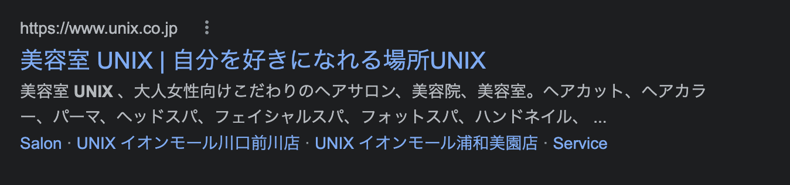
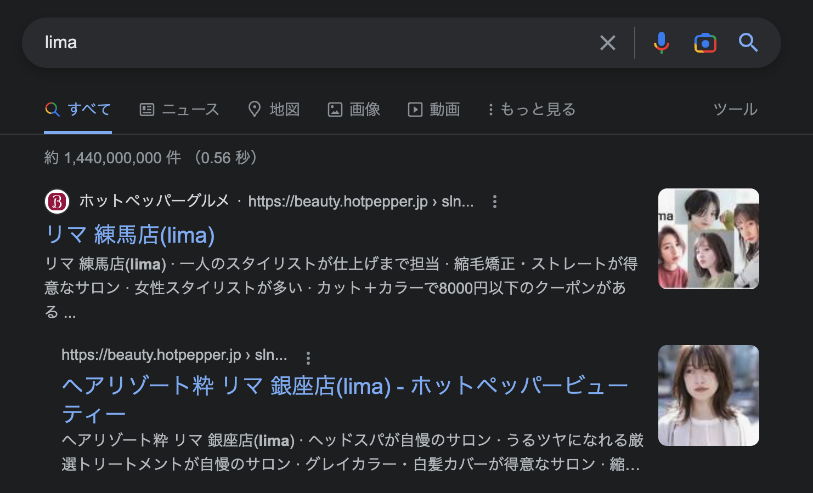
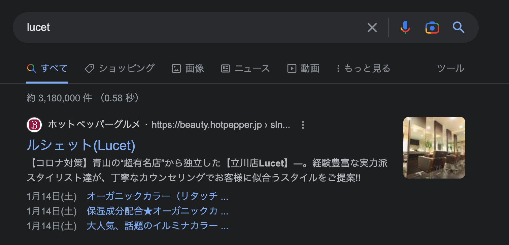
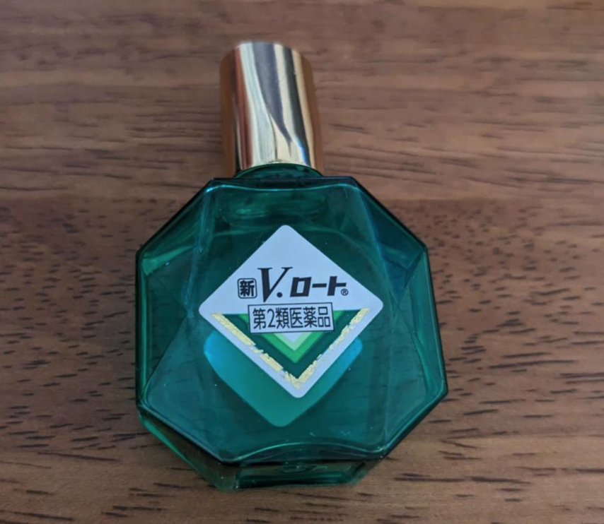

プログラミングとヘアサロン、実はこんなところに関係性がある。
もしかすると皆さんも思い当たることや見たことあるかもしれない。
そんな事例を今日は紹介したい。

## Unix

1 つ 1 つのことをうまくしてくれるのかもしれない。

## lima

yaml でセットできるのかもしれない。

## lucet

edge なスタイルを追求できるかもしれない。

## 他にもあったら自由に追加してね

[Patches are welcome.](https://github.com/sadnessOjisan/blog.ojisan.io/tree/main/src/contents/20230105-programmer-hair-set)

## 余談

目薬どれ買えばいいかわからないからとりあえず V ロート買ってる。

だってロゴが・・・ねぇ。

ぶっちゃけそういうロゴとか名前にすることでエンジニアの購買意欲を誘い、売上が少し伸びているってのは色んなところで発生していると思う。
僕もいつか喫茶店を開くときは、カフェ Script にすると思う。もちろんオススメメニューは モカ・ジャスミン・チャイ です。
