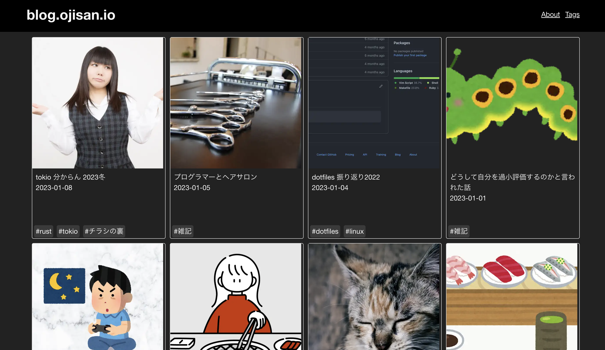
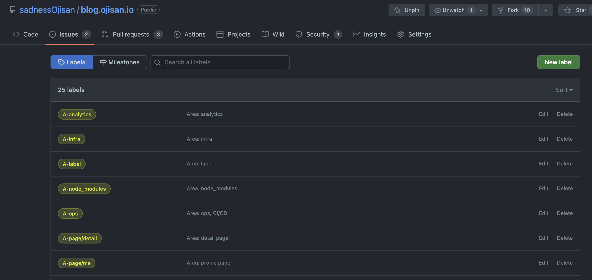
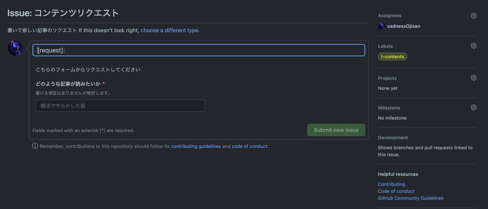
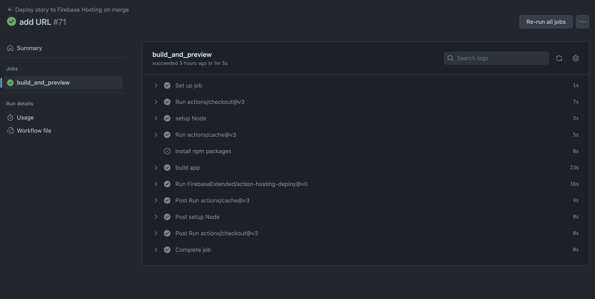
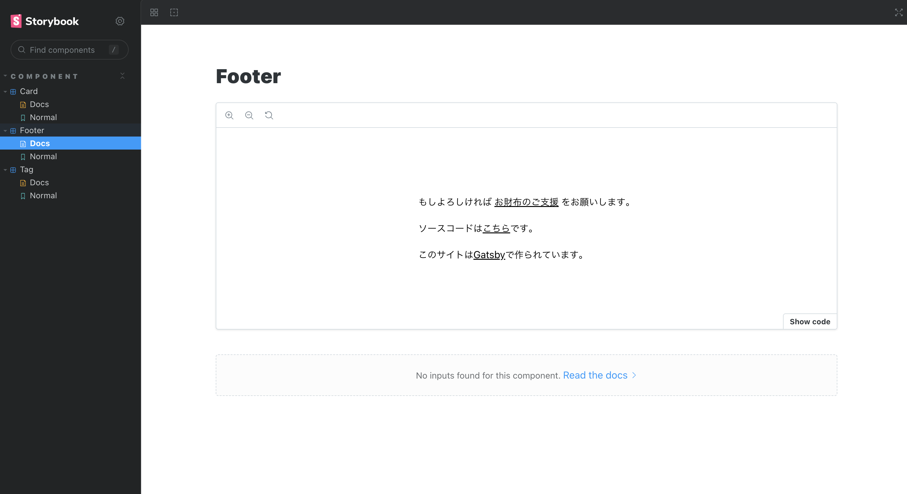
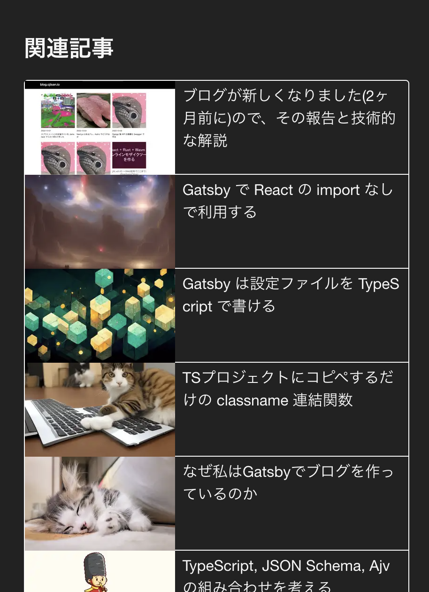
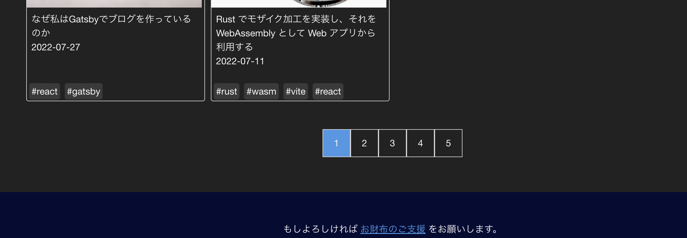
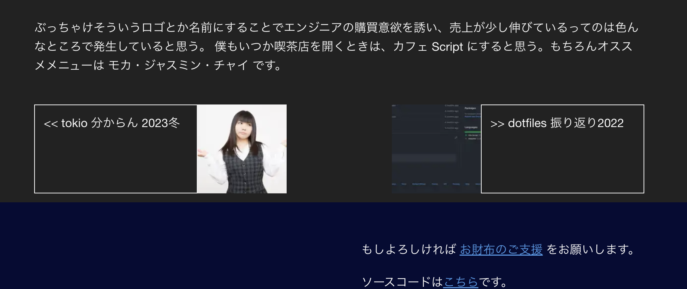
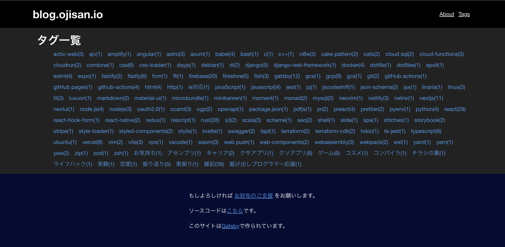

OGP は古いブログの画像です。この記事が書かれた時代のブログはこのような感じです。



ソースコードは [こちら](https://github.com/sadnessOjisan/blog.ojisan.io) です。

## ブログを新しくするまでの経緯

2020 年にブログを作ってから 2 年以上経ちますが、これまで Gatsby -> Rust で自作 SSG -> Gatsby といった風に作り替えてきました。Rust で実装したときの記事は[これ](https://blog.ojisan.io/sakura-vps/)で、Gatsby に戻した時の記事は[これ](https://blog.ojisan.io/taihi-kankyo-tsukuru/)です。この記事にある通り前のブログは仮住まいでして、次もまた自作 SSG にしようとしていました。しかし時間が取れなかったのと、いつまでも仮住まいは嫌だったので Gatsby でまた作り直しました。ブログを作るタイミングでいつも技術選定を見直していますが、今回も Gatsby になりました。いつも Next と悩んでいるのですが、今回はそこに Astro も入って選定をし直した結果、また Gatsby になりました。その理由は [こちら](https://blog.ojisan.io/why-i-will-use-gatsby) にあります。今回はデザインも白黒だけでサボるようなことはしなかったり、Developer Experience 周りも注力しました。これがその [PR](https://github.com/sadnessOjisan/blog.ojisan.io/pull/239) です。

## 0 から実装し直す

作るにあたって真っ当に依存更新をすると、Gatsby のメジャーバージョンが上がって色々と書き方を変えられることを知ったので、いっそのこと作り直そうと全部消しました。contents だけ残し後は全部 rm -rf で消し去りました。

古い依存もこれで最新です。

## 開発環境整備

まっさらにしたので開発環境の整備からです。

### ラベルでの管理

あとでこういうブログを書こうと決めていたので、開発を見返せるように PR とラベルの運用をしっかりしました。



ラベルはいつもとっ散らかるので、 GitHub Actions と yaml で管理しています。コードベースに含めることで Issue Template との紐付けもしやすくて気に入っています。

- https://github.com/sadnessOjisan/blog.ojisan.io/blob/v3.0.0/.github/workflows/github-label-sync.yaml
- https://raw.githubusercontent.com/sadnessOjisan/blog.ojisan.io/v3.0.0/.github/ISSUE_TEMPLATE/contents_request.yml

yaml で管理するアイデアは r7kamura さんの https://r7kamura.com/articles/2022-07-18-release-notes-management を参考にしました。

ラベルの命名は tokio-rs チームでよく見るやり方を採用しました。

- https://github.com/tokio-rs/tokio/issues
- https://github.com/tokio-rs/axum/issues

### 各種テンプレートの用意

ちゃんと運用するぞということでテンプレートも作りました。

- Issue
- PR
- Code of Conduct
- CONTRIBUTING

作ったけど自己満なので中身はスカスカです。

ただ Issue のフォームとかは結構気に入っています。



こんな yaml を書くと作れます。

```yaml
name: コンテンツリクエスト
description: 書いて欲しい記事のリクエスト
title: "[request]: "
labels: ["I-contents"]
assignees:
  - sadnessOjisan
body:
  - type: markdown
    attributes:
      value: |
        こちらのフォームからリクエストしてください
  - type: input
    id: contact
    attributes:
      label: どのような記事が読みたいか
      description: 書ける保証はありませんが検討します。
      placeholder: 婚活でやらかした話
    validations:
      required: true
```

FYI: <https://github.com/sadnessOjisan/blog.ojisan.io/blob/v3.0.0/.github/ISSUE_TEMPLATE/contents_request.yml>

README もしっかり書きました。

### 静的解析系の整備

0 からなので静的解析を整備し直しました。

- TypeScript
- Prettier
- ESLint

を CI で利用しました。

ちなみに vitest, stylelint も入っていますが今は使っていないです。

### GitHub Actions

Action を再利用するようにしています。actions には

```yaml
name: static-check
description: Run static check
runs:
  using: composite
  steps:
    - run: npm run typecheck
      shell: bash
    - run: npm run lint:check
      shell: bash
    - run: npm run format:check
      shell: bash
    - run: npm run test
      shell: bash
```

と

```yaml
name: github-label-sync-action
description: Sync GitHub Labels with labels definition file.
inputs:
  allow_added_labels:
    default: "false"
    description: Allow additional labels in the repository, and don't delete them.
    required: false
  github_token:
    default: ${{ github.token }}
    description: GitHub access token to sync labels (`repo` scope required).
    required: false
  source_path:
    default: .github/labels.yaml
    description: File path to find labels definition file.
    required: false
  source_repository:
    default: ${{ github.repository }}
    description: GitHub repository to find labels definition file.
    required: false
  target_repository:
    default: ${{ github.repository }}
    description: GitHub repository where labels are synced.
    required: false
runs:
  using: composite
  steps:
    - uses: actions/setup-node@v3
      with:
        node-version: 18.x
    - run: npm install -g github-label-sync
      shell: bash
    - uses: actions/checkout@v3
      with:
        token: ${{ inputs.github_token }}
        repository: ${{ inputs.source_repository }}
    - run: |
        github-label-sync \
          --access-token ${{ inputs.github_token }} \
          --labels ${{ inputs.source_path }} \
          ${{ inputs.allow_added_labels != 'false' && '--allow-added-labels' || '' }} \
          ${{ inputs.target_repository }} \
      shell: bash
branding:
  color: orange
  icon: refresh-cw
```

を入れており、ビルド時のトリガーですぐに呼び出せるようにしています。
アプリケーションビルド、ストーリブックビルドが開発・本番に必要なので、それぞれのファイルから呼び出せるようにしています。

```yaml
on:
  push:
    branches:
      - "*"
      - "*/*"
      - "**"
      - "!main"
jobs:
  test:
    runs-on: ubuntu-latest
    steps:
      - name: checkout
        uses: actions/checkout@v3
      - name: setup Node
        uses: actions/setup-node@v3
        with:
          node-version: v18.x
          registry-url: "https://registry.npmjs.org"
      - uses: actions/cache@v3
        id: node_modules_cache_id
        env:
          cache-name: cache-node-modules
        with:
          path: "**/node_modules"
          key: ${{ runner.os }}-build-${{ env.cache-name }}-${{ hashFiles('**/package-lock.json') }}
      - if: ${{ steps.node_modules_cache_id.outputs.cache-hit != 'true' }}
        name: Install npm packages
        run: npm install
      - name: static check
        uses: ./.github/actions/static-check
```

また action は Gatsby や npm のキャッシュをなるべく使うようにしています。

```yaml
# This file was auto-generated by the Firebase CLI
# https://github.com/firebase/firebase-tools

name: Deploy to Firebase Hosting on merge
"on":
  push:
    branches:
      - main
jobs:
  build_and_preview:
    runs-on: ubuntu-latest
    steps:
      - uses: actions/checkout@v3
      - name: setup Node
        uses: actions/setup-node@v3
        with:
          node-version: v18.x
          registry-url: "https://registry.npmjs.org"
      - name: Caching Gatsby
        id: gatsby-cache-build
        uses: actions/cache@v3
        with:
          path: |
            public
            .cache
          key: ${{ runner.os }}-gatsby-build-${{ github.run_id }}
          restore-keys: |
            ${{ runner.os }}-gatsby-build-
      - uses: actions/cache@v3
        id: node_modules_cache_id
        env:
          cache-name: cache-node-modules
        with:
          path: "**/node_modules"
          key: ${{ runner.os }}-build-${{ env.cache-name }}-${{ hashFiles('**/package-lock.json') }}
      - if: ${{ steps.node_modules_cache_id.outputs.cache-hit != 'true' }}
        name: Install npm packages
        run: npm install
      - name: build app
        run: GATSBY_ACTIVE_ENV=production npm run build
        env:
          GATSBY_EXPERIMENTAL_PAGE_BUILD_ON_DATA_CHANGES: true
          CI: true
      - uses: FirebaseExtended/action-hosting-deploy@v0
        with:
          repoToken: "${{ secrets.GITHUB_TOKEN }}"
          firebaseServiceAccount: "${{ secrets.FIREBASE_SERVICE_ACCOUNT_BLOG_OJISAN_IO }}"
          channelId: live
          projectId: blog-ojisan-io
          target: default
```

キャッシュがないとフルビルドに 15 分くらいかかるのできついです。キャッシュがあれば 1,2 分でビルドできています。



### storybook の導入

vite + v7 beta で作っています。ただ全然 story 足しいないし、すこしコツがいるので別の記事にまとめます。



### 型付け

gatsby は 3 系から TS サポートがようやく使い物になり始め、4 系では自然な形で使えるようになっています。

まず設定ファイルが TS で書けます。

```ts
const config: GatsbyConfig = {};
```

config に型がつきます。

Node も

```ts
export const createPages: GatsbyNode["createPages"] = async ({
  actions,
  graphql,
}) => {
  const { createPage } = actions;
  await pagination(createPage, graphql);
  await detailPage(createPage, graphql);
  await tagsPage(createPage, graphql);
};
```

として使えます。
こんな感じで gatsby-node 内での GraphQL でのデータ取得結果に対して型をつけられます。

```ts
const paginationIndexPageResult = await graphql<Queries.PaginationQueryQuery>(`
  query PaginationQuery {
    allMarkdownRemark(sort: { frontmatter: { created: DESC } }, limit: 1000) {
      nodes {
        frontmatter {
          path
        }
      }
    }
  }
`);
```

各ページでは PageProps をつけて型をつけています。

```ts
import { graphql, HeadProps, PageProps } from "gatsby";

const RootBlogList = ({
  data,
  pageContext,
}: PageProps<Queries.DetailPageQueryQuery, DetailPageContext>) => {
  if (!data.markdownRemark) {
    throw new Error("markdown data should be");
  }
  return (
    <Layout>
      <div className={styles.wrapper}>
        <ContentsHeader markdownMeta={data.markdownRemark.frontmatter} />
        <div className={styles.contentsBox}>
          <MainColumn detailPage={data.markdownRemark} />
          <aside className={styles.subCol}>
            <SubColumn
              tags={data.tags.nodes}
              toc={data.markdownRemark.tableOfContents}
            />
          </aside>
          <section className={styles.nextPrevSection}>
            <NextPrevArticles next={pageContext.next} prev={pageContext.prev} />
          </section>
        </div>
      </div>
    </Layout>
  );
};
```

`Queries.DetailPageQueryQuery` は graphql codegen が生成したもの、DetailPageContext は Context の埋め込みに使った gatsby-node であらかじめ export したものです。

```ts
export interface DetailPageContext {
  next: NextEdge;
  prev: PrevEdge;
  id: string;
  tags: string[];
}
```

export したものをあらかじめ埋め込んで createPage しているので型が合います。

```ts
getNextPrevsResult.data.allMarkdownRemark.edges.forEach((edge) => {
  if (!edge.node.frontmatter || !edge.node.frontmatter.tags) {
    throw new Error("data should be");
  }
  const context: DetailPageContext = {
    id: edge.node.id,
    next: edge.next,
    prev: edge.previous,
    tags: edge.node.frontmatter.tags.filter((t) => Boolean(t)) as string[],
  };
  if (!edge.node.frontmatter?.path) {
    throw new Error("path 情報がありません");
  }
  createPage({
    path: `${edge.node.frontmatter.path}`,
    component: path.resolve("./src/templates/detail-page.tsx"),
    context,
  });
});
```

また graphql codegen はこれまで人力でいれていましたが、最近は Gatsby が公式でサポートするようになっています。config で

```ts
const config: GatsbyConfig = {
  // More easily incorporate content into your pages through automatic TypeScript type generation and better GraphQL IntelliSense.
  // If you use VSCode you can also use the GraphQL plugin
  // Learn more at: https://gatsby.dev/graphql-typegen
  graphqlTypegen: true,
};
```

と指定しておけば、GraphQL に対応した型情報がビルドのたびに吐かれます。
それは

```ts
declare namespace Queries {
...
}
```

として declare されているので、`Queries.***` とすればどこからでも型を読み込めます。

### カラーパレットの定義

スタイリングは CSS Modules にしています。
JS が使えないので、色の共通化には custom variable を使っています。

```css
:root {
  --base-color: #f7f7f7;
  --text-color: #222222;
  --primary-color: #1262ab;
  --primary-compatible-color: #b6dcec;
  --neutral-gray: #d9d9d9;
  --white-color: #ffffff;
  --header-color: #ffffff;
  --card-bg-color: #ffffff;
  --tag-gray: #d9d9d9;

  /* invert */
  /* https://www.wave440.com/php/iro.php */
  --primary-color-invert: #ed9d54;

  --screen-width: 1280px;
  --header-height: 80px;
}
```

## 機能実装

白黒のページだけだと寂しいので真面目に最低限の機能を作りました。

### 入稿と transform

入稿は markdown 入稿です。contents 配下に markdown asset が置かれる前提です。

```tsx
{
      resolve: "gatsby-source-filesystem",
      options: {
        name: "contents",
        path: "./src/contents/",
      },
      __key: "contents",
    }
```

md -> html の transformer では画像の差し込みやシンタックスハイライトもサポートするようにしちえます。

```tsx
{
      resolve: `gatsby-transformer-remark`,
      options: {
        plugins: [
          {
            resolve: `gatsby-remark-images`,
            options: {
              maxWidth: 590,
            },
          },
          {
            resolve: `gatsby-remark-autolink-headers`,
            options: {
              offsetY: `80`,
              icon: `<svg aria-hidden="true" height="20" version="1.1" viewBox="0 0 16 16" width="20"><path fill-rule="evenodd" d="M4 9h1v1H4c-1.5 0-3-1.69-3-3.5S2.55 3 4 3h4c1.45 0 3 1.69 3 3.5 0 1.41-.91 2.72-2 3.25V8.59c.58-.45 1-1.27 1-2.09C10 5.22 8.98 4 8 4H4c-.98 0-2 1.22-2 2.5S3 9 4 9zm9-3h-1v1h1c1 0 2 1.22 2 2.5S13.98 12 13 12H9c-.98 0-2-1.22-2-2.5 0-.83.42-1.64 1-2.09V6.25c-1.09.53-2 1.84-2 3.25C6 11.31 7.55 13 9 13h4c1.45 0 3-1.69 3-3.5S14.5 6 13 6z"></path></svg>`,
            },
          },
          {
            resolve: `gatsby-remark-prismjs`,
            options: {
              classPrefix: "language-",
              inlineCodeMarker: null,
              aliases: {},
              showLineNumbers: false,
              noInlineHighlight: false,
              languageExtensions: [
                {
                  language: "superscript",
                  extend: "javascript",
                  definition: {
                    superscript_types: /(SuperType)/,
                  },
                  insertBefore: {
                    function: {
                      superscript_keywords: /(superif|superelse)/,
                    },
                  },
                },
              ],
              prompt: {
                user: "root",
                host: "localhost",
                global: false,
              },
              escapeEntities: {},
            },
          },
        ],
      },
```

### シンタックスハイライト

シンタックスハイライトは prism.js を使っています。prism.js のプラグインは入れているのでスタイルだけ入れます。

```css
code[class*="language-"],
pre[class*="language-"] {
  color: #f8f8f2;
  background: none;
  font-family: "Fira Code", Consolas, Monaco, "Andale Mono", "Ubuntu Mono",
    monospace;
  text-align: left;
  white-space: pre;
  word-spacing: normal;
  word-break: normal;
  word-wrap: normal;
  line-height: 1.5;
  -moz-tab-size: 4;
  -o-tab-size: 4;
  tab-size: 4;
  -webkit-hyphens: none;
  -moz-hyphens: none;
  -ms-hyphens: none;
  hyphens: none;
}

/* Code blocks */
pre[class*="language-"] {
  padding: 1em;
  margin: 0.5em 0;
  overflow: auto;
  border-radius: 0.3em;
}

略
```

これはグローバルに入れると他のページでは不要なので、詳細ページでした import しないようにしています。

### ダークモード対応

dark mode 用のカスタムも用意しています。

```css
@media (prefers-color-scheme: dark) {
  :root {
    --base-color: #222222;
    --text-color: #f7f7f7;
    --primary-color: #1262ab;
    --primary-compatible-color: #050b34;
    --neutral-gray: #d9d9d9;
    --white-color: #ffffff;
    --header-color: #000000;
    --card-bg-color: #000000;
    --tag-gray: #3a3a3a;

    /* invert */
    /* https://www.wave440.com/php/iro.php */
    --primary-color-invert: #ed9d54;
  }
}
```

ただダークモード対応はしていますが、OS の設定を読み取るだけで CSS を切り替えられる機能は付けていないです。作る時に考慮してなかったのと、いまからその辺やるのはめんどくさいのでまた次の作り直しで考慮します。

### 関連記事の表示

記事詳細ページに関連記事を見えるようにしました。



記事のタグに含まれる記事一覧を filter して取るようにしています。
これは pages の query でとってこれます。

```ts
export const postsPaginationQuery = graphql`
  query DetailPageQuery($id: String!, $tags: [String!]) {
    // 中略
    tags: allMarkdownRemark(
      filter: { frontmatter: { tags: { in: $tags } } }
      limit: 10
      sort: { frontmatter: { created: DESC } }
    ) {
      nodes {
        frontmatter {
          path
          title
          visual {
            childImageSharp {
              gatsbyImageData(width: 160, height: 100)
            }
          }
        }
        timeToRead
        excerpt(pruneLength: 40)
      }
    }
  }
`;
```

### ページネーション

記事数がかなり増えてきているのでパフォーマンスを考えて、1 ページあたりの表示数を減らしました。つまり pagination です。



表示したい記事の数で割り算して、その分だけページを作ります。
SSG で各インデックスページを事前生成しなきゃなので、この処理は gatsby-node.ts に書く必要があります。

```ts
const pagination = async (
  createPage: Parameters<
    NonNullable<GatsbyNode["createPages"]>
  >["0"]["actions"]["createPage"],
  graphql: Parameters<NonNullable<GatsbyNode["createPages"]>>["0"]["graphql"]
) => {
  const paginationIndexPageResult =
    await graphql<Queries.PaginationQueryQuery>(`
      query PaginationQuery {
        allMarkdownRemark(
          sort: { frontmatter: { created: DESC } }
          limit: 1000
        ) {
          nodes {
            frontmatter {
              path
            }
          }
        }
      }
    `);

  if (!paginationIndexPageResult.data || paginationIndexPageResult.errors) {
    throw new Error("pagination 用のデータ取得に失敗しました。");
  }

  const posts = paginationIndexPageResult.data.allMarkdownRemark.nodes;

  if (posts === undefined) {
    throw new Error("pagination 用のデータが見つかりませんでした。");
  }

  const postsPerPage = 50;
  const numPages = Math.ceil(posts.length / postsPerPage);
  Array.from({ length: numPages }).forEach((_, i) => {
    createPage({
      path: i === 0 ? `/` : `/posts/${i + 1}`,
      component: path.resolve("./src/templates/root-page.tsx"),
      context: {
        limit: postsPerPage,
        skip: i * postsPerPage,
        numPages,
        currentPage: i + 1,
      },
    });
  });
};
```

ビルド時にしか呼ばれないので無邪気に例外を投げています。
例外が投げられるとビルドが落ちるので、不具合に気づけます。

### 次の記事の表示

これはちょっとめんどくさいです。GraphQL で nodes の prev, next が取れるので、それを gatsby-node で作っておいて必要なコンポーネントまで持ち回します。

```ts
const detailPage = async (
  createPage: Parameters<
    NonNullable<GatsbyNode["createPages"]>
  >["0"]["actions"]["createPage"],
  graphql: Parameters<NonNullable<GatsbyNode["createPages"]>>["0"]["graphql"]
) => {
  const getNextPrevsResult = await graphql<Queries.NextPrevQueryQuery>(`
    query NextPrevQuery {
      allMarkdownRemark(sort: { frontmatter: { created: DESC } }) {
        edges {
          next {
            frontmatter {
              path
              title
              visual {
                childImageSharp {
                  gatsbyImageData(width: 120, height: 90)
                }
              }
            }
            timeToRead
            excerpt(pruneLength: 40)
          }
          previous {
            frontmatter {
              path
              title
              visual {
                childImageSharp {
                  gatsbyImageData(width: 120, height: 90)
                }
              }
            }
            timeToRead
            excerpt(pruneLength: 40)
          }
          node {
            frontmatter {
              path
              tags
            }
            id
          }
        }
      }
    }
  `);

  if (!getNextPrevsResult.data || getNextPrevsResult.errors) {
    throw new Error("全ページURLのデータ取得に失敗しました。");
  }

  getNextPrevsResult.data.allMarkdownRemark.edges.forEach((edge) => {
    if (!edge.node.frontmatter || !edge.node.frontmatter.tags) {
      throw new Error("data should be");
    }
    const context: DetailPageContext = {
      id: edge.node.id,
      next: edge.next,
      prev: edge.previous,
      tags: edge.node.frontmatter.tags.filter((t) => Boolean(t)) as string[],
    };
    if (!edge.node.frontmatter?.path) {
      throw new Error("path 情報がありません");
    }
    createPage({
      path: `${edge.node.frontmatter.path}`,
      component: path.resolve("./src/templates/detail-page.tsx"),
      context,
    });
  });
};
```

こうすることで各記事がその記事の前後の記事を読めます。



### タグの強化

前のバージョンにも実はタグは存在しましたが、タグ一覧の動線を追加するなどしました。また人力ですが表記揺れを防ぐために全部小文字にしました。

<https://blog.ojisan.io/tags/>



### 2 カラム構成

目次や関連記事を表示すべく 2 カラム構成にしました。以前、IE 対応のブログとか書いていましたがこんなご時世なので IE は切り、レイアウトは Grid で行っています。

```css
.contentsBox {
  display: grid;
  grid-template-columns: 2fr 1fr;
  column-gap: 24px;
}
```


せっかくカラムがあるので広告とかもそろそろ載せようかなと思っています。
あと目次とかは sticky で固定したいです。
スクロールした結果、何も要素がないのに 2col になるのはスペースがもったいないです。

### 構造化マークアップ

検索結果での見栄えを意識して構造化マークアップをしています。

構造化マークアップは

> 構造化データを追加することで、よりユーザーの興味をひく検索結果を表示できるようになり、ウェブサイトの利用も増えることが期待されます。これはリッチリザルトと呼ばれます。

といったものです。詳しくは [こちら](https://developers.google.com/search/docs/appearance/structured-data/intro-structured-data?hl=ja)をご覧ください。

Gatsby での実現方法としては、header のなかで OGP に使う情報をもとに

```tsx
{
  type === "article" && (
    <script type="application/ld+json">
      {`
        {
          "@context": "https://schema.org",
          "@type": "BlogPosting",
          "headline": "${title}",
          "image": [
            "${baseData.siteUrl}${pageImage}"
           ],
          "datePublished": "${created}",
          "author": [{
              "@type": "Person",
              "name": "sadnessOjisan",
              "url": "https://ojisan.io"
            }]
        }
        `}
    </script>
  );
}
```

として埋め込んでいます。

### 画像最適化

Gatsby の目玉機能です。Next との差異化として SSG でも使えます。

```ts
import { GatsbyImage, getImage } from "gatsby-plugin-image";

const image = getImage(markdownMeta.visual.childImageSharp);

<GatsbyImage image={image} alt="thumbnail" />;
```

のようにして使い、今は gatsby-image のコンポーネントは使いません。あらかじめスタイルは childImageSharp のクエリでされています。

```
visual {
  childImageSharp {
    gatsbyImageData(width: 1280, height: 600)
  }
}
```

## まとめ

真面目に作り直すと結構疲れました。ただだいぶ良くなったとは思うのでやってよかったです。

ただいまの構成に問題点もあって、記事がかなり増えたことでビルド成果物のファイルが大きくなりすぎて firebase が無料で使えなくなってきています。そう考えると Rust で自作 SSG していたときがよかったなと思います。

いつか財布がピンチん近づいてきたら、また作り直しをしたいです。
